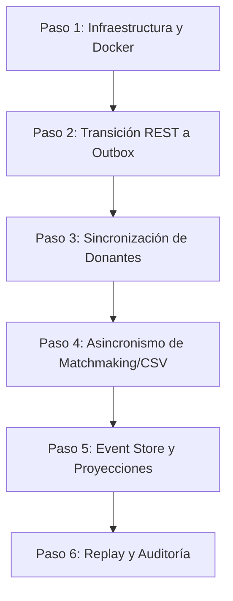

# Arquitectura Orientada a Eventos y Event Sourcing con RabbitMQ

Este documento detalla la especificación técnica para la implementación de la Arquitectura Orientada a Eventos (EDA) y el patrón Event Sourcing en **DonaTrack**, utilizando **RabbitMQ** como Message Broker.

---

## 1. Diseño Teórico: RabbitMQ en EDA y Event Sourcing

### 1.1. RabbitMQ como Event Bus vs. Event Store

Es crucial entender la diferencia de roles en la persistencia de eventos:
*   **RabbitMQ es un Message Broker de tránsito**: Está diseñado para la entrega rápida de mensajes. Una vez que un consumidor procesa y confirma (*acknowledges*) un mensaje en una cola, este se elimina de RabbitMQ.
*   **Event Sourcing requiere almacenamiento persistente permanente**: Para reconstruir las bases de datos ejecutando secuencialmente los eventos (replay), se necesita almacenar el histórico de eventos de forma indefinida.
*   **Arquitectura Propuesta**:
    1.  **Event Store (Base de Datos)**: Cada microservicio que genera eventos persistirá primero el evento en una base de datos relacional (tabla `event_store` en PostgreSQL/MySQL) o no relacional (MongoDB) de forma síncrona en la transacción del comando.
    2.  **Event Bus (RabbitMQ)**: Paralelamente o inmediatamente después (usando el patrón *Transactional Outbox*), el evento se publica en RabbitMQ para que otros servicios se enteren y actualicen sus proyecciones de lectura.

### 1.2. Topología de RabbitMQ en DonaTrack

Se utilizará una estructura de **Topic Exchanges** para permitir un enrutamiento flexible mediante patrones con comodines (`*` y `#`).

```
                              ┌────────────────────────┐
                              │  Exchange (Topic)      │
                              │  "donatrack.events"    │
                              └────────────────────────┘
                                 /         |         \
         routing-key:           /          |          \   routing-key:
         "donacion.asignada"   /           |           \  "incentivos.#"
                              ▼            |            ▼
                 ┌────────────────┐        |        ┌───────────────┐
                 │ Cola:          │        |        │ Cola:         │
                 │ notificaciones │        |        │ incentivos    │
                 └────────────────┘        |        └───────────────┘
                                           |
                                     routing-key:
                                     "donante.registrado"
                                           ▼
                                 ┌──────────────────┐
                                 │ Cola:            │
                                 │ donaciones.audit │
                                 └──────────────────┘
```

#### Exchanges
1.  **`donatrack.events` (Topic Exchange)**: Distribuye los eventos de dominio a los diferentes servicios interesados.
    *   *Routing Keys*: `donante.registrado`, `donacion.registrada`, `donacion.asignada`, `donacion.entregada`, `incentivos.mision.cumplida`.
2.  **`donatrack.commands` (Direct Exchange)**: Enruta tareas de procesamiento asincrónico pesado (comandos) a workers específicos.
    *   *Routing Keys*: `donacion.segmentar`, `donante.importar`.
3.  **`donatrack.dlx` (Direct Exchange - Dead Letter Exchange)**: Canaliza los mensajes fallidos para evitar pérdidas y gestionar reintentos.

#### Colas (Queues) y Bindings
*   **`notificaciones.events.queue`**:
    *   Suscrita a: `donatrack.events`
    *   Filtros (Routing Keys): `donante.registrado`, `donacion.asignada`, `donacion.entregada`, `incentivos.mision.cumplida`, `incentivos.categoria.ascendida`.
*   **`incentivos.events.queue`**:
    *   Suscrita a: `donatrack.events`
    *   Filtros (Routing Keys): `donante.registrado`, `donacion.entregada`.
*   **`donaciones.segmentar.queue`**:
    *   Suscrita a: `donatrack.commands`
    *   Filtro: `donacion.segmentar`.
*   **`donaciones.matchmaking.queue`**:
    *   Suscrita a: `donatrack.commands`
    *   Filtro: `donacion.matchmaking`.

### 1.3. Concurrencia, Ordenamiento e Idempotencia en Event Sourcing

*   **Ordenamiento Garantizado**: RabbitMQ garantiza el orden de los mensajes dentro de una cola si hay un único consumidor. Sin embargo, para escalar horizontalmente se usan múltiples consumidores. Para mantener el orden de eventos sobre el mismo donante o donación:
    *   Se utilizará el plugin **Consistent Hash Exchange** de RabbitMQ, distribuyendo los mensajes a diferentes colas de workers según el *hash* del UUID de la entidad. Así, los eventos de un mismo UUID son procesados siempre por el mismo worker de forma ordenada.
*   **Idempotencia**: Dado que RabbitMQ garantiza la entrega de mensajes *al menos una vez* (at-least-once), los consumidores pueden recibir mensajes duplicados ante fallos de red. Cada consumidor debe llevar un registro de los UUIDs de eventos ya procesados (`processed_events` table) para ignorar duplicados.
*   **Confirmaciones (ACK/NACK)**: Los consumidores usarán confirmaciones manuales. Si un mensaje falla por un problema transitorio (ej. base de datos caída), se responde con `NACK` y se reencola. Si el error es de formato (poison pill), se envía a la **Dead Letter Queue (DLQ)**.

---

## 2. Catálogo de Eventos del Sistema (Mutaciones de Persistencia)

Cualquier cambio de estado persistido en el sistema debe representarse como un evento con un esquema JSON estructurado que incluya metadata común:

```json
{
  "eventId": "UUID-evento",
  "eventType": "NombreDelEvento",
  "aggregateId": "UUID-entidad-afectada",
  "timestamp": "2026-06-08T00:40:00Z",
  "data": { ... }
}
```

### 2.1. Eventos del Servicio de Donaciones

| Evento | aggregateId | Payload Clave (`data`) | Acciones Desencadenadas |
| :--- | :--- | :--- | :--- |
| **`DonanteCreado`** | UUID Donante | Nombre, Tipo (Humana/Jurídica), Email, Teléfono. | Notificaciones: Registra medios de contacto.<br>Incentivos: Crea perfil de gamificación inicial. |
| **`DonanteActualizado`** | UUID Donante | Campos modificados (ej. cambio de teléfono). | Notificaciones: Actualiza canal predeterminado. |
| **`DonacionRegistrada`** | UUID Carga | Descripción general, lista de ítems brutos. | Donaciones: Encola comando `donacion.segmentar` para subdividir bienes. |
| **`DonacionSegmentada`** | UUID Carga | Mapa de subcategorías y sus UUIDs independientes creados. | Donaciones: Cambia estado de ítems a "En depósito". |
| **`DonacionAsignada`** | UUID Donación | UUID Entidad Beneficiaria, detalle de asignación. | Notificaciones: Envía mensajes al donante y a la entidad beneficiaria. |
| **`DonacionListaParaEntregar`** | UUID Donación | UUID Camión, ID de Ruta. | Donaciones: Actualiza estado. |
| **`DonacionEnTraslado`** | UUID Donación | Ubicación inicial del camión. | Notificaciones: Envía alerta de traslado al donante y beneficiario. |
| **`DonacionEntregada`** | UUID Donación | URLs de fotos de recepción de la entidad. | Incentivos: Suma puntos al donante.<br>Notificaciones: Envía confirmación final. |
| **`DonacionEntregaFallida`** | UUID Donación | Motivo del fallo (texto). | Donaciones: Retorna bienes al depósito, genera alerta para reprogramar. |
| **`DonacionVencida`** | UUID Donación | Subcategoría y cantidad expirada. | Donaciones: Elimina el stock disponible. |
| **`NecesidadRegistrada`** | UUID Necesidad | UUID Entidad, Subcategoría, Cantidad, Tipo (Extraordinaria/Recurrente). | Donaciones: Disponible para algoritmos de matchmaking. |

### 2.2. Eventos del Servicio de Incentivos

| Evento | aggregateId | Payload Clave (`data`) | Acciones Desencadenadas |
| :--- | :--- | :--- | :--- |
| **`MisionCompletada`** | UUID Donante | ID Misión, Insignia ganada, Puntos otorgados. | Notificaciones: Envía alerta de logro.<br>Incentivos: Encola webhook a n8n para publicar en redes. |
| **`CategoriaAscendida`** | UUID Donante | Categoría anterior, Categoría nueva (Sostenedor/Transformador). | Notificaciones: Envía correo de felicitación con nuevas ventajas. |
| **`RankingMensualCalculado`** | UUID Ranking | Top 3 de Donantes (UUIDs y nombres), Mes/Año. | Frontend: Actualiza el tablero público de líderes. |

### 2.3. Eventos del Servicio de Notificaciones

| Evento | aggregateId | Payload Clave (`data`) | Acciones Desencadenadas |
| :--- | :--- | :--- | :--- |
| **`NotificacionEnviada`** | UUID Notificación | UUID Usuario, Canal utilizado, Contenido del mensaje. | Notificaciones: Marca estado como COMPLETADO (fines de auditoría). |
| **`NotificacionFallida`** | UUID Notificación | Canal fallido, Código de error del proveedor. | Notificaciones: Ejecuta lógica de fallback (intenta con el siguiente canal disponible). |

---

## 3. Proceso de Implementación Iterativo (Plan de Transición)

Para migrar DonaTrack de un diseño tradicional a una arquitectura EDA/Event Sourcing, se seguirá el siguiente proceso ordenado:



### Paso 1: Levantar RabbitMQ y Configurar Clientes
*   **Acción**: Agregar el contenedor oficial de RabbitMQ (`rabbitmq:3-management`) al archivo `docker-compose` del proyecto.
*   **Desarrollo**: Crear la clase de configuración `RabbitConfig` en el módulo `common-lib` para declarar el Exchange `donatrack.events` y los templates comunes de publicación (`RabbitTemplate`).

### Paso 2: Implementar la Capa de Transición (Patrón Outbox)
*   **Acción**: En lugar de publicar directamente al broker dentro del flujo HTTP (riesgo de fallos), se implementa una tabla `outbox` en la base de datos de cada microservicio.
*   **Proceso**:
    1.  Al procesar un comando (ej. registrar donante), se guarda el registro de donante y la fila de evento en `outbox` dentro de la misma transacción local SQL.
    2.  Un proceso en segundo plano de corta duración (Scheduler o Debezium CDC) lee la tabla `outbox`, publica los mensajes en RabbitMQ y los elimina de la tabla tras recibir la confirmación del broker.

### Paso 3: Sincronizar el Registro de Donantes y Notificaciones
*   **Acción**: Primera prueba real de comunicación distribuida.
    *   El Servicio de Autenticación publica `DonanteCreado`.
    *   El Servicio de Notificaciones y el de Incentivos consumen este evento y crean sus registros locales usando el UUID.
*   **Verificación**: Verificar que al crear un usuario, aparezca su perfil de gamificación y canales de contacto automáticamente sin llamadas HTTP directas.

### Paso 4: Migrar la Segmentación de Donaciones e Importación CSV a Workers
*   **Acción**: Mover la lógica pesada a colas de RabbitMQ.
    *   La importación de CSV del administrador publica el archivo en el File Server y encola un mensaje en `donantes.importar.queue`.
    *   Un worker en segundo plano consume el mensaje e importa los usuarios por bloques (*chunks*).
    *   La segmentación nocturna de matchmaking se programa enviando un comando asincrónico a la cola `donaciones.matchmaking.queue`.

### Paso 5: Implementación de Event Store y Proyecciones (Event Sourcing)
*   **Acción**: Para el Servicio de Donaciones y de Incentivos, cambiar la persistencia tradicional por almacenamiento de eventos.
    *   Crear la tabla `event_store` para guardar el log de cambios.
    *   Crear los *Projections Workers*: clases que escuchan la cola de eventos y van actualizando las tablas de consulta optimizadas (Read Models) de los donantes.

### Paso 6: Verificación de Replay y Auditoría
*   **Acción**: Crear un script o endpoint administrativo `/admin/replay` que borre la tabla de lectura de un microservicio y vuelva a consumir secuencialmente los eventos de la tabla `event_store` o de la cola histórica.
*   **Validación**: Comprobar que el estado de stock final y el progreso de los donantes coincide exactamente antes y después de realizar el Replay.
