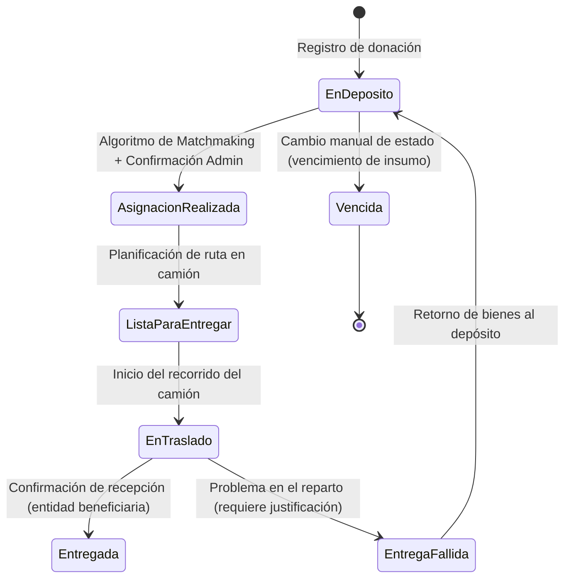

# Especificación de Arquitectura — DonaTrack

Este documento sirve como especificación base para la arquitectura del sistema **DonaTrack**, diseñado para la gestión y trazabilidad de donaciones de la organización *UTN Solidaria*. El propósito de este archivo es consolidar los requerimientos arquitectónicos generales y plantear alternativas de diseño para guiar al equipo de trabajo en el modelado del diagrama de componentes y la posterior toma de decisiones técnicas.

---

## 1. Requerimientos Generales Arquitectónicos (Enunciado 2)

DonaTrack está concebido como una **aplicación distribuida multimódulo** (basada en microservicios) que debe responder a los siguientes pilares de dominio y de infraestructura.

### 1.1. Estructura y Servicios del Sistema

El sistema se divide en los siguientes componentes de software principales:

1. **Servicio de Donaciones**:
   * **Gestión de Actores**: Permite el alta, baja y modificación de personas donantes (humanas y jurídicas) y entidades beneficiarias.
     * *Personas Humanas*: Se registran con nombre, apellido, edad, número de documento, género, dirección y al menos un medio de contacto (correo obligatorio, teléfono y WhatsApp opcionales). Definen un medio de contacto predeterminado.
     * *Personas Jurídicas*: Se registran con razón social, tipo de organización (Gubernamental, ONG, Empresa, Institución), rubro, medio de contacto y personas representantes habilitadas para operar.
   * **Gestión de Donaciones y Segmentación**: Registro de cargas de bienes. El sistema realiza una segmentación interna automática agrupando bienes por subcategoría (unidad mínima de asignación) para crear *donaciones independientes*.
     * Considera el estado del bien (usado o nuevo) y la fecha de vencimiento para bienes perecederos.
     * Registra la cantidad en su respectiva unidad (unidades, kg, etc.).
   * **Gestión de Necesidades**: Las entidades beneficiarias registran necesidades materiales de una subcategoría con una descripción y cantidad. Se dividen en:
     * *Necesidades Extraordinarias*: Situaciones puntuales (ej. emergencias, mudanzas). Se satisfacen acumulando donaciones parciales hasta igualar o superar la cantidad requerida.
     * *Necesidades Recurrentes*: Consumos periódicos (ej. semanales, mensuales) que deben satisfacerse dentro del período correspondiente.
   * **Importación Masiva**: Proceso de migración de datos históricos de personas donantes desde un archivo CSV con más de 10.000 filas. Debe actualizar la información si el donante ya existe (identificado por correo) o crear un nuevo usuario y enviarle credenciales si no existe.
   * **Algoritmos de Matchmaking (Asignación)**: Proceso automático para buscar el destino óptimo de las donaciones "En Depósito" proponiendo hasta 10 entidades beneficiarias candidatas.
     * *Algoritmo de Compatibilidad Semántica*: Evalúa la coincidencia entre los bienes donados y las necesidades declaradas de las organizaciones.
     * *Algoritmo de Prioridad a Sub-atendidos*: Prioriza a las organizaciones que recibieron menos donaciones en el último trimestre.
     * *Filtrado de Intersección*: Se intersectan los resultados de ambos algoritmos para sugerir el destino final a un administrador. Si no hay intersección, se muestran ambas ejecuciones.
     * *Ejecución*: Debe realizarse de manera **asincrónica** y en **horarios de baja carga** para no degradar el desempeño del sistema.

2. **Servicio de Logística, Gestión de Camiones y Entregas**:
   * Administra camiones y planifica rutas de entrega de donaciones.
   * Proporciona trazabilidad en tiempo real sobre la ubicación y estado de los camiones para los donantes y las entidades beneficiarias mediante un mapa interactivo.

3. **Servicio de Incentivos a Donantes y Misiones**:
   * **Analítica**: Consolida datos históricos para mostrar estadísticas al donante (totales de donaciones, evolución por período, organizaciones ayudadas, ranking activo) y métricas agregadas a los administradores.
   * **Gamificación y Categorías**: Define tres categorías de donante: *Colaborador*, *Sostenedor* y *Transformador* (visibles públicamente).
   * **Misiones y Recompensas**: Los donantes completan misiones secuenciales (Racha de meses, Completitud de categorías, Volumen de bienes donados, Donaciones exitosas) para obtener insignias.
   * **Ranking Mensual**: Tarea programada al final de cada mes para calcular y persistir el ranking de los 3 donantes más activos basados en misiones completadas.
   * **Difusión de Insignias**: Integración con flujos automatizados de publicación en redes sociales (ej. mediante herramientas de automatización como n8n) para publicar un mensaje y una imagen autogenerada cuando un donante obtiene una insignia.

4. **Servicio de Notificaciones**:
   * Centraliza el envío de mensajes a los usuarios utilizando diferentes canales (Correo electrónico, SMS, WhatsApp) priorizando el medio predeterminado del usuario y aplicando un mecanismo de reintento/fallback (si falla uno, intenta con el siguiente).
   * Para la entrega actual, simula la llamada a las APIs de proveedores externos y marca las notificaciones como completadas.
   * **Eventos Disparadores**:
     * Inactividad de un donante (>20 días sin interactuar).
     * Asignación de una donación a una necesidad de una entidad beneficiaria.
     * Confirmación de recepción de donación.
     * Cumplimiento de misión por parte de un donante.
     * Cambio de categoría de un donante.

5. **Servicio de Autenticación**:
   * Encargado del registro, inicio de sesión y gestión de accesos para donantes, entidades y administradores.

6. **Componente de Frontend (Server-Side Rendering)**:
   * Interfaz web responsiva con landing page pública, mapa interactivo con donaciones entregadas, registro/inicio de sesión, filtros de donaciones para donantes, registro de necesidades para entidades, y panel de administración para gestionar camiones, importación masiva y confirmación del matchmaking.

---

### 1.2. Ciclo de Vida y Estados de una Donación

El sistema debe auditar la trazabilidad de los estados de cada donación. El flujo principal de estados es el siguiente:

* **En depósito**: Estado inicial al registrar la carga.
* **Asignación realizada**: La donación se vincula a una entidad beneficiaria tras el matchmaking.
* **Lista para entregar**: La donación se asocia a una ruta planificada para un camión.
* **En traslado**: El camión asignado ha iniciado su recorrido de reparto.
* **Entregada**: La entidad beneficiaria confirma la recepción (subiendo fotos de control).
* **Entrega fallida**: No se concreta la entrega. Vuelve a "En depósito" y requiere registrar una justificación (ej. "Nadie respondió al timbre").
* **Vencida**: Si los bienes perecederos expiran antes de ser asignados (modificado por un administrador).

---

### 1.3. Contratos de la API REST Requeridos

Cada microservicio debe exponer sus operaciones a través de un protocolo de red:

#### Servicio de Donaciones
* **Donantes y Donaciones**:
  * `POST /donaciones` - Registrar una carga de bienes (realiza segmentación interna).
  * `GET /donaciones` - Obtener listado de donaciones con filtros (estado, categoría, subcategoría).
  * `GET /donaciones/{id}` - Detalle de una donación.
  * `PUT /donaciones/{id}/estado` - Cambiar el estado de una donación (auditoría).
  * `GET /donantes` - CRUD de donantes (humanos y jurídicos).
  * `POST /donantes/importar` - Importación masiva de donantes vía CSV.
* **Entidades Beneficiarias y Necesidades**:
  * `GET /entidades` - CRUD de entidades beneficiarias.
  * `GET /entidades/{id}/necesidades` - CRUD de necesidades materiales (recurrentes y extraordinarias).
  * `POST /matchmaking/ejecutar` - Ejecución bajo demanda del matchmaking.
  * `GET /matchmaking/resultados` - Obtención del ranking generado por los algoritmos de asignación.

#### Servicio de Incentivos
* `GET /donantes/{id}/metricas` - Obtener métricas de actividad (acumuladas y por período).
* `GET /donantes/{id}/misiones` - Obtener misiones disponibles y progreso de la misión activa.
* `GET /donantes/{id}/insignias` - Historial de insignias obtenidas.
* `GET /rankings/mensual` - Listado del ranking histórico y del mes en curso.

#### Servicio de Notificaciones
* `POST /notificaciones/enviar` - Endpoint interno para encolar o solicitar el envío de una notificación (destinatario, mensaje, canal).

---

## 2. Alternativas de Implementación Arquitectónica

Para modelar el diagrama de componentes definitivo y definir el stack tecnológico de integración, se evalúan las siguientes alternativas técnicas basadas en discusiones previas de diseño:

### 2.1. Comunicación entre Microservicios (Integración de Servicios)

*   **Alternativa A: Comunicación Sincrónica vía REST (HTTP/JSON)**
    *   *Descripción*: Los servicios interactúan de forma directa realizando llamadas HTTP (mediante clientes como WebClient de Spring o Feign). Por ejemplo, cuando el Servicio de Donaciones registra una asignación, invoca directamente el endpoint `POST /notificaciones/enviar` del Servicio de Notificaciones.
    *   *Pros*:
        *   Baja complejidad de implementación y testing inicial.
        *   Fácil seguimiento del flujo de control en entornos de desarrollo.
    *   *Contras*:
        *   Fuerte acoplamiento temporal: si el Servicio de Notificaciones está fuera de línea, la transacción original en Donaciones podría fallar o requerir un manejo complejo de excepciones.
        *   Propagación de latencia: la respuesta al cliente final se ralentiza al acumular los tiempos de respuesta de todos los microservicios en la cadena de llamadas.
    *   *Decisión de Diseño Asociada*: [ADR - Comunicación con el Servicio de Notificaciones](file:///c:/Users/Pc/Documents/DDS/DonaTrack-TP-DDS/docs/adr/notificaciones-service/20260519-comunicacion-con-el-servicio-de-notificaciones.md).

*   **Alternativa B: Comunicación Asincrónica Basada en Eventos (Publish-Subscribe)** (Elegida para Notificaciones)
    *   *Descripción*: Se introduce un broker de mensajería (ej. **RabbitMQ**, **Apache Kafka** o **ActiveMQ**). Los servicios publican eventos de dominio (ej. `DonacionAsignada`, `MisionCumplida`) al broker. El Servicio de Notificaciones y el de Incentivos se suscriben a estos canales y reaccionan de manera independiente.
    *   *Pros*:
        *   Acoplamiento mínimo: el publicador no conoce la existencia ni la ubicación de los consumidores.
        *   Resiliencia: si el Servicio de Notificaciones se cae, los mensajes permanecen seguros en la cola y se procesan cuando el servicio se restablece (sin afectar la experiencia del donante al registrar la donación).
        *   Excelente escalabilidad horizontal de consumidores.
    *   *Contras*:
        *   Mayor complejidad en la infraestructura y configuración (administración del broker).
        *   Consistencia eventual: el envío de la notificación no ocurre instantáneamente en la misma transacción de base de datos.
        *   Dificultad añadida para el rastreo y debugging distribuido (requiere herramientas de tracing como Spring Cloud Sleuth/Micrometer y Trace IDs).

---

### 2.2. Estrategia de Persistencia y Acceso a Datos

*   **Alternativa A: Base de Datos Única Compartida (Shared Database)**
    *   *Descripción*: Todos los microservicios se conectan a una misma base de datos relacional (ej. MySQL o PostgreSQL), separando el acceso mediante diferentes esquemas o tablas.
    *   *Pros*:
        *   Permite realizar consultas complejas con `JOIN` directo entre tablas de distintos módulos (ej. cruzar donaciones del Servicio de Donaciones con insignias en Incentivos para analíticas).
        *   Mantiene la integridad referencial a nivel de motor de base de datos de manera nativa.
        *   Simplifica la administración de la infraestructura de persistencia.
    *   *Contras*:
        *   Acoplamiento de datos: un cambio en la estructura de tablas de un servicio puede impactar y romper el funcionamiento de los demás.
        *   Cuello de botella de performance: todas las consultas de lectura y escritura compiten por los mismos recursos del servidor de base de datos.
        *   Dificulta la escalabilidad independiente de los servicios.

*   **Alternativa B: Base de Datos por Servicio (Database per Service)**
    *   *Descripción*: Cada microservicio posee y gestiona su propio almacén de datos (ej. MySQL para Donaciones, PostgreSQL o MongoDB para Incentivos y Notificaciones), impidiendo que un servicio acceda directamente a las tablas de otro. Cualquier intercambio de datos se realiza a través de APIs REST o eventos.
    *   *Pros*:
        *   Aislamiento completo: cada equipo puede modificar el esquema de su base de datos sin riesgo de afectar a otros servicios.
        *   Flexibilidad tecnológica: permite usar motores específicos según la necesidad (ej. base de datos relacional SQL para el dominio de donaciones, y base documental NoSQL/MongoDB para persistir el historial masivo de notificaciones y logs).
        *   Facilita la escalabilidad horizontal independiente de las bases de datos.
    *   *Contras*:
        *   Consultas distribuidas complejas (requiere duplicación de datos mediante eventos o llamadas de agregación API Composition).
        *   Transacciones distribuidas difíciles de implementar en caso de fallas multiservicio (requiere implementar patrones como Saga o Outbox).

---

### 2.3. Ejecución Asincrónica del Matchmaking y Procesamiento Batch

*   **Alternativa A: Tarea Programada por Lotes (Scheduled Batch Job)**
    *   *Descripción*: Se configura un servicio de planificación (ej. Spring Batch con `@Scheduled` o Quartz) que ejecuta los algoritmos de matchmaking de forma masiva una vez al día en un horario nocturno predefinido (ej. 2:00 AM) procesando todas las donaciones en estado "En Depósito".
    *   *Pros*:
        *   Cumple de manera nativa con la restricción de ejecutarse en "horarios de baja carga".
        *   Permite procesar grandes volúmenes de datos optimizando el uso de recursos y consultas SQL agrupadas (batching).
    *   *Contras*:
        *   Poca flexibilidad si un administrador necesita forzar la asignación inmediata de una donación urgente durante el día (aunque se puede mitigar con un endpoint de ejecución manual).
        *   Las asignaciones sufren un delay de hasta 24 horas desde que la donación ingresa al depósito.

*   **Alternativa B: Procesamiento mediante Colas de Trabajo (Worker Pool / Event-Driven Matchmaking)**
    *   *Descripción*: Al registrar una donación en depósito, se publica un mensaje en una cola de tareas de fondo. Un conjunto de hilos o workers del Servicio de Donaciones consume los mensajes y ejecuta el algoritmo de forma asincrónica e individual para cada donación en segundo plano.
    *   *Pros*:
        *   Procesamiento cercano al tiempo real (las asignaciones se generan pocos segundos o minutos después del ingreso).
        *   Evita la sobrecarga del servidor que produce la ejecución masiva nocturna al distribuir la carga uniformemente.
    *   *Contras*:
        *   Dificulta garantizar que el procesamiento ocurra exclusivamente en horarios de baja carga, a menos que se implemente una cola con retraso (delayed queue) o un mecanismo para pausar el consumidor durante el día.

---

### 2.4. Integración para la Difusión de Insignias (Redes Sociales)

*   **Alternativa A: Integración Externa con Plataforma Low-Code (n8n)**
    *   *Descripción*: El Servicio de Incentivos no se conecta a las APIs de redes sociales. En su lugar, cuando un donante obtiene una insignia, el servicio realiza una petición HTTP POST a un Webhook expuesto por **n8n**. El flujo en n8n se encarga de recibir los datos, usar un servicio de generación de imágenes (o generarlas con HTML/CSS a imagen) y realizar la publicación en la red social configurada.
    *   *Pros*:
        *   Desarrollo rápido y visual: la integración con las APIs complejas de redes sociales (OAuth, límites de peticiones) se delega a n8n, reduciendo el código en el backend de DonaTrack.
        *   Fácil mantenimiento: si una red social cambia su API o se desea añadir una nueva (ej. Twitter a LinkedIn), solo se modifica el flujo en n8n sin tener que compilar ni desplegar el código del microservicio.
    *   *Contras*:
        *   Dependencia de una infraestructura externa activa para el flujo de negocio de incentivos.
        *   Dificultad de control de versiones del flujo de n8n junto al código fuente del proyecto (requiere exportar/importar archivos JSON de workflows).

*   **Alternativa B: Worker Interno Dedicado (Custom Social Media Worker)**
    *   *Descripción*: El equipo desarrolla un servicio dedicado dentro del backend de Incentivos (en Java o un worker ligero en Node.js) que utiliza librerías de generación gráfica para componer la imagen de la insignia y clientes SDK de redes sociales para publicar directamente.
    *   *Pros*:
        *   Independencia de herramientas externas de terceros; control absoluto sobre el flujo de publicación y generación de imágenes.
        *   Toda la lógica y configuraciones se controlan bajo el mismo repositorio Git.
    *   *Contras*:
        *   Alto esfuerzo de desarrollo inicial para integrar múltiples redes sociales y gestionar la autenticación OAuth de las plataformas.
        *   Mayor consumo de memoria y procesamiento en el backend del sistema para realizar tareas de renderizado de imágenes.
