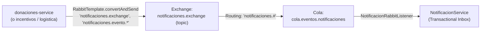

# Guía de Migración de Contratos e Integración: Notificaciones Service (Entrega 4)

> **Subdominio:** Notificaciones y Mensajería Multicanal (`notificaciones-service`)  
> **Ámbito:** Clientes consumidores y productores de eventos (`donaciones-service`, `incentivos-service`, `logistica-service`)  
> **Versión de Referencia:** Entrega 4 (Fase 0 y Oleada de Persistencia / AMQP)  
> **Estado:** Vigente / Guía Técnica Normativa  

---

## 1. Propósito y Alcance

Este documento especifica la evolución arquitectónica del servicio `notificaciones-service` introducida en la Entrega 4, detallando:
1. La adopción de **AMQP (RabbitMQ)** como canal primario de ingesta de eventos de dominio.
2. La política de compatibilidad hacia atrás en la **API REST** para clientes existentes.
3. El mecanismo de **idempotencia y deduplicación** mediante el patrón **Transactional Inbox**.
4. La guía paso a paso para que `donaciones-service` migre de forma segura y desacoplada sin generar fallas de compilación ni regresiones de entrega.

> [!NOTE]
> En cumplimiento estricto de las reglas de alcance de `AGENTS.md` (§6 Anti-Scope Creep), el código de `donaciones-service` no fue alterado dentro de la remediación del PR 874. Las instrucciones a continuación constituyen la hoja de ruta que el equipo responsable de `donaciones-service` debe aplicar en su propia rama/PR de integración.

---

## 2. Topología de Ingesta y Canales Disponibles

### 2.1 Canal Primario: AMQP (RabbitMQ)

Para desacoplar el ciclo de vida de los servicios emisores y evitar bloqueos por latencia HTTP en la persistencia de eventos, `notificaciones-service` expone un listener AMQP configurado con la siguiente topología:

* **Exchange:** `notificaciones.exchange` (Tipo: `topic`, durable)
* **Cola:** `cola.eventos.notificaciones` (Durable)
* **Routing Key de Suscripción:** `notificaciones.#`
* **Formato de Payload:** JSON tipado conforme a la jerarquía sellada `EventoNotificableDTO` (usando `JacksonJsonMessageConverter`).



### 2.2 Canal Dual: HTTP REST

Para preservar retrocompatibilidad con tests existentes y clientes que aún despachan vía HTTP sincrónico, se mantienen dos rutas de entrada:

| Endpoint | Método | Estado | Propósito |
|---|---|---|---|
| `/api/notificaciones/eventos` | `POST` | **Vigente (Canónico)** | Ingesta de eventos vía HTTP REST conforme a la convención `/api/*`. |
| `/notificaciones` | `POST` | **Deprecated (Legacy)** | Alias de compatibilidad hacia atrás para clientes heredados de Entrega 3. |
| `/api/notificaciones` | `GET` | **Vigente** | Consulta y filtrado de notificaciones por `personaId` y/o `estado`. |
| `/api/notificaciones/{id}` | `GET` | **Vigente** | Consulta de notificación por identificador unívoco. |
| `/api/notificaciones/persona/{personaId}` | `GET` | **Vigente** | Historial de notificaciones despachadas a una persona. |
| `/notificaciones/persona/{personaId}` | `GET` | **Deprecated (Legacy)** | Alias legacy de historial de persona. |

---

## 3. Idempotencia: Patrón Transactional Inbox y `eventId`

### 3.1 Clave de Idempotencia (`eventId: UUID`)

Todos los DTOs de eventos derivados de `EventoNotificableDTO` cuentan con el campo:
```java
UUID eventId()
```

* **Función:** Identifica de forma unívoca la ocurrencia de un evento de negocio específico.
* **Persistencia:** Al procesar un evento dentro de una transacción `@Transactional`, `NotificacionService` registra el identificador en la tabla `notificaciones.evento_procesado`:
  ```sql
  INSERT INTO notificaciones.evento_procesado (event_id, fecha_procesamiento)
  VALUES (?, ?)
  ON CONFLICT (event_id) DO NOTHING;
  ```
* Si la sentencia reporta `0` filas insertadas, el evento es detectado como duplicado (por ejemplo, producto de un reintento de red de Feign o redelivery AMQP) y se descarta de forma segura sin emitir notificaciones repetidas al usuario.

### 3.2 Manejo de Clientes Legacy (Fallback UUID)

Si un cliente REST legacy despacha un payload donde `eventId` es `null`, `notificaciones-service` **no rechaza la petición con 400 Bad Request**. En su lugar:
1. Asigna automáticamente un `UUID.randomUUID()`.
2. Emite una advertencia estructurada en el log de auditoría:
   `[FALLBACK_LEGACY_EVENT_ID] Generado eventId <uuid> para evento legacy de tipo <EventoDTO>`.
3. Procesa normalmente la notificación.

---

## 4. Hoja de Ruta para la Migración de `donaciones-service`

El equipo de `donaciones-service` debe llevar a cabo los siguientes pasos en su ciclo de desarrollo:

### Paso 1: Generación de `eventId` en Emisión de Eventos

Asegurar que cada evento de dominio emitido (`DonacionAsignada`, `DonacionRecibida`, `DonanteInactivo`, etc.) instancie un `eventId` estable (`UUID.randomUUID()` al momento de la creación del evento de dominio, o el UUID del aggregate event).

```java
// Ejemplo al construir el DTO de despacho:
EventoDonacionAsignadaDTO dto = new EventoDonacionAsignadaDTO(
    UUID.randomUUID(), // <-- eventId obligatorio para deduplicación
    donanteId,
    LocalDateTime.now(),
    beneficiarioId,
    "10 kg de alimentos no perecederos"
);
```

### Paso 2: Actualización de Contratos Feign (HTTP)

Si se continúa utilizando Feign temporalmente:
1. Actualizar la URL objetivo en el cliente Feign de:
   `@PostMapping("/notificaciones")`
   a:
   `@PostMapping("/api/notificaciones/eventos")`
2. Verificar que las firmas de los métodos y DTOs transmitan el `eventId`.

### Paso 3: Migración a Mensajería Asíncrona (AMQP)

Para la migración definitiva a comunicación asíncrona:
1. Inyectar `RabbitTemplate` en el despachador de eventos de `donaciones-service`.
2. Publicar directamente al exchange de notificaciones:
   ```java
   rabbitTemplate.convertAndSend(
       "notificaciones.exchange",
       "notificaciones.donacion." + tipoEvento,
       eventoDto
   );
   ```
3. El listener `NotificacionRabbitListener` en `notificaciones-service` consumirá automáticamente el mensaje desde `cola.eventos.notificaciones`, ejecutando la deduplicación transaccional y el posterior envío multicanal.

---

## 5. Matriz de Compatibilidad y Quality Gates

| Componente | Compatibilidad | Comportamiento con Legacy |
|---|---|---|
| `POST /notificaciones` | ✅ Retrocompatible | Acepta eventos legacy, asigna fallback UUID y responde `202 Accepted`. |
| `POST /api/notificaciones/eventos` | ✅ Canónico | Recomendado para nuevos desarrollos HTTP. |
| Listener AMQP | ✅ Canónico | Ingesta nativa AMQP con auto-ACK ante fallas de validación terminal para evitar poison pills. |
| Base de Datos PostgreSQL | ✅ Multi-Schema | Esquema `notificaciones` con tablas `persona`, `medio_de_contacto`, `notificacion`, `notificacion_historial_estado` y `evento_procesado`. |
