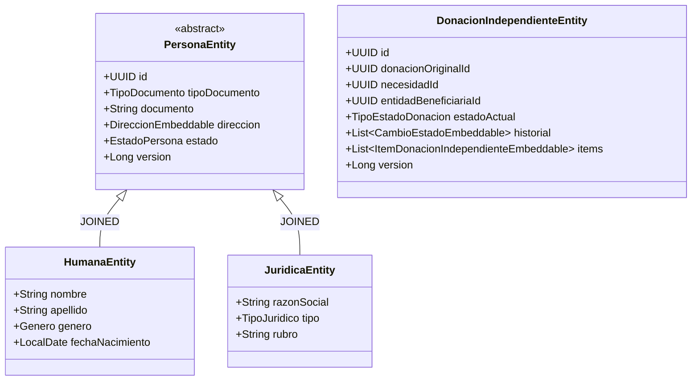
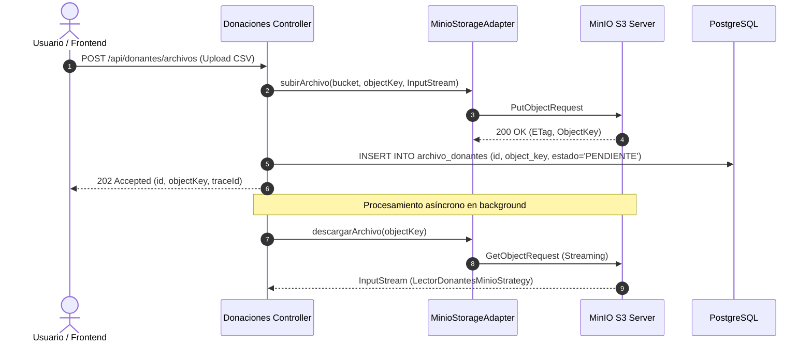
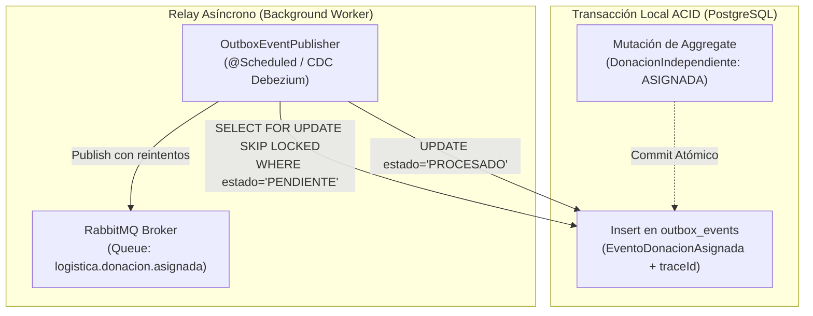
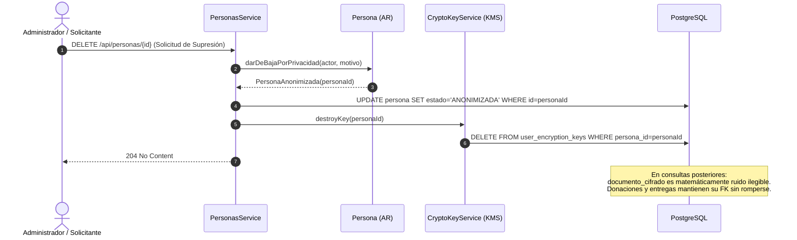

# Decisiones Técnicas Futuras para la Persistencia Real — `donaciones-service`

> **Documento de Referencia Técnica Complementario a la Oleada 10**  
> **Contexto:** Microservicio de Donaciones — Sistema DonaTrack  
> **Propósito:** Registrar formalmente las decisiones de arquitectura, esquemas relacionales, configuración de almacenamiento de objetos, mecanismos criptográficos y pruebas de integración que se implementarán en la fase de persistencia física (JPA/Hibernate, PostgreSQL y MinIO), permitiendo que la capa de dominio permanezca limpia y agnóstica a frameworks.

---

## 1. Mapeo Objeto-Relacional (ORM) con JPA / Hibernate 6



### 1.1. Estrategia de Herencia para Agregados Polimórficos
1. **Jerarquía `Persona` (`Humana`, `Juridica`)**:
   - **Estrategia Elegida**: `@Inheritance(strategy = InheritanceType.JOINED)`.
   - **Justificación**: Permite aplicar restricciones `NOT NULL` e índices únicos a nivel de tabla relacional para campos específicos de cada subtipo (`persona_humana` con `apellido NOT NULL`, `persona_juridica` con `razon_social NOT NULL` y `cuit UNIQUE`). Evita columnas dispersas con valores `NULL`.
2. **Jerarquía `Necesidad` (`NecesidadExtraordinaria`, `NecesidadRecurrente`)**:
   - **Estrategia Elegida**: `@Inheritance(strategy = InheritanceType.SINGLE_TABLE)` con columna discriminadora `@DiscriminatorColumn(name = "tipo_necesidad", discriminatorType = DiscriminatorType.STRING)`.
   - **Justificación**: Ambos subtipos comparten más del 80% de sus atributos (`subcategoria_id`, `entidad_id`, `cantidad_necesitada`, `cantidad_acumulada`, `descripcion`, `fecha_inicio`). La estrategia de tabla única optimiza las consultas polimórficas del algoritmo de asignación (`findByEstaSatisfechaFalseActivaTrue`) ejecutando un `SELECT` directo sin `JOIN`.

### 1.2. Mapeo de Value Objects Inmutables (`@Embeddable` / Records)
* **`Direccion` y `Localidad`**: Se mapean como `@Embeddable` y se embeben directamente en las tablas `persona` y `donacion` (para el depósito de recepción), aplanando las columnas geográficas (`calle`, `altura`, `piso`, `departamento`, `codigo_postal`, `localidad`, `provincia`, `pais`). Esto preserva el snapshot histórico inmutable de la dirección al momento de la operación.
* **`Bien` y `BienNormalizado`**: En Hibernate 6, los `record`s de Java se mapean directamente como componentes `@Embeddable` dentro de `ItemDonacion` e `ItemDonacionIndependiente`.
* **Colecciones de Value Objects**:
  - `Subcategoria.aliases`: `@ElementCollection` asociada a la tabla `subcategoria_alias`.
  - `Donacion.items`: `@ElementCollection` o tabla dependiente `donacion_item`.

### 1.3. Mapeo del State Pattern mediante `AttributeConverter`
Para no crear 7 tablas polimórficas artificiales en la base de datos para los estados de `DonacionIndependiente`, se implementa un `AttributeConverter`:

```java
@Converter(autoApply = true)
public class EstadoDonacionIndependienteConverter
    implements AttributeConverter<EstadoDonacionIndependiente, String> {

  @Override
  public String convertToDatabaseColumn(EstadoDonacionIndependiente attribute) {
    return attribute != null ? attribute.getTipo().name() : null;
  }

  @Override
  public EstadoDonacionIndependiente convertToEntityAttribute(String dbData) {
    if (dbData == null) return null;
    TipoEstadoDonacion tipo = TipoEstadoDonacion.valueOf(dbData);
    return EstadoDonacionIndependienteFactory.crear(tipo);
  }
}
```

---

## 2. Esquema Relacional DDL Optimizado (PostgreSQL)

A continuación se define el esquema relacional DDL preparado para PostgreSQL 15+, estructurado según las Raíces de Agregado:

```sql
-- ============================================================================
-- DONATRACK: SERVICIO DE DONACIONES - ESQUEMA RELACIONAL (POSTGRESQL)
-- ============================================================================

-- ----------------------------------------------------------------------------
-- 1. AGREGADO PERSONA (JOINED TABLE INHERITANCE)
-- ----------------------------------------------------------------------------
CREATE TABLE persona (
    id UUID PRIMARY KEY,
    tipo_persona VARCHAR(20) NOT NULL, -- 'HUMANA', 'JURIDICA'
    tipo_documento VARCHAR(20) NULL,
    documento VARCHAR(50) NULL,
    estado VARCHAR(20) NOT NULL DEFAULT 'ACTIVA', -- 'ACTIVA', 'ANONIMIZADA'
    
    -- Value Object Direccion Embebido
    calle VARCHAR(150) NULL,
    altura INT NULL,
    piso INT NULL,
    departamento VARCHAR(10) NULL,
    codigo_postal VARCHAR(20) NULL,
    localidad VARCHAR(100) NULL,
    provincia VARCHAR(100) NULL,
    pais VARCHAR(100) NULL DEFAULT 'Argentina',
    
    version BIGINT NOT NULL DEFAULT 0,
    created_at TIMESTAMP WITH TIME ZONE DEFAULT CURRENT_TIMESTAMP NOT NULL
);

CREATE TABLE persona_humana (
    id UUID PRIMARY KEY REFERENCES persona(id) ON DELETE CASCADE,
    nombre VARCHAR(100) NOT NULL,
    apellido VARCHAR(100) NOT NULL,
    genero VARCHAR(20) NULL,
    fecha_nacimiento DATE NULL
);

CREATE TABLE persona_juridica (
    id UUID PRIMARY KEY REFERENCES persona(id) ON DELETE CASCADE,
    razon_social VARCHAR(150) NOT NULL,
    tipo_juridico VARCHAR(50) NOT NULL,
    rubro VARCHAR(100) NOT NULL
);

CREATE TABLE persona_juridica_representantes (
    juridica_id UUID NOT NULL REFERENCES persona_juridica(id) ON DELETE CASCADE,
    humana_id UUID NOT NULL REFERENCES persona_humana(id) ON DELETE RESTRICT,
    PRIMARY KEY (juridica_id, humana_id)
);

CREATE TABLE persona_medio_contacto (
    id UUID PRIMARY KEY,
    persona_id UUID NOT NULL REFERENCES persona(id) ON DELETE CASCADE,
    tipo_medio VARCHAR(20) NOT NULL, -- 'CORREO', 'TELEFONO', 'WHATSAPP'
    es_predeterminado BOOLEAN NOT NULL DEFAULT FALSE,
    valor_contacto VARCHAR(150) NOT NULL,
    caracteristica VARCHAR(10) NULL,
    codigo_area VARCHAR(10) NULL
);
CREATE INDEX idx_persona_documento ON persona(documento);
CREATE INDEX idx_persona_contacto_persona ON persona_medio_contacto(persona_id);

-- ----------------------------------------------------------------------------
-- 2. AGREGADOS DONANTE Y ENTIDAD BENEFICIARIA (REFERENCIAS POR ID)
-- ----------------------------------------------------------------------------
CREATE TABLE donante (
    id UUID PRIMARY KEY,
    persona_id UUID NOT NULL UNIQUE REFERENCES persona(id) ON DELETE RESTRICT,
    version BIGINT NOT NULL DEFAULT 0,
    created_at TIMESTAMP WITH TIME ZONE DEFAULT CURRENT_TIMESTAMP NOT NULL
);

CREATE TABLE entidad_beneficiaria (
    id UUID PRIMARY KEY,
    juridica_id UUID NOT NULL UNIQUE REFERENCES persona_juridica(id) ON DELETE RESTRICT,
    version BIGINT NOT NULL DEFAULT 0,
    created_at TIMESTAMP WITH TIME ZONE DEFAULT CURRENT_TIMESTAMP NOT NULL
);

-- ----------------------------------------------------------------------------
-- 3. CATÁLOGO DE BIENES: CATEGORÍA Y SUBCATEGORÍA
-- ----------------------------------------------------------------------------
CREATE TABLE categoria (
    id UUID PRIMARY KEY,
    nombre VARCHAR(100) NOT NULL UNIQUE,
    con_uso BOOLEAN NOT NULL,
    con_vencimiento BOOLEAN NOT NULL,
    tipo_unidad VARCHAR(30) NOT NULL
);

CREATE TABLE subcategoria (
    id UUID PRIMARY KEY,
    categoria_id UUID NOT NULL REFERENCES categoria(id) ON DELETE RESTRICT,
    nombre VARCHAR(100) NOT NULL,
    CONSTRAINT uq_categoria_subcategoria_nombre UNIQUE (categoria_id, nombre)
);

CREATE TABLE subcategoria_alias (
    subcategoria_id UUID NOT NULL REFERENCES subcategoria(id) ON DELETE CASCADE,
    alias VARCHAR(100) NOT NULL,
    PRIMARY KEY (subcategoria_id, alias)
);
CREATE INDEX idx_subcategoria_alias_alias ON subcategoria_alias(alias);

-- ----------------------------------------------------------------------------
-- 4. AGREGADO DONACIÓN (CARGA HISTÓRICA)
-- ----------------------------------------------------------------------------
CREATE TABLE donacion (
    id UUID PRIMARY KEY,
    donante_id UUID NOT NULL REFERENCES donante(id) ON DELETE RESTRICT,
    descripcion TEXT NULL,
    fecha TIMESTAMP WITH TIME ZONE NOT NULL,
    estado_actual VARCHAR(30) NOT NULL, -- 'CARGADA', 'NORMALIZADA', 'SEGMENTADA'
    
    -- Value Object Deposito Embebido
    deposito_nombre VARCHAR(100) NULL,
    deposito_calle VARCHAR(150) NULL,
    deposito_altura INT NULL,
    deposito_localidad VARCHAR(100) NULL,
    
    version BIGINT NOT NULL DEFAULT 0,
    created_at TIMESTAMP WITH TIME ZONE DEFAULT CURRENT_TIMESTAMP NOT NULL
);

CREATE TABLE donacion_item (
    id UUID PRIMARY KEY,
    donacion_id UUID NOT NULL REFERENCES donacion(id) ON DELETE CASCADE,
    cantidad NUMERIC(10, 2) NOT NULL CHECK (cantidad > 0),
    
    -- Value Object Bien Embebido
    bien_descripcion VARCHAR(255) NOT NULL,
    bien_foto_url VARCHAR(500) NULL,
    bien_fecha_vencimiento DATE NULL,
    bien_estado VARCHAR(20) NULL,
    bien_peso_unitario NUMERIC(8, 2) NOT NULL CHECK (bien_peso_unitario > 0),
    bien_volumen_unitario NUMERIC(8, 2) NOT NULL CHECK (bien_volumen_unitario > 0)
);
CREATE INDEX idx_donacion_item_donacion ON donacion_item(donacion_id);

CREATE TABLE donacion_historial_estado (
    id UUID PRIMARY KEY,
    donacion_id UUID NOT NULL REFERENCES donacion(id) ON DELETE CASCADE,
    estado_anterior VARCHAR(30) NOT NULL,
    estado_nuevo VARCHAR(30) NOT NULL,
    timestamp TIMESTAMP WITH TIME ZONE DEFAULT CURRENT_TIMESTAMP NOT NULL
);

-- ----------------------------------------------------------------------------
-- 5. AGREGADO ITEM DONACIÓN NORMALIZADO
-- ----------------------------------------------------------------------------
CREATE TABLE item_donacion_normalizado (
    id UUID PRIMARY KEY,
    donacion_original_id UUID NOT NULL REFERENCES donacion(id) ON DELETE RESTRICT,
    subcategoria_id UUID NOT NULL REFERENCES subcategoria(id) ON DELETE RESTRICT,
    cantidad INT NOT NULL CHECK (cantidad > 0),
    confianza NUMERIC(4, 3) NOT NULL CHECK (confianza >= 0 AND confianza <= 1),
    estado_normalizacion VARCHAR(30) NOT NULL, -- 'PENDIENTE_REVISION', 'ACEPTADO', 'RECHAZADO'
    segmentado BOOLEAN NOT NULL DEFAULT FALSE,
    
    -- Value Object Bien Original Embebido
    bien_descripcion VARCHAR(255) NOT NULL,
    bien_foto_url VARCHAR(500) NULL,
    bien_fecha_vencimiento DATE NULL,
    bien_estado VARCHAR(20) NULL,
    bien_peso_unitario NUMERIC(8, 2) NOT NULL,
    bien_volumen_unitario NUMERIC(8, 2) NOT NULL,
    
    created_at TIMESTAMP WITH TIME ZONE DEFAULT CURRENT_TIMESTAMP NOT NULL
);
CREATE INDEX idx_item_norm_estado ON item_donacion_normalizado(estado_normalizacion);
CREATE INDEX idx_item_norm_donacion ON item_donacion_normalizado(donacion_original_id);

-- ----------------------------------------------------------------------------
-- 6. AGREGADO DONACIÓN INDEPENDIENTE (INVENTARIO Y STOCK FÍSICO)
-- ----------------------------------------------------------------------------
CREATE TABLE donacion_independiente (
    id UUID PRIMARY KEY,
    donacion_original_id UUID NOT NULL REFERENCES donacion(id) ON DELETE RESTRICT,
    necesidad_id UUID NULL,             -- Referencia débil por ID
    entidad_beneficiaria_id UUID NULL,  -- Referencia débil por ID
    estado_actual VARCHAR(30) NOT NULL, -- 'EN_DEPOSITO', 'ASIGNACION_REALIZADA', etc.
    fecha_registro TIMESTAMP WITH TIME ZONE DEFAULT CURRENT_TIMESTAMP NOT NULL,
    version BIGINT NOT NULL DEFAULT 0
);
CREATE INDEX idx_donacion_indep_estado ON donacion_independiente(estado_actual);
CREATE INDEX idx_donacion_indep_necesidad ON donacion_independiente(necesidad_id);

CREATE TABLE donacion_independiente_item (
    id UUID PRIMARY KEY,
    donacion_independiente_id UUID NOT NULL REFERENCES donacion_independiente(id) ON DELETE CASCADE,
    subcategoria_id UUID NOT NULL REFERENCES subcategoria(id) ON DELETE RESTRICT,
    cantidad INT NOT NULL CHECK (cantidad > 0),
    bien_descripcion VARCHAR(255) NOT NULL,
    bien_foto_url VARCHAR(500) NULL,
    bien_fecha_vencimiento DATE NULL,
    bien_estado VARCHAR(20) NULL,
    bien_peso_unitario NUMERIC(8, 2) NOT NULL,
    bien_volumen_unitario NUMERIC(8, 2) NOT NULL
);
CREATE INDEX idx_donacion_indep_item_parent ON donacion_independiente_item(donacion_independiente_id);

CREATE TABLE donacion_independiente_cambio_estado (
    id UUID PRIMARY KEY,
    donacion_independiente_id UUID NOT NULL REFERENCES donacion_independiente(id) ON DELETE CASCADE,
    estado_anterior VARCHAR(30) NOT NULL,
    estado_nuevo VARCHAR(30) NOT NULL,
    justificacion TEXT NULL,
    actor VARCHAR(100) NOT NULL,
    timestamp TIMESTAMP WITH TIME ZONE DEFAULT CURRENT_TIMESTAMP NOT NULL
);
CREATE INDEX idx_donacion_indep_historial ON donacion_independiente_cambio_estado(donacion_independiente_id);

-- ----------------------------------------------------------------------------
-- 7. AGREGADO NECESIDAD (SINGLE TABLE INHERITANCE)
-- ----------------------------------------------------------------------------
CREATE TABLE necesidad (
    id UUID PRIMARY KEY,
    tipo_necesidad VARCHAR(30) NOT NULL, -- 'EXTRAORDINARIA', 'RECURRENTE'
    subcategoria_id UUID NOT NULL REFERENCES subcategoria(id) ON DELETE RESTRICT,
    entidad_id UUID NOT NULL REFERENCES entidad_beneficiaria(id) ON DELETE RESTRICT,
    cantidad_necesitada INT NOT NULL CHECK (cantidad_necesitada > 0),
    cantidad_acumulada INT NOT NULL DEFAULT 0,
    descripcion TEXT NOT NULL,
    fecha_inicio DATE NOT NULL,
    fecha_fin DATE NULL,
    activa BOOLEAN NOT NULL DEFAULT TRUE,
    
    -- Atributos de Necesidad Recurrente
    frecuencia_periodo_iso VARCHAR(20) NULL, -- Ej: 'P1M', 'P1W'
    
    version BIGINT NOT NULL DEFAULT 0,
    created_at TIMESTAMP WITH TIME ZONE DEFAULT CURRENT_TIMESTAMP NOT NULL
);
CREATE INDEX idx_necesidad_matching ON necesidad(subcategoria_id, activa);

CREATE TABLE periodo_necesidad (
    id UUID PRIMARY KEY,
    necesidad_id UUID NOT NULL REFERENCES necesidad(id) ON DELETE CASCADE,
    fecha_fin DATE NOT NULL,
    cantidad_objetivo INT NOT NULL CHECK (cantidad_objetivo > 0),
    cantidad_acumulada INT NOT NULL DEFAULT 0,
    created_at TIMESTAMP WITH TIME ZONE DEFAULT CURRENT_TIMESTAMP NOT NULL
);
CREATE INDEX idx_periodo_necesidad_parent ON periodo_necesidad(necesidad_id);

-- ----------------------------------------------------------------------------
-- 8. AGREGADO PROPUESTA Y AUDITORÍA DE ASIGNACIÓN
-- ----------------------------------------------------------------------------
CREATE TABLE propuesta (
    id UUID PRIMARY KEY,
    necesidad_id UUID NOT NULL REFERENCES necesidad(id) ON DELETE RESTRICT,
    estado VARCHAR(20) NOT NULL DEFAULT 'PENDIENTE', -- 'PENDIENTE', 'APROBADA', 'DESCARTADA'
    fecha_creacion TIMESTAMP WITH TIME ZONE DEFAULT CURRENT_TIMESTAMP NOT NULL,
    version BIGINT NOT NULL DEFAULT 0
);
CREATE INDEX idx_propuesta_estado ON propuesta(estado);

CREATE TABLE propuesta_fragmentacion (
    id UUID PRIMARY KEY,
    propuesta_id UUID NOT NULL REFERENCES propuesta(id) ON DELETE CASCADE,
    donacion_original_id UUID NOT NULL REFERENCES donacion_independiente(id) ON DELETE RESTRICT,
    cantidad_necesaria INT NOT NULL CHECK (cantidad_necesaria > 0)
);

CREATE TABLE ejecucion_asignacion (
    id UUID PRIMARY KEY,
    fecha_ejecucion TIMESTAMP WITH TIME ZONE DEFAULT CURRENT_TIMESTAMP NOT NULL,
    cantidad_propuestas_generadas INT NOT NULL CHECK (cantidad_propuestas_generadas >= 0)
);

-- ----------------------------------------------------------------------------
-- 9. AGREGADO ARCHIVO (IMPORTACIÓN MASIVA DE DONANTES)
-- ----------------------------------------------------------------------------
CREATE TABLE archivo_donantes (
    id UUID PRIMARY KEY,
    object_key VARCHAR(500) NOT NULL, -- Clave S3 en MinIO
    tipo_almacenamiento VARCHAR(30) NOT NULL DEFAULT 'MINIO_S3',
    estado VARCHAR(30) NOT NULL DEFAULT 'PENDIENTE',
    created_at TIMESTAMP WITH TIME ZONE DEFAULT CURRENT_TIMESTAMP NOT NULL
);

-- ----------------------------------------------------------------------------
-- 10. TABLA TRANSACTIONAL OUTBOX (CONSISTENCIA EVENTUAL)
-- ----------------------------------------------------------------------------
CREATE TABLE outbox_events (
    id UUID PRIMARY KEY,
    aggregate_type VARCHAR(100) NOT NULL, -- 'Donacion', 'DonacionIndependiente', etc.
    aggregate_id UUID NOT NULL,
    event_type VARCHAR(100) NOT NULL,     -- 'DonacionCargada', 'EventoDonacionAsignada'
    payload JSONB NOT NULL,
    trace_id VARCHAR(64) NOT NULL,
    estado VARCHAR(20) NOT NULL DEFAULT 'PENDIENTE', -- 'PENDIENTE', 'PROCESADO', 'ERROR'
    reintentos INT NOT NULL DEFAULT 0,
    created_at TIMESTAMP WITH TIME ZONE DEFAULT CURRENT_TIMESTAMP NOT NULL,
    processed_at TIMESTAMP WITH TIME ZONE NULL
);
CREATE INDEX idx_outbox_pendientes ON outbox_events(estado, created_at);
```

---

## 3. Integración con MinIO (S3 Object Storage)



### 3.1. Topología de Buckets en MinIO
1. **`donatrack-donantes-csv`**:
   - **Propósito**: Almacenar archivos CSV de padrones de donantes subidos por administradores.
   - **Estructura de Claves (*Object Keys*)**: `donantes/{yyyy}/{MM}/{uuid-lote}.csv`.
   - **Políticas de Acceso**: Bucket privado. Acceso exclusivo a través del backend o URLs prefirmadas de subida (`PUT`).
2. **`donatrack-bienes-fotos`**:
   - **Propósito**: Almacenar fotografías de los bienes donados (`Bien.fotoUrl`).
   - **Estructura de Claves (*Object Keys*)**: `fotos-bienes/{yyyy}/{MM}/{uuid-bien}.jpg`.
   - **Políticas de Acceso**: Acceso de lectura directa mediante URLs prefirmadas temporales (`GET` con TTL de 2 horas) o CDN de lectura.

### 3.2. Adaptador de Infraestructura (`MinioStorageAdapter`)
```java
@Component
@ConditionalOnProperty(name = "donatrack.storage.provider", havingValue = "minio")
public class MinioStorageAdapter implements StoragePort {

  private final MinioClient minioClient;
  private final String bucketDefault;

  public MinioStorageAdapter(
      MinioClient minioClient,
      @Value("${donatrack.storage.minio.bucket:donatrack-donantes-csv}") String bucketDefault) {
    this.minioClient = minioClient;
    this.bucketDefault = bucketDefault;
  }

  @Override
  public InputStream descargarArchivo(String objectKey) {
    try {
      return minioClient.getObject(
          GetObjectArgs.builder().bucket(bucketDefault).object(objectKey).build());
    } catch (Exception e) {
      throw new InfrastructureException(ErrorCatalog.ERROR_STORAGE_DESCARGA, e);
    }
  }

  @Override
  public String subirArchivo(String objectKey, InputStream contenido, String contentType) {
    try {
      minioClient.putObject(
          PutObjectArgs.builder()
              .bucket(bucketDefault)
              .object(objectKey)
              .stream(contenido, contenido.available(), -1)
              .contentType(contentType)
              .build());
      return objectKey;
    } catch (Exception e) {
      throw new InfrastructureException(ErrorCatalog.ERROR_STORAGE_SUBIDA, e);
    }
  }

  @Override
  public String generarUrlLectura(String objectKey, Duration duracion) {
    try {
      return minioClient.getPresignedObjectUrl(
          GetPresignedObjectUrlArgs.builder()
              .method(Method.GET)
              .bucket(bucketDefault)
              .object(objectKey)
              .expiry((int) duracion.toSeconds(), TimeUnit.SECONDS)
              .build());
    } catch (Exception e) {
      throw new InfrastructureException(ErrorCatalog.ERROR_STORAGE_PRESIGNED, e);
    }
  }
}
```

---

## 4. Patrón Transactional Outbox y Consistencia Eventual



### 4.1. El Problema de la Doble Escritura (*Dual-Write*)
* Si se envía un mensaje a RabbitMQ dentro de la transacción de base de datos y la transacción hace `rollback`, se despachan eventos de negocio falsos (*phantom messages*).
* Si se envía el mensaje fuera de la transacción pero la red falla, la base de datos confirmó el cambio pero el evento nunca se publicó (*data inconsistency*).

### 4.2. Solución: Tabla `outbox_events` y Worker Desacoplado
1. En cada caso de uso modificador (`@Transactional`), la capa de aplicación persiste la entidad y escribe en `outbox_events`.
2. Un job `@Scheduled(fixedDelayString = "${outbox.poll.interval:1000}")` consulta los registros con `estado = 'PENDIENTE'` utilizando `SELECT ... FOR UPDATE SKIP LOCKED` (evitando contención si hay múltiples pods de Spring Boot activos).
3. Cada mensaje se despacha a RabbitMQ incluyendo en sus headers el `traceId` y el `eventId` (clave de idempotencia para el receptor).

---

## 5. Estrategia de Crypto-Shredding para Cumplimiento de Privacidad



### 5.1. Arquitectura de Cifrado por Envolvente (*Envelope Encryption*)
1. Cada `Persona` tiene una clave simétrica AES-256 única (*Data Encryption Key* - DEK) asociada a su `persona_id`.
2. Los atributos personales sensibles (`documento`, `nombre`, `apellido`, `telefono`, `correo`, `calle`) se almacenan cifrados en PostgreSQL mediante un JPA `AttributeConverter` transparente.
3. La clave DEK se almacena cifrada con una clave maestra KEK en una tabla protegida `user_encryption_keys` o en un gestor de secretos (HashiCorp Vault / AWS KMS).

### 5.2. Ejecución del Derecho de Supresión
* Ante una solicitud de eliminación de datos (Art. 16 Ley 25.326 / GDPR), se ejecuta `cryptoKeyService.destroyKey(personaId)`.
* Al destruirse la clave, los datos cifrados se vuelven irreversibles matemáticamente (*crypto-shredded*).
* **Beneficio**: Las relaciones históricas (`donante_id`, `persona_id` en `donacion` y `entrega`) conservan su integridad referencial y las estadísticas de auditoría siguen siendo consistentes, cumpliendo con la ley sin destruir el modelo relacional.

---

## 6. Estrategia de Testing de Persistencia con Testcontainers

Para garantizar que los mapeos JPA, consultas SQL complejas y operaciones S3 funcionen sin mocks frágiles, se diseñan pruebas de integración con contenedores efímeros Docker:

```java
@Testcontainers
@DataJpaTest
@AutoConfigureTestDatabase(replace = AutoConfigureTestDatabase.Replace.NONE)
class DonacionesPersistenceIT {

  @Container
  static PostgreSQLContainer<?> postgres =
      new PostgreSQLContainer<>("postgres:15-alpine")
          .withDatabaseName("donatrack_test")
          .withUsername("test")
          .withPassword("test");

  @DynamicPropertySource
  static void configureProperties(DynamicPropertyRegistry registry) {
    registry.add("spring.datasource.url", postgres::getJdbcUrl);
    registry.add("spring.datasource.username", postgres::getUsername);
    registry.add("spring.datasource.password", postgres::getPassword);
  }

  @Test
  void deberiaGuardarYRecuperarDonacionIndependienteConStatePattern() {
    // Valida persistencia real en PostgreSQL con el AttributeConverter activo
  }
}
```
