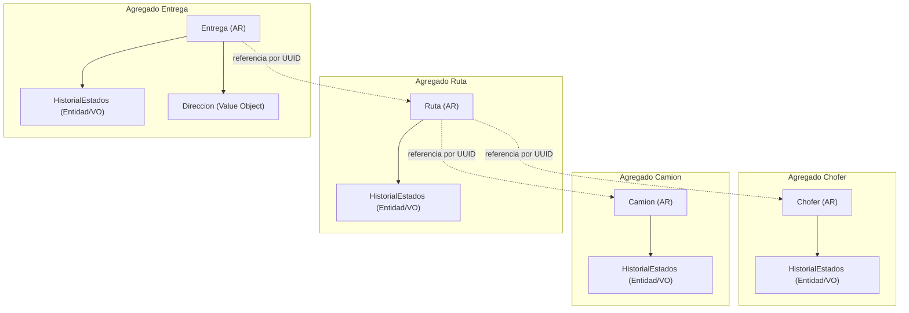
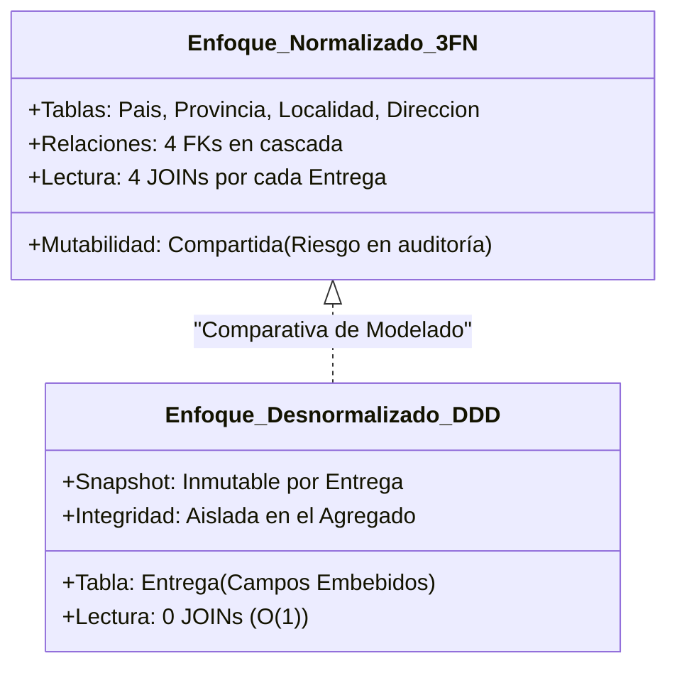
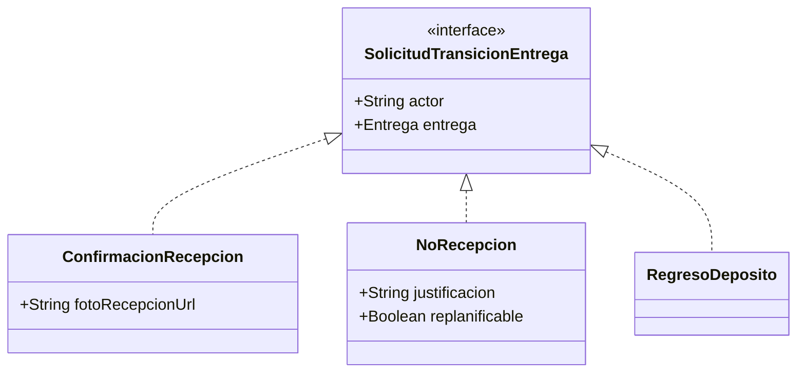

# Informe de Revisión de Diseño: Modelado de Datos y Persistencia (Servicio de Logística)

**Rol:** Ingeniero Revisor de Diseño de Software y Arquitectura de Datos  
**Contexto:** Servicio de Logística — Sistema DonaTrack  
**Documentos evaluados:**
- Diagrama de Clases de Dominio: [`logistica-clases.puml`](logistica-clases.puml)
- Export DDL del DER: [`logistica-DER.sql`](logistica-DER.sql)
- Catálogo de Agregados DDD: [`aggregates-servicio-logistica.md`](../../../aggregates-logistica.md)

---

## 1. Análisis del Modelado desde el Enfoque Domain-Driven Design (DDD)

El diseño del dominio define límites transaccionales y de consistencia claros a través de 4 **Aggregate Roots (Raíces de Agregado)** principales:



### 1.1. Correspondencia entre Modelo de Dominio y Modelo Relacional
1. **Límites de Agregados y Referencias por Identidad (ID Reference)**:
   - Siguiendo las reglas de DDD táctico, los agregados independientes (`Camion`, `Chofer`, `Ruta`, `Entrega`) se comunican entre sí exclusivamente mediante sus identificadores únicos (`UUID`). 
   - En el DER, la tabla `Ruta` almacena `id_chofer` y `id_camion`, mientras que `Entrega` almacena `id_ruta`, `id_donacion` y `id_beneficiario`. Esto respeta el desacoplamiento entre agregados.
2. **Entidades Internas vs. Value Objects (VO)**:
   - **`Direccion` (con `Localidad`, `Provincia`, `Pais`)**: En el dominio es un *Value Object* inmutable que define el destino de una entrega. En el DER fue tratado como un conjunto de entidades normalizadas independientes con identidad artificial propia (`id_direccion`, `id_localidad`, etc.).
   - **Historiales de Estado (`CambioEstado*`)**: Son entidades dependientes del ciclo de vida de sus respectivas raíces. En el DER se plasmaron en tablas auxiliares independientes.
3. **Servicios de Dominio y Clases de Estrategia**:
   - Componentes como `GestorDeCamiones`, `ValidadorPatentes`, `GeneradorDeRutas`, `AlgoritmoOrdenadorSimple` y `AsignadorDeEntregasPorDimension` son **Servicios de Dominio** o implementaciones del patrón **Strategy**. Correctamente, no fueron persistidos como tablas relacionales, ya que representan lógica de comportamiento y no estado de negocio persistente.

---

## 2. Comparación de Decisiones: Normalización vs. Desnormalización



A continuación se contrastan las alternativas de modelado adoptadas frente a sus contrapartes en cada entidad del modelo:

| Elemento / Concepto | Opción Elegida en el DER (Normalizada) | Opción Alternativa (Desnormalizada / DDD) | Ventajas de la Opción Elegida | Desventajas / Fricciones Generadas |
| :--- | :--- | :--- | :--- | :--- |
| **Modelado Geográfico (`Direccion`)** | **Alta Normalización (3FN / BCNF)**:<br>4 tablas vinculadas:<br>`Pais` &larr; `Provincia` &larr; `Localidad` &larr; `Direccion`. | **Embebido / Flattening (Value Object)**:<br>Campos embebidos directamente en la tabla `Entrega` (o almacenados como columna `JSONB` inmutable). | • Evita duplicidad de nombres de provincias/localidades.<br>• Estandarización geográfica relacional. | • Requiere 4 `JOIN` para obtener el destino de una entrega.<br>• **Viola el concepto de *Snapshot Inmutable*:** Si una localidad o calle cambia de nombre o se corrige, modifica retroactivamente los destinos históricos de entregas pasadas.<br>• Introduce claves foráneas innecesarias entre agregados y maestros. |
| **Historial de Estados (`Cambio_estado_*`)** | **Tablas 1:N Independientes**:<br>Una tabla de historial por cada Aggregate Root (`Camion`, `Chofer`, `Ruta`, `Entrega`). | **Estado Actual en Raíz + Tabla Única de Auditoría / Eventos** (Event Sourcing parcial o Audit Log unificado). | • Trazabilidad temporal exhaustiva.<br>• Consultas sencillas sobre transiciones de una entidad específica. | • Proliferación de 4 tablas con estructuras prácticamente idénticas.<br>• En el DER actual contienen redundancia y errores de clave foránea. |
| **Estado Actual del Agregado** | **Desnormalización del Estado Actual**:<br>La columna `estado` se mantiene en `Camion`, `Chofer`, `Ruta` y `Entrega`, a la par que existe la tabla de historial. | **Estado Calculado**:<br>Obtener el estado actual haciendo `ORDER BY timestamp DESC LIMIT 1` sobre la tabla de historial. | • **Decisión correcta**: Consultas inmediatas del estado actual en tiempo $O(1)$ sin agregaciones o subqueries sobre la tabla histórica. | • Requiere garantizar coherencia transaccional (insertar en historial y actualizar estado de la raíz en la misma transacción). |
| **Secuencia de Entregas en una Ruta** | **Relación Simple 1:N**:<br>`Entrega` guarda `id_ruta` como FK. | **Tabla Intermedia con Orden Operativo**:<br>Tabla `Ruta_Entrega` o campo `orden_visita` / `secuencia` en `Entrega`. | • Estructura mínima con una sola FK. | • **Pérdida de invariante de negocio:** La ruta logística exige un orden estricto de visita de los camiones. El DER actual no modela la secuencia ni el orden de parada. |

---

## 3. Estrategias de Mapeo de Herencia y Polimorfismo

En el diagrama de clases existe una jerarquía polimórfica explícita vinculada al ciclo de vida de `Entrega`:



### 3.1. Evaluación de Alternativas de Mapeo Relacional

#### Opción A: Single Table Inheritance (Tabla Única)
Se colapsa la jerarquía en una única tabla de auditoría/transición con un discriminador `tipo_transicion`.
- **Estructura:**
  ```sql
  CREATE TABLE transicion_entrega (
      id_transicion UUID PRIMARY KEY,
      id_entrega UUID NOT NULL,
      actor VARCHAR(100) NOT NULL,
      tipo_transicion VARCHAR(30) NOT NULL, -- 'CONFIRMACION', 'NO_RECEPCION', 'REGRESO_DEPOSITO'
      foto_recepcion_url VARCHAR(255) NULL,
      justificacion TEXT NULL,
      replanificable BOOLEAN NULL,
      timestamp TIMESTAMP NOT NULL
  );
  ```
- **Pros:** Máximo rendimiento en lecturas/escrituras (sin `JOIN` ni `UNION`), simplifica la auditoría.
- **Contras:** Columnas con valores `NULL` para los subtipos que no aplican esos atributos.

#### Opción B: Joined Table Inheritance (Tabla por Clase con Clave Foránea)
Una tabla base (`transicion_entrega`) y 3 tablas hijas (`confirmacion_recepcion`, `no_recepcion`, `regreso_deposito`).
- **Pros:** Integridad relacional estricta; restricciones `NOT NULL` aplicables en cada tabla hija.
- **Contras:** Sobrecarga de `JOIN` en cada consulta de historial polimórfico; mayor complejidad en operaciones DML.

#### Opción C: Table per Concrete Class (Tabla por Clase Concreta)
Una tabla para cada tipo de transición, sin tabla base.
- **Pros:** No hay columnas nulas ni tablas maestras intermedias.
- **Contras:** Consultar el historial completo de una entrega obliga a unificar mediante `UNION ALL`.

#### Opción D: Patrón DTO/Comando de Aplicación (Alternativa adoptada parcialmente en el DER)
En DDD, `SolicitudTransicionEntrega` funciona como un **Command** de la capa de aplicación/dominio. No necesita persistirse como entidad polimórfica si sus datos de resultado se almacenan en el registro inmutable de auditoría (`Cambio_estado_entrega`).
- **Diagnóstico del DER actual:** En el DER se agregaron columnas como `foto_recepcion_url` directamente en `Entrega`, pero se omitió registrar la `justificacion` y `replanificable` en `Cambio_estado_entrega`.

---

## 4. Hallazgos Críticos y Defectos Estructurales en `logistica-DER.sql`

Durante la revisión técnica del script DDL exportado, se identificaron **defectos severos de integridad referencial, sintaxis y tipado**:

### 4.1. Claves Foráneas Invertidas y Referencias Cruzadas Inválidas (Severidad: Crítica)
1. **En tabla `Camion` (Líneas 44-47):**
   ```sql
   -- INCORRECTO:
   CONSTRAINT "FK_Camion_patente"
     FOREIGN KEY ("patente") REFERENCES "Cambio_estado_camion"("id_camion")
   ```
   *Problema:* La entidad raíz (`Camion`) intenta referenciar como FK a su propia tabla hija de historial (`Cambio_estado_camion`), cruzando además un `varchar` (`patente`) contra un `UUID` (`id_camion`). La FK debe estar en `Cambio_estado_camion` apuntando a `Camion(id_camion)`.
2. **En tabla `Chofer` (Líneas 101-104):**
   ```sql
   -- INCORRECTO:
   CONSTRAINT "FK_Chofer_nombre"
     FOREIGN KEY ("nombre") REFERENCES "Cambio_estado_chofer"("id_chofer")
   ```
   *Problema:* Error idéntico; vincula la columna `nombre` (string) al UUID de historial.
3. **En tabla `Ruta` (Líneas 118-124):**
   ```sql
   -- INCORRECTO:
   CONSTRAINT "FK_Ruta_id_camion" FOREIGN KEY ("id_camion") REFERENCES "Camion"("patente"),
   CONSTRAINT "FK_Ruta_id_ruta" FOREIGN KEY ("id_ruta") REFERENCES "Cambio_estado_ruta"("id_ruta")
   ```
   *Problema:* `id_camion` (UUID) referencia `Camion.patente` (varchar) en lugar de la PK `Camion.id_camion`. Además, `Ruta` tiene una FK circular e invertida hacia su historial de cambios.
4. **En tabla `Entrega` (Líneas 139-141):**
   ```sql
   -- INCORRECTO:
   CONSTRAINT "FK_Entrega_id_entrega" FOREIGN KEY ("id_entrega") REFERENCES "Cambio_estado_entrega"("id_entrega")
   ```
   *Problema:* Inversión del sentido de la relación. `Entrega` no puede depender de la existencia previa de un registro en `Cambio_estado_entrega`.

### 4.2. Errores de Sintaxis, Nomenclatura y Tipos de Datos (Severidad: Alta)
1. **Artefactos corruptos de exportación (`"" <type>` y `"actor" <type>`):**
   - En líneas 33, 55, 79 y 89 existen columnas anónimas con tipo placeholder (`<type>`), lo cual provoca error de ejecución en cualquier motor SQL estándar.
2. **Identificador erróneo en `Cambio_estado_chofer` (Línea 50):**
   - La PK fue nombrada `"id_cambio_estado_entrega"` en lugar de `"id_cambio_estado_chofer"`.
3. **Tipos de datos inadecuados para el dominio:**
   - **Fechas y Tiempos:** Uso de `int` para `timestamp`, `fecha`, `hora_arribo`, `hora_salida`, `hora_inicio_estimada`, etc. Deben utilizarse tipos temporales nativos (`TIMESTAMP WITH TIME ZONE` o `DATE`).
   - **Teléfono y Código Postal:** `telefono` y `codigo_postal` están tipados como `int`. En Argentina y a nivel internacional, los números de teléfono poseen prefijos y ceros a la izquierda (desbordan un `INTEGER` de 32 bits), y los códigos postales pueden ser alfanuméricos (e.g. `C1414EBD`). Deben ser `VARCHAR`.
   - **Tipo genérico `enum` y `string`:** No corresponden a tipos ANSI SQL / PostgreSQL válidos. Deben definirse tipos `ENUM` con nombre o constraints `CHECK`.

---

## 5. Propuestas de Mejora y Consejos de Diseño Justificados

A continuación se presentan las decisiones de rediseño recomendadas con su debida justificación arquitectónica:

### Mejora 1: Desnormalizar `Direccion` como Value Object Embebido en `Entrega`
*   **Justificación:** En el dominio logístico, la dirección de entrega es un **Value Object** y representa una foto fija (*snapshot*) del momento en que se pactó el traslado. Normalizar en 4 tablas geográficas obliga a costosos `JOINs` en cada consulta de hoja de ruta y crea un acoplamiento frágil ante renombre de calles o divisiones administrativas.
*   **Decisión:** Embeber los atributos de la dirección (`calle`, `altura`, `piso`, `departamento`, `codigo_postal`, `localidad`, `provincia`, `pais`) directamente en la tabla `entrega` o mediante una estructura `JSONB` indexada.

### Mejora 2: Incorporar Secuencia / Orden de Visita en `Ruta`
*   **Justificación:** Una ruta no es un conjunto desordenado de entregas, sino una **secuencia ordenada de paradas**.
*   **Decisión:** Incluir la columna `orden_visita INT NOT NULL` en la tabla `entrega` (o en una tabla asociativa `parada_ruta`), asegurando unicidad compuesta mediante `UNIQUE (id_ruta, orden_visita)`.

### Mejora 3: Unificar el Historial de Transiciones con soporte polimórfico
*   **Justificación:** Permite auditar adecuadamente los datos provenientes de `ConfirmacionRecepcion` (foto), `NoRecepcion` (justificación, replanificación) y `RegresoDeposito` sin perder información ni crear tablas dispersas.
*   **Decisión:** Diseñar `cambio_estado_entrega` bajo el patrón **Single Table Inheritance** incluyendo `actor`, `justificacion`, `replanificable` y `foto_recepcion_url`.

### Mejora 4: Corrección Integral de Claves Foráneas y Tipado Nativo
*   **Justificación:** Restablecer el sentido natural de las relaciones 1:N (la tabla hija referencia a la raíz de agregado) y utilizar tipos estándar de base de datos (`TIMESTAMPTZ`, `DECIMAL(10,2)`, `VARCHAR`, constraints `CHECK`).

---

## 6. Esquema DDL SQL Recomendado (PostgreSQL / ANSI SQL)

A continuación se provee el script DDL corregido, optimizado y alineado a los principios de DDD y las recomendaciones expuestas:

```sql
-- ============================================================================
-- SERVICIO DE LOGÍSTICA - ESQUEMA DE BASE DE DATOS OPTIMIZADO (DDD ALIGNED)
-- ============================================================================

-- ----------------------------------------------------------------------------
-- 1. ENUMS Y TIPOS DE DOMINIO
-- ----------------------------------------------------------------------------
CREATE TYPE estado_chofer AS ENUM ('DISPONIBLE', 'EN_RUTA', 'DESHABILITADO');
CREATE TYPE estado_camion AS ENUM ('DISPONIBLE', 'EN_RUTA', 'DESHABILITADO');
CREATE TYPE estado_ruta   AS ENUM ('PENDIENTE', 'EN_TRASLADO', 'COMPLETADA');
CREATE TYPE estado_entrega AS ENUM ('PENDIENTE', 'EN_TRASLADO', 'ENTREGADA', 'NO_RECIBIDA', 'REVISION');

-- ----------------------------------------------------------------------------
-- 2. AGREGADO CHOFER
-- ----------------------------------------------------------------------------
CREATE TABLE chofer (
    id_chofer UUID PRIMARY KEY,
    nombre VARCHAR(100) NOT NULL,
    apellido VARCHAR(100) NOT NULL,
    licencia VARCHAR(50) NOT NULL UNIQUE,
    telefono_contacto VARCHAR(30) NOT NULL,
    estado estado_chofer NOT NULL DEFAULT 'DISPONIBLE',
    habilitado BOOLEAN NOT NULL DEFAULT TRUE,
    created_at TIMESTAMP WITH TIME ZONE DEFAULT CURRENT_TIMESTAMP NOT NULL
);

CREATE TABLE cambio_estado_chofer (
    id_cambio_estado_chofer UUID PRIMARY KEY,
    id_chofer UUID NOT NULL,
    estado_anterior estado_chofer NOT NULL,
    estado_nuevo estado_chofer NOT NULL,
    timestamp TIMESTAMP WITH TIME ZONE DEFAULT CURRENT_TIMESTAMP NOT NULL,
    CONSTRAINT fk_cambio_estado_chofer_chofer
        FOREIGN KEY (id_chofer)
        REFERENCES chofer(id_chofer)
        ON DELETE RESTRICT
);
CREATE INDEX idx_cambio_chofer_id ON cambio_estado_chofer(id_chofer);

-- ----------------------------------------------------------------------------
-- 3. AGREGADO CAMIÓN
-- ----------------------------------------------------------------------------
CREATE TABLE camion (
    id_camion UUID PRIMARY KEY,
    patente VARCHAR(15) NOT NULL UNIQUE,
    capacidad_volumen_m3 NUMERIC(8, 2) NOT NULL CHECK (capacidad_volumen_m3 > 0),
    capacidad_peso_kg NUMERIC(8, 2) NOT NULL CHECK (capacidad_peso_kg > 0),
    altura_m NUMERIC(5, 2) NOT NULL CHECK (altura_m > 0),
    estado estado_camion NOT NULL DEFAULT 'DISPONIBLE',
    ruta_actual_id UUID NULL, -- Referencia débil por ID
    created_at TIMESTAMP WITH TIME ZONE DEFAULT CURRENT_TIMESTAMP NOT NULL
);

CREATE TABLE cambio_estado_camion (
    id_cambio_estado_camion UUID PRIMARY KEY,
    id_camion UUID NOT NULL,
    estado_anterior estado_camion NOT NULL,
    estado_nuevo estado_camion NOT NULL,
    timestamp TIMESTAMP WITH TIME ZONE DEFAULT CURRENT_TIMESTAMP NOT NULL,
    CONSTRAINT fk_cambio_estado_camion_camion
        FOREIGN KEY (id_camion)
        REFERENCES camion(id_camion)
        ON DELETE RESTRICT
);
CREATE INDEX idx_cambio_camion_id ON cambio_estado_camion(id_camion);

-- ----------------------------------------------------------------------------
-- 4. AGREGADO RUTA
-- ----------------------------------------------------------------------------
CREATE TABLE ruta (
    id_ruta UUID PRIMARY KEY,
    id_chofer UUID NOT NULL,
    id_camion UUID NOT NULL,
    fecha DATE NOT NULL,
    estado estado_ruta NOT NULL DEFAULT 'PENDIENTE',
    hora_inicio_real TIMESTAMP WITH TIME ZONE NULL,
    hora_fin_real TIMESTAMP WITH TIME ZONE NULL,
    created_at TIMESTAMP WITH TIME ZONE DEFAULT CURRENT_TIMESTAMP NOT NULL,
    CONSTRAINT fk_ruta_chofer
        FOREIGN KEY (id_chofer)
        REFERENCES chofer(id_chofer)
        ON DELETE RESTRICT,
    CONSTRAINT fk_ruta_camion
        FOREIGN KEY (id_camion)
        REFERENCES camion(id_camion)
        ON DELETE RESTRICT
);
CREATE INDEX idx_ruta_fecha ON ruta(fecha);
CREATE INDEX idx_ruta_estado ON ruta(estado);

CREATE TABLE cambio_estado_ruta (
    id_cambio_estado_ruta UUID PRIMARY KEY,
    id_ruta UUID NOT NULL,
    estado_anterior estado_ruta NOT NULL,
    estado_nuevo estado_ruta NOT NULL,
    timestamp TIMESTAMP WITH TIME ZONE DEFAULT CURRENT_TIMESTAMP NOT NULL,
    CONSTRAINT fk_cambio_estado_ruta_ruta
        FOREIGN KEY (id_ruta)
        REFERENCES ruta(id_ruta)
        ON DELETE RESTRICT
);
CREATE INDEX idx_cambio_ruta_id ON cambio_estado_ruta(id_ruta);

-- ----------------------------------------------------------------------------
-- 5. AGREGADO ENTREGA (CON DIRECCIÓN EMBEBIDA COMO VALUE OBJECT)
-- ----------------------------------------------------------------------------
CREATE TABLE entrega (
    id_entrega UUID PRIMARY KEY,
    id_ruta UUID NULL, -- Asignada a una ruta o pendiente de asignación
    orden_visita INT NULL, -- Secuencia operativa en la ruta
    id_donacion UUID NOT NULL, -- Referencia por ID a donaciones-service
    id_beneficiario UUID NOT NULL, -- Referencia por ID a beneficiarios
    estado estado_entrega NOT NULL DEFAULT 'PENDIENTE',
    
    -- Magnitudes físicas
    volumen_total_m3 NUMERIC(8, 2) NOT NULL CHECK (volumen_total_m3 > 0),
    peso_total_kg NUMERIC(8, 2) NOT NULL CHECK (peso_total_kg > 0),
    
    -- Trazabilidad operativa
    hora_arribo TIMESTAMP WITH TIME ZONE NULL,
    hora_salida TIMESTAMP WITH TIME ZONE NULL,
    foto_recepcion_url VARCHAR(255) NULL,
    
    -- Value Object: Dirección de Destino Embebida (Inmutable Snapshot)
    destino_calle VARCHAR(150) NOT NULL,
    destino_altura INT NOT NULL,
    destino_piso INT NULL,
    destino_departamento VARCHAR(10) NULL,
    destino_codigo_postal VARCHAR(20) NOT NULL,
    destino_localidad VARCHAR(100) NOT NULL,
    destino_provincia VARCHAR(100) NOT NULL,
    destino_pais VARCHAR(100) NOT NULL DEFAULT 'Argentina',
    
    created_at TIMESTAMP WITH TIME ZONE DEFAULT CURRENT_TIMESTAMP NOT NULL,
    
    CONSTRAINT fk_entrega_ruta
        FOREIGN KEY (id_ruta)
        REFERENCES ruta(id_ruta)
        ON DELETE RESTRICT,
    CONSTRAINT uq_ruta_orden_visita
        UNIQUE (id_ruta, orden_visita)
);
CREATE INDEX idx_entrega_ruta ON entrega(id_ruta);
CREATE INDEX idx_entrega_estado ON entrega(estado);
CREATE INDEX idx_entrega_donacion ON entrega(id_donacion);

-- ----------------------------------------------------------------------------
-- 6. AUDITORÍA POLIMÓRFICA DE CAMBIOS DE ESTADO DE ENTREGA (Single Table)
-- ----------------------------------------------------------------------------
CREATE TABLE cambio_estado_entrega (
    id_cambio_estado_entrega UUID PRIMARY KEY,
    id_entrega UUID NOT NULL,
    estado_anterior estado_entrega NOT NULL,
    estado_nuevo estado_entrega NOT NULL,
    actor VARCHAR(100) NOT NULL, -- Chofer, Beneficiario o Administrador
    timestamp TIMESTAMP WITH TIME ZONE DEFAULT CURRENT_TIMESTAMP NOT NULL,
    
    -- Atributos de SolicitudTransicionEntrega (Polimórficos)
    motivo_justificacion TEXT NULL,       -- Aplicable en NoRecepcion / Revision
    es_replanificable BOOLEAN NULL,       -- Aplicable en NoRecepcion
    foto_recepcion_url VARCHAR(255) NULL, -- Aplicable en ConfirmacionRecepcion
    
    CONSTRAINT fk_cambio_estado_entrega_entrega
        FOREIGN KEY (id_entrega)
        REFERENCES entrega(id_entrega)
        ON DELETE CASCADE
);
CREATE INDEX idx_cambio_entrega_id ON cambio_estado_entrega(id_entrega);
```

---

## 7. Resumen de Decisiones y Recomendación Final

1. **Adoptar el DDL Corregido**: Corrige de inmediato las FKs invertidas que imposibilitaban la inserción y consulta en base de datos.
2. **Priorizar Dirección Embebida en `Entrega`**: Resguarda la inmutabilidad histórica de los destinos y suprime 4 tablas intermedias que añadían latencia y costo de mantenimiento.
3. **Mantener la Auditoría con Enfoque Single Table**: Da soporte directo a los comandos `ConfirmacionRecepcion`, `NoRecepcion` y `RegresoDeposito` manteniendo simpleza y performance.
4. **Incorporar `orden_visita`**: Cumple con la regla operativa fundamental de planificación de rutas de reparto.