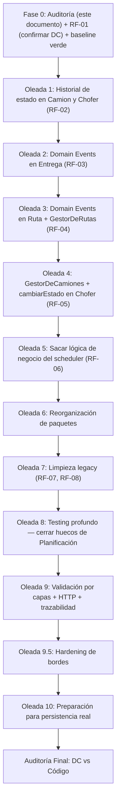

# Plan de Refactor por Oleadas — `logistica-service`

> Instancia específica del [Plan Genérico de Refactor por Oleadas v2] aplicada a `logistica-service`, a partir de:
> 1. El DC actualizado (`DC_COMPLETO.PNG` + `dc_zoom1..5.PNG`, bloques ENTREGA / RUTAS / CAMIONES / CHOFER / DIRECCION / PLANIFICADOR_EXTERNO).
> 2. El código actual del módulo (`logistica-service.zip`, paquete `grupo5.logistica.*`).
>
> **Nota sobre `common-lib`:** el zip no incluye el módulo compartido (`AggregateRoot`, `CrudRepositoryEnMemoria`, `ErrorCatalog`, `ValidationException`, `BusinessStateException`, `RecursoNoEncontradoException`). Se lo trata como infraestructura dada, sin evaluarlo — igual que se hizo en la Fase 0 de donaciones. Esto es relevante porque, según la bitácora de `incentivos-service`, en algún momento se agregó a `common-lib` una abstracción centralizada para agregados con eventos (`AgregadoConEventos<T>`). **No pude confirmar si ya existe** (no está en este zip): es el primer punto a verificar antes de arrancar la Oleada 2 (ver Fase 0.5).
>
> **Convención nueva de este documento:** cuando el resultado de una oleada cambia una precondición que la siguiente oleada necesita conocer (una firma que se va a tocar, un bug que hay que reportar, una decisión de diseño pendiente), la oleada lo marca con un bloque **🔁 Devolución necesaria**. Si una oleada no tiene ese bloque, es porque no hace falta avisar nada especial al que siga.

---

## Fase 0 — Auditoría de `logistica-service`

**Rol de esta sección:** observación y evidencia, no refactor. Ninguna de las acciones descritas en las oleadas más abajo está implementada todavía.

### 1. Resumen ejecutivo

1. **Cero Domain Events reales.** Ni `Entrega` ni `Ruta` generan eventos propios (no hay `registrarEvento`/`getDomainEvents`/`clearDomainEvents` en ninguna de las dos). Los cuatro eventos que el DC dibuja (`EventoRutaAsignada`, `EventoRutaIniciada`, `EventoEntregaExitosa`, `EventoEntregaFallida`) existen en el código, pero como **DTOs** (`dto/eventos/*`) que arma y publica directamente el Application Service — exactamente el mismo patrón que en `donaciones-service` antes de su Oleada 2. Ver §8.
2. **Los tres Domain Services (`Gestor*`) del DC no existen.** El DC define `GestorDeEntregas`, `GestorDeRutas` y `GestorDeCamiones` como componentes de dominio separados de los Application Services. En el código, esa coordinación está directamente adentro de `EntregasService`, `RutasService` y `CamionesService`. Es la brecha más consistente de todo el servicio — aparece en los tres bloques del DC por igual. Ver §5, §6.
3. **Duplicación de regla de negocio confirmada**, igual que el caso `ProcesadorDeDonaciones`/`ItemDonacionNormalizadoService` de donaciones: `RutasService.agregarEntrega` y `PlanificacionService.guardarRutaPlanificada` implementan **cada uno por su cuenta** la secuencia "asignar entrega(s) a una ruta + publicar `EventoRutaAsignada` por cada una". Ver §6.
4. **El scheduler (`PlanificadorDeEntregas`) contiene lógica de negocio propia**, marcada por el propio equipo con comentarios `// INICIO LOGICA DE NEGOCIO` / `// FIN LOGICA DE NEGOCIO`: filtra entregas pendientes, filtra camiones disponibles y particiona en lotes de máximo N elementos. Nada de esto está delegado a un Application Service. Buena noticia: ya hay characterization tests (`PlanificadorDeEntregasTest`) que cubren la partición en lotes y se pueden portar tal cual. Ver §5.9, §10.
5. **Switch anémico duplicado dos veces**, también auto-marcado por el equipo: `CamionesService.cambiarEstado` y `ChoferService.cambiarEstado` repiten exactamente el mismo `switch(estado){ DISPONIBLE -> habilitar(); DESHABILITADO -> deshabilitar(); EN_RUTA -> throw ...}`. El DC asigna esta responsabilidad a `GestorDeCamiones.cambiarEstado(Camion, EstadoCamion)` para camiones, y a un método `cambiarEstado(EstadoChofer)` directamente en `Chofer` para choferes — dos soluciones distintas para el mismo problema, ninguna de las dos implementada. Ver §6.
6. **Divergencia de diseño consciente y bien documentada, no un bug**: el bloque `PLANIFICADOR_EXTERNO` del DC modela un componente síncrono en memoria (`PlanificadorDeRutas.procesarSolicitud(...): RespuestaPlanificacion`). El código implementa en cambio un **simulador de proveedor externo asincrónico** (`GeneradorDeRutas`, `@Async` + callback HTTP vía `RestTemplate`, con `SolicitudPlanificacion`/`EstadoSolicitud` como registro de auditoría persistente) — una entidad y un patrón que **no existen en el DC en absoluto**. El propio Javadoc de `GeneradorDeRutas` explica la intención: anticipar el contrato que usaría un proveedor real el día que se reemplace la implementación. Es una decisión de diseño razonable, pero el DC quedó desactualizado respecto a ella. Ver §4, §11.
7. **Hueco de tests concentrado justo en lo más nuevo/divergente**: no hay ningún test de `PlanificacionService`, `PlanificacionController`, `SolicitudPlanificacion` (entidad), `Direccion` (value object con validación propia) ni de ningún mapper. Es la zona menos cubierta de todo el servicio. Ver §10.
8. `Camion` y `Chofer` son, en cambio, la parte del código **mejor alineada** con los principios transversales: Tell-Don't-Ask casi completo (`habilitar()`, `deshabilitar()`, `asignarARuta()`, `completarRuta()`, `estaDisponibleParaAsignar()`), sin `@Setter`, sin excepciones crudas. Les falta únicamente el historial de cambios de estado que el DC sí pide (`CambioEstadoCamion`, `CambioEstadoChofer` — ninguna de las dos clases existe en el código).
9. **Posible inconsistencia en el propio DC**: `CambioEstadoCamion` aparece con sus campos `estadoAnterior`/`estadoNuevo` tipados como `EstadoRuta` en vez de `EstadoCamion` (visible en la imagen ampliada de CAMIONES). Puede ser un error de tipeo del diagrama o una decisión real — no se puede asumir ninguna de las dos sin preguntar. **Se marca como pendiente de confirmar con quien mantiene el DC antes de crear la clase** (ver Oleada 1).
10. Un método de mapeo toma una decisión de negocio: `RutaMapper.calcularUrlSeguimiento` decide que la URL de tracking solo existe si `ruta.getEstado() != PENDIENTE` — es una regla de negocio (¿cuándo hay seguimiento disponible?) escondida en la capa de mapeo en lugar de ser una pregunta semántica a `Ruta`. Ver §6.
11. Duplicación menor de lógica de consulta: `ValidadorPatentes`, `PlanificadorDeEntregas` y `GeneradorDeRutas` re-filtran `findAll()` manualmente en vez de reusar los métodos de query ya existentes en los repositorios (`ICamionRepository.findByPatente`, `findDisponibles`). Además, `GeneradorDeRutas` vuelve a filtrar "disponibles" sobre una lista que el scheduler ya le pasó filtrada — doble filtrado redundante, señal de que no hay un único dueño claro de esa regla. Ver §9.
12. Wildcard imports presentes en 4 archivos (`IEntregasController`, `IRutasController`, `CamionesController`, `ChoferesController`). Ver §11.
13. Naming inconsistente: `Ruta` expone tres métodos equivalentes (`getEntregas()`, `getEntregaIds()`, `obtenerEntregas()`) que hacen lo mismo; `Camion`/`Chofer` usan `asignarARuta(UUID)` mientras el DC nombra el método `asignarRuta(...)`.
14. Dos DTOs de `dto/callback` (`EntregaPlanificadaDTO`, `SolicitudPlanificacionRequestDTO`) no tienen ningún call site en `src/main` — candidatos a código muerto o a un circuito que quedó a medio construir. A confirmar antes de tocarlos.
15. Sin relación con este refactor pero digno de nota: el endpoint `POST /api/logistica/callback/rutas` no tiene ninguna verificación de origen — cualquiera que conozca la URL puede marcar una `SolicitudPlanificacion` como resuelta con rutas arbitrarias. Es un tema de seguridad, no de arquitectura; se deja como nota para quien corresponda, fuera del alcance de este plan.

### 2. Modelo objetivo reconstruido del DC (resumen por bloque)

| Bloque | Clases principales | Responsabilidad según el DC |
|---|---|---|
| **ENTREGA** | `Entrega` (AR), `EstadoEntrega`, `CambioEstadoEntrega`, `EventoEntrega` (+ 3 subclases), `SolicitudTransicionEntrega` (sealed interface + `ConfirmacionRecepcion`/`NoRecepcion`/`RegresoDeposito`), `GestorDeEntregas`, `GeneradorLotesSimple`/`GeneradorLotes` | `Entrega` gestiona su ciclo de vida y genera sus propios eventos; `GestorDeEntregas` orquesta transiciones vía parameter objects (`SolicitudTransicionEntrega`) |
| **RUTAS** | `Ruta` (AR), `EstadoRuta`, `CambioEstadoRuta`, `EventoRutaIniciada`, `EventoRutaAsignada`/`EventoEntregaFallida`/`EventoEntregaExitosa` (asociados también acá), `GestorDeRutas` | `Ruta` gestiona su ciclo PENDIENTE→EN_TRASLADO→COMPLETADA y su historial; `GestorDeRutas.iniciarRuta(Ruta, Chofer)`/`completarRuta(Ruta, Chofer)`/`cambiarEstado(...)` coordina Ruta+Chofer |
| **CAMIONES** | `Camion` (AR), `EstadoCamion`, `CambioEstadoCamion`, `GestorDeCamiones`, `ValidadorPatentes`, `SolicitudNuevoCamion` | `GestorDeCamiones.procesarSolicitudNuevoCamion(...)`/`cambiarEstado(Camion, EstadoCamion)` orquesta; `ValidadorPatentes` valida formato + unicidad |
| **CHOFER** | `Chofer` (AR), `EstadoChofer`, `CambioEstadoChofer` | `Chofer.cambiarEstado(EstadoChofer)` directo en la entidad, sin Gestor dedicado |
| **DIRECCION** | `Direccion`, `Localidad`, `Provincia`, `Pais` | Value objects anidados, cada uno con `anonimizar()` |
| **PLANIFICADOR_EXTERNO** | `PlanificadorDeRutas`, `AlgoritmoOrdenadorDeEntregas`/`AlgoritmoAsignadorDeEntregas` (interfaces Strategy), `PlanificacionSolicitada`, `RespuestaPlanificacion`, `GeneradorDeRutas` (generador de lotes, `MAX_ENTREGAS_POR_SOLICITUD=100`) | Componente síncrono en memoria: recibe una `PlanificacionSolicitada`, devuelve una `RespuestaPlanificacion` |

### 3. Matriz DC → código

| Clase del DC | ¿Existe? | Archivo | Diferencias principales |
|---|---|---|---|
| `Entrega` | Parcial | `models/entities/entregas/Entrega.java` | Métodos casi 1:1 con el DC (`iniciarRuta`, `confirmarEntrega`, `adjuntarFotoRecepcion`, `negarEntrega`, `regresarAlDeposito`, `asignarRuta`). **Sin `eventos`/`registrarEvento`/`getDomainEvents`/`clearDomainEvents`** — no genera ninguno de los eventos que el DC le asocia. `mandarARevision` es privado y se auto-encadena desde `negarEntrega` con actor hardcodeado `"SISTEMA_LOGISTICA"`, mientras el DC lo muestra como método público independiente — a confirmar si el flujo real necesita que un administrador dispare esa transición por separado |
| `EstadoEntrega` | Sí | `models/entities/entregas/EstadoEntrega.java` | Coincide (`PENDIENTE, EN_TRASLADO, ENTREGADA, NO_RECIBIDA, REVISION`) |
| `CambioEstadoEntrega` | Sí | `models/entities/entregas/CambioEstadoEntrega.java` | Coincide |
| `EventoEntrega` (+ 3 subclases) | No | — | No existe ninguna clase de evento de dominio. Lo más parecido son los DTOs `dto/eventos/EventoRutaAsignada`, `EventoRutaIniciada`, `EventoEntregaExitosa`, `EventoEntregaFallida`, con forma de campos muy similar a la del DC, pero construidos y publicados directamente por los Services, no generados por `Entrega`/`Ruta` |
| `SolicitudTransicionEntrega` (sealed) + `ConfirmacionRecepcion`/`NoRecepcion`/`RegresoDeposito` | No | — | El código resuelve cada transición con un DTO de request específico por endpoint (`ConfirmarRecepcionRequestDTO`, `ReportarNoRecepcionRequestDTO`, `RegresarAlDepositoRequestDTO`) en vez de un parameter object de dominio polimórfico único |
| `GestorDeEntregas` | No | — | Su responsabilidad (`cambiarEstado(SolicitudTransicionEntrega)`) está repartida entre los métodos públicos de `EntregasService` |
| `GeneradorLotesSimple` / `GeneradorLotes` | Equivalente parcial | — | No existe como tal para Entregas; el particionado en lotes que sí existe (`PlanificadorDeEntregas.particionarEnLotes`) pertenece conceptualmente al bloque `PLANIFICADOR_EXTERNO`, no a `ENTREGA` |
| `Ruta` | Parcial | `models/entities/rutas/Ruta.java` | `iniciarRuta()`, `completarRuta()`, `agregarEntrega()` coinciden. **Sin `historialEstado`/`CambioEstadoRuta`, sin eventos.** Tres getters redundantes para la misma lista de entregas (`getEntregas`, `getEntregaIds`, `obtenerEntregas`) |
| `EstadoRuta` | Sí | `models/entities/rutas/EstadoRuta.java` | Coincide (`PENDIENTE, EN_TRASLADO, COMPLETADA`) |
| `CambioEstadoRuta` | No | — | No existe ninguna clase ni campo de historial en `Ruta` |
| `GestorDeRutas` | No | — | Su responsabilidad (`iniciarRuta(Ruta, Chofer)`, `completarRuta(Ruta, Chofer)`, `cambiarEstado(...)`) está implementada directamente dentro de `RutasService.iniciar()`/`completar()`, bloques marcados por el equipo como `// INICIO/FIN LOGICA DE NEGOCIO` |
| `Camion` | Parcial | `models/entities/camiones/Camion.java` | `habilitar`, `deshabilitar`, `asignarARuta` (DC: `asignarRuta`), `completarRuta`, `estaDisponibleParaAsignar`, `validarPatente`, `validarCapacidad` — todo presente y bien encapsulado. **Sin `historialEstado`/`CambioEstadoCamion`** |
| `EstadoCamion` | Sí | `models/entities/camiones/EstadoCamion.java` | Coincide |
| `CambioEstadoCamion` | No | — | No existe. El DC muestra sus campos tipados como `EstadoRuta` en vez de `EstadoCamion` — inconsistencia a confirmar antes de implementar (ver §1.9) |
| `GestorDeCamiones` | No | — | Su responsabilidad (`cambiarEstado(Camion, EstadoCamion)`) está en el `switch` de `CamionesService.cambiarEstado`. `procesarSolicitudNuevoCamion(...)` equivale a `CamionesService.crear(...)` |
| `ValidadorPatentes` | Sí, con otra ubicación | `services/impl/ValidadorPatentes.java` | Mismos tres métodos (`validar`, `validarFormato`, `validarUnicidad`) y misma dependencia (`ICamionRepository`). Ubicado en `services/impl` con `@Component`, no en un paquete de dominio puro |
| `SolicitudNuevoCamion` | No, resuelto distinto | — | El código usa `CamionRequestDTO` (DTO de aplicación) en vez de un value object de dominio propio |
| `Chofer` | Parcial | `models/entities/choferes/Chofer.java` | Mismo patrón que `Camion`: `habilitar`, `deshabilitar`, `asignarARuta` (DC: `asignarRuta(Ruta)`, recibe el objeto completo; código recibe `UUID`), `completarRuta`, `estaDisponibleParaAsignar`. **Sin `cambiarEstado(EstadoChofer)` genérico** (el DC lo lista como método directo de la entidad) y **sin `historialEstado`/`CambioEstadoChofer`** |
| `EstadoChofer` | Sí | `models/entities/choferes/EstadoChofer.java` | Coincide |
| `CambioEstadoChofer` | No | — | No existe |
| `Direccion`, `Localidad`, `Provincia`, `Pais` | Parcial | `models/entities/rutas/direccion/*.java` | Estructura y validación coinciden. **Sin `anonimizar()`** en ninguna de las cuatro clases |
| `PlanificadorDeRutas` | Equivalente con otro diseño | `services/impl/GeneradorDeRutas.java` | Ver hallazgo §1.6 — diseño async con callback en vez de síncrono en memoria |
| `AlgoritmoOrdenadorDeEntregas` / `AlgoritmoAsignadorDeEntregas` | Sí (nombres levemente distintos) | `services/AlgoritmoOrdenadorDeEntrega.java` (singular en el código, plural en el DC) / `services/AlgoritmoAsignadorDeEntregas.java` | Contratos y responsabilidad coinciden bien |
| `AlgoritmoOrdenadorSimple` / `AsignadorDeEntregasPorDimension` | Sí | `services/impl/AlgoritmoOrdenarSimple.java` (DC: `AlgoritmoOrdenadorSimple` — nombre levemente distinto) / `services/impl/AsignadorDeEntregasPorDimension.java` | El asignador por dimensión documenta explícitamente que la restricción de altura queda pendiente (`Entrega` no modela altura por bien) — deuda reconocida en el propio Javadoc |
| `PlanificacionSolicitada` / `RespuestaPlanificacion` | No, resuelto distinto | — | El código no tiene esta forma síncrona; en su lugar existen `SolicitudPlanificacion` (entidad persistente) + DTOs de callback (`CallbackPlanificacionRequestDTO`, `RutaPlanificadaDTO`, etc.) — ver §1.6 |
| `GeneradorDeRutas.MAX_ENTREGAS_POR_SOLICITUD` | Equivalente con otra ubicación | `SolicitudPlanificacion.MAX_DONACIONES_POR_LOTE` | Mismo valor (100) y misma intención, pero como constante fija en la entidad en vez de parámetro configurable de cada solicitud (el DC lo modela como campo `maximoPorLote` de `PlanificacionSolicitada`, no como constante) |

### 4. Matriz código → DC (elementos sin equivalente en el diagrama)

| Elemento del código | Archivo | ¿Por qué no está en el DC? |
|---|---|---|
| `SolicitudPlanificacion`, `EstadoSolicitud` | `models/entities/solicitudes/*.java` | Consecuencia directa de la decisión de diseño async-con-callback (§1.6). Registro de auditoría persistente de cada corrida de planificación, con reintentos |
| `dto/callback/*` (`CallbackPlanificacionRequestDTO`, `RutaPlanificadaDTO`, `EntregaPlanificadaDTO`, `SolicitudPlanificacionRequestDTO`, `SolicitudPlanificacionResponseDTO`) | `dto/callback/` | Contrato HTTP del callback async. Dos de los cinco (`EntregaPlanificadaDTO`, `SolicitudPlanificacionRequestDTO`) no tienen ningún call site detectado en `src/main` |
| `IServicioExternoPlanificacion` | `services/IServicioExternoPlanificacion.java` | Puerto que abstrae al "proveedor externo" simulado; concepto que el DC no contempla porque modela el planificador como síncrono |
| `GeneradorDeURLSeguimiento` | `infrastructure/GeneradorDeURLSeguimiento.java` | Utilidad de infraestructura para armar la URL de tracking en tiempo real; no aparece en el DC pero es infraestructura legítima, no lógica de negocio mal ubicada |
| `LogisticaEventPublisher`, `RabbitMQConfig` | `infrastructure/`, `config/` | Infraestructura de mensajería saliente; razonable que no esté en un DC de dominio |

### 5. Auditoría de Application Services

Taxonomía: `ORQUESTACION | DOMINIO | PERSISTENCIA | COMUNICACION | MAPEO | VALIDACION_TECNICA | POSIBLE_LOGICA_DE_NEGOCIO | DUDOSO`

**5.1 `RutasService`**
```
agregarEntrega(id, dto)
1. buscarRuta / buscarEntrega                          → PERSISTENCIA
2. ruta.agregarEntrega(entrega.getId())                 → DOMINIO
3. entrega.asignarRuta(ruta.getId())                    → DOMINIO
4. save(ruta), save(entrega)                            → PERSISTENCIA
5. construir y publicar EventoRutaAsignada              → POSIBLE_LOGICA_DE_NEGOCIO — el Service arma
   el evento a mano en vez de que Ruta/Entrega lo generen (ver §1.1)

iniciar(id, dto)  [bloque marcado "INICIO/FIN LOGICA DE NEGOCIO" por el propio equipo]
1. buscarRuta, validar choferId == dto.choferId()       → PERSISTENCIA + VALIDACION_TECNICA
2. buscarCamion, buscarChofer                           → PERSISTENCIA
3. camion.asignarARuta(...), chofer.asignarARuta(...),
   ruta.iniciarRuta(), entrega.iniciarRuta() por cada
   entrega de la ruta                                    → POSIBLE_LOGICA_DE_NEGOCIO — la
   *coordinación* de estos 4 pasos atómicos es justo la responsabilidad que el DC asigna a
   GestorDeRutas.iniciarRuta(Ruta, Chofer), no a un Application Service
4. save(camion), save(chofer), save(ruta), save(entregas) → PERSISTENCIA
5. armar y publicar EventoRutaIniciada                   → POSIBLE_LOGICA_DE_NEGOCIO (mismo motivo que el punto 5 de arriba)

completar(id)                                            → mismo patrón: coordinación de
  ruta.completarRuta()+camion.completarRuta()+chofer.completarRuta() dentro del Service
  en vez de en GestorDeRutas
```

**5.2 `EntregasService`**
```
confirmarRecepcion(id, dto)
1. buscarEntrega                                        → PERSISTENCIA
2. entrega.confirmarEntrega(dto.actor())                → DOMINIO
3. save(entrega)                                        → PERSISTENCIA
4. buscarCamionDeEntrega — llama a rutasService.obtenerPorId(...)
   (otro Application Service) y desarma su DTO para sacar el camionId → DUDOSO — dependencia
   Service→Service via DTO en vez de ir directo al repositorio de Rutas
5. armar y publicar EventoEntregaExitosa                → POSIBLE_LOGICA_DE_NEGOCIO (mismo
   patrón que en RutasService)

reportarNoRecepcion(id, dto)
1-2. buscarEntrega, entrega.negarEntrega(actor)         → PERSISTENCIA + DOMINIO
3. replanificable = dto.replanificable() == null || dto.replanificable() → POSIBLE_LOGICA_DE_NEGOCIO
   (default de negocio calculado inline en el Service)
4. armar y publicar EventoEntregaFallida                → POSIBLE_LOGICA_DE_NEGOCIO
```

**5.3 `CamionesService` / `ChoferService`** (mismo patrón en ambos)
```
cambiarEstado(id, request)
1. buscarPorId sin filtro de activo (comentario explícito: "el dominio valida si la
   transición es válida, incluyendo DESHABILITADO -> DISPONIBLE")             → PERSISTENCIA
2. switch(request.estado()){ DISPONIBLE -> habilitar(); DESHABILITADO ->
   deshabilitar(); EN_RUTA -> throw ValidationException }, bloque marcado
   "INICIO/FIN LOGICA DE NEGOCIO"                                            → POSIBLE_LOGICA_DE_NEGOCIO
3. save                                                                      → PERSISTENCIA
```

**5.4 `PlanificacionService`**
```
procesarCallback(dto)
1. buscarSolicitud                                       → PERSISTENCIA
2. if PROCESADA → devolver sin reprocesar                → DOMINIO (guarda de idempotencia,
   correctamente ubicada aunque vale la pena un test explícito, ver Oleada 9.5)
3. if estado=="ERROR" → solicitud.marcarError(...)       → DOMINIO
4. guardarRutaPlanificada por cada ruta del callback:
   crea Ruta nueva, asigna entregas, guarda, publica
   EventoRutaAsignada por entrega (bloque marcado
   "INICIO/FIN LOGICA DE NEGOCIO")                        → POSIBLE_LOGICA_DE_NEGOCIO — **duplica**
   la secuencia de RutasService.agregarEntrega (§1.3)
5. solicitud.procesarResultados(rutasGeneradas)           → DOMINIO
```

**5.5 `GeneradorDeRutas`** (rol de infraestructura simulando proveedor externo, ver §1.6)
```
generarRutas(solicitud, entregas, camiones)  [@Async]
1. filtrar camiones disponibles (de nuevo — ver §1.11)   → DUDOSO (duplica un filtro que el
   scheduler ya aplicó antes de invocar este método)
2. ordenar entregas + asignar por dimensión               → ORQUESTACION (delega a Strategy)
3. emparejar cada camión usado con un chofer disponible,
   crear Ruta y asignar entregas                           → POSIBLE_LOGICA_DE_NEGOCIO — algoritmo
   de armado de rutas, mezclado en la misma clase que la simulación de latencia async y el
   callback HTTP de infraestructura
4. notificarExito/notificarError vía RestTemplate         → COMUNICACION
```

**5.6 `PlanificadorDeEntregas`** (scheduler — ver §1.4, hallazgo prioritario)
```
ejecutar()  [@Scheduled, bloque marcado "INICIO/FIN LOGICA DE NEGOCIO"]
1. obtenerEntregasPendientesDeRuta (filtra findAll())     → POSIBLE_LOGICA_DE_NEGOCIO
2. obtenerCamionesDisponibles (filtra findAll())          → POSIBLE_LOGICA_DE_NEGOCIO
3. particionarEnLotes(entregas, maxDonacionesPorLote)     → POSIBLE_LOGICA_DE_NEGOCIO
4. por cada lote: crear SolicitudPlanificacion, guardarla,
   invocar generadorDeRutas.generarRutas(...)              → ORQUESTACION + PERSISTENCIA, pero
   ejecutada íntegramente dentro del scheduler en vez de en un Application Service
```

**5.7 `ValidadorPatentes`** — sin hallazgos de lógica mal ubicada; el único punto es de **ubicación de paquete**: vive en `services/impl` con `@Component` en vez de en un paquete de dominio puro registrado vía `@Bean` (ver §6).

**5.8 `RutaMapper.calcularUrlSeguimiento`** — `MAPEO` con una decisión de negocio infiltrada: `if (ruta.getEstado() == PENDIENTE) return null;`. Candidata a moverse a una pregunta semántica de `Ruta` (ver §6).

### 6. Inventario de lógica de negocio fuera del dominio (priorizado)

| Archivo | Método | Regla detectada | Ubicación actual | Posible dueño según el DC |
|---|---|---|---|---|
| `RutasService.java` | `iniciar`, `completar` | Coordinar atómicamente Camion+Chofer+Ruta(+Entregas) en cada transición de ruta | Application Service | `GestorDeRutas.iniciarRuta(Ruta, Chofer)` / `completarRuta(Ruta, Chofer)` |
| `RutasService.java`, `EntregasService.java`, `PlanificacionService.java` | `agregarEntrega`, `iniciar`, `confirmarRecepcion`, `reportarNoRecepcion`, `guardarRutaPlanificada` | Construcción manual de `EventoRutaAsignada/Iniciada/EntregaExitosa/Fallida` | Application Service | `Entrega`/`Ruta` deberían generarlos internamente (Domain Events) |
| `RutasService.agregarEntrega` **y** `PlanificacionService.guardarRutaPlanificada` | ambos | Duplicación: "asignar entrega(s) a ruta + publicar evento por cada una" implementado dos veces de forma independiente | Application Service (x2) | Un único `GestorDeRutas` |
| `CamionesService.cambiarEstado` **y** `ChoferService.cambiarEstado` | ambos | Switch que mapea `EstadoX` solicitado a método semántico de la entidad, duplicado idéntico en dos Services | Application Service | `GestorDeCamiones.cambiarEstado(Camion, EstadoCamion)` para camiones; `Chofer.cambiarEstado(EstadoChofer)` directo en la entidad para choferes |
| `PlanificadorDeEntregas.java` | `ejecutar`, `particionarEnLotes` | Filtrado de pendientes/disponibles + partición en lotes | Scheduler | Application Service dedicado (el scheduler solo debería disparar) |
| `RutaMapper.java` | `calcularUrlSeguimiento` | "¿Cuándo hay URL de seguimiento disponible?" decidido por `ruta.getEstado()` | Mapper | `Ruta.tieneSeguimientoDisponible(): boolean` o equivalente semántico |
| `services/impl/ValidadorPatentes.java` | clase completa | Validación de dominio (formato + unicidad de patente) ubicada como `@Component` en `services/impl` | Application/Infra | Paquete de dominio puro, registrado vía `DomainServicesConfig` |
| `AlgoritmoOrdenarSimple.java`, `AsignadorDeEntregasPorDimension.java` | clases completas | Algoritmos puros (Strategy) sin dependencias de infraestructura, ubicados en `services/impl` con `@Component` | Application/Infra | `models/` (dominio puro) |
| `EntregasService.buscarCamionDeEntrega` | — | Dependencia Service→Service (llama a `IRutasService` y desarma su DTO) en vez de ir directo al repositorio | Application Service | Inyectar `IRutasRepository` directamente |

### 7. Estados y transiciones

- **`Entrega`**: enum `EstadoEntrega` con guardas internas (`if (this.estadoActual != X) throw ValidationException`). Historial completo (`historialEstado`). Quien decide invocar cada transición es siempre el Application Service correspondiente — correcto, es su rol. El único punto a revisar es el auto-encadenamiento `negarEntrega → mandarARevision(actor hardcodeado)`, que el DC modela como dos pasos independientes.
- **`Ruta`**: mismo patrón de guardas internas, pero **sin historial** (`CambioEstadoRuta` no existe).
- **`Camion`/`Chofer`**: guardas internas correctas, **sin historial** en ninguno de los dos.
- Ningún estado tiene lógica de transición fuera de la entidad — la calidad de las guardas de invariante es buena en las cuatro entidades. El gap está en el historial y en quién coordina múltiples entidades a la vez (ver §6), no en la máquina de estados individual de cada una.

### 8. Domain Events

| Evento (según DC) | ¿Quién lo crea hoy? | ¿Quién lo publica hoy? | ¿Coincide con el patrón objetivo? |
|---|---|---|---|
| `EventoRutaAsignada` | `RutasService` / `PlanificacionService` (dos lugares distintos) | `LogisticaEventPublisher` (RabbitMQ) | No — lo arma un Application Service, no `Ruta`/`Entrega` |
| `EventoRutaIniciada` | `RutasService` | `LogisticaEventPublisher` | No |
| `EventoEntregaExitosa` | `EntregasService` | `LogisticaEventPublisher` | No |
| `EventoEntregaFallida` | `EntregasService` | `LogisticaEventPublisher` | No |

Ninguno de los cuatro sigue el patrón "agregado genera → Service persiste/publica/limpia". Es la Oleada 2/3 completa de este servicio.

### 9. Repositories, mappers, clients y schedulers (inventario)

- **Repositorios**: `CamionRepository`, `ChoferesRepository`, `EntregasRepository`, `RutasRepository`, `SolicitudPlanificacionRepository` — todos extienden `CrudRepositoryEnMemoria<T>` de `common-lib` con queries de filtrado simples. Sin lógica de negocio. Nota: `CamionRepository.findByPatente`/`findDisponibles` existen pero no se usan (ver §1.11).
- **Mappers**: `CamionMapper`, `ChoferMapper`, `DireccionMapper`, `EntregaMapper`, `RutaMapper`, `SolicitudPlanificacionMapper`. Todos son `@Component` de mapeo DTO↔entidad; el único con una decisión de negocio infiltrada es `RutaMapper.calcularUrlSeguimiento` (§6).
- **Clients**: el paquete `infrastructure/clients/` existe pero está **vacío** (solo `.gitkeep`) — la llamada HTTP real (`RestTemplate.postForEntity`) vive inline dentro de `GeneradorDeRutas` en lugar de detrás de un cliente dedicado.
- **Schedulers**: un único scheduler, `PlanificadorDeEntregas` — ver hallazgo prioritario en §1.4/§5.6.
- **Paquete vacío**: `routes/` no contiene ninguna clase, solo `.gitkeep`.

### 10. Tests actuales

- Cobertura sólida en: entidades (`CamionTest`, `ChoferTest`, `EntregaTest`, `RutaTest`), algoritmos (`AlgoritmoOrdenadorDeEntregaTest`, `AlgoritmoAsignadorDeEntregaTest`), `ValidadorPatentesTest`, controllers de Camiones/Choferes/Entregas/Rutas, y — particularmente valioso — `PlanificadorDeEntregasTest` ya cubre con `ArgumentCaptor` el caso de partición en lotes (70 entregas / lote de 50 → 2 lotes de 50 y 20), listo para portarse cuando esa lógica se mueva fuera del scheduler.
- **Cobertura ausente por completo en**: `PlanificacionService`, `PlanificacionController`, `SolicitudPlanificacion` (entidad), `Direccion`/`Localidad`/`Provincia`/`Pais`, y los seis mappers (`CamionMapper`, `ChoferMapper`, `DireccionMapper`, `EntregaMapper`, `RutaMapper`, `SolicitudPlanificacionMapper`). Es la zona menos cubierta y, a la vez, la más nueva/divergente del DC — combinación de riesgo a tener en cuenta al planificar el orden de trabajo.
- `PlanificadorDeEntregasTest` usa `mock(Entrega.class)`/`mock(Camion.class)` en vez de instancias reales o Object Mothers — funciona, pero no ejercita el comportamiento real de las entidades.

### 11. Deuda respecto del DC (consolidado)

- **Falta de implementación**: Domain Events (`Entrega`, `Ruta`), `GestorDeEntregas`, `GestorDeRutas`, `GestorDeCamiones`, historial de estado en `Ruta`/`Camion`/`Chofer`, `anonimizar()` en el bloque `DIRECCION`, `SolicitudTransicionEntrega` como parameter object polimórfico.
- **Responsabilidad mal ubicada**: coordinación multi-entidad en `RutasService`; switches de cambio de estado en `CamionesService`/`ChoferService`; decisión de negocio en `RutaMapper`; algoritmos Strategy y `ValidadorPatentes` fuera de `models/`; lógica de negocio completa dentro del scheduler.
- **Modelo divergente (decisión, no bug)**: `PLANIFICADOR_EXTERNO` síncrono en el DC vs. simulador async con callback en el código; asociación por `UUID` vs. por objeto completo en `Camion.asignarARuta`/`Chofer.asignarARuta` (`Chofer` en el DC) — patrón consistente en todo el servicio, razonable en un contexto de microservicios.
- **Naming**: `asignarARuta` vs. `asignarRuta`; `AlgoritmoOrdenadorDeEntrega` (código, singular) vs. `AlgoritmoOrdenadorDeEntregas` (DC, plural); tres getters redundantes en `Ruta`.
- **Acoplamiento inverso / entre Services**: `EntregasService` depende de `IRutasService` (otro Application Service) en vez de su repositorio.
- **Posible inconsistencia del propio DC**: tipo de los campos de `CambioEstadoCamion` (§1.9) — pendiente de confirmar, no de asumir.

### 12. Grafo de dependencias (fan-in/fan-out)

- `RutasService` es el nodo más acoplado: depende de `IRutasRepository`, `IEntregasRepository`, `ICamionRepository`, `IChoferesRepository`, `RutaMapper`, `LogisticaEventPublisher`, `GeneradorDeURLSeguimiento` (7 dependencias) — es también el que concentra más lógica de coordinación (§5.1). Es el componente más fràgil para tocar en paralelo.
- `EntregasService` depende, además de sus propios repositorios, de `IRutasService` (Service→Service) — segundo nodo más acoplado.
- `PlanificacionService`, `GeneradorDeRutas` y `PlanificadorDeEntregas` forman una cadena secuencial (scheduler → simulador externo → callback → PlanificacionService) que comparte la misma responsabilidad de "crear Ruta desde un conjunto de Entregas" con `RutasService.agregarEntrega`, sin punto de reuso común — de ahí la duplicación de §1.3.
- `Camion` y `Chofer` son las entidades con menor fan-in y más aisladas — buen punto de partida de bajo riesgo (consistente con la Oleada 1 genérica).

### 13. Candidatos de slices (RFs), en orden propuesto de menor a mayor riesgo

```text
RF-01 — Confirmar con el equipo el tipo de CambioEstadoCamion en el DC
Objetivo: resolver si los campos estadoAnterior/estadoNuevo de CambioEstadoCamion deben
  tipar EstadoCamion (lo esperable) o si hay una razón real para EstadoRuta, antes de
  crear la clase.
Clases afectadas: ninguna todavía (es una pregunta, no código).
Dependencias: ninguna.
Riesgo: nulo si se resuelve antes de tocar código; alto si se asume una respuesta y hay
  que deshacerla después.
Motivo del orden: bloquea a cualquier RF que cree CambioEstadoCamion (Oleada 1).

RF-02 — Historial de estado en Camion y Chofer
Objetivo: agregar CambioEstadoCamion/CambioEstadoChofer + historialEstado, siguiendo el
  patrón ya usado en Entrega.
Clases afectadas: Camion, Chofer, sus tests, sus mappers de respuesta.
Dependencias: RF-01 (para Camion).
Riesgo: bajo — cambio aditivo, sin tocar transiciones existentes.
Motivo del orden: aislado, dos entidades desacopladas entre sí, ideal para trabajo en
  paralelo (persona A: Camion, persona B: Chofer).

RF-03 — Domain Events en Entrega
Objetivo: Entrega genera EventoEntregaExitosa/Fallida (y evalúa si también necesita un
  evento propio al asignarse a una ruta) en sus propios métodos; EntregasService pasa a
  persistir → obtener eventos → publicar → limpiar, en vez de construir el evento a mano.
Clases afectadas: Entrega, EntregasService, dto/eventos/EventoEntregaExitosa/Fallida
  (evaluar si conviene mantenerlos como DTO de integración separado del evento de
  dominio, o si el mismo shape sirve para ambos en este servicio).
Dependencias: ninguna estructural. Depende de resolver primero si common-lib ya tiene
  AgregadoConEventos<T> (Fase 0.5) para decidir si Entrega hereda de esa base o
  implementa domainEvents a mano (a migrar después si aparece la base común).
Riesgo: medio — hay que decidir la separación Domain Event / Integration DTO.

RF-04 — Domain Events en Ruta + GestorDeRutas
Objetivo: Ruta genera EventoRutaAsignada/Iniciada; crear GestorDeRutas que absorba la
  coordinación Camion+Chofer+Ruta+Entregas hoy en RutasService.iniciar()/completar(), y
  que RutasService.agregarEntrega y PlanificacionService.guardarRutaPlanificada usen el
  mismo Gestor en vez de duplicar la secuencia.
Clases afectadas: Ruta, RutasService, PlanificacionService, GestorDeRutas (nuevo).
Dependencias: se apoya en el patrón validado en RF-03; resuelve directamente el hallazgo
  de duplicación de §1.3.
Riesgo: alto — RutasService es el nodo de mayor fan-in (§12); tocarlo repercute en
  EntregasService (vía buscarCamionDeEntrega) y en PlanificacionService.

RF-05 — GestorDeCamiones + cambiarEstado en Chofer
Objetivo: mover el switch de CamionesService a un GestorDeCamiones.cambiarEstado(Camion,
  EstadoCamion) según el DC; agregar Chofer.cambiarEstado(EstadoChofer) en la entidad y
  mover ahí el switch de ChoferService. Reubicar ValidadorPatentes a un paquete de
  dominio puro, sin @Component (registrar vía DomainServicesConfig).
Clases afectadas: CamionesService, ChoferService, Camion, Chofer, ValidadorPatentes.
Dependencias: RF-02 (mismo grupo de entidades).
Riesgo: bajo/medio — cambio acotado, con tests de Camion/Chofer ya existentes como base.

RF-06 — Sacar la lógica de negocio de PlanificadorDeEntregas
Objetivo: mover obtenerEntregasPendientesDeRuta, obtenerCamionesDisponibles,
  particionarEnLotes y solicitarPlanificacionDeLote a un Application Service (ampliar
  PlanificacionService o crear uno dedicado); el scheduler queda en una línea. Separar en
  GeneradorDeRutas la parte de algoritmo puro (calcularRutas/crearRuta) de la parte de
  cliente HTTP simulado (@Async + RestTemplate), llevando esta última a
  infrastructure/clients/ (hoy vacío).
Clases afectadas: PlanificadorDeEntregas, PlanificacionService, GeneradorDeRutas.
Dependencias: se beneficia de tener resuelto RF-04 (el nuevo Application Service y la
  parte pura de GeneradorDeRutas deberían reusar GestorDeRutas para crear las rutas, en
  vez de sumar una tercera implementación de la misma secuencia).
Riesgo: medio — hay characterization tests ya escritos (PlanificadorDeEntregasTest) para
  portar, lo que baja el riesgo real de regresión.

RF-07 — Limpieza de legado
Objetivo: wildcard imports (4 archivos) a 0; unificar los 3 getters redundantes de Ruta
  en uno solo; confirmar y resolver el destino de EntregaPlanificadaDTO/
  SolicitudPlanificacionRequestDTO (¿completar su circuito o eliminarlos?); reusar
  findDisponibles()/findByPatente() en vez de refiltrar findAll() en ValidadorPatentes,
  PlanificadorDeEntregas y GeneradorDeRutas.
Clases afectadas: las listadas arriba.
Dependencias: ninguna funcional, puede hacerse en paralelo a cualquier otro RF.
Riesgo: muy bajo.

RF-08 — Mover la decisión de RutaMapper.calcularUrlSeguimiento al dominio
Objetivo: reemplazar el if (ruta.getEstado() == PENDIENTE) del mapper por una pregunta
  semántica en Ruta (ej. tieneSeguimientoDisponible()).
Clases afectadas: Ruta, RutaMapper.
Dependencias: ninguna.
Riesgo: bajo.
```

### Checklist de criterios de finalización de esta Fase 0

- **¿Qué partes del DC ya existen?** Las cuatro entidades principales con sus estados y guardas de invariante; los algoritmos Strategy de planificación; `ValidadorPatentes`.
- **¿Qué partes faltan?** Domain Events completos (los 4 tipos), los tres `Gestor*`, historial de estado en Ruta/Camion/Chofer, `anonimizar()` en Dirección.
- **¿Qué conceptos existen con otro diseño?** Todo el bloque `PLANIFICADOR_EXTERNO` (síncrono en el DC, async-con-callback en el código); asociación por id en vez de por objeto en `asignarARuta`.
- **¿Dónde está hoy la lógica de negocio?** Mayormente en `RutasService`, duplicada entre `RutasService`/`PlanificacionService`, y en el scheduler `PlanificadorDeEntregas`.
- **¿Qué Services están haciendo demasiado?** `RutasService` (mayor fan-in) y el scheduler `PlanificadorDeEntregas` (lógica de negocio completa dentro de un componente que debería ser un simple trigger).
- **¿Qué reglas deberían revisarse para mover al dominio?** Las de la tabla de §6, en el orden de §13.
- **¿Cómo están modelados los estados?** Guardas internas correctas en las 4 entidades; el gap es historial + coordinación multi-entidad, no la máquina de estados en sí.
- **¿Quién genera y publica Domain Events?** Nadie los genera desde el dominio hoy; los Application Services arman DTOs con forma de evento y los publican directamente.
- **¿Qué dependencias de infraestructura tiene hoy el dominio?** Ninguna detectada en `models/entities/**` — correcto. El problema es el inverso: lógica de dominio ubicada en `services/impl` (algoritmos, `ValidadorPatentes`).
- **¿Qué comportamiento está protegido por tests?** Entidades, algoritmos, y — particularmente útil — la partición en lotes del scheduler. Sin cobertura: todo el circuito de planificación async/callback y los mappers.
- **¿Qué partes pueden refactorizarse independientemente?** RF-02 (historial Camion/Chofer) y RF-07 (limpieza) son las más aisladas.
- **¿Cuál sería un orden seguro para comenzar?** RF-01 → RF-02 → RF-03 → RF-04 → RF-05 → RF-06 → RF-07/RF-08 (estos dos últimos en paralelo a cualquier otro).

### FIX-00 — Baseline

No se detectó, en esta auditoría, ninguna inconsistencia de firma que impida compilar (a diferencia del caso `Propuesta.aceptar()`/`confirmar()` de donaciones). No hay FIX-00 pendiente más allá de correr la suite completa y confirmar que está en verde antes de arrancar RF-01.

### Fase 0.5 — Inventario de `common-lib` (pendiente de verificar)

No se pudo confirmar porque `common-lib` no está incluido en este zip. Antes de arrancar RF-03/RF-04 (Domain Events), verificar puntualmente:
- ¿Existe ya `AgregadoConEventos<T>` (o equivalente) en `common-lib`, agregado durante el refactor de `incentivos-service`? Si existe, `Entrega` y `Ruta` deberían heredar de ahí directamente en vez de implementar `domainEvents`/`getDomainEvents`/`clearDomainEvents` a mano.
- ¿El `ErrorCatalog` ya tiene códigos para los nuevos casos que va a necesitar este refactor (ej. transición inválida de `SolicitudPlanificacion`, que ya usa `ErrorCatalog.SOLICITUD_PLANIFICACION_*` — confirmar que esos códigos ya están dados de alta)?
- ¿Hay ya un `DomainServicesConfig` en el proyecto (de incentivos) del que este servicio pueda copiar el patrón para `ValidadorPatentes`/`GestorDeCamiones`/`GestorDeRutas`?

### Branch
```
E4_refactor-logistica
```

---

## Roadmap de oleadas específico de `logistica-service`



---

### Oleada 1 — Historial de estado en `Camion` y `Chofer` (RF-02)

**Por qué esta oleada primero:** son las dos entidades más aisladas del servicio (menor fan-in, §12) y el cambio es puramente aditivo — no toca ninguna transición existente. Ideal para arrancar en paralelo.

**Acciones:**
- Crear `CambioEstadoCamion` y `CambioEstadoChofer` (records, mismo patrón que `CambioEstadoEntrega`), con el tipo de campo que se haya confirmado en RF-01.
- Agregar `historialEstado: List<CambioEstadoX>` + registro interno en cada transición (`habilitar`, `deshabilitar`, `asignarARuta`, `completarRuta`).
- Getter con copia defensiva (`List.copyOf(...)`), igual que `Entrega.getHistorialEstado()`.
- Characterization tests primero sobre el comportamiento actual, después tests del historial nuevo.
- De paso, evaluar si conviene alinear el nombre `asignarARuta` → `asignarRuta` (como lo nombra el DC) ya que se están tocando estos archivos de todas formas — si se decide sí, hacerlo en un RF separado y chico dentro de la misma oleada, no mezclado con el historial.

> **🔁 Devolución necesaria:** si en esta oleada se decide renombrar `asignarARuta` → `asignarRuta` en `Camion` y/o `Chofer`, avisar explícitamente antes de arrancar la Oleada 3/4/5 — `RutasService`, `GeneradorDeRutas` y sus tests llaman a ese método por nombre en varios lugares y hay que actualizar todos los call sites a la vez, no de a uno.

---

### Oleada 2 — Domain Events en `Entrega` (RF-03)

**Acciones:**
1. Verificar el resultado de la Fase 0.5 (¿existe `AgregadoConEventos<T>` en `common-lib`?). Si existe, `Entrega` hereda de ahí. Si no, implementar `domainEvents`/`getDomainEvents()` (con `List.copyOf`, nunca `Collections.unmodifiableList`)/`clearDomainEvents()` a mano, dejando explícito en la bitácora que es candidato a migrarse el día que exista la base común.
2. `Entrega.confirmarEntrega(...)` registra internamente un evento (equivalente a `EventoEntregaExitosa`); `Entrega.negarEntrega(...)` registra el equivalente a `EventoEntregaFallida`.
3. Decidir y documentar (📝) la separación Domain Event / Integration DTO: ¿los `dto/eventos/*` actuales pasan a ser exclusivamente el payload de RabbitMQ (mapeados desde el evento de dominio), o se mantiene el mismo shape para ambos por ser un servicio chico? Cualquiera de las dos es válida — lo que no puede pasar es que seEntrega no sepa nada de RabbitMQ mientras sigue sin generar evento propio.
4. `EntregasService` pasa a: ejecutar el método de dominio → guardar → recuperar `getDomainEvents()` → publicar cada uno → `clearDomainEvents()`. Elimina la construcción manual de los DTOs de evento.
5. Test canónico de reentrancia (snapshot inmutable, inmune a `clearDomainEvents()` posterior).

> **🔁 Devolución necesaria:** si se decide crear una interfaz/clase base común para eventos de dominio de este servicio en esta oleada (aunque `common-lib` no tenga todavía `AgregadoConEventos<T>`), avisar en la Oleada 3 — `Ruta` debería reusar esa misma base en vez de crear una segunda forma distinta de manejar `domainEvents`.

---

### Oleada 3 — Domain Events en `Ruta` + `GestorDeRutas` (RF-04)

**Esta es la oleada de mayor riesgo del plan** (§13, RF-04) porque toca el nodo de mayor fan-in (`RutasService`).

**Acciones:**
1. `Ruta` genera internamente `EventoRutaAsignada` (al agregar una entrega) y `EventoRutaIniciada` (al iniciar), con la misma base de eventos definida en la Oleada 2.
2. Crear `GestorDeRutas` (domain service puro) con, como mínimo, `iniciarRuta(Ruta, Camion, Chofer)` y `completarRuta(Ruta, Camion, Chofer)`, que absorba exactamente los bloques hoy marcados `// INICIO/FIN LOGICA DE NEGOCIO` en `RutasService.iniciar()`/`completar()`.
3. Reescribir `RutasService.agregarEntrega` y `PlanificacionService.guardarRutaPlanificada` para que ambos llamen al mismo `GestorDeRutas` (o al mismo método de `Ruta`/`Entrega`) en vez de mantener dos implementaciones de la misma secuencia — esto cierra el hallazgo de duplicación de §1.3 de una vez en las dos puntas.
4. `RutasService` y `PlanificacionService` quedan: recuperar entidades → `gestorDeRutas.iniciarRuta(...)` → guardar → publicar eventos → limpiar.

> **🔁 Devolución necesaria:** esta oleada cambia la forma en que se crean y asignan `Ruta`s desde **dos** puntos de entrada (`RutasService` y `PlanificacionService`). Antes de arrancar la Oleada 5 (que toca el scheduler y `GeneradorDeRutas`), confirmar con quien hizo esta oleada cuál quedó siendo la forma canónica de "crear una Ruta con sus entregas", porque la Oleada 5 va a necesitar reusar exactamente esa forma para no crear una tercera variante.
> **🔁 Devolución necesaria (hacia atrás):** si al implementar `GestorDeRutas.iniciarRuta` aparece algún caso borde no cubierto por los tests actuales de `Camion`/`Chofer` (ej. qué pasa si `camion.asignarARuta` falla después de que `chofer.asignarARuta` ya tuvo éxito — orden de operaciones y atomicidad en memoria), reportarlo como bug/gap sobre la Oleada 1, no resolverlo silenciosamente acá.

---

### Oleada 4 — `GestorDeCamiones` + `cambiarEstado` en `Chofer` (RF-05)

**Acciones:**
1. Crear `GestorDeCamiones` (domain service puro) con `cambiarEstado(Camion, EstadoCamion)`, moviendo ahí el `switch` hoy en `CamionesService`.
2. Agregar `Chofer.cambiarEstado(EstadoChofer)` directamente en la entidad (así lo nombra el DC), que despache internamente a `habilitar()`/`deshabilitar()`/lance la excepción para `EN_RUTA`. Mover el switch hoy en `ChoferService` hacia este método.
3. Mover `ValidadorPatentes` a un paquete de dominio puro (ej. `models/camiones/` o el que corresponda), quitarle `@Component`, y registrarlo vía un `DomainServicesConfig` con `@Bean` (crear ese config si todavía no existe en este servicio).
4. `CamionesService.cambiarEstado`/`ChoferService.cambiarEstado` quedan como: buscar → delegar al Gestor/entidad → guardar.

> **🔁 Devolución necesaria:** si esta oleada se hace en paralelo con la Oleada 1 (ambas tocan Camion/Chofer), coordinar el orden real de merge — esta oleada asume que el historial de estado (Oleada 1) ya está registrando los cambios; si `cambiarEstado`/cada método específico no invoca el registro de historial que Oleada 1 haya agregado, el historial queda incompleto para los cambios que pasen por acá.

---

### Oleada 5 — Sacar la lógica de negocio del scheduler (RF-06)

**Acciones:**
1. Mover `obtenerEntregasPendientesDeRuta`, `obtenerCamionesDisponibles` y `particionarEnLotes` desde `PlanificadorDeEntregas` hacia un Application Service (ampliar `PlanificacionService` o crear uno nuevo, ej. `OrquestadorDePlanificacionService`, si `PlanificacionService` ya está muy cargado después de la Oleada 3).
2. Portar tal cual los characterization tests ya existentes en `PlanificadorDeEntregasTest` (la partición 70/50→50+20 ya está cubierta) al nuevo home de esa lógica.
3. `PlanificadorDeEntregas.ejecutar()` queda en un timer que delega en una sola línea al Application Service.
4. Separar dentro de `GeneradorDeRutas` la parte de algoritmo puro (`calcularRutas`/`crearRuta`) de la parte de "cliente HTTP simulado" (`@Async` + `RestTemplate`). La parte de algoritmo puro debería reusar el mismo punto de creación de `Ruta` que se centralizó en la Oleada 3 (`GestorDeRutas`), en vez de construir una tercera variante. La parte de cliente queda en `infrastructure/clients/` (hoy vacío), como un adapter delgado.
5. Eliminar el doble filtrado de "camiones disponibles" (scheduler y `GeneradorDeRutas` filtran lo mismo) dejando un único punto de verdad.

> **🔁 Devolución necesaria:** esta oleada depende directamente de que la Oleada 3 haya dejado un punto único y reusable para "crear una Ruta con entregas asignadas". Si esa oleada todavía no se hizo o quedó con una forma distinta a la esperada, avisar antes de escribir el nuevo Application Service, para no terminar con una cuarta implementación de la misma secuencia.

---

### Oleada 6 — Reorganización de paquetes

**Acciones:**
- Mover a `models/` (dominio puro): `AlgoritmoOrdenarSimple`, `AsignadorDeEntregasPorDimension`, `GestorDeRutas`, `GestorDeCamiones`, `ValidadorPatentes` (si no se movió ya en la Oleada 4).
- Confirmar que el nuevo cliente HTTP de callback (extraído en la Oleada 5) vive en `infrastructure/clients/`.
- Decidir el destino del paquete `routes/` (vacío) — eliminarlo si no tiene un propósito real pendiente.
- Cero cambios funcionales, solo imports y ubicación.

---

### Oleada 7 — Limpieza legacy (RF-07, RF-08)

**Acciones:**
- Wildcard imports → 0 (`IEntregasController`, `IRutasController`, `CamionesController`, `ChoferesController`).
- Unificar `Ruta.getEntregas()`/`getEntregaIds()`/`obtenerEntregas()` en un único nombre.
- Confirmar si `EntregaPlanificadaDTO` y `SolicitudPlanificacionRequestDTO` tienen un circuito real pendiente de conectar o son código muerto; actuar en consecuencia (completar o eliminar), documentando la decisión.
- Reemplazar los refiltrados manuales de `findAll()` en `ValidadorPatentes`, `PlanificadorDeEntregas`/su Application Service sucesor, y `GeneradorDeRutas` por los métodos de query ya existentes (`findByPatente`, `findDisponibles`).
- Mover `RutaMapper.calcularUrlSeguimiento` a una pregunta semántica de `Ruta` (RF-08).
- Agregar `anonimizar()` a `Direccion`/`Localidad`/`Provincia`/`Pais` si el DC lo sigue pidiendo (confirmar que aplica a logística igual que a donaciones).

---

### Oleada 8 — Testing profundo: cerrar los huecos de Planificación

**Acciones:**
- Object Mothers para `Entrega`, `Ruta`, `Camion`, `Chofer`, `SolicitudPlanificacion`.
- Tests nuevos para lo que hoy tiene cobertura cero: `PlanificacionService`, `PlanificacionController`, `SolicitudPlanificacion` (entidad — incluyendo `procesarResultados`, `marcarError`, `reintentar` y sus guardas de transición), `Direccion` (validaciones del compact constructor), y los seis mappers.
- Reemplazar los `mock(Entrega.class)`/`mock(Camion.class)` de `PlanificadorDeEntregasTest`-sucesor por instancias reales vía Object Mother donde sea razonable.
- Casos borde específicos de este dominio:
  - Lote de entregas exactamente igual al máximo configurado (ni más ni menos).
  - Cero camiones disponibles vs. cero entregas pendientes (ya cubiertos parcialmente, confirmar que sigue cubierto tras mover la lógica).
  - Camión en el límite exacto de capacidad (peso/volumen) en `AsignadorDeEntregasPorDimension`.
  - Callback duplicado para una `SolicitudPlanificacion` ya `PROCESADA` (la guarda ya existe en el código; falta el test explícito).
  - Reintento (`reintentar()`) de una solicitud en `ERROR` y su vuelta a `PENDIENTE`.
  - Restricción de altura de camión no validada — documentar explícitamente como deuda reconocida (ya está en el Javadoc de `AsignadorDeEntregasPorDimension`), no inventar una validación que el dominio no soporta todavía (`Entrega` no modela altura por bien).

---

### Oleada 9 — Validación por capas, HTTP y trazabilidad

**Acciones:**
- Agregar Jakarta Bean Validation a todos los DTOs de entrada (`CamionRequestDTO`, `ChoferRequestDTO`, `CrearEntregaRequestDTO`, `ConfirmarRecepcionRequestDTO`, `ReportarNoRecepcionRequestDTO`, `RegresarAlDepositoRequestDTO`, `AdjuntarFotoRecepcionRequestDTO`, `AgregarEntregaRutaRequestDTO`, `IniciarRutaRequestDTO`, `CallbackPlanificacionRequestDTO`, etc.) — ninguno la tiene hoy.
- Confirmar que `GlobalExceptionHandler`/`TraceResponseHeaderFilter`/`FeignTraceRequestInterceptor` de `common-lib` están activos (el `scanBasePackages = "grupo5"` ya está bien configurado en `LogisticaServiceApplication`).
- Nota de seguridad (fuera del alcance arquitectónico de este plan, pero vale dejarla escrita): `POST /api/logistica/callback/rutas` no verifica el origen de la llamada. Si se mantiene el diseño de callback HTTP hacia adentro, vale la pena que alguien evalúe autenticación/firma del callback en algún momento.

---

### Oleada 9.5 — Hardening de bordes

**Acciones:**
- `AsyncConfig.proveedorExternoExecutor` ya está acotado (`corePoolSize=2, maxPoolSize=5, queueCapacity=50`) — falta una política de rechazo explícita (ej. `CallerRunsPolicy`) para cuando la cola se llena.
- Si se usa `X-Trace-Id`/MDC en este servicio, agregar `TaskDecorator` al executor async para no perder el trace id en el hilo de `GeneradorDeRutas`.
- Test explícito de idempotencia del callback (`procesarCallback` sobre una solicitud ya `PROCESADA` no debe reprocesar ni duplicar rutas) — la guarda ya existe en el código, falta el test.
- Confirmar el desempate/orden en `AlgoritmoOrdenarSimple` (hoy ordena por UUID, que es determinista pero arbitrario) — documentar si alguna vez debe pasar a un criterio de negocio real (ej. cercanía geográfica, como ya lo anticipa el propio Javadoc de la clase).

---

### Oleada 10 — Preparación para persistencia real

**Acciones (adaptando la plantilla genérica a este servicio):**
- Mapeo ORM por agregado: `Entrega` (con `historialEstado` como colección embebida), `Ruta`, `Camion`, `Chofer` (ambos con su historial agregado en la Oleada 1), `SolicitudPlanificacion`.
- `Direccion`/`Localidad`/`Provincia`/`Pais` como `@Embeddable` anidados.
- Definir si `SolicitudPlanificacion` necesita `@Version` para concurrencia optimista (varias corridas del scheduler en paralelo si el servicio escala horizontalmente) y si el scheduler necesita coordinación tipo ShedLock en ese escenario.
- Idempotencia de ingesta del callback ya está parcialmente resuelta a nivel de dominio (`EstadoSolicitud.PROCESADA` no se reprocesa) — documentar esa garantía como parte del diseño de persistencia real, no algo a rehacer con JPA.
- Transactional Outbox para la publicación de los 4 eventos de dominio hacia RabbitMQ, si no se resuelve ya de otra forma en `common-lib`.

---

## Auditoría Final

Repetir la Fase 0 con el mismo formato, comparando el DC (actualizado si hubo conversación sobre los puntos divergentes de §1.6/§1.9) contra el código final. Usar el checklist genérico del plan v2, más estos puntos específicos de logística:

```
GestorDeEntregas / GestorDeRutas / GestorDeCamiones implementados     ✅
Entrega y Ruta generan sus propios Domain Events                     ✅
Duplicación agregarEntrega / guardarRutaPlanificada resuelta          ✅
Scheduler PlanificadorDeEntregas sin lógica de negocio                ✅
Historial de estado en Ruta, Camion y Chofer                          ✅
PLANIFICADOR_EXTERNO: divergencia con el DC documentada y aceptada
  (o DC actualizado para reflejarla)                                  ✅
Cobertura de tests en PlanificacionService/Controller/SolicitudPlanificacion/mappers ✅
```
