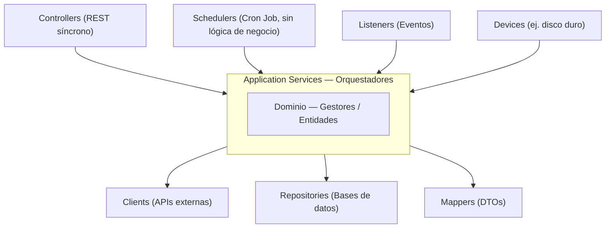
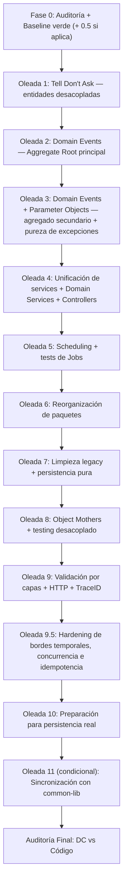

# Plan Genérico de Refactor por Oleadas — v2

> **Fuentes de esta versión:**
> 1. `plan-generico-refactor-servicios.md` (v1) — extraído de las Oleadas 0–10 de `donaciones-service`.
> 2. `oleadas-refactor.md` — bitácora completa de `incentivos-service` (Oleadas 0–15 + Post-Auditoría), el refactor más largo y mejor documentado hasta ahora.
> 3. `docs/refactor/donaciones/fase-0-auditoria.md` — plantilla real de auditoría Fase 0, mucho más rica que la v1.
> 4. `postdebate20260821.pdf` — notas manuscritas de la sesión de debate arquitectónico del equipo (proceso de refactor y arquitectura objetivo por capas).
>
> **Objetivo:** que este sea el único documento que se abre al empezar el refactor de cualquier servicio nuevo (logística, notificaciones, el que siga), adaptando nombres de entidades al DC de cada uno, sin tener que redescubrir a los golpes los errores que ya cometimos en donaciones e incentivos.

---

## 0. Qué cambia respecto a la v1

La v1 estaba bien como esqueleto de oleadas, pero se quedó corta en tres lugares donde `incentivos-service` sí maduró:

| Gap en v1 | Qué se agrega en v2 |
|---|---|
| Fase 0 muy delgada ("comparar DC vs código, dejar todo verde") | Plantilla de auditoría completa con matrices DC↔código, taxonomía de clasificación por paso de Service, inventario priorizado de lógica fuera del dominio, grafo de dependencias y RFs numerados con riesgo/orden justificado (§4) |
| No había formato de documentación por oleada | Formato de bitácora obligatorio (Problema/Evidencia/Objetivo/Fuera de scope/Tests/Diseño/IA/Verificación humana), igual al que se usó en incentivos y que dio trazabilidad real (§3) |
| No existía una "arquitectura objetivo" explícita más allá de las capas típicas de Spring | Se incorpora el modelo de capas que el equipo consensuó en la sesión de debate (dominio → orquestadores → adaptadores), con reglas concretas de cuándo dividir/unificar Services y Controllers (§1) |
| No había una oleada dedicada a bugs de bordes (concurrencia, tiempo, idempotencia) | Nueva **Oleada 9.5 — Hardening de bordes**, que agrupa toda la clase de bugs reales que aparecieron recién en la auditoría post-cierre de incentivos (§5.10) |
| No contemplaba que el 2º/3º servicio en refactorizarse hereda infraestructura ya construida | Nueva **Fase 0.5** (inventario de `common-lib`) y **Oleada final condicional de sincronización** (§4.1, §5.13) |
| Las lecciones aprendidas quedaban enterradas dentro de cada oleada, difíciles de chequear rápido | **Catálogo de errores recurrentes** como checklist transversal, con la oleada donde conviene revisarlos (§6) |

---

## 1. Arquitectura objetivo (modelo de referencia del equipo)

Esto no salió de un solo refactor sino de una sesión de debate dedicada a "cómo debería ser un Service". Vale como referencia para la Oleada 4 (unificación) y la Oleada 6 (reorganización de paquetes) de cualquier servicio.



El dominio (Gestores/Entidades) es el núcleo. Los Application Services son la única capa que orquesta. Todo lo demás —Controllers, Schedulers, Listeners, Devices, Clients, Repositories, Mappers— son adaptadores de entrada o salida, intercambiables, sin lógica de negocio propia.

### Flujo estándar de un Application Service

1. Recibe DTOs + parámetros + ids (nunca entidades de dominio desde afuera).
2. Arma la consulta a la base de datos (datos + filtros) para localizar el/los registro(s) necesarios.
3. Trae la entidad de dominio correcta — nunca decide con datos crudos sin antes reconstituir la entidad.
4. Ejecuta **un único** método de dominio (directamente sobre la entidad o vía un Gestor/Domain Service).
5. Si hubo mutación → persiste (`save`) la(s) entidad(es).
6. Si el método de dominio generó eventos de dominio → los publica y limpia.
7. Mapea a DTO / produce la respuesta, o se comunica con otro sistema.

> **Regla de oro:** toda vez que se modifica una entidad hay que persistirla, y si esa modificación generó eventos de dominio, hay que publicarlos. Un Application Service que se salta el paso 5 o el 6 es un bug silencioso, no un detalle de estilo.

### Qué puede activar un Application Service (sin lógica de negocio propia)

| Activador | Capa conceptual | Regla |
|---|---|---|
| Controller | REST síncrono | Solo traduce HTTP ↔ llamada a Service |
| Scheduler | Temporizador (cron) | Solo dispara en el tiempo, cero lógica de negocio, cero decisiones |
| Listener | Evento (mensajería, `@EventListener`) | Solo traduce el evento ↔ llamada a Service |
| Otro componente | Su propio activador (ej. un Device) | Misma regla: solo traduce, no decide |

### Criterios para dividir o unificar Services y Controllers

- **1 Recurso REST ↔ 1 Gestor (Application Service)** por caso de uso principal — es el default razonable.
- Antes de crear un Service nuevo, escribir explícitamente los pasos concretos que va a seguir y a qué caso de uso responde. Programar "a ciegas" sin esa estructura escrita fue una causa concreta de servicios sobre-concentrados (`IncentivosService` con 5 responsabilidades antes de la Oleada 4 de incentivos).
- Cuando SRP por sí solo no alcanza para decidir dónde cortar un Service grande, un criterio adicional es separar responsabilidades de **solo lectura** vs **solo escritura** — protege la concurrencia y suele coincidir con un corte natural de dominio.
- Un Service puede tener asociado más de un repositorio/base de datos si el caso de uso lo requiere; eso no es motivo automático para dividirlo.

---

## 2. Principios Transversales (v2)

Aplican a **todas** las oleadas en **todos** los servicios. Los marcados 🆕 son incorporaciones respecto a la v1, basadas en bugs reales encontrados en incentivos-service.

| Principio | Descripción |
|---|---|
| **Tell, Don't Ask** | Las entidades deciden sobre su propio estado; los servicios informan, no interrogan. Incluye evitar `instanceof` + casteo dentro del propio agregado: si hay que despachar según subtipo, es polimorfismo, no un `if`/`switch` 🆕 |
| **Aggregate Root con Domain Events** | El agregado registra eventos internamente; el Application Service persiste → publica → limpia |
| **Snapshot inmutable de eventos** 🆕 | `getDomainEvents()` devuelve `List.copyOf(this.domainEvents)`, **nunca** `Collections.unmodifiableList(...)` sobre la lista mutable interna. La segunda forma es solo una vista de solo lectura sobre una lista que sigue siendo mutable por dentro: si algo la modifica mientras otro la está iterando, explota con `ConcurrentModificationException`. Todo agregado con eventos necesita un test canónico de reentrancia |
| **Application Service delgado** | Solo orquesta según el flujo estándar de la sección 1 |
| **Dominio puro (sin frameworks)** | Las entidades y Domain Services son POJOs sin `@Component`, `@Value`, `@Autowired` ni dependencias de Spring. Verificable con `grep -rnE "@(Component|Autowired|Qualifier|Value|Service|Repository)" models/` → 0 matches |
| **Cero excepciones crudas en dominio** 🆕 | Nunca `IllegalArgumentException`/`IllegalStateException` en el dominio. Siempre `ValidationException`/`BusinessStateException` contra un `ErrorCatalog` centralizado en `common-lib`, con código propio por regla (ej. `ERR-VAL-711`) |
| **Inmutabilidad por defecto** 🆕 | Sin `@Setter` públicos en clases de dominio; mutaciones solo vía métodos de comportamiento semánticos. Getters de colecciones devuelven copias defensivas (`List.copyOf`/`Set.copyOf`), nunca la referencia interna — esto aplica a *cualquier* colección expuesta por un getter, no solo a `domainEvents` |
| **Plantilla vs. instancia poseída** 🆕 | Cuando un mismo concepto sirve de plantilla inmutable (ej. una recompensa definida una sola vez) y también de instancia que un actor posee y puede mutar (ej. visibilidad), separarlos en dos clases desde el diseño. Usar la misma clase para ambos roles termina rompiendo invariantes de uno de los dos lados |
| **Reutilización de `common-lib`** 🆕 | Antes de construir una abstracción nueva (manejo de domain events, catálogo de errores, trazabilidad, executor acotado), verificar si ya existe en `common-lib` por haberse creado en el refactor de otro servicio. Si existe, extenderla; si no, construirla pensando en que el próximo servicio la va a heredar |
| **Determinismo** 🆕 | Cualquier ordenamiento o desempate (rankings, colas, resolución de duplicados) debe tener un criterio de desempate explícito y determinista — nunca depender del orden de iteración incidental de una colección |
| **Idempotencia en operaciones "otorgar/agregar"** 🆕 | Métodos como `otorgarX(...)` deben poder invocarse más de una vez sin duplicar el efecto (reprocesamiento de eventos, reintentos de red) |
| **Event time vs. processing time** 🆕 | Si una entidad registra un hecho de negocio con fecha, esa fecha debe propagarse desde el evento/dato de origen, no generarse con `LocalDate.now()`/`Instant.now()` en el momento del procesamiento — salvo fallback explícito y documentado para cuando no hay fecha de origen |
| **Canonicalización léxica** 🆕 | Claves de negocio basadas en texto (categorías, nombres, tags) se normalizan (`trim().toLowerCase(Locale.ROOT)`) antes de compararse o usarse como clave de `Set`/`Map` — si no, `"Alimentos"`, `"alimentos "` y `"ALIMENTOS"` cuentan como tres cosas distintas |
| **Tests primero, refactor después** | Characterization tests antes de mover código; suite verde obligatoria en cada paso |
| **Bitácora obligatoria** 🆕 | Todo RF/oleada se documenta con el formato de la sección 3 — es lo que permite auditar después qué se hizo y por qué |
| **PR pequeño y explicable** | Cada RF debe poder explicarse en ~10 minutos |

---

## 3. Formato de gobernanza y bitácora (obligatorio por oleada)

La v1 no definía esto y fue, en la práctica, lo que le dio trazabilidad real al refactor de incentivos. Cada oleada (y cada RF grande dentro de una oleada) se documenta así:

```markdown
## Oleada N: <título>

### Problema
Qué está mal hoy, en términos de principios violados (no solo "está feo").
Enumerar cada violación por separado si hay más de una.

### Evidencia
Archivo y línea concretos. Nunca "en varios lugares" sin nombrarlos.
Ejemplo: `DonanteIncentivos.java` L.113: `return Collections.unmodifiableList(this.domainEvents);`

### Objetivo
Qué se va a cambiar, en términos concretos y verificables.

### Fuera de scope
Qué se ve pero se pospone a otra oleada, y a cuál. Evita que un RF crezca sin límite.

### Qué se hizo (opcional; útil en oleadas grandes con varios sub-pasos)
Lista de cambios concretos aplicados, en el orden en que se aplicaron.

### Tests / Verificación
- Tests nuevos/actualizados (nombre + qué valida cada uno).
- Barridos mecánicos de verificación (grep) — ver catálogo en §6.
- Suite completa del módulo, y del reactor completo si es un monorepo multi-módulo.
- Formatter/linter (ej. `mvn spotless:check`) en 0 archivos desalineados.

### Diseño resultante
Cómo queda la arquitectura después del cambio, en 2-4 líneas.

### IA utilizada
Qué tareas se delegaron a IA (detección estática, generación de tests, refactors mecánicos)
y cuáles requirieron decisión humana.

### Verificación humana
- [ ] Punto verificado 1
- [ ] Punto verificado 2
- [ ] Suite completa en verde
- [ ] Formatter/linter en verde
```

**Convención de estado:**
- `✅` = hay diff de código y la suite pasa en verde.
- `📝` = decisión de diseño / análisis puramente conceptual, sin diff de código (ej. la preparación para persistencia real suele ser así hasta que se implementa físicamente).

**Reglas de proceso que se aplican junto con este formato:**
- Ningún RF empieza sobre una suite roja (así se distinguen bugs preexistentes de regresiones del refactor).
- Un PR = un RF explicable en ~10 minutos. Si no entra en esa explicación, es más de un RF.
- Toda oleada cierra con: suite del módulo en verde + reactor completo en verde (si aplica) + formatter en verde + barridos grep de la oleada en 0 matches.
- Branch de trabajo: `E4_refactor-<nombre-servicio>`.

---

## 4. Fase 0 — Auditoría y Baseline

### Rol del documento

Es un documento de **auditoría/reviewer**, no de refactor: no modifica código, no corrige nada. Todo lo que contiene es observación (con archivo/método citado), inferencia (marcada explícitamente como tal) o recomendación futura (marcada explícitamente, sin instrucciones de implementación). Cierra con una frase equivalente a *"Fin de la Fase 0. No se implementó ninguna de las recomendaciones listadas arriba."* — separar auditoría de ejecución evitó, en donaciones, que decisiones de diseño se colaran sin discutirse.

### Fuentes, en orden de prioridad

1. **Diagrama de Clases (DC) actualizado.** Si existe tanto una fuente de texto exacto (`.puml`, `.json`) como imágenes/capturas, prioriza el texto — una imagen de resolución limitada es una lectura, no un dato exacto. Si ambas fuentes existen y difieren, se documenta cada corrección explícitamente (no se pisa la versión anterior sin dejar rastro).
2. **Documentos de decisiones del equipo** (actas, debates, backlog). Si alguno no se puede leer (PDF corrupto, sin capa de texto, formato no soportado), se dejarlo como **limitación explícita** del documento — nunca se ignora en silencio. Se recomienda pedir que se re-adjunte en un formato legible.
3. **Reglas de negocio explícitas en el código** (validaciones, invariantes, catálogo de errores existente).
4. **Código actual**, tratado como evidencia de lo que hay, no como diseño objetivo.

### Estructura recomendada del documento de Fase 0

| § | Sección | Contenido |
|---|---|---|
| 1 | Resumen ejecutivo | 10-15 hallazgos priorizados, cada uno referenciando su sección de detalle |
| 2 | Modelo objetivo reconstruido del DC | Por bloque/paquete conceptual: clase, tipo, atributos, métodos, asociaciones, responsabilidad según el DC |
| 3 | Matriz DC → código | Para cada clase del DC: ¿existe en el código?, dónde, qué difiere |
| 4 | Matriz código → DC | Para cada clase relevante del código sin equivalente directo en el DC |
| 5 | Auditoría de Application Services | Para cada Service: métodos públicos relevantes, desglosados paso a paso y clasificados (ver taxonomía abajo) |
| 6 | Inventario de lógica de negocio fuera del dominio | Tabla priorizada: archivo, método, regla detectada, ubicación actual, posible dueño según el DC, evidencia |
| 7 | Estados y transiciones | ¿Quién valida la precondición? ¿Quién decide invocar la transición? (casi siempre el problema no es la entidad sino quién la llama) |
| 8 | Domain Events | Tabla: evento, quién lo crea hoy, quién lo publica hoy, cuándo, ¿coincide con el patrón objetivo? |
| 9 | Repositories, mappers, clients, listeners/schedulers | Inventario simple |
| 10 | Tests actuales | Cobertura por capa; tests rotos o desalineados con el código real (señal de alarma alta — ver RF-01 de donaciones como ejemplo real) |
| 11 | Deuda respecto del DC | Consolidado de §3-10 por categoría: falta implementación / responsabilidad mal ubicada / modelo divergente / naming / acoplamiento inverso |
| 12 | Grafo de dependencias | Fan-in/fan-out; identificar el nodo más frágil para el refactor incremental |
| 13 | Candidatos de slices futuros (RFs) | Ver formato abajo |
| 14 | (si aplica) Verificación cruzada contra una segunda fuente del DC | Qué corrigió y por qué se prioriza una fuente sobre otra |

### Taxonomía para clasificar cada paso de un Application Service (§5)

```
ORQUESTACION            → delega a dominio/infraestructura sin decidir nada
DOMINIO                 → la entidad ejecuta su propio comportamiento
PERSISTENCIA            → lectura/escritura de repositorio
COMUNICACION            → llamada saliente (Feign, mensajería, notificación)
MAPEO                   → DTO ↔ entidad
VALIDACION_TECNICA      → guardas de forma (404, tipos, nulls técnicos)
POSIBLE_LOGICA_DE_NEGOCIO → una decisión de negocio ubicada fuera del dominio (candidata a mover)
DUDOSO                  → no encaja claramente en ninguna anterior; se marca para discutir, no se asume
```

Al desglosar cada método, prestar atención especial a si el código en verdad compila contra las firmas actuales de sus dependencias (un rename a medio terminar entre una entidad y su Service, o entre un test y el código de producción, es evidencia real que ya apareció y que si no se detecta en Fase 0 bloquea la Oleada 1).

### Formato de los RFs candidatos (§13)

```text
RF-0N — <título>
Objetivo: qué se resuelve, en 1-3 líneas.
Clases afectadas: lista concreta.
Dependencias: qué otro RF debe resolverse antes (o "ninguna").
Riesgo: bajo/medio/alto, con la razón concreta (ej. "nodo de mayor fan-in del grafo").
Motivo del orden: por qué va en esta posición de la secuencia propuesta.
```

Numerados en el orden propuesto (menor riesgo/acoplamiento primero), dejando explícito que ese orden es una propuesta, no necesariamente el orden final de ejecución (esa decisión puede quedar fuera de la Fase 0).

### Checklist de criterios de finalización de Fase 0

El documento debe poder responder, con referencia a su propia sección de detalle, cada una de estas preguntas:

- ¿Qué partes del DC ya existen?
- ¿Qué partes faltan?
- ¿Qué conceptos existen con otro diseño?
- ¿Dónde está hoy la lógica de negocio?
- ¿Qué Services están haciendo demasiado?
- ¿Qué reglas deberían revisarse para mover al dominio?
- ¿Cómo están modelados los estados?
- ¿Quién genera y publica Domain Events?
- ¿Qué dependencias de infraestructura tiene hoy el dominio?
- ¿Qué comportamiento está protegido por tests?
- ¿Qué partes pueden refactorizarse independientemente?
- ¿Cuál sería un orden seguro para comenzar?

### FIX-00 — Baseline compilable

Resolver **solo** lo estrictamente necesario para que el módulo compile y la suite existente pase en verde (ej. una firma de método inconsistente entre un test y la clase real). No es un refactor de diseño, es higiene de punto de partida.

> **Regla:** ningún RF debe comenzar sobre una suite roja.

### 4.1 Fase 0.5 — Inventario de `common-lib` (solo si este no es el primer servicio refactorizado)

Antes de diseñar Domain Events, catálogo de errores o trazabilidad para el nuevo servicio, relevar qué ya existe en `common-lib` por haberse construido en el refactor de un servicio anterior — por ejemplo `AgregadoConEventos<T>` (base para agregados con eventos), `ErrorCatalog`, `ValidationException`, `BusinessStateException`, `GlobalExceptionHandler`, `TraceResponseHeaderFilter`, `FeignTraceRequestInterceptor`. Documentar qué se va a **reutilizar tal cual**, qué se va a **extender**, y qué es **genuinamente específico** de este servicio. Construir de nuevo algo que ya existe en `common-lib` genera exactamente el tipo de deuda que la Oleada 14 de incentivos tuvo que salir a corregir después de un merge.

### Branch
```
E4_refactor-<nombre-servicio>
```

---

## 5. Roadmap de Oleadas



### Oleada 1 — Tell, Don't Ask en entidades desacopladas (paralelo seguro)

**Idea principal:** identificar 2-3 entidades desacopladas entre sí donde la lógica de negocio vive fuera de la entidad (en un Service o en infraestructura) y moverla al lugar correcto según el DC.

```
ANTES:  Service pregunta atributos de Entidad → Service decide → Service muta estado
DESPUÉS: Service informa resultado → Entidad decide su propio estado
```

**Acciones:**
- Identificar entidades con decisiones de estado dispersas en services.
- Mover la lógica a métodos de comportamiento en la entidad (`entidad.accion(params)`).
- Eliminar strategies o validadores anémicos si el DC no los contempla (evaluar caso a caso).
- Escribir characterization tests primero, luego portar a tests unitarios de la entidad.

Ideal para trabajo en paralelo: cada persona toma un RF distinto sobre una entidad distinta, y explica ANTES → PROBLEMA → DESPUÉS → TESTS al equipo al cerrar.

---

### Oleada 2 — Domain Events en el Aggregate Root principal

**Idea principal:** el agregado raíz principal del servicio gestiona sus propios eventos de dominio internamente, reemplazando la publicación ad-hoc desde services e infraestructura.

```
ANTES:  Service crea evento manualmente → Service publica
DESPUÉS: Entidad registra evento internamente → Service persiste → obtiene eventos → publica → limpia
```

**Acciones:**
1. Si `common-lib` ya tiene una abstracción de agregado con eventos (`AgregadoConEventos<T>` o equivalente relevado en la Fase 0.5), heredar de ella en lugar de reimplementar `domainEvents`/`getDomainEvents`/`clearDomainEvents` a mano. Si no existe todavía, construirla pensando en que el próximo servicio la va a heredar.
2. `getDomainEvents()` debe devolver `List.copyOf(this.domainEvents)` — nunca `Collections.unmodifiableList(...)`. Agregar el test canónico de reentrancia: el snapshot debe quedar intacto después de `clearDomainEvents()`, y debe rechazar mutaciones (`UnsupportedOperationException`).
3. En cada transición de estado del agregado, registrar el evento correspondiente.
4. Desduplicar reglas de negocio repetidas en múltiples servicios (extraer a política de dominio pura).
5. Aplicar Tell, Don't Ask en entidades hijas: reemplazar `entity.getX().getY() == Z` por `entity.preguntaSemántica()`.
6. Documentar explícitamente (📝) si algún agregado secundario **no** necesita Domain Events por ser puramente de cálculo/proyección batch — no todos los agregados los necesitan, y vale la pena dejarlo escrito para no reabrir la discusión después.

---

### Oleada 3 — Domain Events y Parameter Objects en agregados secundarios + pureza del dominio

**Idea principal:** extender el patrón de Domain Events al segundo agregado relevante, introducir parameter objects de dominio para reemplazar switches anémicos, y — nuevo en v2 — purgar excepciones crudas e inconsistencias de mutabilidad del dominio completo, no solo del agregado principal.

```
ANTES:  Service recibe DTO → switch para elegir transición → Service llama métodos de entidad individualmente
DESPUÉS: Controller → DTO → Mapper → ParameterObject de dominio → Aggregate.cambiarEstado(solicitud)
```

**Acciones:**
1. Crear eventos de dominio del agregado secundario (misma base de `common-lib` que en Oleada 2).
2. Crear parameter object de dominio que encapsule la solicitud de cambio de estado.
3. Delegar la decisión de transición a los estados concretos del State Pattern (si aplica).
4. Extraer llamadas remotas (Feign, mensajería) a EventListeners dedicados.
5. **Purga de excepciones crudas 🆕**: reemplazar todo `IllegalArgumentException`/`IllegalStateException` del dominio por `ValidationException`/`BusinessStateException` con código propio en `ErrorCatalog`. Barrido de verificación: `grep -rnE "throw new Illegal(Argument|State)Exception" models/` → 0 matches.
6. **Eliminación de `@Setter` en dominio 🆕**: encapsular mutaciones en métodos protegidos/semánticos. Barrido: `grep -rn "@Setter" models/` → 0 matches.
7. **Resolver ambigüedad plantilla/instancia poseída 🆕**: si alguna clase del dominio juega doble rol (plantilla inmutable + instancia mutable por un actor externo — ej. una recompensa vs. la recompensa que alguien ganó y puede ocultar/mostrar), separarla en dos clases antes de seguir. Es una fuente real de bugs de visibilidad/estado cruzado.
8. Guardas estrictas en Value Objects de entrada (obligatoriedad de campos, positividad de cantidades, copias defensivas de colecciones).

**Separación clave:**
```
Domain Event     = hecho del dominio (interno)
Integration DTO  = payload enviado a otro microservicio (externo)
```

---

### Oleada 4 — Unificación de servicios, Domain Services y controllers

**Idea principal:** atacar las zonas de mayor riesgo: servicios con mucho fan-in, duplicación entre services, y lógica de negocio pura atrapada en Application Services. Usar los criterios de la sección 1 para decidir el corte.

```
ANTES:  ServiceA y ServiceB duplican orquestación → lógica pura en métodos estáticos privados
DESPUÉS: DomainService puro encapsula reglas → Application Service único orquesta
```

**Acciones:**
1. Identificar entidades anémicas cuya lógica decisoria vive en services.
2. Crear Domain Services puros (POJOs sin Spring) para reglas de matching, consolidación o algoritmos. Si hoy son clases con métodos `static`, convertirlas en instanciables y registrarlas explícitamente (ej. un `DomainServicesConfig` con `@Bean`), para poder inyectarlas y testearlas con mocks.
3. Unificar Application Services duplicados en uno solo, **o** — si un único Service concentra responsabilidades divergentes (ej. perfil + transacciones + analítica + notificaciones) — descomponerlo en varios Services delgados, uno por responsabilidad, con su interfaz propia.
4. Unificar/segregar Controllers bajo la misma raíz REST, preservando el 100% de las rutas y contratos HTTP existentes.
5. Poner interfaces explícitas a los clientes de infraestructura (`INotificacionesClient`, etc.) para poder mockearlos limpio en tests.
6. Dividir en RFs pequeños (un RF por entidad enriquecida + un RF por unificación/segregación).

> **Advertencia:** no modificar en paralelo servicios con mucho fan-in. Trabajar secuencialmente con RFs pequeños.

---

### Oleada 5 — Lógica de scheduling y procesos periódicos

**Idea principal:** separar el mecanismo de activación (scheduler/cron) de la lógica de negocio que ejecuta, y dejar esa separación cubierta por tests dedicados.

```
ANTES:  Scheduler → Service intermedio anémico → lógica dispersa
DESPUÉS: Scheduler (solo dispara) → Application Service (orquesta) → Entidad.accion() (decide)
```

**Acciones:**
1. Identificar clases intermediarias entre el scheduler y el dominio.
2. Mover la lógica de decisión al Aggregate Root (ej. `entidad.renovarSiCorresponde(fecha)`).
3. Eliminar clases utilitarias anémicas con `@Component` que actúan como mediadores innecesarios.
4. El Application Service solo: recupera entidades → filtra las que mutaron → persiste.
5. **Tests de Jobs dedicados 🆕** (si no existían): un test por scheduler, verificando (a) que delega exactamente una vez al Application Service correspondiente, con los parámetros correctos (usar `ArgumentCaptor` cuando el parámetro depende del reloj, ej. el mes/período actual), y (b) que cualquier `RuntimeException` lanzada por el service es atrapada dentro del job y no se propaga (`assertDoesNotThrow`) — un scheduler que revienta puede comprometer el thread pool de tareas programadas del framework.

---

### Oleada 6 — Reorganización de paquetes

**Idea principal:** primero corregir responsabilidades, después mover paquetes. Los movimientos de paquetes producen diffs grandes y ruido sin valor funcional inmediato. Usar la arquitectura objetivo de la sección 1 como mapa de destino.

**Acciones:**
1. Identificar clases de dominio puras (POJOs sin dependencias de infraestructura) que estén en `infrastructure/` — algoritmos de negocio, normalizadores/comparadores puros, estrategias de dominio.
2. Moverlas a `models/` (o el paquete de dominio equivalente).
3. Mantener en `infrastructure/` solo: clientes Feign, listeners de eventos, seeders, readers de archivos, beans técnicos con Spring — y sub-empaquetar semánticamente (`infrastructure/adapters/`, `infrastructure/clients/`, `infrastructure/schedulers/`) en vez de dejar todo en la raíz.
4. Actualizar imports en producción y tests.
5. Cero cambios funcionales — solo reorganización.

> **Nota:** si una clase tiene `@Component`, `@Value`, o inyecta repositorios, probablemente es un adapter de infraestructura legítimo. Solo mover lo que sea POJO puro.

---

### Oleada 7 — Limpieza legacy y pureza de persistencia

**Idea principal:** resolver deuda técnica acumulada: interfaces huérfanas, naming ambiguo, repositorios que persisten DTOs, domain services atrapados en infraestructura, y residuos de refactors anteriores.

| Componente | Foco |
|---|---|
| **A — Persistencia pura** | Repositorios operan sobre entidades de dominio, no DTOs. Crear entidad + mapper si falta |
| **B — Domain services puros** | Migrar servicios de dominio que estén en infra como `@Component` a POJOs puros en `models/` |
| **C — Declaratividad y naming** | Renombrar clases con versionado informal (ej. `XMejorado`), resolver colisiones de nombres, completar interfaces faltantes. Ojo especial con clases de test que jueguen doble rol: fixtures/Object Mothers **no deben** llevar sufijo `*Test` — si lo llevan, herramientas como Surefire/SonarCloud las ejecutan (o cuentan) como suites de test vacías 🆕 |
| **D — Limpieza de código** | Eliminar `.gitkeep` innecesarios, comentarios residuales, imports wildcard, FQCNs, métodos muertos; estandarizar nombres de test a singular (`*Test.java`, no `*Tests.java`) |

**Barridos mecánicos de cierre:**
```
grep -rn "import .*\.\*" src/main/java/         → 0 matches
find src/test -name "*Tests.java"               → 0 matches
grep -rnE "@(Component|Autowired|Qualifier|Value)" models/entities/  → 0 matches
```

> **Precaución:** no eliminar automáticamente algo solo porque no aparezca en el DC. Primero verificar si corresponde a un requisito válido que el diagrama no representa.

---

### Oleada 8 — Refactor profundo de testing

**Idea principal:** desacoplar los tests de la implementación interna de las entidades mediante Object Mothers / Test Data Builders y aserciones semánticas — y, nuevo en v2, cerrar los huecos de cobertura por capa y los casos borde que la Fase 0 haya señalado.

**Acciones:**
1. Crear **Object Mothers** por cada entidad principal (instancias válidas en distintos estados del ciclo de vida) y **DTOFixtures** centralizados. Nombrarlos `*Mother`/`*Fixtures`, nunca `*Test`.
2. Aplicar Tell, Don't Ask también dentro de los tests: nada de `entidad.getLista().add(...)` desde afuera; el test le pide a la entidad que ejecute su comportamiento y verifica el resultado con métodos semánticos.
3. **Sin magic strings en aserciones 🆕**: comparar dinámicamente contra las propiedades del objeto de entrada/entidad (`assertEquals(request.nombre(), guardado.getNombre())`), no contra literales duplicados (`assertEquals("Modificado", ...)`) — los literales duplicados rompen en silencio cuando cambia el fixture.
4. **Tests defensivos de null-safety en Domain Services puros 🆕**: verificar que devuelven colecciones/proyecciones vacías seguras ante inputs nulos o listas vacías, no solo el camino feliz.
5. **Catálogo de casos borde a cubrir explícitamente** (adaptar según el dominio del servicio):
   - Umbrales exactos (`N-1` vs `N`) en cualquier condición de "al menos X".
   - Entidad recién creada / sin actividad todavía (no confundir "sin dato" con "estado negativo por defecto").
   - Entidad en su estado terminal/máximo, que sigue recibiendo eventos sin romperse.
   - Colecciones con 0, 1, 2 y N elementos (especialmente en rankings/podios).
   - Categorías/keys de texto duplicadas por mayúsculas o espacios.
   - Eventos que llegan fuera de orden o con fecha retroactiva.
6. Estandarizar nombres de tests a singular; DAMP en escenarios (que se lean como especificación de negocio), DRY en la construcción de fixtures.
7. Cerrar gaps de cobertura por capa completa: controllers, listeners, adaptadores de infraestructura, configuraciones `@Bean`, mappers de DTOs — no solo el dominio.

---

### Oleada 9 — Validación por capas, HTTP clásico y trazabilidad

**Idea principal:** esquema de validación claro por capa y respuestas HTTP estandarizadas con trazabilidad distribuida.

| Capa | Responsabilidad |
|---|---|
| **Web (DTOs/Controllers)** | Validación sintáctica con Jakarta Bean Validation (`@NotNull`, `@NotBlank`, `@Positive`, `@PastOrPresent`, `@Valid`, `@Validated`) |
| **Aplicación (Services)** | Validación de existencia (404), duplicados, orquestación |
| **Dominio (Entities)** | Guardas de invariantes de estado (400 `ValidationException`, 409 `BusinessStateException`) |

**Artefactos transversales en `common-lib`** (una sola vez, reutilizados en todos los servicios): `ErrorResponse` con `traceId` + `FieldErrorDTO`, `GlobalExceptionHandler` (incluyendo handlers para `MethodArgumentTypeMismatchException` y `DateTimeParseException`, que si faltan devuelven 500 en vez de 400 ante un UUID o fecha malformada en la URL), `TraceResponseHeaderFilter` (header `X-Trace-Id`), `FeignTraceRequestInterceptor`.

**Códigos HTTP estandarizados:**
```
201 Created     → POST de creación
202 Accepted    → procesos asincrónicos
200 OK          → consultas y actualizaciones
204 No Content  → eliminaciones
400 Bad Request → validación fallida
404 Not Found   → recurso inexistente
409 Conflict    → transición de estado inválida
```

**Puntos de atención específicos en monorepos multi-módulo 🆕:**
- Verificar que la aplicación escanea el paquete compartido (`scanBasePackages`) donde vive `common-lib`; si no, el filtro de trazabilidad, el interceptor Feign y el manejador global de excepciones no se auto-configuran, y falla en silencio.
- Inicializar el `traceId` en el MDC también dentro de los jobs/schedulers en background (no solo en el hilo de request HTTP), con limpieza en `finally`.

---

### Oleada 9.5 — Hardening de bordes temporales, concurrencia e idempotencia 🆕

**Idea principal:** esta oleada no estaba en la v1. Se agrega porque, en incentivos, la auditoría posterior al cierre formal de las 13 oleadas encontró bugs reales de esta clase — vale la pena buscarlos a propósito en vez de esperar a que aparezcan solos. No todos van a aplicar a todo servicio: usar como checklist, no como lista obligatoria completa.

**Chequeos a correr sobre el servicio ya refactorizado hasta la Oleada 9:**

1. **Falsos positivos por ausencia de dato ≠ estado negativo.** Revisar predicados que evalúan "¿pasó X?" comparando contra `null`: una entidad recién creada sin actividad todavía no debería caer automáticamente en la rama negativa (ej. "inactivo") si en realidad nunca tuvo la oportunidad de tener actividad. Comparar siempre contra la fecha de alta/registro cuando no hay dato de actividad.
2. **Degradación destructiva ante eventos fuera de orden.** Si un evento llega con fecha anterior a la última procesada, verificar que el agregado **no** resetea progreso/estado ya avanzado por error — debe preservar el estado más avanzado, no sobreescribirlo con el evento tardío.
3. **Propagación de trazabilidad en hilos asíncronos.** Si hay `@Async`, configurar un `TaskDecorator` que copie el contexto (`MDC`/`X-Trace-Id`) al hilo del pool y lo limpie al terminar — sin esto, los logs de tareas asíncronas pierden el trace id del request que las originó.
4. **Executor acotado con backpressure.** `@EnableAsync` sin un `TaskExecutor` explícito crea hilos de sistema operativo no acotados ante ráfagas de eventos — riesgo real de agotamiento de recursos. Declarar un `ThreadPoolTaskExecutor` con `corePoolSize`/`maxPoolSize`/`queueCapacity` explícitos y una política de rechazo (ej. `CallerRunsPolicy`).
5. **Desempate determinista.** Si hay ordenamiento con posibilidad de empate (rankings, colas de asignación), verificar que el desempate no cae solo en un id arbitrario cuando hay un criterio de negocio más relevante disponible (ej. volumen total en el período).
6. **Idempotencia en reprocesamiento.** Métodos de "otorgar/agregar" deben soportar ser llamados dos veces con el mismo input sin duplicar el efecto (reintentos de red, replay de eventos).
7. **Residuos de introspección post-refactor.** Después de varias oleadas, es común que quede algún acceso directo a una colección/VO embebido en vez de delegar en el método semántico del agregado — repasar los Application Services una vez más con la lupa de Tell, Don't Ask.
8. **Consistencia semántica texto↔código.** Si la descripción de una regla de negocio dice "más de X" pero el código evalúa `>= X` (o viceversa), corregir uno de los dos y dejarlo documentado — es una fuente de confusión para el próximo que lea el código.

---

### Oleada 10 — Preparación para persistencia real y decisiones arquitectónicas avanzadas

**Idea principal:** auditoría integral para preparar el dominio para persistencia real (JPA/PostgreSQL) y almacenamiento externo, sin introducir aún dependencias de base de datos. Suele ser una oleada mayormente `📝` (analítica) hasta que se ejecuta la fase física.

| Eje | Acciones |
|---|---|
| **Límites de Agregados** | Eliminar interfaces artificiales de acoplamiento en memoria. Reemplazar referencias directas entre agregados por `UUID` explícitos |
| **Estrategia ORM** | Mapeo JPA/Hibernate por agregado; estrategia de herencia (ej. `SINGLE_TABLE` con discriminador) para jerarquías polimórficas; aplanamiento escalar de Value Objects embebidos de alta frecuencia de lectura |
| **Strategy de Almacenamiento** | Diseñar puertos/adapters para almacenamiento dual (FileSystem local vs S3/MinIO) si aplica |
| **Constructores limpios** | Separar creación de negocio (emite eventos) de reconstitución técnica (hidratación sin eventos). Eliminar ghost objects |
| **Privacidad** | Reemplazar interfaces destructivas (`Anonimizable`) por estados de ciclo de vida y Crypto-Shredding como puerto |
| **Concurrencia** | Preparar campos `version: Long` para Optimistic Locking. Diseñar Transactional Outbox para dual-write (eventos de dominio hacia mensajería/notificaciones sin acoplar la transacción de negocio a la publicación externa) |
| **Idempotencia de ingesta** | Especificar cómo se deduplican eventos/comandos entrantes (ej. por id de negocio) antes de aplicar efectos |
| **Coordinación distribuida** | Si el servicio corre en múltiples instancias, especificar coordinación de schedulers (ej. ShedLock) para evitar ejecución duplicada |
| **Esquema relacional** | DDL completo con índices, claves foráneas con cascada apropiada, restricciones de unicidad/integridad |
| **No-regresión** | Verificar que todo lo construido en las Oleadas 8 y 9 (mothers, fixtures, validación, traceId) sigue funcionando |

> **Nota:** cero anotaciones JPA prematuras. Cero dependencias de base de datos física. Solo preparación del dominio y documentación de decisiones futuras.

---

### Oleada 11 — Sincronización con `common-lib` (condicional) 🆕

**Cuándo aplica:** solo si este servicio **no** es el primero en refactorizarse, y mientras estaba en curso otro servicio consolidó una abstracción compartida nueva en `common-lib` (por ejemplo, un `AgregadoConEventos<T>` centralizado que reemplaza el manejo manual de `domainEvents` que este servicio construyó por su cuenta antes de que existiera).

**Acciones:**
1. Migrar el agregado principal (y secundarios) para heredar de la abstracción centralizada, eliminando la implementación manual duplicada.
2. Revisar si algún patrón usado aquí (ej. despacho por `instanceof` que ya se había tolerado) fue resuelto polimórficamente en el servicio hermano, y aplicar el mismo criterio acá.
3. Normalizar nombres de fixtures/Object Mothers si el estándar cambió entretanto.
4. Barrido de no-regresión sobre todas las oleadas anteriores de este servicio.

Esta oleada existe porque, en la práctica, el orden en que se refactorizan los servicios de un mismo sistema importa: el primero paga el costo de diseño, los siguientes heredan (o deberían heredar) ese diseño en vez de reinventarlo — y a veces hay que volver atrás a alinear al que ya estaba, como pasó entre donaciones e incentivos.

---

## Auditoría Final

Al completar todas las oleadas que apliquen, repetir la Fase 0:

```
DC actualizado  VS  Código final
```

### Checklist genérico de validación

```
Domain Events en agregados principales           ✅
Domain Events en agregados secundarios            ✅
Snapshot inmutable de eventos (List.copyOf)       ✅
Tell, Don't Ask en todas las entidades            ✅
Cero instanceof/casteo en dominio                 ✅
Application Services delgados                     ✅
Domain Services puros (sin Spring)                ✅
Cero excepciones crudas en dominio                ✅
Cero @Setter públicos en dominio                  ✅
Copias defensivas en todos los getters de colección ✅
Listeners/Schedulers delgados + tests de Jobs     ✅
Paquetes organizados por capa                     ✅
Persistencia pura (entidades, no DTOs)            ✅
Object Mothers / Fixtures (sin sufijo *Test)      ✅
Sin magic strings en aserciones de tests          ✅
Validación por capas (Bean Val + guardas)         ✅
HTTP clásico + TraceID (incluye hilos async)      ✅
Determinismo en ordenamientos/desempates          ✅
Idempotencia en operaciones de otorgar/agregar    ✅
Event time propagado correctamente                ✅
Preparación para JPA/PostgreSQL                   ✅
Reuso de common-lib documentado (si aplica)        ✅
Tests verdes en todo el reactor                   ✅
```

---

## 6. Catálogo de errores recurrentes (checklist transversal)

Lista de bugs reales ya encontrados, para revisar a propósito en la oleada indicada en vez de descubrirlos por accidente.

| Error | Dónde suele aparecer | Oleada donde revisarlo | Cómo prevenirlo/testear |
|---|---|---|---|
| `getDomainEvents()` con `Collections.unmodifiableList` sobre lista mutable | Aggregate Root | 2 | `List.copyOf(...)` + test canónico de reentrancia |
| `IllegalArgumentException`/`IllegalStateException` crudas en dominio | Constructores/guardas de entidades | 3 | `grep` de excepciones crudas → 0; catálogo de errores centralizado |
| `@Setter` público en clases de dominio | Entidades y Value Objects | 3 | `grep "@Setter" models/` → 0; métodos semánticos |
| Un mismo concepto usado como plantilla y como instancia poseída/mutable | Value Objects de "recompensa"/"configuración" | 3 | Separar en dos clases si un lado necesita mutabilidad que el otro no debe tener |
| `instanceof` + casteo dentro del propio agregado | Métodos de verificación/actualización periódica | 1, 9.5 | Despacho polimórfico en la jerarquía |
| Getter que devuelve la referencia interna de una colección | Cualquier entidad con `List`/`Set` | 3, 9.5 | `List.copyOf`/`Set.copyOf` en el getter |
| Magic strings duplicados en aserciones de test | Suites de Application Services y mappers | 8 | Comparar contra la propiedad del objeto de entrada, no contra literales |
| Fixtures/Object Mothers con sufijo `*Test` | `src/test/.../fixtures/` | 7, 8 | Nombrarlas `*Mother`/`*Fixtures` |
| Falso positivo de "inactivo"/"pendiente" por confundir "sin dato" con "estado negativo" | Reglas basadas en `ultimaFecha == null` | 9.5 | Comparar contra fecha de alta/registro cuando no hay dato de actividad |
| Evento fuera de orden que resetea progreso ya avanzado | Rachas, contadores acumulativos | 9.5 | Guardar contra fechas anteriores a la última procesada |
| Pérdida de `X-Trace-Id`/MDC en hilos `@Async` | Listeners/adaptadores asincrónicos | 9, 9.5 | `TaskDecorator` que copia y limpia el contexto |
| `@EnableAsync` sin `TaskExecutor` acotado | Configuración de async | 9.5 | `ThreadPoolTaskExecutor` con límites + política de rechazo explícita |
| Desempate no determinista en rankings/colas | Domain Services de cálculo | 9.5 | Criterio de desempate secundario explícito, nunca orden incidental |
| Operación "otorgar/agregar" no idempotente | Reprocesamiento de eventos | 9.5 | Test de doble invocación con mismo input |
| Fecha de un hecho de negocio generada con `now()` en vez de propagada | Registro de eventos históricos | 9.5 | Propagar fecha del evento de origen, `now()` solo como fallback documentado |
| Categorías/keys de texto no normalizadas (mayúsculas/espacios) | Sets/Maps con claves de texto | 9.5 | `trim().toLowerCase(Locale.ROOT)` antes de comparar/usar como clave |
| Rename a medio terminar (firma de método distinta entre entidad, service y test) | Cualquier método renombrado sin barrido completo | Fase 0 (FIX-00) | `grep` de todos los call-sites del método viejo y nuevo antes de dar por cerrado el rename |
| Wildcard imports / clases de test en plural | Todo el código | 7 | `grep "import .*\.\*"` → 0; `find -name "*Tests.java"` → 0 |
| Abstracción reinventada que ya existe en `common-lib` | Domain Events, catálogo de errores, trazabilidad | Fase 0.5, 2 | Inventario de `common-lib` antes de diseñar |

---

## 7. Cómo aplicar a un nuevo servicio

Para adaptar este plan a **logística**, **notificaciones** o el que siga:

1. Ejecutar **Fase 0** (y **0.5** si no es el primer servicio) con el DC específico del servicio.
2. Identificar los agregados principales del servicio (equivalentes a `Donacion`/`DonacionIndependiente` en donaciones, o `DonanteIncentivos`/`RankingMensual` en incentivos).
3. Mapear cada oleada reemplazando los nombres de entidad por los del servicio, usando estas preguntas clave:

| Oleada | Pregunta clave para el servicio |
|---|---|
| 1 | ¿Qué entidades tienen decisiones de estado viviendo en services? |
| 2 | ¿Cuál es el aggregate root principal? ¿Qué eventos genera? ¿`common-lib` ya tiene una base de agregado con eventos para heredar? |
| 3 | ¿Hay un segundo agregado con transiciones de estado? ¿Switches anémicos? ¿Excepciones crudas o `@Setter` en el dominio? ¿Algún concepto juega doble rol de plantilla/instancia poseída? |
| 4 | ¿Hay services duplicados o con mucho fan-in? ¿Lógica pura atrapada en application layer? |
| 5 | ¿Hay schedulers o procesos periódicos con lógica mezclada? ¿Tienen tests propios? |
| 6 | ¿Hay dominio en `infrastructure/`? |
| 7 | ¿Hay DTOs en repositorios, naming ambiguo, interfaces huérfanas, fixtures mal nombradas? |
| 8 | ¿Los tests están acoplados a constructores internos? ¿Hay magic strings en aserciones? ¿Qué casos borde del dominio de este servicio faltan cubrir? |
| 9 | ¿Los DTOs tienen validación? ¿Las respuestas HTTP son consistentes? ¿El monorepo escanea bien el paquete compartido? |
| 9.5 | ¿Hay reglas sensibles al tiempo, concurrencia asincrónica, desempates o idempotencia propias de este dominio? |
| 10 | ¿El dominio está listo para JPA? ¿Hay ghost objects o interfaces artificiales? ¿Corre en múltiples instancias (necesita ShedLock)? |
| 11 | ¿Otro servicio ya construyó una abstracción en `common-lib` que este debería adoptar? |

4. Omitir oleadas que no apliquen (ej. si el servicio no tiene schedulers, saltear la Oleada 5; si es el primer servicio en refactorizarse, saltear 0.5 y 11).
5. Reutilizar `common-lib` para `EventoDeDominio`/`AgregadoConEventos`, `ErrorCatalog`, `GlobalExceptionHandler`, `TraceFilter`, `TaskExecutor` acotado, etc.

---

## 8. Checklist de cierre por oleada

Antes de dar una oleada por cerrada:

- [ ] Documento de bitácora completo con el formato de la sección 3.
- [ ] Barridos mecánicos (grep) de la oleada en 0 matches (ver catálogo §6 para los que apliquen).
- [ ] Tests nuevos/actualizados en verde.
- [ ] Suite completa del módulo en verde.
- [ ] Reactor completo en verde (si es monorepo multi-módulo).
- [ ] Formatter/linter (ej. `spotless:check`) en verde.
- [ ] "Fuera de scope" de la oleada explícito y coherente con lo que quedó pendiente para la siguiente.
- [ ] Checklist de "Verificación humana" tildado, no solo generado.
