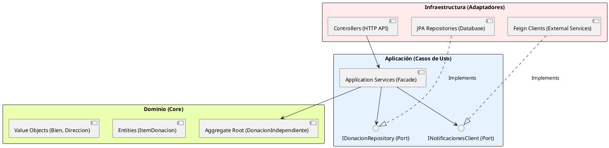
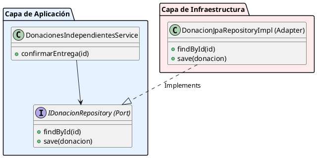
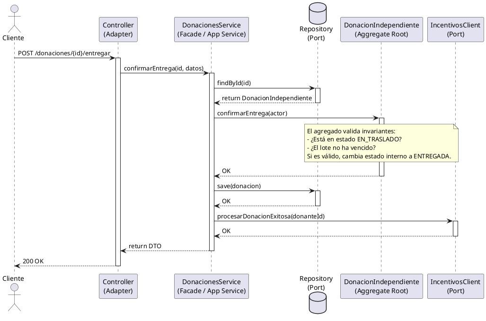
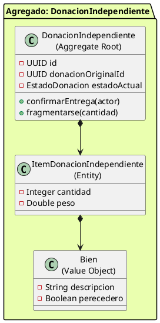

# Guía de Arquitectura de Software, Patrones de Diseño y Estructura en DonaTrack

Esta guía establece los fundamentos conceptuales y metodológicos de arquitectura y diseño para **DonaTrack**. Su propósito es unificar criterios entre los equipos de **Diseño y Abstracción**, **Ejecución Guiada** y **Soporte e Implementación**, brindando un marco de referencia de alto nivel para estructurar el software, delimitar responsabilidades en capas y modelar el dominio de forma limpia y extensible.

---

## 1. Delimitación de Responsabilidades: Dominio vs. Aplicación vs. Infraestructura

Uno de los problemas más comunes en arquitecturas empresariales es la concentración excesiva de responsabilidades en la capa `Service` (lo que da lugar a servicios inflados y acoplados). Para solucionarlo, DonaTrack adopta una mentalidad de **Arquitectura Hexagonal (Puertos y Adaptadores)** y **Clean Architecture**.

La estructura lógica del software se divide en tres zonas bien delimitadas, donde la dirección de las dependencias fluye siempre hacia el centro (el Dominio no depende de nada externo):



### El Dominio (Core)
*   **Qué es:** El corazón del negocio. Aquí residen los conceptos del mundo real (`DonacionIndependiente`, `Necesidad`, `Persona`), sus estados y sus reglas (invariantes).
*   **Regla de Oro:** **No debe tener dependencias de infraestructura.** No importa librerías de base de datos (como Spring Data, JPA, Hibernate), ni clientes HTTP, ni anotaciones de frameworks (a excepción de anotaciones de utilidad inofensivas como Lombok si el equipo lo acuerda).
*   **Responsabilidad:** Garantizar que las reglas del negocio de DonaTrack siempre se cumplan (ej: una donación no puede entregarse si está vencida).

### La Aplicación (Casos de Uso / Servicios de Aplicación)
*   **Qué es:** El director de orquesta. Esta capa representa las acciones que el usuario o el sistema pueden realizar (ej: "Confirmar Entrega de Donación", "Registrar Donante").
*   **Responsabilidad:** Coordina el flujo técnico:
    1.  Carga el agregado del Dominio usando un **Puerto (Interface)** del repositorio.
    2.  Invoca los métodos de negocio del agregado.
    3.  Persiste el nuevo estado a través del Puerto.
    4.  Despacha notificaciones o integra con sistemas externos a través de otros Puertos.
*   **Qué NO debe hacer:** No debe validar reglas de negocio internas ni modificar directamente los campos de las entidades del dominio de forma procedimental (evitar el modelo anémico).

### La Infraestructura (Adaptadores)
*   **Qué es:** Los detalles técnicos y de comunicación con el exterior.
*   **Responsabilidad:** Implementar los Puertos definidos por la capa de Aplicación. Ejemplos:
    *   **Adaptadores de Entrada:** Controladores REST (`@RestController`) que exponen endpoints HTTP, validan la entrada sintáctica (DTOs) y llaman a la capa de Aplicación.
    *   **Adaptadores de Salida:** Repositorios JPA reales (`@Repository`) que guardan datos en PostgreSQL, o clientes de red Feign (`@FeignClient`) que envían peticiones a otros microservicios.

---

## 2. Principios SOLID Aplicados a la Arquitectura de Capas

Es común comprender SOLID al diseñar clases individuales, pero estos mismos principios rigen las fronteras y las dependencias entre las capas del software:

### S - Single Responsibility Principle (Principio de Responsabilidad Única)
*   **A nivel de Capa:** Cada capa cambia por una única razón de negocio.
    *   Si cambia el formato JSON de respuesta de una API, solo debe modificarse la capa de **Presentación/Infraestructura** (`Controller` / `DTO`).
    *   Si cambia la secuencia de pasos de un caso de uso (ej. ahora después de confirmar la entrega también se debe registrar un log de auditoría local), solo debe modificarse la capa de **Aplicación** (`Service`).
    *   Si cambia una regla del negocio (ej. el peso máximo que soporta un envío logístico), solo debe modificarse la entidad en la capa de **Dominio**.

### O - Open/Closed Principle (Principio de Abierto/Cerrado)
*   **A nivel de Capa:** Debemos poder agregar nuevas funcionalidades de infraestructura o negocio sin modificar los casos de uso existentes.
*   **Ejemplo en DonaTrack:** En lugar de tener un bloque `switch` en el servicio para decidir cómo despachar una alerta según el tipo de comunicación (SMS, Correo, WhatsApp), se define una abstracción de salida (Puerto de Notificación). Si mañana se agrega "Telegram", se crea un nuevo adaptador que implemente la interfaz, dejando el caso de uso intacto.

### L - Liskov Substitution Principle (Principio de Sustitución de Liskov)
*   **A nivel de Capa:** Las jerarquías polimórficas del dominio deben ser consistentes para la capa de aplicación.
*   **Ejemplo en DonaTrack:** Si el agregador de asignación opera sobre la abstracción `Necesidad`, las subclases `NecesidadExtraordinaria` y `NecesidadRecurrente` deben respetar el contrato de comportamiento establecido por la clase base. La capa de aplicación no debe recurrir a comprobaciones de tipo (`instanceof`) para ejecutar lógica diferenciada que rompa el polimorfismo.

### I - Interface Segregation Principle (Principio de Segregación de Interfaces)
*   **A nivel de Capa:** Ninguna capa debe depender de interfaces que contengan métodos que no utiliza.
*   **Ejemplo en DonaTrack:** No se debe crear un `IGatewayComun` gigante que contenga métodos para enviar notificaciones, calcular rutas logísticas y procesar incentivos. En su lugar, se segregan en interfaces pequeñas y enfocadas: `INotificacionesClient`, `IRutaService` e `IIncentivosClient`. Esto previene que cambios en un servicio ajeno fuercen recompilaciones o re-despliegues de módulos no relacionados.

### D - Dependency Inversion Principle (Principio de Inversión de Dependencias)
*   **A nivel de Capa:** Los módulos de alto nivel (Dominio y Aplicación) no deben depender de los módulos de bajo nivel (Infraestructura). Ambos deben depender de abstracciones.
*   **Ejemplo en DonaTrack:** El `DonacionesIndependientesService` (Aplicación) no depende de `IDonacionesIndependientesRepository` de JPA (Infraestructura). En su lugar, el Servicio depende de la interfaz de puerto de repositorio declarada en su propia capa. La infraestructura es la que implementa esa interfaz.



---

## 3. Patrones de Interacción para la Orquestación de Casos de Uso

Para evitar la sobrecarga y el desorden en los flujos del sistema, se proponen los siguientes patrones de interacción:

### Facade Pattern (Fachada de Aplicación)
El controlador expone la API pública al exterior, pero no debe coordinar la lógica de base de datos, mapeos ni llamadas a redes. El `Service` de aplicación actúa como una **Fachada** (`Facade`). Oculta la complejidad del dominio y de los sistemas externos, entregando una interfaz de ejecución simple al controlador.

### Strategy Pattern (Patrón Estrategia)
Utilizado para desacoplar algoritmos variables del flujo central del caso de uso.
*   **Caso de Uso:** Matchmaking inteligente (emparejar inventario físico con necesidades de los centros).
*   **Diseño:** La capa de aplicación define una interfaz `IMatchmakingStrategy`. El caso de uso central simplemente invoca `strategy.match(donaciones, necesidades)`. Se pueden crear múltiples estrategias (ej. `PrioridadMenorAsistenciaStrategy`, `PrioridadAntiguedadStrategy`) que el sistema puede intercambiar dinámicamente según la parametrización de la organización sin tocar el flujo transaccional.

### Command/Query Separation (CQS)
Es una buena práctica diferenciar los métodos que alteran el estado del sistema de aquellos que solo leen datos:
*   **Commands (Escrituras):** Modifican el dominio, ejecutan reglas de negocio y cambian de estado. Retornan vacío o un identificador simple (ej. `confirmarEntrega`). Requieren consistencia transaccional estricta.
*   **Queries (Lecturas):** No alteran el sistema. Retornan DTOs optimizados para la visualización en la interfaz (ej. buscar inventario filtrado). Pueden saltearse el modelo de dominio rico e ir directo a la base de datos a través de proyecciones o consultas optimizadas para ganar rendimiento.

#### Flujo de Interacción Típico (PlantUML)


---

## 4. Diseño Táctico de DDD: El Patrón Agregado (Aggregates)

Para modelar la lógica de negocio correctamente y evitar que las entidades se conviertan en meros contenedores de datos (anémicas), se aplican los patrones tácticos de **Domain-Driven Design (DDD)**.

### Qué es un Agregado
Es un conjunto de entidades y objetos de valor asociados que se tratan como una **unidad de cambio de datos**. Define una frontera de consistencia e integridad transaccional estricta.



### Reglas Críticas de Diseño para Agregados

#### 1. Referencias Únicamente por ID
Los agregados nunca deben contener referencias a objetos directos de otros agregados. La comunicación se realiza únicamente guardando el `UUID` identificador del agregado externo.
*   **Incorrecto:** `DonacionIndependiente` tiene una referencia directa en memoria al objeto `Necesidad` asociada.
*   **Correcto:** `DonacionIndependiente` almacena un campo `UUID necesidadId`. Si el servicio necesita información de la necesidad, la consulta al repositorio correspondiente de forma independiente. Esto evita que Hibernate cargue en memoria grafos de datos gigantescos y previene dependencias cíclicas.

#### 2. Límite de Consistencia Transaccional
*   Una transacción de base de datos **solo debe modificar un único agregado**.
*   Si una acción requiere modificar dos agregados distintos (ej. marcar una donación como asignada y al mismo tiempo descontar la cantidad requerida en la necesidad), se debe optar por consistencia eventual o disparar eventos de dominio asíncronos que reaccionen y ejecuten la segunda transacción de forma desacoplada.

#### 3. Inmutabilidad de los Objetos de Valor (Value Objects)
Los objetos de valor (como `Bien` o `Direccion`) no tienen identidad propia y se definen exclusivamente por sus atributos. Deben ser estrictamente inmutables (en Java, preferentemente implementados con `record` o clases sin métodos mutadores). Si se requiere modificar un objeto de valor en una entidad, se reemplaza la instancia completa por una nueva en lugar de alterar sus campos internos.

---

## 5. Empaquetamiento Orientado al Negocio (Package by Feature)

Tradicionalmente, las aplicaciones se organizan por tipo de componente (capas técnicas):
```text
grupo5.donaciones/
├── controllers/
│   ├── DonacionController.java
│   └── NecesidadController.java
├── services/
│   ├── DonacionService.java
│   └── NecesidadService.java
└── repositories/
    ├── DonacionRepository.java
    └── NecesidadRepository.java
```
**El problema:** Para entender o modificar el caso de uso "Donaciones", el desarrollador debe saltar entre tres o cuatro paquetes distintos. Además, todas las clases deben declararse públicas (`public`), lo que destruye el encapsulamiento y permite que cualquier parte del código acceda a detalles internos (como el repositorio JPA o clases de mapeo).

### La Alternativa: Package by Feature / Component
Organizar los paquetes en torno a las capacidades de negocio o límites de los agregados:
```text
grupo5.donaciones/
├── donacionesIndependientes/          <-- Paquete encapsulado de la Feature
│   ├── DonacionIndependienteController.java (public)
│   ├── DonacionIndependienteResponseDTO.java (public)
│   ├── DonacionesIndependientesService.java (package-private/internal)
│   ├── DonacionIndependiente.java (public - Aggregate Root)
│   ├── ItemDonacionIndependiente.java (package-private - Internal Entity)
│   ├── IDonacionesIndependientesRepository.java (package-private - Port)
│   └── DonacionIndependienteMapper.java (package-private - Helper)
├── necesidades/
│   └── ...
```

### Ventajas de este Diseño
1.  **Encapsulamiento Nativo:** El repositorio (`IDonacionesIndependientesRepository`), las entidades internas (`ItemDonacionIndependiente`) y el mapeador pueden declararse con visibilidad de paquete por defecto (sin la palabra clave `public`). Solo las clases que representan la interfaz pública (el controlador, los DTOs y la raíz del agregado) son accesibles desde el exterior.
2.  **Alta Cohesión:** Todo el código relacionado con un concepto de negocio específico reside en el mismo directorio.
3.  **Facilidad de Mantenimiento:** Para los equipos de Ejecución y Soporte, es extremadamente sencillo localizar el alcance de sus cambios y validar que no estén introduciendo acoplamientos prohibidos.
