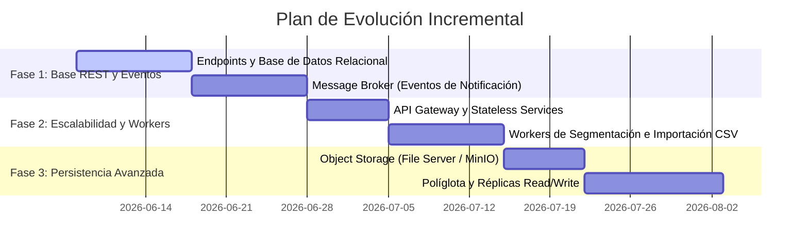

# Plan Arquitectónico — DonaTrack

Este documento define el diseño arquitectónico detallado y flexible para **DonaTrack**, estructurando la transición hacia una arquitectura orientada a eventos, el desacoplamiento total del frontend y la escalabilidad del almacenamiento y base de datos. Se concibe de manera incremental para que estos componentes se incorporen progresivamente en cada entrega.

---

## 1. Arquitectura Orientada a Eventos (EDA) y Event Sourcing

Para lograr un sistema altamente desacoplado, escalable y tolerante a fallos, DonaTrack adoptará una arquitectura dirigida por eventos para la comunicación y la persistencia de cambios de estado.

### 1.1. Flujo de Comandos y Eventos (Command/Event Flow)

El sistema separará las intenciones del usuario (comandos) de los hechos resultantes (eventos):
1. **Comandos (Commands)**: Representan una acción intencional (ej. `RegistrarDonante`, `CrearDonacion`). Son enviados por el cliente liviano al API Gateway, el cual los enruta al servicio correspondiente.
2. **Eventos (Events)**: Hechos inmutables del pasado (ej. `DonanteRegistrado`, `DonacionAsignada`). Una vez que un servicio valida y procesa un comando, publica el evento resultante en el Message Broker.

```
┌──────────────────┐           ┌──────────────┐           ┌───────────────────────┐
│ Cliente Liviano  │ ──cmd───> │ API Gateway  │ ──cmd───> │ Servicio Donaciones   │
│ (Frontend)       │           │              │           │ (Valida y Persiste)   │
└──────────────────┘           └──────────────┘           └───────────────────────┘
                                                                      │
                                                                 publica evento
                                                                      ▼
┌──────────────────┐           ┌──────────────┐           ┌───────────────────────┐
│ Servicio         │ <──sub─── │  Event Bus   │ <──────── │    Message Broker     │
│ Notificaciones   │           │ (Broker)     │           │ (RabbitMQ / Kafka)    │
└──────────────────┘           └──────────────┘           └───────────────────────┘
```

### 1.2. Ciclo de Registro de Donantes con UUID Unificado

Para garantizar la consistencia referencial entre microservicios sin acoplarlos mediante bases de datos compartidas, se utilizará un identificador único global (**UUID v4**):

1. **Generación del Identificador**: El cliente liviano (o el API Gateway en su defecto) genera un UUID v4 al enviar el comando `RegistrarDonante`.
2. **Propagación**: El **Servicio de Autenticación** procesa el comando, registra las credenciales y publica el evento `DonanteRegistrado` en el broker, incluyendo el UUID y los datos comunes.
3. **Consumo y Proyección**:
   * El **Servicio de Donaciones** recibe el evento y crea su propia proyección de `Donante` con sus atributos de perfil (dirección, género, etc.) utilizando el mismo UUID como clave primaria.
   * El **Servicio de Incentivos** recibe el evento y crea la entidad `DonanteStats` con saldo 0 de puntos y categoría "Colaborador", con el mismo UUID.
   * El **Servicio de Notificaciones** recibe el evento y asocia los medios de contacto preferidos del usuario a ese UUID.

### 1.3. Persistencia Basada en Eventos (Event-Driven Persistence)

Cualquier acción de persistencia transaccional en el núcleo del negocio debe gatillar eventos asincrónicos:
* **Donacion Asignada**: Cuando el Servicio de Donaciones cambia el estado de una donación a "Asignación realizada", publica el evento `DonacionAsignada`. El **Servicio de Notificaciones** consume este evento para notificar inmediatamente a la entidad beneficiaria y al donante.
* **Misión Cumplida**: Cuando el Servicio de Incentivos detecta que una donación impactó en el progreso de una misión y se completó, persiste la insignia y publica `MisionCumplida`. El **Servicio de Notificaciones** reacciona para enviar la felicitación e invocar el webhook de n8n para su difusión social.

### 1.4. Reconstrucción de Bases de Datos (Event Sourcing)

El sistema contempla la capacidad de reconstruir el estado actual de las bases de datos a partir del log histórico de eventos:
* **Event Store**: El broker de mensajería (o una base de datos específica como PostgreSQL con una tabla de eventos serializados en JSON) actuará como la fuente única de la verdad (*Source of Truth*).
* **Mecanismo de Replay**:
  * Para reconstruir la base de datos de lectura de un servicio (por ejemplo, si se corrompe o se migra a un nuevo motor de base de datos), se ejecuta un proceso de *Replay* secuencial de todos los eventos históricos almacenados.
  * El servicio procesará los eventos en orden cronológico, regenerando sus tablas y estados actuales paso a paso.
  * Se implementarán *Snapshots* periódicos (capturas de estado en el evento $N$) para acelerar la reconstrucción y evitar procesar millones de eventos desde cero.

---

## 2. Desacoplamiento del Frontend y Gateway

El frontend (Cliente Liviano) debe diseñarse de forma agnóstica a la topología física y lógica de los microservicios del backend.

```
                                      ┌──────────────┐
                                 ┌───>│ Auth Service │
┌──────────┐      ┌───────────┐  │    └──────────────┘
│ Cliente  │ ───> │    API    │──┼───>│ Donaciones   │ (Escalado Horizontal)
│ Liviano  │      │  Gateway  │  │    └──────────────┘
└──────────┘      └───────────┘  │    ┌──────────────┐
                                 └───>│ Incentivos   │
                                      └──────────────┘
```

### 2.1. API Gateway como Fachada Única

Se implementará un **API Gateway** (ej. *Spring Cloud Gateway* o *Kong*) que resolverá las peticiones de la siguiente manera:
* **Punto de Entrada Único**: El frontend solo conoce la URL pública del Gateway (ej. `api.donatrack.org`). No expone puertos ni direcciones IP internas de los microservicios individuales.
* **Enrutamiento Dinámico**: El Gateway redirige las peticiones según el path (ej. `/api/donaciones/**` se enruta al *Servicio de Donaciones*, y `/api/incentivos/**` al *Servicio de Incentivos*).
* **Autenticación Centralizada**: El Gateway valida los tokens JWT en la cabecera HTTP de las peticiones antes de derivarlas a los servicios, asegurando que las solicitudes que llegan a los backends ya estén pre-autenticadas y limpias.

### 2.2. Resolución de DNS y Escalabilidad Horizontal

*   **DNS (Domain Name System)**: En producción, se usará un servicio de DNS (ej. AWS Route53 o Cloudflare) apuntando al balanceador de carga del API Gateway.
*   **Balanceo de Carga e Instancias sin Estado**:
    *   Todos los microservicios backend deben ser **Stateless** (sin estado local en memoria del servidor). Cualquier estado de sesión se guarda en el token JWT o en una caché distribuida (Redis).
    *   Esto permite el **escalado horizontal**: agregar múltiples instancias clonadas de cualquier servicio (ej. levantar 3 instancias de `donaciones-service`) para procesar peticiones en paralelo. El Gateway o un balanceador (como Nginx) distribuirá la carga uniformemente utilizando algoritmos como Round Robin.

---

## 3. Almacenamiento de Archivos y Activos (File Server vs CDN)

DonaTrack maneja recursos multimedia (fotos de bienes donados, fotos de control de recepción de entidades) y archivos de datos masivos (CSVs de importación de donantes).

```
┌──────────────────┐     Upload     ┌─────────────────────┐
│ Cliente Liviano  │ ─────────────> │     API Gateway     │
└──────────────────┘                └─────────────────────┘
         ▲                                     │
      Descarga                                 ▼
      (Cached)                      ┌─────────────────────┐
┌──────────────────┐    Retrieve    │   Servicio Storage  │
│  Cloudflare CDN  │ <───────────── │   (MinIO / AWS S3)  │
└──────────────────┘                └─────────────────────┘
```

### 3.1. Arquitectura Híbrida de Almacenamiento de Objetos

Se evitará guardar archivos binarios directamente en los servidores de aplicación o en bases de datos relacionales (lo cual degradaría la performance de la base de datos).
*   **Componente de Almacenamiento (Object Storage)**:
    *   *Desarrollo*: Se utilizará **MinIO** (un servidor de almacenamiento compatible con la API de S3 que corre localmente en Docker).
    *   *Producción*: Se migrará de forma transparente a **AWS S3** o **Google Cloud Storage**.
*   **Servicio de Storage**: Un microservicio ligero del backend actuará como intermediario para autorizar las subidas generando *URLs firmadas* (Presigned URLs), permitiendo al cliente subir el archivo directamente al Object Storage de forma segura sin sobrecargar el ancho de banda del backend de DonaTrack.

### 3.2. CDN (Content Delivery Network)

Para optimizar el acceso y reducir la latencia de descarga:
*   Las imágenes públicas y recursos estáticos se servirán a través de un **CDN** (ej. *Cloudflare*).
*   El CDN cacheará las imágenes en servidores perimetrales cercanos a los usuarios.
*   Para la descarga de reportes CSV masivos, el CDN aliviará la carga del file server al servir versiones estáticas cacheadas temporalmente si el recurso no ha cambiado.

---

## 4. Estrategia de Persistencia Políglota y Workers

Para soportar las diferentes demandas de lectura y escritura del sistema sin comprometer el rendimiento general, se aplicarán estrategias de persistencia optimizadas.

### 4.1. Réplicas Master/Slave para Escalabilidad de Lectura

Para mitigar la saturación de lecturas (ej. cuando miles de donantes consultan sus estadísticas e insignias al mismo tiempo):
*   **BD Master**: Recibe todas las operaciones de escritura (INSERT, UPDATE, DELETE). Es el nodo de consistencia ACID estricta.
*   **BD Slaves (Read Replicas)**: Replican los datos del Master de forma asincrónica. Se configuran exclusivamente para operaciones de lectura (SELECT).
*   **Configuración en Spring Boot**: Se utilizará un enrutador de datos dinámico (`AbstractRoutingDataSource`) para dirigir las transacciones anotadas con `@Transactional(readOnly = true)` a las réplicas Slave, y las de escritura al Master.

### 4.2. Persistencia Políglota

No todos los datos tienen la misma estructura ni los mismos requisitos de consistencia. Se utilizará persistencia políglota para usar el motor adecuado en cada caso:

| Servicio | Tipo de Dato | Motor Propuesto | Justificación |
| :--- | :--- | :--- | :--- |
| **Donaciones** | Transaccional (Donantes, Bienes, Entidades) | **Relacional (MySQL / PostgreSQL)** | Requiere integridad referencial estricta, transacciones ACID y relaciones complejas. |
| **Incentivos** | Métricas históricas y analítica de comportamiento | **No Relacional (MongoDB o Redis)** | Estructura flexible de documentos para estadísticas acumuladas. Rápido acceso de lectura a perfiles de gamificación. |
| **Notificaciones** | Log de envíos, auditoría histórica y estado | **No Relacional (MongoDB)** | Alto volumen de escrituras rápidas y datos semiestructurados que no requieren relaciones SQL. |
| **Event Store** | Historial de eventos (Log de Event Sourcing) | **PostgreSQL (JSONB) / EventStoreDB** | Requiere inserciones ultra rápidas (*Append-Only*) y lectura secuencial por clave/UUID. |

### 4.3. Colas de Workers para Tareas Pesadas (Segmentación e Importación)

Para evitar bloquear el hilo de ejecución principal de la API web en operaciones de larga duración:
1. **Segmentación de Donaciones**:
   * Al registrar una donación con múltiples bienes, el servicio guarda el registro inicial y publica el trabajo en una cola de segmentación (`donacion.segmentar.queue`).
   * Un grupo de **Background Workers** en segundo plano toma la tarea de la cola, calcula la segmentación por subcategorías y actualiza la base de datos de manera asincrónica.
2. **Importación de CSV de 10.000+ Filas**:
   * Cuando el administrador sube el archivo CSV, el servicio lo almacena en el File Server y publica un mensaje en la cola (`donante.importar.queue`).
   * El worker procesa el archivo por lotes (ej. en bloques de 500 registros) leyendo, validando e insertando los donantes. El administrador puede consultar el progreso de la importación vía un ID de tarea.

---

## 5. Gestión y Normalización de Categorías y Subcategorías

La clasificación de bienes es un componente transversal a múltiples servicios:
* **Donaciones**: Necesita categorías y subcategorías para el inventario, segmentación y matchmaking.
* **Incentivos**: Necesita conocer las categorías de los bienes donados para validar la misión de "Completitud" (donar en X categorías distintas).

### 5.1. Impacto Arquitectónico y Alternativas de Diseño

Se analizan tres alternativas para estructurar este catálogo de metadatos de forma flexible:

```
Alternativa A (Shared Library):
[ common-lib (Enum / Class) ] ── compilado en ──> [ Donaciones ] & [ Incentivos ]

Alternativa B (API Catalog):
[ Donaciones (Owner DB) ] ── REST / Eventos ──> [ Incentivos (Cache Local) ]
```

#### Alternativa A: Biblioteca Compartida (`common-lib` con Enums o Clases Estáticas)
*   *Implementación*: Las categorías (Mobiliario, Alimentos, Vestimenta) y sus subcategorías se definen como Enums de Java dentro del módulo `common-lib`, el cual es importado por todos los servicios.
*   *Pros*:
    *   Consistencia absoluta de tipos en tiempo de compilación.
    *   Cero llamadas de red o accesos a bases de datos adicionales para resolver una categoría.
*   *Contras*:
    *   Rigidez extrema: cualquier adición o cambio en una categoría requiere modificar `common-lib`, recompilar el proyecto y volver a desplegar todos los servicios afectados.

#### Alternativa B: Microservicio de Catálogo con Caché Distribuida (Recomendada)
*   *Implementación*: El **Servicio de Donaciones** es el único dueño (*Source of Truth*) de las tablas de Categorías y Subcategorías en su base de datos.
    *   Expone un endpoint REST para que los administradores editen las categorías dinámicamente.
    *   El **Servicio de Incentivos** consulta estas categorías al arrancar y las almacena localmente en una caché (Redis) o en su base de datos local.
    *   Ante cambios en el catálogo, el Servicio de Donaciones publica un evento `CategoriaModificada`, y los servicios suscritos limpian y actualizan su caché local de forma eventual.
*   *Pros*:
    *   Catálogo 100% dinámico editable en caliente sin necesidad de desplegar código.
    *   Mantener el principio de diseño de base de datos aislada por servicio.
*   *Contras*:
    *   Introduce una dependencia de red inicial para la sincronización y eventual consistency.

---

## 6. Plan de Evolución Incremental (Roadmap)

Para mitigar los riesgos de una migración abrupta, se propone implementar esta arquitectura de forma incremental:



* **Fase 1 (Entrega 2/3 - Actual)**:
  * Mantener el modelo relacional tradicional.
  * Incorporar el Message Broker para los eventos transversales más críticos (Notificaciones de asignaciones y cumplimiento de misiones).
* **Fase 2 (Entrega 4)**:
  * Introducción del API Gateway y desacoplamiento del cliente frontend.
  * Migración del proceso de segmentación y de importación CSV a colas de workers asincrónicos para liberar el servidor HTTP principal.
* **Fase 3 (Entrega 5/6)**:
  * Migración de assets multimedia a MinIO / CDN.
  * Separación de persistencia relacional en Donaciones y persistencia NoSQL en Incentivos/Logs.
  * Implementación de réplicas de lectura en entornos de staging/producción.
