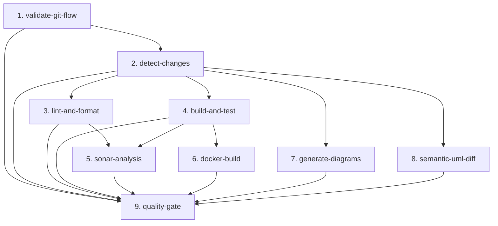

# Documentación de CI/CD - DonaTrack

## Resumen General

Este documento detalla la infraestructura de Integración y Despliegue Continuo (CI/CD) y las automatizaciones del flujo de trabajo implementadas para el proyecto **DonaTrack**. El sistema está diseñado bajo una arquitectura de microservicios multi-módulo empleando **Maven**, garantizando la integridad del código, la calidad del diseño académico y la colaboración eficiente en el equipo.

---

## 1. Pipeline Principal de CI (GitHub Actions)

El archivo [`.github/workflows/main.yaml`](../../.github/workflows/main.yaml) centraliza las validaciones de integración en un pipeline unificado basado en la filosofía de **"Fallo Temprano" (Fail-fast)**, optimizado para compilaciones incrementales de microservicios.

### 1.1. Política de Ramas (Git Flow UTN)
* **Merges a `main`**: Solo permitidos desde ramas `ENTREGA_N` mediante Pull Request.
* **Merges a `ENTREGA_N`**: Solo permitidos desde ramas de requerimiento con prefijo `E{N}_` (ej: `E1_nueva-funcionalidad`).

### 1.2. Arquitectura de Jobs del Pipeline
El workflow de CI se organiza de forma paralela y jerárquica para ahorrar tiempos y recursos de cómputo en GitHub Actions:

### 1.3. Detalle de las Etapas
1. **validate-git-flow**: Valida mediante bash regex que la rama origen de la PR respete los prefijos y nomenclatura correspondientes según la rama base destino (`main` o `ENTREGA_N`).
2. **detect-changes**: Usa la acción `dorny/paths-filter@v3` para inspeccionar qué archivos del repositorio microservicio/multi-módulo han cambiado. Genera salidas y matrices dinámicas de compilación (`services-matrix` y `docker-matrix`). Si la librería compartida `common-lib` o el archivo `pom.xml` padre cambian, fuerza la reconstrucción de todo el ecosistema.
3. **lint-and-format**: Ejecuta `mvn spotless:check` en paralelo para validar que el formato de código sea estrictamente correcto.
4. **build-and-test**: Compila y testea los microservicios afectados de manera aislada utilizando una matriz de ejecución. Genera y sube reportes de cobertura de JaCoCo y JUnit Surefire como artefactos de GitHub.
5. **sonar-analysis**: Se ejecuta tras pasar la compilación y formato. Compila el reactor y sincroniza los reportes de calidad y porcentaje de cobertura a la plataforma **SonarCloud**.
6. **docker-build**: Construye de manera simulada (sin hacer push) las imágenes de Docker de los microservicios modificados, empleando la acción de Docker Buildx con cache de capas persistente para acelerar la pipeline.
7. **generate-diagrams**: Genera automáticamente diagramas de clases PlantUML a partir de la implementación de dominio utilizando el plugin de Maven, y los renderiza en formato vectorial SVG.
8. **semantic-uml-diff**: Utiliza la acción personalizada `tsorren/SemanticUMLDiff@main` para comparar estructuralmente los diagramas UML de la rama base contra la rama de la PR, comentando las discrepancias en GitHub y enviando un reporte visual al webhook de Discord.
9. **quality-gate**: Job centinela final que evalúa los resultados de todos los jobs predecesores. Actúa como el único estado de chequeo obligatorio (Required Status Check) para las Branch Protection Rules de GitHub.

---

## 2. Flujo de Desarrollo en Cascada (Stacked PRs)

Para agilizar las revisiones de código y evitar Pull Requests gigantescas, se implementó un sistema de **Stacked PRs** que desglosa de manera automática cada requerimiento principal en tareas modulares secuenciales.

### 2.1. Componentes del Flujo
* **Workflow**: [`.github/workflows/cascading-setup.yml`](../../.github/workflows/cascading-setup.yml)
* **Script Orquestador (SOLID)**: [`.github/scripts/setup_cascade.js`](../../.github/scripts/setup_cascade.js)
* **Configuración de Tareas**: [`.github/scripts/standard_tasks.json`](../../.github/scripts/standard_tasks.json)
* **Plantilla de Sub-Issues**: [`.github/scripts/sub_issue_body_template.md`](../../.github/scripts/sub_issue_body_template.md)
* **Formulario Base**: [`.github/ISSUE_TEMPLATE/02-req-con-subissues.yaml`](../../.github/ISSUE_TEMPLATE/02-req-con-subissues.yaml)

### 2.2. Funcionamiento de la Automatización
1. Al crear una issue de requerimiento base con la etiqueta `requerimiento` (usando la plantilla `02-req-con-subissues.yaml`), el workflow se dispara automáticamente.
2. El script `setup_cascade.js` parsea el cuerpo de la issue para extraer:
   - La milestone/entrega elegida (determinando la rama base `ENTREGA_N`).
   - La lista de asignaciones planificadas bajo `### Asignaciones Planificadas:` (ej. `Task 1: @usuario`).
3. Crea las sub-issues en GitHub correspondientes a las tareas activas indicadas en el checklist, cargando el cuerpo desde la plantilla markdown `sub_issue_body_template.md` y asignándolas a los usuarios correspondientes.
4. Crea la rama base del requerimiento `E{N}_req-{id}` y las ramas secuenciales consecutivas para las tareas 1 a 7 (ej: `task1` basada en la rama principal; `task2` basada en `task1`).
5. Abre Pull Requests en estado de borrador (**Draft PRs**) encadenadas:
   - **PR 1:** Head `task1` -> Base `E{N}_req-{id}`
   - **PR 2:** Head `task2` -> Base `task1`
   - ...
   - **PR Padre:** Head `E{N}_req-{id}` -> Base `ENTREGA_N`
6. **Exclusión de Tarea 8 (Calidad y Diseño / Verificación de Diagramas)**: Esta tarea no genera rama git ni PR. Es asignada en su issue correspondiente y se cierra de forma **manual** por el desarrollador una vez finalizada la verificación.

---

## 3. Asignación Automática y Validación Secuencial de Reviews

Este flujo gestiona la asignación equitativa de revisores y garantiza que las revisiones de código de las PRs apiladas se soliciten de manera estrictamente ordenada.

### 3.1. Componentes del Flujo
* **Workflow**: [`.github/workflows/auto-assign.yml`](../../.github/workflows/auto-assign.yml)
* **Script Orquestador (SOLID)**: [`.github/scripts/assign_reviewer.js`](../../.github/scripts/assign_reviewer.js)

### 3.2. Reglas de Validación y Asignación
1. **Validación de Secuencialidad (Crítico)**: Cuando una PR de tarea (ej: Task 3) pasa de Draft a lista para revisión (`ready_for_review`), el script valida que no haya PRs previas (`task1`, `task2`) del mismo requerimiento que se encuentren en borrador (`draft == true`). Si encuentra alguna previa en borrador:
   - Publica un comentario de advertencia en la PR actual.
   - Falla la ejecución del check de GitHub Actions, bloqueando el proceso.
   - Detiene el flujo sin asignar revisor.
2. **Round-Robin Dinámico**: Si pasa la validación, determina los colaboradores elegibles excluyendo al autor de la PR y a cualquier colaborador que haya realizado commits en la rama.
3. Evalúa las últimas 50 PRs del historial de forma stateless (autocurativa) para contar las asignaciones de cada colaborador.
4. Selecciona al colaborador elegible con menos asignaciones acumuladas. En caso de empate, selecciona a quien tenga la asignación más antigua (mayor tiempo inactivo).
5. **Notificación**: Envía una alerta a Discord mencionando al revisor asignado usando el mapa de usuarios de la variable `DISCORD_USER_MAP`.

---

## 4. Recordatorios y Triage de Issues / PRs

### 4.1. Recordatorios Inteligentes de Inactividad (Cron Job)
* **Workflow**: [`.github/workflows/pr-reminders.yml`](../../.github/workflows/pr-reminders.yml)
* **Script Orquestador**: [`.github/scripts/send_reminders.js`](../../.github/scripts/send_reminders.js)
* **Funcionamiento**: Se ejecuta de lunes a viernes a las 12:00 PM UTC-3 (15:00 UTC), alertando en Discord sobre PRs abiertas con más de 48 horas de inactividad.

### 4.2. Triage y Asignación de Issues
* **Workflows**: [`.github/workflows/issue-triage.yml`](../../.github/workflows/issue-triage.yml) e [`.github/workflows/issue-auto-assign-cron.yml`](../../.github/workflows/issue-auto-assign-cron.yml).
* **Funcionamiento**: Clasifican automáticamente las etiquetas según el tipo de formulario y balancean la asignación de issues huérfanas entre los miembros del equipo.

---

## 5. Despliegue de Documentación en GitHub Pages

* **Workflow**: [`.github/workflows/deploy-pages.yaml`](../../.github/workflows/deploy-pages.yaml)
* **Script de Árbol de Entregas**: [`.github/scripts/generate-pdf-tree.js`](../../.github/scripts/generate-pdf-tree.js)
* **Funcionamiento**: En cada push a `main` o ramas `ENTREGA_*`, compila la previsualización interactiva de ADRs con Log4brains, empaqueta el visor Hub (`docs/herramientas/hub/`), el Documentador (`docs/herramientas/documentador/`) y genera el catálogo de PDFs de entregas publicando todo en GitHub Pages.

---

## 5. Validación Local (Git Hooks)

Facilita la verificación temprana antes de subir cambios al servidor remoto.

### 5.1. Instalación en Windows
Ejecutar el script de PowerShell: `./.github/scripts/setup-hooks.ps1`. Esto configurará los hooks en la carpeta interna `.git/hooks/`.

### 5.2. Comportamiento (`pre-commit`)
Al realizar `git commit`, el script intercepta la acción, detecta qué módulos Maven del reactor fueron modificados y ejecuta localmente `spotless:check` y los tests unitarios correspondientes únicamente sobre los archivos en stage, acelerando los tiempos de commit y asegurando la higiene del historial git.

---

## 6. Configuración de Secretos en GitHub (Secrets)

El correcto funcionamiento de todos los flujos de integración y notificaciones requiere definir las siguientes variables confidenciales en GitHub Secrets:

| Secreto / Variable | Propósito | Formato / Ejemplo |
|---|---|---|
| `GEMINI_API_KEY` | Token de API para integraciones secundarias | Llave de Google AI Studio |
| `SONAR_TOKEN` | Token de autenticación para sincronizar con SonarCloud | Generado en SonarCloud |
| `SONAR_PROJECT_KEY` | Identificador del proyecto en SonarCloud | String único del proyecto |
| `SONAR_ORG` | Organización de SonarCloud vinculada | String de la organización |
| `SONAR_URL` | URL de la plataforma SonarCloud | `https://sonarcloud.io` |
| `DISCORD_WEBHOOK_URL` | Webhook de Discord para enviar notificaciones de asignaciones de reviews y recordatorios de inactividad | URL del webhook del canal de alertas/reminders |
| `DISCORD_SEMANTIC_DIFF_WEBHOOK_URL` | Webhook de Discord exclusivo para reportar los diffs arquitectónicos visuales generados por la comparación UML | URL del webhook del canal de arquitectura |
| `DISCORD_USER_MAP` | JSON confidencial que mapea usuarios de GitHub con sus IDs de Discord de 18 dígitos | `{"github_user": "123456789012345678"}` |