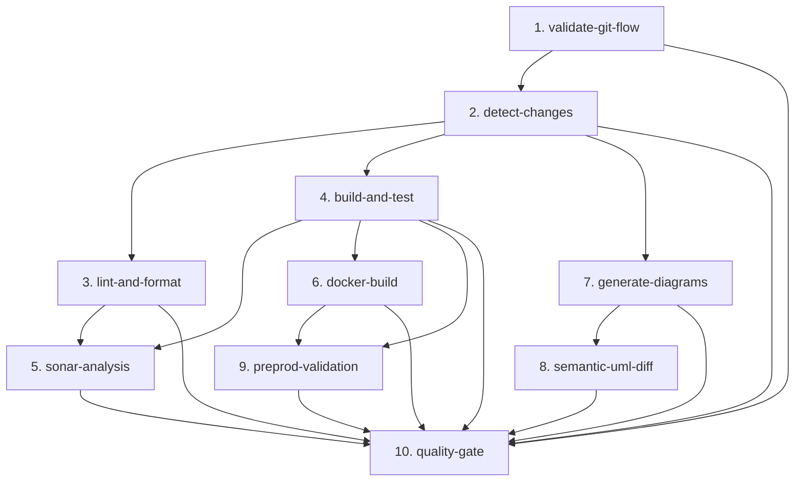
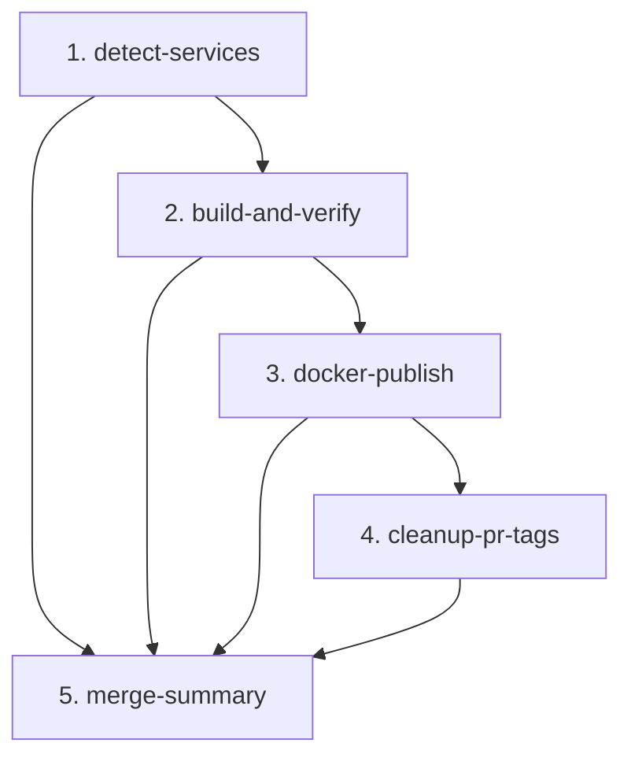

# Documentación de CI/CD — DonaTrack

## Resumen General

Este documento detalla la infraestructura de Integración y Despliegue Continuo (CI/CD) y las automatizaciones del flujo de trabajo implementadas para el proyecto **DonaTrack**. El sistema está diseñado bajo una arquitectura de microservicios multi-módulo empleando **Maven**, garantizando la integridad del código, la calidad del diseño académico y la colaboración eficiente en el equipo.

El sistema CI/CD se compone de **dos pipelines centrales y flujos de soporte**:

| Pipeline / Flujo | Archivo | Trigger | Responsabilidad |
|---|---|---|---|
| **PR Pipeline** | [`.github/workflows/main.yml`](../../.github/workflows/main.yml) | `pull_request` | Validar, compilar, testear y generar artefactos efímeros |
| **Merge Pipeline** | [`.github/workflows/merge.yml`](../../.github/workflows/merge.yml) | `push` a `main`/`ENTREGA_*` | Publicar imágenes Docker estables en GHCR |
| **Recordatorios de Inactividad** | [`.github/workflows/pr-reminders.yml`](../../.github/workflows/pr-reminders.yml) | Cron diario (Lun-Vie 15:00 UTC) | Alertar en Discord sobre PRs inactivas > 48h |
| **Deploy Pages** | [`.github/workflows/deploy-pages.yml`](../../.github/workflows/deploy-pages.yml) | `push` a `main`/`ENTREGA_*` | Desplegar Hub, Documentador y ADRs en GitHub Pages |
| **Agent Governance** | [`.github/workflows/agent-governance.yml`](../../.github/workflows/agent-governance.yml) | `pull_request`, `push` | Validar propiedades mecánicas y canonicidad documental |

---

## 1. Pipeline de PR — `main.yml`

El archivo [`.github/workflows/main.yml`](../../.github/workflows/main.yml) centraliza las validaciones de integración en un pipeline unificado basado en la filosofía de **"Fallo Temprano" (Fail-fast)**, optimizado para compilaciones incrementales de microservicios.

### 1.1. Política de Ramas (Git Flow UTN)
* **Merges a `main`**: Solo permitidos desde ramas `ENTREGA_N` mediante Pull Request.
* **Merges a `ENTREGA_N`**: Solo permitidos desde ramas de requerimiento con prefijo `E{N}_` o `ENTREGA_{N}_` (ej: `E2_nueva-funcionalidad`). La lógica es genérica basada en el número de entrega extraído de `BASH_REMATCH`.

### 1.2. Arquitectura de Jobs del Pipeline de PR

### 1.3. Detalle de las Etapas

1. **validate-git-flow**: Valida mediante bash regex que la rama origen de la PR respete los prefijos y nomenclatura correspondientes según la rama base destino (`main` o `ENTREGA_N`). Lógica genérica basada en el número de entrega sin hardcoding de ramas específicas.
2. **detect-changes**: Usa `dorny/paths-filter` para detectar cambios globales y `git diff --name-only origin/base...HEAD` (triple punto, comparación desde ancestro común) para detectar cambios por servicio. Genera dos matrices: `services-matrix` (módulos a compilar) y `docker-matrix` (módulos con Dockerfile). Exporta dos outputs booleanos: `any-service` y `any-docker-service`.
3. **lint-and-format**: Ejecuta `mvn spotless:check` validando el formato de código.
4. **build-and-test**: Compila y testea los microservicios afectados con matriz paralela. Sube JARs, reportes JaCoCo, Surefire y archivos PUML como artefactos de Actions.
5. **sonar-analysis**: Sincroniza cobertura y métricas a SonarCloud. Job opcional: si falla, el Quality Gate no bloquea el PR.
6. **docker-build**: Construye y publica en GHCR la imagen de cada servicio modificado con tag `pr-{N}` (efímero, para uso en preprod-validation). Utiliza caché GHA por scope de servicio.
7. **generate-diagrams**: Genera diagramas PlantUML (rama base y PR) y los renderiza a SVG. Usa PlantUML `v1.2024.7` con clave de caché fija para 100% hit rate.
8. **semantic-uml-diff**: Compara estructuralmente los diagramas UML usando `tsorren/SemanticUMLDiff` y comenta las diferencias en el PR y Discord.
9. **preprod-validation**: Levanta el stack completo de pre-producción (`docker-compose.preprod.yml`) resolviendo imágenes en tres niveles: (1) imagen `pr-{N}` del servicio modificado, (2) imagen `:entrega_N` del pipeline de merge para servicios no modificados, (3) error explícito si ninguna está disponible. Ejecuta smoke tests y suite completa de integración.
10. **quality-gate**: Job centinela con lógica de **doble eje de contexto**: evalúa cada job según `any-service` o `any-docker-service`, evitando falsos positivos cuando jobs son correctamente omitidos por contexto (ej: `docker-build=skipped` cuando no hay Dockerfiles modificados es **válido**).

### 1.4. Estrategia de Caché
* **Maven**: caché nativa de `actions/setup-java` (por workspace).
* **Docker layers**: caché GHA con scope por nombre de servicio, compartida entre el pipeline de PR y el pipeline de merge para acelerar builds sucesivos.
* **PlantUML JAR**: clave fija `plantuml-jar-1.2024.7`. Para actualizar la versión, cambiar la clave **y** la URL de descarga en sincronía.

---

## 2. Pipeline de Merge — `merge.yml`

El archivo [`.github/workflows/merge.yml`](../../.github/workflows/merge.yml) se dispara automáticamente al integrar un PR en `main` o cualquier rama `ENTREGA_*`. Su responsabilidad única es publicar **imágenes Docker estables** en GHCR para que los PRs futuros puedan resolverlas.

> **Prerrequisito operativo**: `preprod-validation` en el pipeline de PR depende de que `merge.yml` haya publicado previamente las imágenes base de la rama destino. Ante el primer PR de una rama nueva, publicar manualmente las imágenes iniciales o forzar el merge pipeline con `git commit --allow-empty`.

### 2.1. Arquitectura del Pipeline de Merge

### 2.2. Detalle de las Etapas

1. **detect-services**: Descubrimiento dinámico de todos los servicios del monorepo. Calcula el `branch-tag` (ej: `entrega_2`) y el `sha-short` (7 chars) para usarlos como tags Docker.
2. **build-and-verify**: Compila y testea **todos** los servicios desde el estado mergeado (no desde artefactos de PR). Usa `mvn verify` para detectar regresiones introducidas por el merge. Si fallan los tests, las imágenes no se publican.
3. **docker-publish**: Construye y publica cada imagen con **tres tags simultáneos** en un solo push ("Build Once, Tag Many"):
   - `:sha-a1b2c3d` — inmutable, para rollback/trazabilidad
   - `:entrega_2` — tag estable de la rama (sobreescrito en cada merge)
   - `:latest` — solo si el push es a `main`
4. **cleanup-pr-tags**: Elimina los tags `pr-N` efímeros de GHCR tras el merge para evitar acumulación de imágenes obsoletas. Requiere el secreto `PACKAGES_CLEANUP_PAT`.
5. **merge-summary**: Genera un resumen visible en la pestaña de GitHub Actions con el estado de cada job y los tags publicados.

### 2.3. Política de Concurrencia
A diferencia del pipeline de PR (`cancel-in-progress: true`), el pipeline de merge usa `cancel-in-progress: false`. Dos merges consecutivos se serializan para evitar publicar un estado intermedio o dejar GHCR con imágenes incompletas.

### 2.4. Filtro de Paths
El merge pipeline solo se dispara cuando hay cambios en código fuente (`*/src/**`), `pom.xml`, `Dockerfile` o `docker-compose*.yml`. Commits de solo documentación o ADRs no consumen minutos de runner ni cuota de GHCR.

---

## 3. Recordatorios Inteligentes de Inactividad (`pr-reminders.yml`)

Para evitar cuellos de botella en la revisión de código, se mantiene activo un cron job diario que audita PRs estancadas.

* **Workflow**: [`.github/workflows/pr-reminders.yml`](../../.github/workflows/pr-reminders.yml)
* **Script Orquestador**: [`.github/scripts/send_reminders.js`](../../.github/scripts/send_reminders.js)
* **Framework Compartido**: [`.github/scripts/shared_notifier.js`](../../.github/scripts/shared_notifier.js)
* **Funcionamiento**: Se ejecuta de lunes a viernes a las 12:00 PM UTC-3 (15:00 UTC). Filtra PRs en estado abierto (no draft) con más de 48 horas sin cambios ni aprobaciones, despachando recordatorios a Discord mencionando a los revisores asignados mediante `DISCORD_USER_MAP`.

---

## 4. Despliegue de Documentación en GitHub Pages (`deploy-pages.yml`)

* **Workflow**: [`.github/workflows/deploy-pages.yml`](../../.github/workflows/deploy-pages.yml)
* **Script de Árbol de Entregas**: [`.github/scripts/generate-pdf-tree.js`](../../.github/scripts/generate-pdf-tree.js)
* **Funcionamiento**: En cada push a `main` o ramas `ENTREGA_*`, compila la previsualización interactiva de ADRs con Log4brains, empaqueta el visor Hub (`docs/herramientas/hub/`), el Documentador (`docs/herramientas/documentador/`) y genera el catálogo de PDFs de entregas publicando todo en GitHub Pages.

---

## 5. Validación Local (Git Hooks)

Facilita la verificación temprana antes de subir cambios al servidor remoto.

### 5.1. Instalación en Windows
Ejecutar el script de PowerShell: `./.github/scripts/setup-hooks.ps1`. Esto configurará los hooks en la carpeta interna `.git/hooks/`.

### 5.2. Comportamiento (`pre-commit`)
Al realizar `git commit`, el script intercepta la acción, detecta qué módulos Maven del reactor fueron modificados y ejecuta localmente `spotless:check` y los tests unitarios correspondientes únicamente sobre los archivos en stage, acelerando los tiempos de commit y asegurando la higiene del historial git.

---

## 6. Configuración de Secretos en GitHub (Secrets)

El correcto funcionamiento de todos los flujos de integración y notificaciones requiere definir las siguientes variables confidenciales en GitHub Secrets:

| Secreto / Variable | Propósito | Formato / Ejemplo |
|---|---|---|
| `GEMINI_API_KEY` | Token de API para integraciones secundarias | Llave de Google AI Studio |
| `SONAR_TOKEN` | Token de autenticación para sincronizar con SonarCloud | Generado en SonarCloud |
| `SONAR_PROJECT_KEY` | Identificador del proyecto en SonarCloud | String único del proyecto |
| `SONAR_ORG` | Organización de SonarCloud vinculada | String de la organización |
| `SONAR_URL` | URL de la plataforma SonarCloud | `https://sonarcloud.io` |
| `DISCORD_WEBHOOK_URL` | Webhook de Discord para recordatorios de inactividad | URL del webhook del canal de alertas/reminders |
| `DISCORD_SEMANTIC_DIFF_WEBHOOK_URL` | Webhook de Discord exclusivo para reportar los diffs arquitectónicos visuales generados por la comparación UML | URL del webhook del canal de arquitectura |
| `DISCORD_USER_MAP` | JSON confidencial que mapea usuarios de GitHub con sus IDs de Discord de 18 dígitos | `{"github_user": "123456789012345678"}` |
| `PACKAGES_CLEANUP_PAT` | PAT Classic con scope `delete:packages` para limpiar tags efímeros `pr-N` de GHCR tras merge. Sin este secreto, la limpieza falla silenciosamente (el pipeline no se bloquea). | PAT generado en GitHub → Settings → Developer settings |

---

## 7. Agent Governance Check (Wave 7A)

* **Workflow**: [`.github/workflows/agent-governance.yml`](../../.github/workflows/agent-governance.yml)
* **Trigger**: Todo `pull_request` y `push` a `main` o `ENTREGA_*`. Sin filtros de paths — el check es lo suficientemente barato.
* **Responsabilidad**: Verifica propiedades mecánicas del harness de agentes. Wave 7A cubre: canonicidad de `AGENTS.md`, existencia y referencia activa de `docs/IA/review/evaluator.md`, y ausencia de términos obsoletos eliminados en Oleada 6.
* **Stack**: Node.js 20, módulos built-in únicamente. Sin Docker, Maven ni dependencias externas.
* **Tests del tooling**: `node scripts/tests/run-tests.js` (86 aserciones de fixtures temporales).
* **Ejecución local**: `node scripts/agent-check.js`
* **Bloquea merge**: Sí, si cualquier check emite severidad `FAIL`. Los `WARN` son informativos.
* **Secretos requeridos**: Ninguno.

---

## 8. Desmantelamiento de Flujos Experimentales (2026)

Con el fin de consolidar la arquitectura CI/CD y eliminar complejidad accidental en la gobernanza del repositorio, se procedió al retiro formal de los siguientes componentes:
1. **Flujo de Tareas en Cascada (Stacked PRs)** (`cascading-setup.yml`, `setup_cascade.js`, `standard_tasks.json`, `sub_issue_body_template.md`, `02-req-con-subissues.yaml`): Eliminado debido a la sobrecarga de sincronización de ramas apiladas y la fricción generada por Draft PRs encadenadas.
2. **Asignación Automática Round-Robin** (`auto-assign.yml`, `assign_reviewer.js`, `notify_reviewer.js`, `reviewer_groups.json`): Eliminado para devolver la autonomía a los desarrolladores en la elección y solicitud manual de revisores de acuerdo al contexto técnico.
3. **Triage Automático y Autoasignación Cron de Issues** (`issue-triage.yml`, `issue-auto-assign-cron.yml`, `triage_issue.js`, `auto_assign_issues.js`): Decomisionado para simplificar la gestión de GitHub Projects sin requerir scripts periódicos con permisos elevados de escritura.
