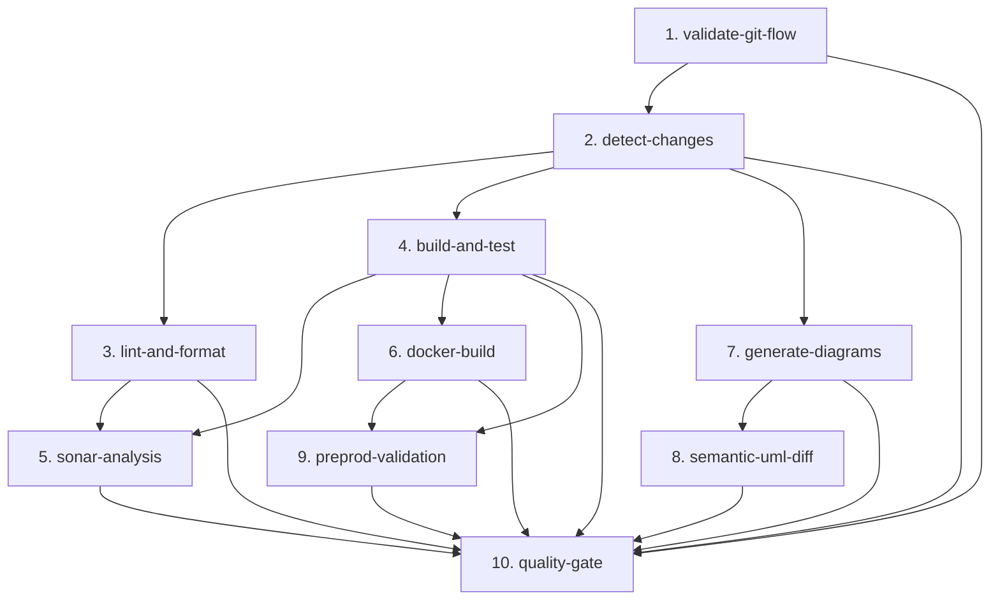
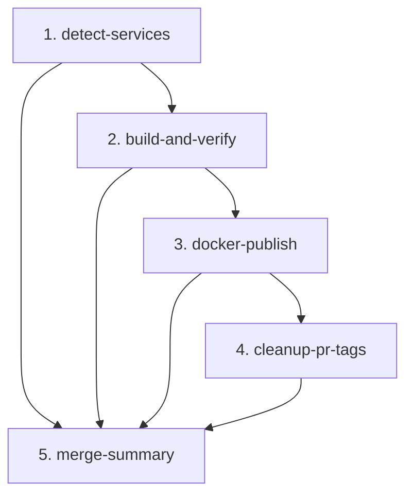

# Documentación de CI/CD - DonaTrack

## Resumen General

Este documento detalla la infraestructura de Integración y Despliegue Continuo (CI/CD) y las automatizaciones del flujo de trabajo implementadas para el proyecto **DonaTrack**. El sistema está diseñado bajo una arquitectura de microservicios multi-módulo empleando **Maven**, garantizando la integridad del código, la calidad del diseño académico y la colaboración eficiente en el equipo.

El sistema CI/CD se compone de **dos pipelines complementarios**:

| Pipeline | Archivo | Trigger | Responsabilidad |
|---|---|---|---|
| **PR Pipeline** | `.github/workflows/main.yml` | `pull_request` | Validar, compilar, testear y generar artefactos efímeros |
| **Merge Pipeline** | `.github/workflows/merge.yml` | `push` a `main`/`ENTREGA_*` | Publicar imágenes Docker estables en GHCR |

---

## 1. Pipeline de PR — `main.yml`

El archivo [`.github/workflows/main.yml`](../../.github/workflows/main.yml) centraliza las validaciones de integración en un pipeline unificado basado en la filosofía de **"Fallo Temprano" (Fail-fast)**, optimizado para compilaciones incrementales de microservicios.

### 1.1. Política de Ramas (Git Flow UTN)
* **Merges a `main`**: Solo permitidos desde ramas `ENTREGA_N` mediante Pull Request.
* **Merges a `ENTREGA_N`**: Solo permitidos desde ramas de requerimiento con prefijo `E{N}_` o `ENTREGA_{N}_` (ej: `E2_nueva-funcionalidad`). La lógica es genérica basada en el número de entrega extraído de `BASH_REMATCH`.

### 1.2. Arquitectura de Jobs del Pipeline de PR

### 1.3. Detalle de las Etapas

1. **validate-git-flow**: Valida mediante bash regex que la rama origen de la PR respete los prefijos y nomenclatura correspondientes según la rama base destino (`main` o `ENTREGA_N`). Lógica genérica basada en el número de entrega sin hardcoding de ramas específicas.
2. **detect-changes**: Usa `dorny/paths-filter` para detectar cambios globales y `git diff --name-only origin/base...HEAD` (triple punto, comparación desde ancestro común) para detectar cambios por servicio. Genera dos matrices: `services-matrix` (módulos a compilar) y `docker-matrix` (módulos con Dockerfile). Exporta dos outputs booleanos: `any-service` y `any-docker-service`.
3. **lint-and-format**: Ejecuta `mvn spotless:check` validando el formato de código.
4. **build-and-test**: Compila y testea los microservicios afectados con matriz paralela. Sube JARs, reportes JaCoCo, Surefire y archivos PUML como artefactos de Actions.
5. **sonar-analysis**: Sincroniza cobertura y métricas a SonarCloud. Job opcional: si falla, el Quality Gate no bloquea el PR.
6. **docker-build**: Construye y publica en GHCR la imagen de cada servicio modificado con tag `pr-{N}` (efímero, para uso en preprod-validation). Utiliza caché GHA por scope de servicio.
7. **generate-diagrams**: Genera diagramas PlantUML (rama base y PR) y los renderiza a SVG. Usa PlantUML `v1.2024.7` con clave de caché fija para 100% hit rate.
8. **semantic-uml-diff**: Compara estructuralmente los diagramas UML usando `tsorren/SemanticUMLDiff` y comenta las diferencias en el PR y Discord.
9. **preprod-validation**: Levanta el stack completo de pre-producción (`docker-compose.preprod.yml`) resolviendo imágenes en tres niveles: (1) imagen `pr-{N}` del servicio modificado, (2) imagen `:entrega_N` del pipeline de merge para servicios no modificados, (3) error explícito si ninguna está disponible. Ejecuta smoke tests y suite completa de integración.
10. **quality-gate**: Job centinela con lógica de **doble eje de contexto**: evalúa cada job según `any-service` o `any-docker-service`, evitando falsos positivos cuando jobs son correctamente omitidos por contexto (ej: `docker-build=skipped` cuando no hay Dockerfiles modificados es **válido**).

### 1.4. Estrategia de Caché
* **Maven**: caché nativa de `actions/setup-java` (por workspace).
* **Docker layers**: caché GHA con scope por nombre de servicio, compartida entre el pipeline de PR y el pipeline de merge para acelerar builds sucesivos.
* **PlantUML JAR**: clave fija `plantuml-jar-1.2024.7`. Para actualizar la versión, cambiar la clave **y** la URL de descarga en sincronía.

---

## 2. Pipeline de Merge — `merge.yml`

El archivo [`.github/workflows/merge.yml`](../../.github/workflows/merge.yml) se dispara automáticamente al integrar un PR en `main` o cualquier rama `ENTREGA_*`. Su responsabilidad única es publicar **imágenes Docker estables** en GHCR para que los PRs futuros puedan resolverlas.

> **Prerrequisito operativo**: `preprod-validation` en el pipeline de PR depende de que `merge.yml` haya publicado previamente las imágenes base de la rama destino. Ante el primer PR de una rama nueva, publicar manualmente las imágenes iniciales o forzar el merge pipeline con `git commit --allow-empty`.

### 2.1. Arquitectura del Pipeline de Merge

### 2.2. Detalle de las Etapas

1. **detect-services**: Descubrimiento dinámico de todos los servicios del monorepo. Calcula el `branch-tag` (ej: `entrega_2`) y el `sha-short` (7 chars) para usarlos como tags Docker.
2. **build-and-verify**: Compila y testea **todos** los servicios desde el estado mergeado (no desde artefactos de PR). Usa `mvn verify` para detectar regresiones introducidas por el merge. Si fallan los tests, las imágenes no se publican.
3. **docker-publish**: Construye y publica cada imagen con **tres tags simultáneos** en un solo push ("Build Once, Tag Many"):
   - `:sha-a1b2c3d` — inmutable, para rollback/trazabilidad
   - `:entrega_2` — tag estable de la rama (sobreescrito en cada merge)
   - `:latest` — solo si el push es a `main`
4. **cleanup-pr-tags**: Elimina los tags `pr-N` efímeros de GHCR tras el merge para evitar acumulación de imágenes obsoletas. Requiere el secreto `PACKAGES_CLEANUP_PAT`.
5. **merge-summary**: Genera un resumen visible en la pestaña de GitHub Actions con el estado de cada job y los tags publicados.

### 2.3. Política de Concurrencia
A diferencia del pipeline de PR (`cancel-in-progress: true`), el pipeline de merge usa `cancel-in-progress: false`. Dos merges consecutivos se serializan para evitar publicar un estado intermedio o dejar GHCR con imágenes incompletas.

### 2.4. Filtro de Paths
El merge pipeline solo se dispara cuando hay cambios en código fuente (`*/src/**`), `pom.xml`, `Dockerfile` o `docker-compose*.yml`. Commits de solo documentación o ADRs no consumen minutos de runner ni cuota de GHCR.

---

## 3. Flujo de Desarrollo en Cascada (Stacked PRs)

Para agilizar las revisiones de código y evitar Pull Requests gigantescas, se implementó un sistema de **Stacked PRs** que desglosa de manera automática cada requerimiento principal en tareas modulares secuenciales.

### 3.1. Componentes del Flujo
* **Workflow**: [`.github/workflows/cascading-setup.yml`](../../.github/workflows/cascading-setup.yml)
* **Script Orquestador (SOLID)**: [`.github/scripts/setup_cascade.js`](../../.github/scripts/setup_cascade.js)
* **Configuración de Tareas**: [`.github/scripts/standard_tasks.json`](../../.github/scripts/standard_tasks.json)
* **Plantilla de Sub-Issues**: [`.github/scripts/sub_issue_body_template.md`](../../.github/scripts/sub_issue_body_template.md)
* **Formulario Base**: [`.github/ISSUE_TEMPLATE/02-req-con-subissues.yaml`](../../.github/ISSUE_TEMPLATE/02-req-con-subissues.yaml)

### 3.2. Funcionamiento de la Automatización
1. Al crear una issue de requerimiento base con la etiqueta `requerimiento` (usando la plantilla `02-req-con-subissues.yaml`), el workflow se dispara automáticamente.
2. El script `setup_cascade.js` parsea el cuerpo de la issue para extraer:
   - La milestone/entrega elegida (determinando la rama base `ENTREGA_N`).
   - La lista de asignaciones planificadas bajo `### Asignaciones Planificadas:` (ej. `Task 1: @usuario`).
3. Crea las sub-issues en GitHub correspondientes a las tareas activas indicadas en el checklist, cargando el cuerpo desde la plantilla markdown `sub_issue_body_template.md` y asignándolas a los usuarios correspondientes.
4. Crea la rama base del requerimiento `E{N}_req-{id}` y las ramas secuenciales consecutivas para las tareas 1 a 7 (ej: `task1` basada en la rama principal; `task2` basada en `task1`).
5. Abre Pull Requests en estado de borrador (**Draft PRs**) encadenadas:
   - **PR 1:** Head `task1` -> Base `E{N}_req-{id}`
   - **PR 2:** Head `task2` -> Base `task1`
   - ...
   - **PR Padre:** Head `E{N}_req-{id}` -> Base `ENTREGA_N`
6. **Exclusión de Tarea 8 (Calidad y Diseño / Verificación de Diagramas)**: Esta tarea no genera rama git ni PR. Es asignada en su issue correspondiente y se cierra de forma **manual** por el desarrollador una vez finalizada la verificación.

---

## 4. Asignación Automática y Validación Secuencial de Reviews

Este flujo gestiona la asignación equitativa de revisores y garantiza que las revisiones de código de las PRs apiladas se soliciten de manera estrictamente ordenada.

### 4.1. Componentes del Flujo
* **Workflow**: [`.github/workflows/auto-assign.yml`](../../.github/workflows/auto-assign.yml)
* **Script Orquestador (SOLID)**: [`.github/scripts/assign_reviewer.js`](../../.github/scripts/assign_reviewer.js)

### 4.2. Reglas de Validación y Asignación
1. **Validación de Secuencialidad (Crítico)**: Cuando una PR de tarea (ej: Task 3) pasa de Draft a lista para revisión (`ready_for_review`), el script valida que no haya PRs previas (`task1`, `task2`) del mismo requerimiento que se encuentren en borrador (`draft == true`). Si encuentra alguna previa en borrador:
   - Publica un comentario de advertencia en la PR actual.
   - Falla la ejecución del check de GitHub Actions, bloqueando el proceso.
   - Detiene el flujo sin asignar revisor.
2. **Round-Robin Dinámico**: Si pasa la validación, determina los colaboradores elegibles excluyendo al autor de la PR y a cualquier colaborador que haya realizado commits en la rama.
3. Evalúa las últimas 50 PRs del historial de forma stateless (autocurativa) para contar las asignaciones de cada colaborador.
4. Selecciona al colaborador elegible con menos asignaciones acumuladas. En caso de empate, selecciona a quien tenga la asignación más antigua (mayor tiempo inactivo).
5. **Notificación**: Envía una alerta a Discord mencionando al revisor asignado usando el mapa de usuarios de la variable `DISCORD_USER_MAP`.

---

## 5. Recordatorios y Triage de Issues / PRs

### 5.1. Recordatorios Inteligentes de Inactividad (Cron Job)
* **Workflow**: [`.github/workflows/pr-reminders.yml`](../../.github/workflows/pr-reminders.yml)
* **Script Orquestador**: [`.github/scripts/send_reminders.js`](../../.github/scripts/send_reminders.js)
* **Funcionamiento**: Se ejecuta de lunes a viernes a las 12:00 PM UTC-3 (15:00 UTC), alertando en Discord sobre PRs abiertas con más de 48 horas de inactividad.

### 5.2. Triage y Asignación de Issues
* **Workflows**: [`.github/workflows/issue-triage.yml`](../../.github/workflows/issue-triage.yml) e [`.github/workflows/issue-auto-assign-cron.yml`](../../.github/workflows/issue-auto-assign-cron.yml).
* **Funcionamiento**: Clasifican automáticamente las etiquetas según el tipo de formulario y balancean la asignación de issues huérfanas entre los miembros del equipo.

---

## 6. Despliegue de Documentación en GitHub Pages

* **Workflow**: [`.github/workflows/deploy-pages.yaml`](../../.github/workflows/deploy-pages.yaml)
* **Script de Árbol de Entregas**: [`.github/scripts/generate-pdf-tree.js`](../../.github/scripts/generate-pdf-tree.js)
* **Funcionamiento**: En cada push a `main` o ramas `ENTREGA_*`, compila la previsualización interactiva de ADRs con Log4brains, empaqueta el visor Hub (`docs/herramientas/hub/`), el Documentador (`docs/herramientas/documentador/`) y genera el catálogo de PDFs de entregas publicando todo en GitHub Pages.

---

## 7. Validación Local (Git Hooks)

Facilita la verificación temprana antes de subir cambios al servidor remoto.

### 7.1. Instalación en Windows
Ejecutar el script de PowerShell: `./.github/scripts/setup-hooks.ps1`. Esto configurará los hooks en la carpeta interna `.git/hooks/`.

### 7.2. Comportamiento (`pre-commit`)
Al realizar `git commit`, el script intercepta la acción, detecta qué módulos Maven del reactor fueron modificados y ejecuta localmente `spotless:check` y los tests unitarios correspondientes únicamente sobre los archivos en stage, acelerando los tiempos de commit y asegurando la higiene del historial git.

---

## 8. Configuración de Secretos en GitHub (Secrets)

El correcto funcionamiento de todos los flujos de integración y notificaciones requiere definir las siguientes variables confidenciales en GitHub Secrets:

| Secreto / Variable | Propósito | Formato / Ejemplo |
|---|---|---|
| `GEMINI_API_KEY` | Token de API para integraciones secundarias | Llave de Google AI Studio |
| `SONAR_TOKEN` | Token de autenticación para sincronizar con SonarCloud | Generado en SonarCloud |
| `SONAR_PROJECT_KEY` | Identificador del proyecto en SonarCloud | String único del proyecto |
| `SONAR_ORG` | Organización de SonarCloud vinculada | String de la organización |
| `SONAR_URL` | URL de la plataforma SonarCloud | `https://sonarcloud.io` |
| `DISCORD_WEBHOOK_URL` | Webhook de Discord para notificaciones de asignaciones de reviews y recordatorios de inactividad | URL del webhook del canal de alertas/reminders |
| `DISCORD_SEMANTIC_DIFF_WEBHOOK_URL` | Webhook de Discord exclusivo para reportar los diffs arquitectónicos visuales generados por la comparación UML | URL del webhook del canal de arquitectura |
| `DISCORD_USER_MAP` | JSON confidencial que mapea usuarios de GitHub con sus IDs de Discord de 18 dígitos | `{"github_user": "123456789012345678"}` |
| `PACKAGES_CLEANUP_PAT` | PAT Classic con scope `delete:packages` para limpiar tags efímeros `pr-N` de GHCR tras merge. Sin este secreto, la limpieza falla silenciosamente (el pipeline no se bloquea). | PAT generado en GitHub → Settings → Developer settings |

---

## 9. Agent Governance Check (Wave 7A)

* **Workflow**: [`.github/workflows/agent-governance.yml`](../../.github/workflows/agent-governance.yml)
* **Trigger**: Todo `pull_request` y `push` a `main` o `ENTREGA_*`. Sin filtros de paths — el check es lo suficientemente barato.
* **Responsabilidad**: Verifica propiedades mecánicas del harness de agentes. Wave 7A cubre: canonicidad de `AGENTS.md`, existencia y referencia activa de `docs/IA/review/evaluator.md`, y ausencia de términos obsoletos eliminados en Oleada 6.
* **Stack**: Node.js 20, módulos built-in únicamente. Sin Docker, Maven ni dependencias externas.
* **Tests del tooling**: `node scripts/tests/run-tests.js` (17 casos, fixtures temporales).
* **Ejecución local**: `node scripts/agent-check.js`
* **Bloquea merge**: Sí, si cualquier check emite severidad `FAIL`. Los `WARN` son informativos.
* **Secretos requeridos**: Ninguno.
