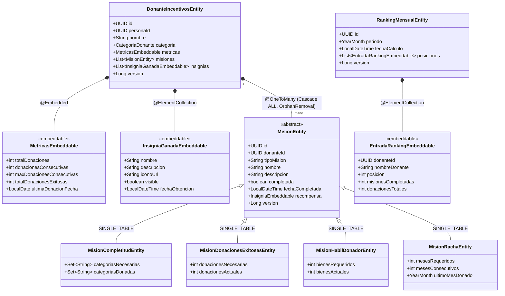
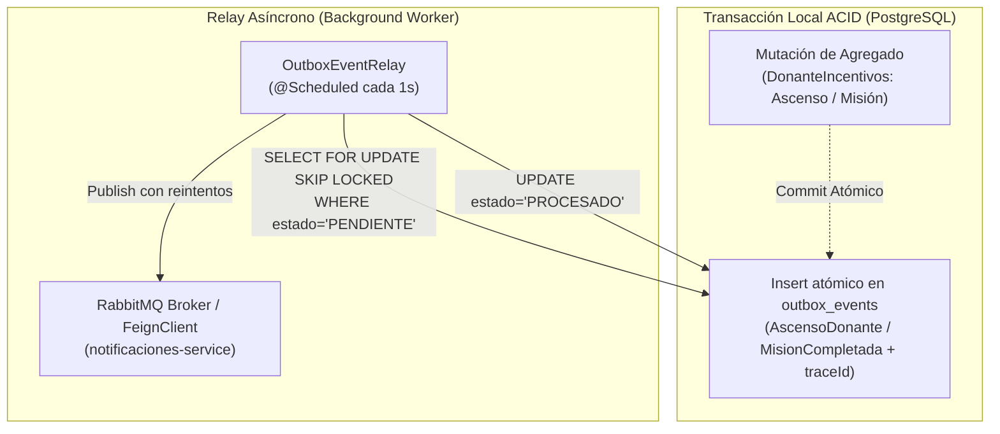
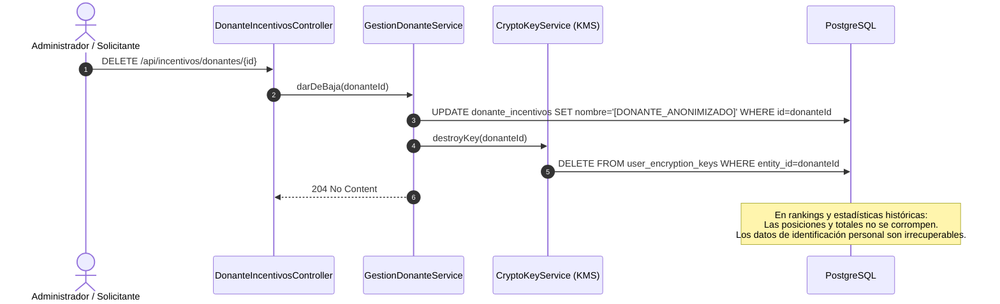

# Decisiones Técnicas Futuras para la Persistencia Real — `incentivos-service`

> **Documento de Referencia Técnica Complementario a la Oleada 10**  
> **Contexto:** Microservicio de Incentivos — Sistema DonaTrack  
> **Propósito:** Registrar formalmente las decisiones de arquitectura, esquemas relacionales, configuración de JPA/Hibernate 6, Transactional Outbox, Crypto-Shredding y Testcontainers que se implementarán en la fase de persistencia física en PostgreSQL, preservando la pureza y aislamiento del dominio.

---

## 1. Mapeo Objeto-Relacional (ORM) con JPA / Hibernate 6



---

### 1.1. Estrategia de Herencia Polimórfica para `Mision`
* **Estrategia Elegida**: `@Inheritance(strategy = InheritanceType.SINGLE_TABLE)` con discriminador `@DiscriminatorColumn(name = "tipo_mision", discriminatorType = DiscriminatorType.STRING)`.
* **Justificación**:
  - Todas las misiones (`MisionCompletitud`, `MisionDonacionesExitosas`, `MisionHabilDonador`, `MisionRacha`) comparten más del 70% de su estructura (`id`, `donante_id`, `nombre`, `descripcion`, `completada`, `fecha_completada`, `recompensa`, `version`).
  - La estrategia de tabla única optimiza las consultas del aggregate root (`DonanteIncentivos`) ejecutando un único `SELECT` directo sin `JOIN`s ni `UNION`s polimórficas costosas en base de datos.
  - Columnas discriminadas:
    - `COMPLETITUD`: Utiliza tablas secundarias de colecciones (`mision_categorias_necesarias`, `mision_categorias_donadas`).
    - `DONACIONES_EXITOSAS`: `donaciones_necesarias`, `donaciones_actuales`.
    - `HABIL_DONADOR`: `bienes_requeridos`, `bienes_actuales`.
    - `RACHA`: `meses_requeridos`, `meses_consecutivos`, `ultimo_mes_donado`.

---

### 1.2. Mapeo de Value Objects y Aplanamiento Escalar de `Metricas`
* **Problema de Rendimiento**: Cargar una colección no acotada `List<EventoDonacion>` en memoria en cada lectura del donante degrada el rendimiento a medida que el historial crece con los años.
* **Solución**:
  - `Metricas` se aplanará como `@Embeddable` con campos escalares directamente en la tabla `donante_incentivos`:
    - `total_donaciones INT`
    - `donaciones_consecutivas INT`
    - `max_donaciones_consecutivas INT`
    - `total_donaciones_exitosas INT`
    - `ultima_donacion_fecha DATE`
  - El detalle de eventos históricos de donación (`EventoDonacion`) se mantendrá desacoplado o como `@ElementCollection` con carga estrictamente diferida (`FetchType.LAZY`) en tabla secundaria `donante_historial_donacion`.

---

### 1.3. Mapeo de Value Objects `Insignia` e `InsigniaGanada`
* **`Insignia`**: Recompensa inmutable (`nombre`, `descripcion`, `iconoUrl`) embebida dentro de `Mision` (`@Embedded`).
* **`InsigniaGanada`**: Value object que representa el logro del donante (`nombre`, `descripcion`, `iconoUrl`, `visible`, `fechaObtencion`). Mapeado como `@ElementCollection` en la tabla `donante_insignia_ganada` con restricción de unicidad `UNIQUE (donante_id, nombre)` garantizando idempotencia.

---

### 1.4. Conversores de Atributos (`AttributeConverter`)
Para tipos de fecha y periodos no soportados nativamente por JDBC:

```java
@Converter(autoApply = true)
public class YearMonthAttributeConverter implements AttributeConverter<YearMonth, String> {

  @Override
  public String convertToDatabaseColumn(YearMonth attribute) {
    return attribute != null ? attribute.toString() : null; // Ej: "2026-08"
  }

  @Override
  public YearMonth convertToEntityAttribute(String dbData) {
    return dbData != null && !dbData.isBlank() ? YearMonth.parse(dbData) : null;
  }
}
```

---

## 2. Esquema Relacional DDL Optimizado (PostgreSQL 15+)

```sql
-- ============================================================================
-- DONATRACK: SERVICIO DE INCENTIVOS - ESQUEMA RELACIONAL (POSTGRESQL 15+)
-- ============================================================================

-- ----------------------------------------------------------------------------
-- 1. AGREGADO DONANTE INCENTIVOS
-- ----------------------------------------------------------------------------
CREATE TABLE donante_incentivos (
    id UUID PRIMARY KEY,
    persona_id UUID NOT NULL UNIQUE,
    nombre VARCHAR(100) NOT NULL,
    categoria VARCHAR(20) NOT NULL DEFAULT 'COLABORADOR', -- 'COLABORADOR', 'BENEFACTOR', 'PATROCINADOR', 'HEROE'
    
    -- Value Object Embebido: Metricas (Escalares aplanados)
    total_donaciones INT NOT NULL DEFAULT 0 CHECK (total_donaciones >= 0),
    donaciones_consecutivas INT NOT NULL DEFAULT 0 CHECK (donaciones_consecutivas >= 0),
    max_donaciones_consecutivas INT NOT NULL DEFAULT 0 CHECK (max_donaciones_consecutivas >= 0),
    total_donaciones_exitosas INT NOT NULL DEFAULT 0 CHECK (total_donaciones_exitosas >= 0),
    ultima_donacion_fecha DATE NULL,
    
    version BIGINT NOT NULL DEFAULT 0,
    created_at TIMESTAMP WITH TIME ZONE DEFAULT CURRENT_TIMESTAMP NOT NULL,
    updated_at TIMESTAMP WITH TIME ZONE DEFAULT CURRENT_TIMESTAMP NOT NULL
);
CREATE INDEX idx_donante_inc_persona ON donante_incentivos(persona_id);
CREATE INDEX idx_donante_inc_categoria ON donante_incentivos(categoria);

-- ----------------------------------------------------------------------------
-- 2. JERARQUÍA MISIONES (SINGLE TABLE INHERITANCE)
-- ----------------------------------------------------------------------------
CREATE TABLE mision (
    id UUID PRIMARY KEY,
    donante_id UUID NOT NULL REFERENCES donante_incentivos(id) ON DELETE CASCADE,
    tipo_mision VARCHAR(30) NOT NULL, -- 'COMPLETITUD', 'DONACIONES_EXITOSAS', 'HABIL_DONADOR', 'RACHA'
    nombre VARCHAR(100) NOT NULL,
    descripcion VARCHAR(255) NOT NULL,
    completada BOOLEAN NOT NULL DEFAULT FALSE,
    fecha_completada TIMESTAMP WITH TIME ZONE NULL,
    
    -- Recompensa (Insignia Embebida)
    insignia_nombre VARCHAR(100) NOT NULL,
    insignia_descripcion VARCHAR(255) NOT NULL,
    insignia_icono_url VARCHAR(500) NOT NULL,
    
    -- Atributos de MisionDonacionesExitosas
    donaciones_necesarias INT NULL CHECK (donaciones_necesarias > 0),
    donaciones_actuales INT NULL CHECK (donaciones_actuales >= 0),
    
    -- Atributos de MisionHabilDonador
    bienes_requeridos INT NULL CHECK (bienes_requeridos > 0),
    bienes_actuales INT NULL CHECK (bienes_actuales >= 0),
    
    -- Atributos de MisionRacha
    meses_requeridos INT NULL CHECK (meses_requeridos > 0),
    meses_consecutivos INT NULL CHECK (meses_consecutivos >= 0),
    ultimo_mes_donado VARCHAR(7) NULL, -- 'YYYY-MM'
    
    version BIGINT NOT NULL DEFAULT 0,
    created_at TIMESTAMP WITH TIME ZONE DEFAULT CURRENT_TIMESTAMP NOT NULL
);
CREATE INDEX idx_mision_donante ON mision(donante_id);
CREATE INDEX idx_mision_tipo_completada ON mision(tipo_mision, completada);

-- ----------------------------------------------------------------------------
-- 3. COLECCIONES DE CATEGORÍAS PARA MISION COMPLETITUD
-- ----------------------------------------------------------------------------
CREATE TABLE mision_categorias_necesarias (
    mision_id UUID NOT NULL REFERENCES mision(id) ON DELETE CASCADE,
    categoria VARCHAR(50) NOT NULL,
    PRIMARY KEY (mision_id, categoria)
);

CREATE TABLE mision_categorias_donadas (
    mision_id UUID NOT NULL REFERENCES mision(id) ON DELETE CASCADE,
    categoria VARCHAR(50) NOT NULL,
    PRIMARY KEY (mision_id, categoria)
);

-- ----------------------------------------------------------------------------
-- 4. VALUE OBJECTS: INSIGNIAS GANADAS POR EL DONANTE
-- ----------------------------------------------------------------------------
CREATE TABLE donante_insignia_ganada (
    id UUID PRIMARY KEY,
    donante_id UUID NOT NULL REFERENCES donante_incentivos(id) ON DELETE CASCADE,
    nombre VARCHAR(100) NOT NULL,
    descripcion VARCHAR(255) NOT NULL,
    icono_url VARCHAR(500) NOT NULL,
    visible BOOLEAN NOT NULL DEFAULT TRUE,
    fecha_obtencion TIMESTAMP WITH TIME ZONE DEFAULT CURRENT_TIMESTAMP NOT NULL,
    CONSTRAINT uq_donante_insignia_nombre UNIQUE (donante_id, nombre)
);
CREATE INDEX idx_donante_insignias_donante ON donante_insignia_ganada(donante_id);

-- ----------------------------------------------------------------------------
-- 5. HISTORIAL DE DONACIONES DEL DONANTE
-- ----------------------------------------------------------------------------
CREATE TABLE donante_historial_donacion (
    id UUID PRIMARY KEY,
    donante_id UUID NOT NULL REFERENCES donante_incentivos(id) ON DELETE CASCADE,
    cantidad_bienes INT NOT NULL CHECK (cantidad_bienes > 0),
    fecha DATE NOT NULL,
    created_at TIMESTAMP WITH TIME ZONE DEFAULT CURRENT_TIMESTAMP NOT NULL
);
CREATE INDEX idx_donante_historial_donante ON donante_historial_donacion(donante_id);

CREATE TABLE donante_historial_donacion_categoria (
    historial_id UUID NOT NULL REFERENCES donante_historial_donacion(id) ON DELETE CASCADE,
    categoria VARCHAR(50) NOT NULL,
    PRIMARY KEY (historial_id, categoria)
);

-- ----------------------------------------------------------------------------
-- 6. AGREGADO RANKING MENSUAL (PROYECCIÓN HISTÓRICA)
-- ----------------------------------------------------------------------------
CREATE TABLE ranking_mensual (
    id UUID PRIMARY KEY,
    periodo VARCHAR(7) NOT NULL UNIQUE, -- 'YYYY-MM'
    fecha_calculo TIMESTAMP WITH TIME ZONE DEFAULT CURRENT_TIMESTAMP NOT NULL,
    version BIGINT NOT NULL DEFAULT 0
);
CREATE INDEX idx_ranking_periodo ON ranking_mensual(periodo);

CREATE TABLE ranking_mensual_posicion (
    id UUID PRIMARY KEY,
    ranking_id UUID NOT NULL REFERENCES ranking_mensual(id) ON DELETE CASCADE,
    donante_id UUID NOT NULL,
    nombre_donante VARCHAR(100) NOT NULL,
    posicion INT NOT NULL CHECK (posicion > 0),
    misiones_completadas INT NOT NULL DEFAULT 0 CHECK (misiones_completadas >= 0),
    donaciones_totales INT NOT NULL DEFAULT 0 CHECK (donaciones_totales >= 0),
    CONSTRAINT uq_ranking_posicion UNIQUE (ranking_id, posicion),
    CONSTRAINT uq_ranking_donante UNIQUE (ranking_id, donante_id)
);
CREATE INDEX idx_ranking_pos_ranking ON ranking_mensual_posicion(ranking_id);
CREATE INDEX idx_ranking_pos_donante ON ranking_mensual_posicion(donante_id);

-- ----------------------------------------------------------------------------
-- 7. TABLA TRANSACTIONAL OUTBOX (CONSISTENCIA EVENTUAL)
-- ----------------------------------------------------------------------------
CREATE TABLE outbox_events (
    id UUID PRIMARY KEY,
    aggregate_type VARCHAR(100) NOT NULL, -- 'DonanteIncentivos', 'RankingMensual'
    aggregate_id UUID NOT NULL,
    event_type VARCHAR(100) NOT NULL,     -- 'AscensoDonante', 'MisionCompletada'
    payload JSONB NOT NULL,
    trace_id VARCHAR(64) NOT NULL,
    estado VARCHAR(20) NOT NULL DEFAULT 'PENDIENTE', -- 'PENDIENTE', 'PROCESADO', 'ERROR'
    reintentos INT NOT NULL DEFAULT 0,
    created_at TIMESTAMP WITH TIME ZONE DEFAULT CURRENT_TIMESTAMP NOT NULL,
    processed_at TIMESTAMP WITH TIME ZONE NULL
);
CREATE INDEX idx_outbox_incentivos_pendientes ON outbox_events(estado, created_at);
```

---

## 3. Patrón Transactional Outbox y Consistencia Eventual



### 3.1. Mitigación del Problema de Doble Escritura (*Dual-Write*)
* Si se llama a `notificacionesClientAdapter.notificarAscenso(...)` dentro de una transacción activa y la base de datos hace rollback por un conflicto de concurrencia, se enviaría una notificación falsa al usuario.
* Mediante el patrón **Transactional Outbox**, la mutación del donante y el evento de dominio se escriben en la misma transacción local de PostgreSQL.
* Un worker desacoplado (`OutboxEventRelay`) despacha los eventos pendientes asegurando semántica de entrega *at-least-once* y propagando el `traceId` correspondiente.

---

## 4. Estrategia de Crypto-Shredding y Privacidad



### 4.1. Supresión Efectiva de Datos Personales
* Cuando un usuario ejerce su derecho al olvido (Art. 16 Ley 25.326 / GDPR), se destruye la clave simétrica DEK asociada a su identidad.
* El nombre del donante en `donante_incentivos` y `ranking_mensual_posicion` se anonimiza.
* **Beneficio**: Las métricas consolidadas del sistema (`total_donaciones`, `ranking_mensual`) permanecen consistentes matemáticamente sin alterar el podio ni romper la integridad referencial.

---

## 5. Estrategia de Testing de Persistencia con Testcontainers

Para validar la persistencia relacional real sin depender de bases de datos embebidas (como H2, que no replican el comportamiento de PostgreSQL con JSONB o `SKIP LOCKED`):

```java
@Testcontainers
@DataJpaTest
@AutoConfigureTestDatabase(replace = AutoConfigureTestDatabase.Replace.NONE)
class IncentivosPersistenceIT {

  @Container
  static PostgreSQLContainer<?> postgres =
      new PostgreSQLContainer<>("postgres:15-alpine")
          .withDatabaseName("donatrack_incentivos_test")
          .withUsername("test")
          .withPassword("test");

  @DynamicPropertySource
  static void configureProperties(DynamicPropertyRegistry registry) {
    registry.add("spring.datasource.url", postgres::getJdbcUrl);
    registry.add("spring.datasource.username", postgres::getUsername);
    registry.add("spring.datasource.password", postgres::getPassword);
  }

  @Test
  void deberiaPersistirDonanteConMisionesPolimorficasYSingleTable() {
    // Valida persistencia de DonanteIncentivos con MisionCompletitud, MisionRacha y Insignias
  }

  @Test
  void deberiaVerificarConcurrenciaOptimistaConVersion() {
    // Valida que dos actualizaciones concurrentes sobre DonanteIncentivos disparen OptimisticLockingFailureException
  }
}
```
