# Plan de Refactor — `incentivos-service`

> Instanciación del [Plan Genérico de Refactor por Oleadas](./plan-generico-refactor-servicios.md) aplicada al microservicio de incentivos.
> Fecha de auditoría inicial: 2026-08-26.

> [!IMPORTANT]
> **Regla de Bitácora y Gobernanza Obligatoria**:
> Cada oleada completada (y cada RF dentro de ella) debe documentarse en el archivo `oleadas-refactor.md` ubicado en `docs/design/incentivos-service/oleadas-refactor.md`, siguiendo estrictamente el formato y estructura de [`docs/design/donaciones-service/oleadas-refactor.md`](file:///C:/IdeaProjects/DonaTrack-TP-DDS/docs/design/donaciones-service/oleadas-refactor.md):
> - **Problema**: Descripción del acoplamiento, violación arquitectónica o bug detectado.
> - **Evidencia**: Referencias directas a archivos, líneas de código y Diagrama de Clases.
> - **Objetivo**: Qué responsabilidades se reubican, qué clases se crean o eliminan.
> - **Fuera de scope**: Límites de la oleada para evitar scope creep.
> - **Tests / Verificación**: Tests previos (characterization), tests portados/nuevos y `mvn clean test` / `mvn spotless:check`.
> - **Diseño resultante**: Explicación del modelo enriquecido final y decisiones tomadas.
> - **IA utilizada**: Resumen de asistencia y análisis generados.

---

## Fase 0 — Auditoría y Inventario Completo

### Inventario de entidades y clases

| Entidad / Clase | Tipo | Paquete actual | Tell Don't Ask | Domain Events | State Pattern / Guardas | Tests | Observaciones |
|---|---|---|---|---|---|---|---|
| `DonanteIncentivos` | Aggregate Root | `models/entities/donante` | ✅ | ⚠️ `Collections.unmodifiableList()` en vez de `List.copyOf()` | N/A | ✅ (indirecto vía service) | Aggregate Root principal. Lógica de ascenso bien encapsulada. |
| `RankingMensual` | Aggregate Root | `models/entities/ranking` | ✅ | N/A (por diseño) | ❌ `IllegalArgumentException` en constructor y `agregarEntrada()` | ⚠️ parcial | Agregado de consulta/cálculo periódico. No requiere eventos de dominio. |
| `Metricas` | Entity (embebida) | `models/entities/metricas` | ✅ | N/A | ❌ `@Getter @Setter` expone setters innecesarios | ❌ sin tests propios | `@Getter @Setter` completo viola encapsulamiento. |
| `Mision` | Abstract Entity | `models/entities/misiones` | ⚠️ | N/A | ❌ `IllegalArgumentException` en constructor + `@Setter` expone mutación directa | ⚠️ via `MisionesTest` | `@Setter` permite mutación externa sin validación. |
| `MisionRacha` | Entity (concrete) | `models/entities/misiones` | ✅ | N/A | ⚠️ `@Getter @Setter` | ✅ | Lógica bien en la entidad. |
| `MisionCompletitud` | Entity (concrete) | `models/entities/misiones` | ✅ | N/A | ⚠️ `@Getter @Setter` | ✅ | OK. |
| `MisionDonacionesExitosas` | Entity (concrete) | `models/entities/misiones` | ⚠️ | N/A | ⚠️ `@Getter @Setter` + duplica lógica de `evaluarProgreso` | ✅ | Duplica lógica de completar misión respecto a `Mision.evaluarProgreso()`. |
| `MisionHabilDonador` | Entity (concrete) | `models/entities/misiones` | ✅ | N/A | ⚠️ `@Getter @Setter` | ✅ | OK. |
| `EntradaRanking` | Entity | `models/entities/ranking` | ⚠️ | N/A | ❌ `setPosicion()` expone mutación externa | ⚠️ via `RankingMensualTest` | `setPosicion` es una señal de diseño anémico en GestorDeRankings. |
| `EventoDonacion` | Value Object | `models/entities/donante` | ✅ (inmutable via Builder) | N/A | ❌ No valida campos requeridos en el Builder | N/A | Sin guardas en `fecha` ni `donanteId`. |
| `CambioCategoria` | Value Object | `models/entities/donante` | ✅ | N/A | ? | ❌ sin tests | Usado en historial de categorías de `DonanteIncentivos`. |
| `CategoriaDonante` | Enum | `models/entities/donante` | ✅ | N/A | N/A | N/A | OK. |
| `Insignia` | Value Object (record) | `models/entities/insignias` | ✅ | N/A | ❌ No valida `nombre` nulo en constructor | N/A | `DonanteIncentivos.otorgarInsignia()` ya valida nulo externo pero la propia insignia no se auto-valida. La visibilidad configurada sobre `DonanteIncentivos.insignias` (lista ganada) **no se propaga** a la copia plantilla que vive en `Mision.insignia`: si la misma misión volviera a otorgar su insignia (ej: reconstitución o re-procesamiento), crearía una copia con el `visible` original, ignorando la preferencia del usuario. |
| `CriterioInactividad` | Domain Service (abstract) | `models/entities/inactividad` | ✅ | N/A | N/A | ✅ | POJO puro. OK. |
| `InactividadDonaciones` | Domain Service (concrete) | `models/entities/inactividad` | ✅ | N/A | ❌ `IllegalArgumentException` en constructor | ✅ | Único caso con `IllegalArgumentException` en dominio de inactividad. |
| `DonanteInactivo` | Value Object (record) | `models/entities/inactividad` | ✅ | N/A | N/A | ✅ (indirecto) | OK. |
| `GestorDeInactivos` | Domain Service (static) | `models/entities/inactividad` | ✅ | N/A | N/A | ⚠️ | Clase con método estático — no instanciable ni registrable en `DomainServicesConfig`. |
| `GestorDeRankings` | Domain Service (static) | `models/entities/ranking` | ⚠️ | N/A | N/A | ⚠️ | Usa `setPosicion()` en `EntradaRanking` (mutación externa). Método estático. |
| `MisionFactory` | Factory | `models/entities/misiones/factory` | ✅ | N/A | N/A | ❌ | `final` con constructor privado. Sin `DomainServicesConfig`. |
| `AscensoDonante` | Domain Event | `models/entities/donante/eventos` | ✅ | N/A | N/A | ✅ (indirecto) | OK. |
| `MisionCompletada` | Domain Event | `models/entities/donante/eventos` | ✅ | N/A | N/A | ✅ (indirecto) | OK. |
| `EventoDonanteIncentivos` | Domain Event (base) | `models/entities/donante/eventos` | ✅ | N/A | N/A | N/A | OK. |

### Inventario de Application Services

| Service | Tipo | Interfaz | Tests | Observaciones |
|---|---|---|---|---|
| `IncentivosService` | Application Service | ✅ `IIncentivosService` | ✅ `IncentivosServiceTest` | ❌ **Viola SRP**: Agrupa gestión de perfiles, procesamiento de donaciones/misiones, gestión de insignias, reportes/métricas y chequeo de inactividad. Se debe descomponer en Application Services especializados en Oleada 4. Wildcard import `dto.*`. |
| `RankingService` | Application Service | ✅ `IRankingService` | ⚠️ `RankingServiceTest` no encontrado en lista | Wildcard import `java.util.*`. |

### Inventario de Controllers

| Controller | Interfaz | Tests | Observaciones |
|---|---|---|---|
| `IncentivosController` | ✅ `IIncentivosController` | ❌ sin tests de controller | Wildcard imports. Sin `@Valid` en `@RequestBody`. `procesarDonacion` retorna `200` en vez de `202`. |
| `RankingController` | ✅ `IRankingController` | ❌ sin tests de controller | Sin `@Valid`. `calcularRanking` retorna `200 OK`. |

### Inventario de Schedulers / Jobs

| Job | Trigger | Lógica interna | Tests | Observaciones |
|---|---|---|---|---|
| `InactividadJob` | `@Scheduled` diario 8am | Delega a `IIncentivosService.procesarInactividad()` | ❌ | Bien desacoplado — solo dispara. |
| `RachaJob` | `@Scheduled` 1° del mes 00:05 | Delega a `IIncentivosService.verificarRachasVencidas()` | ❌ | Bien desacoplado — solo dispara. |
| `RankingMensualJob` | `@Scheduled` último día del mes 23:59 | Delega a `IRankingService.calcularYNotificar()` | ❌ | Contiene `try/catch` + log propio — aceptable como trigger robusto. |

### Inventario de DTOs de entrada

| DTO | Validaciones declarativas | Observaciones |
|---|---|---|
| `RegistrarDonanteRequest` | ❌ ninguna | `idDonante`, `idPersona`, `nombre` sin `@NotNull`/`@NotBlank`. |
| `NuevaDonacionRequest` | ❌ ninguna | `donanteId`, `fecha` sin `@NotNull`; `cantidadBienes` sin `@Positive`. |
| `DonacionExitosaRequest` | ❌ ninguna | Sin validaciones. |
| `ModificarDonanteRequest` | ❌ ninguna | Sin `@NotBlank` en `nombre`. |

### Inventario de infraestructura

| Clase | Tipo | Interfaz propia | Observaciones |
|---|---|---|---|
| `NotificacionesClient` | `@Component` + `@Async` | ❌ sin interfaz | Actúa como adaptador. Necesita `INotificacionesClient`. |
| `NotificacionesFeignClient` | `@FeignClient` | N/A (es la interfaz) | OK. Expone `Object` como body — podría tipizarse. |
| `N8nClient` | `@Component` (WebClient) | ❌ sin interfaz | Necesita `IN8nClient`. |
| `InactividadConfig` | `@Configuration` | N/A | Bien. Pero no existe `DomainServicesConfig` unificado. |

---

## Diagnóstico por Oleada

### Oleada 1 — Tell, Don't Ask ⚠️ Parcialmente OK

**Estado**: Mayormente resuelto en `DonanteIncentivos`. Problemas residuales:

| Hallazgo | Archivo | Descripción |
|---|---|---|
| `obtenerResumenSistema` hace preguntas anémicas | `IncentivosService` L.173-188 | El service interroga `d.getMetricas().donacionesEnMes(...)` directamente desde el service, en vez de delegar a un método del agregado. |
| `verificarRachasVencidas` itera sobre `getMisiones()` con `instanceof` | `IncentivosService` L.206-213 | El service hace `instanceof MisionRacha` — el `DonanteIncentivos` debería exponer `verificarRachas(YearMonth)`. |
| `obtenerMetricas` cuenta misiones desde el service | `IncentivosService` L.132-133 | `donante.getMisiones().stream().filter(...).count()` en el service — mover a `donante.misionesCompletadas()`. |
| `GestorDeRankings` usa `setPosicion()` sobre `EntradaRanking` | `GestorDeRankings` L.27 | Mutación exterior a la entidad. `EntradaRanking` debería nacer ya con posición asignada. |
| `MisionDonacionesExitosas` duplica lógica de completar misión | `MisionDonacionesExitosas` L.26-42 | Duplica el bloque de `donante.otorgarInsignia()` que ya existe en `Mision.evaluarProgreso()`. |
| Inconsistencia de visibilidad entre `DonanteIncentivos.insignias` y `Mision.insignia` | `DonanteIncentivos` L.118-129 + `Mision.java` | `configurarVisibilidadInsignia()` reemplaza el elemento en `List<Insignia>` (copia **ganada**), pero la copia **plantilla** que vive en `Mision.insignia` no se actualiza. Si en algún momento se llama `otorgarInsignia(mision.getInsignia())` de nuevo (reconstitución, re-procesamiento), se crea una copia con el `visible=true` original, ignorando la preferencia configurada por el usuario. El campo `visible` en `Insignia.plantilla` no debería ser de la misma naturaleza que `visible` en la insignia ganada: ambas nociones de "visibilidad" están mezcladas en un único record. |

### Oleada 2 — Domain Events ⚠️ Requiere corrección en Aggregate Root principal

**Estado**: `DonanteIncentivos` tiene eventos de dominio (`AscensoDonante`, `MisionCompletada`) pero con un bug crítico de reentrancia. `RankingMensual` es un agregado de consulta/cálculo periódico proyectado y por diseño no requiere eventos de dominio (no es un bug ni pendiente).

| Hallazgo | Archivo | Descripción | Severidad |
|---|---|---|---|
| `getDomainEvents()` retorna `Collections.unmodifiableList()` | `DonanteIncentivos` L.111 | Debe ser `List.copyOf()` — riesgo de `ConcurrentModificationException` ante reentrancia. | 🔴 CRÍTICO |
| Test canónico de reentrancia ausente en `DonanteIncentivos` | — | No existe test que tome snapshot → mute con `clearDomainEvents()` → verifique snapshot intacto. | 🟡 PENDIENTE |

### Oleada 3 — Parameter Objects y Guardas Estrictas ❌ Múltiples issues

**Estado**: Varios constructores lanzan `IllegalArgumentException` — viola el principio de 0 excepciones crudas en dominio.

| Hallazgo | Archivo | Línea | Descripción |
|---|---|---|---|
| `IllegalArgumentException` en `Mision` constructor | `Mision.java` | L.30, L.33 | Lanza `IllegalArgumentException` — debe ser `ValidationException(ErrorCatalog.X)`. |
| `IllegalArgumentException` en `RankingMensual` constructor | `RankingMensual.java` | L.18 | Idem. |
| `IllegalArgumentException` en `RankingMensual.agregarEntrada()` | `RankingMensual.java` | L.27 | Idem. |
| `IllegalArgumentException` en `InactividadDonaciones` constructor | `InactividadDonaciones.java` | L.20 | Idem. |
| `EventoDonacion` sin validaciones en Builder | `EventoDonacion.java` | — | `fecha` y `donanteId` pueden ser null sin rechazo. |
| `@Setter` en `Mision` y subclases | `Mision.java`, subclases | — | Permite mutación directa sin validación. Eliminar setters públicos; exponer solo comportamiento semántico. |
| Códigos de error faltantes en `ErrorCatalog` | `ErrorCatalog` (common-lib) | — | Faltan: `MISION_NOMBRE_INVALIDO`, `MISION_OBJETIVO_INVALIDO`, `RANKING_PERIODO_NULO`, `RANKING_ENTRADA_NULA`, `INACTIVIDAD_DIAS_INVALIDOS`. |

### Oleada 4 — Unificación, Descomposición SRP y Domain Services Puros ⚠️ Múltiples issues

**Estado**: `IncentivosService` concentra demasiadas responsabilidades en un solo Application Service (violación de SRP). Los Domain Services `GestorDeInactivos` y `GestorDeRankings` son métodos estáticos no gestionados. Falta `DomainServicesConfig`.

| Hallazgo | Archivo | Descripción | Severidad |
|---|---|---|---|
| `IncentivosService` viola SRP (5 responsabilidades) | `IncentivosService.java` | Mezcla: (1) Gestión/Perfil Donante, (2) Procesamiento de Donaciones y Misiones, (3) Gestión/Visibilidad de Insignias, (4) Métricas y Resumen, (5) Detección de Inactividad. Debe descomponerse en Application Services delgados y especializados. | 🟡 IMPORTANTE |
| `GestorDeInactivos` es clase con método `static` | `GestorDeInactivos.java` | No puede registrarse en `DomainServicesConfig`. Convertir a instancia. | 🔵 DEUDA |
| `GestorDeRankings` es clase con método `static` | `GestorDeRankings.java` | Idem. | 🔵 DEUDA |
| `MisionFactory` es clase `final` con método `static` | `MisionFactory.java` | Evaluar si debe ser instanciada o puede quedar como factory estática. | 🔵 DEUDA |
| `DomainServicesConfig` no existe | — | Ninguna clase `@Configuration` ensambla los Domain Services del dominio. | 🔵 DEUDA |
| `NotificacionesClient` sin interfaz `INotificacionesClient` | `NotificacionesClient.java` | `@Async` wrapper sin interfaz — viola regla de oleada 7. | 🔵 DEUDA |
| `N8nClient` sin interfaz `IN8nClient` | `N8nClient.java` | `@Component` sin interfaz. | 🔵 DEUDA |

### Oleada 5 — Schedulers ✅ Mayormente OK

Los tres jobs son triggers puros que delegan al Application Service. Solo falta agregar tests.

### Oleada 6 — Reorganización de Paquetes ✅ Bien organizado

No hay POJOs de dominio en `infrastructure/`. Mejora menor: `NotificacionesClient` y `N8nClient` podrían ir a `infrastructure/adapters/`. El paquete `jobs/` podría moverse a `infrastructure/schedulers/`.

### Oleada 7 — Limpieza ❌ Múltiples issues

| Hallazgo | Archivos afectados |
|---|---|
| Wildcard imports en producción | `IncentivosController`, `RankingService`, `Metricas`, `MisionFactory`, `IncentivosService` |
| `.gitkeep` en raíz del servicio | `incentivos-service/.gitkeep` |
| `NotificacionesClient` y `N8nClient` sin interfaz | `infrastructure/` |
| `obtenerDonante()` es `public` en `IncentivosService` | `IncentivosService.java` L.122 |

### Oleada 8 — Object Mothers ❌ No existe infraestructura de testing

Todos los tests construyen entidades con constructores posicionales directos. `new DonanteIncentivos(id, id, "Test")` repetido en 4 archivos. `EventoDonacion.builder()...build()` repetido en 3 archivos.

### Oleada 9 — Validación en DTOs y Controllers ❌ Ausente

Cero validaciones declarativas en DTOs. Sin `@Valid` en controllers.

### Oleada 10 — Preparación para JPA 📝 Análisis inicial

| Agregado | Decisiones JPA requeridas |
|---|---|
| `DonanteIncentivos` | `@Embedded Metricas` + `@OneToMany` para Misiones, Insignias, CambioCategorias. Separar constructor crear/reconstituir. Campo `version`. |
| `RankingMensual` | `@OneToMany EntradaRanking`. Separar constructores. Campo `version`. |
| Jerarquía `Mision` | Estrategia herencia JPA (`SINGLE_TABLE` recomendada). `categoriasdonadas` → `@ElementCollection`. Campo `version`. |
| `Metricas.historialDonaciones` | Evaluar si mantener `@OneToMany EventoDonacion` o reemplazar por contadores escalares. |

---

## Resumen de Hallazgos Prioritarios

### 🔴 Críticos (bloquean correctitud en producción)

1. **`getDomainEvents()` retorna `Collections.unmodifiableList()`** en [`DonanteIncentivos.java` L.111](file:///C:/IdeaProjects/DonaTrack-TP-DDS/incentivos-service/src/main/java/grupo5/incentivos/models/entities/donante/DonanteIncentivos.java#L111) — riesgo real de `ConcurrentModificationException`. Corregir a `List.copyOf()` **inmediatamente**.
2. **`IllegalArgumentException` en 4 clases de dominio** — viola el contrato del plan genérico. Corregir con `ValidationException(ErrorCatalog.X)` y agregar los códigos faltantes al `ErrorCatalog`.

### 🟡 Importantes (degradan el diseño)

3. **`IncentivosService` viola SRP** — Application Service concentrador que aglutina 5 dominios de responsabilidad distintos (gestión de perfil donante, procesamiento transaccional de donaciones y misiones, administración de visibilidad de insignias, dashboard de métricas/resumen y proceso de inactividad). Debe descomponerse en Application Services delgados y cohesivos.
4. **`@Setter` público en jerarquía `Mision`** — permite mutación sin validación desde cualquier clase.
5. **`instanceof MisionRacha` en `IncentivosService`** — viola Tell Don't Ask; `DonanteIncentivos` debe exponer `verificarRachas(YearMonth)`.
6. **Inconsistencia de visibilidad de `Insignia`** — `configurarVisibilidadInsignia()` actualiza la copia ganada en `DonanteIncentivos.insignias`, pero **no la plantilla en `Mision.insignia`**. Ambas nociones (`visible` de visualización del usuario vs. `visible` de la plantilla de recompensa) están mezcladas en un único record. Una reconstitución o re-procesamiento re-crearía la insignia ganada con `visible=true` aunque el usuario la haya ocultado.
7. **Cero Object Mothers** — fragilidad de tests ante cualquier cambio de constructor.
8. **Cero validaciones declarativas en DTOs** — payloads inválidos llegan hasta el dominio.
9. **`GestorDeInactivos` y `GestorDeRankings` con métodos `static`** — no gestionables en `DomainServicesConfig`.

### 🔵 Deuda técnica (limpiar antes de JPA)

10. Wildcard imports en 5 archivos de producción.
11. `NotificacionesClient` y `N8nClient` sin interfaz propia.
12. `DomainServicesConfig` inexistente.
13. Sin tests de controllers ni de jobs.

---

## Roadmap de Oleadas — Incentivos

```mermaid
graph TD
    F0["✅ Fase 0: Auditoría completada"]
    O1["Oleada 1: Tell Don't Ask — verificarRachas() + misionesCompletadas() + resumen sistema + EntradaRanking sin setPosicion()"]
    O2["Oleada 2: Domain Events — List.copyOf() en DonanteIncentivos + test de reentrancia (RankingMensual no requiere eventos por diseño)"]
    O3["Oleada 3: Guardas estrictas — 0 IllegalArgumentException + eliminar @Setter en Mision + ErrorCatalog entries"]
    O4["Oleada 4: Descomposición SRP de IncentivosService + DomainServicesConfig + GestorDeInactivos/Rankings instanciables + interfaces INotificacionesClient/IN8nClient"]
    O5["Oleada 5: Jobs — tests unitarios de InactividadJob, RachaJob, RankingMensualJob"]
    O67["Oleadas 6+7 combinadas: Reorganizar infrastructure/ + eliminar wildcard imports + .gitkeep"]
    O8["Oleada 8: Object Mothers — DonanteIncentivos, Mision, RankingMensual, EventoDonacion, DTOFixtures"]
    O9["Oleada 9: @Valid en DTOs + controllers + códigos HTTP + GlobalExceptionHandler verificado + tests de controller"]
    O10["Oleada 10: Análisis JPA — separar constructores + campo version + estrategia herencia Mision"]
    O1112["Oleadas 11+12 combinadas: Hardening — grep @Component en models/ + List.copyOf() + code review"]
    O13["Oleada 13: Gobernanza checksum ✅/📝 + decisiones-jpa-incentivos.md + mvn clean test verde"]

    F0 --> O1
    O1 --> O2
    O2 --> O3
    O3 --> O4
    O4 --> O5
    O5 --> O67
    O67 --> O8
    O8 --> O9
    O9 --> O10
    O10 --> O1112
    O1112 --> O13
```



---

## Detalle por Oleada

### Oleada 1 — Tell, Don't Ask

#### RF-INC-1.1: `DonanteIncentivos.verificarRachas(YearMonth)`

```java
// ANTES — IncentivosService.java L.206-213:
todos.forEach(donante ->
    donante.getMisiones().stream()
        .filter(m -> m instanceof MisionRacha && !m.isCompletada())
        .map(m -> (MisionRacha) m)
        .forEach(r -> r.verificarVigencia(mesActual)));

// DESPUÉS — DonanteIncentivos.java:
public void verificarRachas(YearMonth mesActual) {
    this.misiones.stream()
        .filter(m -> m instanceof MisionRacha && !m.isCompletada())
        .map(m -> (MisionRacha) m)
        .forEach(r -> r.verificarVigencia(mesActual));
}

// IncentivosService.java:
todos.forEach(d -> d.verificarRachas(mesActual));
repository.saveAll(todos);
```

#### RF-INC-1.2: `DonanteIncentivos.misionesCompletadas()` (int)

```java
// ANTES — IncentivosService.java L.132-133:
int misionesCompletadas = (int) donante.getMisiones().stream().filter(Mision::isCompletada).count();

// DESPUÉS — DonanteIncentivos.java:
public int misionesCompletadas() {
    return (int) this.misiones.stream().filter(Mision::isCompletada).count();
}
```

#### RF-INC-1.3: `DonanteIncentivos.tuvoActividadEnMes(YearMonth)` (boolean)

```java
// ANTES — IncentivosService.java L.173-174:
(int) todos.stream().filter(d -> d.getMetricas().donacionesEnMes(mesActual) > 0).count()

// DESPUÉS — DonanteIncentivos.java:
public boolean tuvoActividadEnMes(YearMonth mes) {
    return this.metricas.donacionesEnMes(mes) > 0;
}
```

#### RF-INC-1.4: `EntradaRanking` — posición en constructor

```java
// ANTES — GestorDeRankings.java L.18-27:
new EntradaRanking(0, d.getId(), ...) → entrada.setPosicion(posicion.getAndIncrement());

// DESPUÉS — GestorDeRankings.java:
// Calcular posición ANTES de crear la entrada
// EntradaRanking recibe posición final en constructor (sin setter)
```

#### RF-INC-1.5: `MisionDonacionesExitosas` — eliminar duplicación

La lógica de `otorgarInsignia()` y marcar `completada=true` ya existe en `Mision.evaluarProgreso()`. `evaluarProgresoExitoso()` debe delegar o unificarse con el mecanismo base sin duplicar.

#### RF-INC-1.6: Inconsistencia de visibilidad entre insignia ganada e insignia plantilla

**Diagnóstico concreto:**

`Insignia` es un record inmutable que actúa como dos cosas distintas a la vez:
- **Plantilla de recompensa** (`Mision.insignia`): define qué insignia se otorga al completar la misión. La `MisionFactory` la crea con `visible=true` (constructor de 3 parámetros).
- **Insignia ganada** (`DonanteIncentivos.insignias`): la copia otorgada al donante, con su propia `fechaObtenida` y `visible` configurable por el usuario.

El problema: `configurarVisibilidadInsignia()` reemplaza el elemento en `DonanteIncentivos.insignias` (correcto para el record inmutable), pero la plantilla en `Mision.insignia` permanece inalterada. Si `otorgarInsignia(mision.getInsignia())` se vuelve a invocar — por re-procesamiento, reconstitución de estado, o cualquier flujo futuro —, el campo `visible` de la plantilla (`true` hardcodeado en `MisionFactory`) pisaría la preferencia del usuario.

```
ESTADO ACTUAL (inconsistencia latente):
  DonanteIncentivos.insignias → [Insignia("Racha Inicial", ..., visible=false)]  ← usuario configuró
  Mision("Racha Inicial").insignia → Insignia("Racha Inicial", ..., visible=true) ← plantilla sin cambios
  Si se llama otorgarInsignia(mision.getInsignia()): se agrega Insignia(..., visible=true) ignorando preferencia
```

**Diseño propuesto (discutir antes de implementar):**

Opción A — Separar semánticamente las dos nociones en el record:
```java
// El record Insignia solo representa la PLANTILLA (sin visible de usuario)
public record Insignia(String nombre, String descripcion, String imagenUrl) { ... }

// Una nueva clase InsigniaGanada representa la insignia en posesión del donante
public record InsigniaGanada(String nombre, String descripcion, String imagenUrl, boolean visible, LocalDate fechaObtenida) { ... }
```
`DonanteIncentivos` trabaja con `List<InsigniaGanada>`. `Mision.insignia` sigue siendo `Insignia` (plantilla).
`configurarVisibilidadInsignia()` opera solo sobre `InsigniaGanada` → no hay forma de contaminar la plantilla.

Opción B — Guardar la visibilidad como un campo separado en `DonanteIncentivos` (Map nombre→visible):
- Menos disruptiva pero más complicada de razonar.

> [!IMPORTANT]
> La Opción A es la recomendada: elimina la ambigüedad conceptual y hace el diseño auto-documentado. La Opción B es un parche.

**Checklist Oleada 1:**
- [ ] `DonanteIncentivos.verificarRachas(YearMonth)` implementado
- [ ] `IncentivosService.verificarRachasVencidas()` sin `instanceof MisionRacha`
- [ ] `DonanteIncentivos.misionesCompletadas()` implementado
- [ ] `DonanteIncentivos.tuvoActividadEnMes(YearMonth)` implementado
- [ ] `IncentivosService.obtenerMetricas()` y `obtenerResumenSistema()` adelgazados
- [ ] `EntradaRanking` sin `setPosicion()` — posición asignada en constructor
- [ ] `MisionDonacionesExitosas` sin duplicación de lógica de completar misión
- [ ] RF-INC-1.6: Opción elegida documentada y aprobada (📝 análisis en esta oleada; implementación en Oleada 3 junto con rediseño de `Insignia`)
- [ ] Suite verde

---

### Oleada 2 — Domain Events

#### RF-INC-2.1: `List.copyOf()` en `DonanteIncentivos`

```java
// ANTES — DonanteIncentivos.java L.111:
return Collections.unmodifiableList(this.domainEvents);
// DESPUÉS:
return List.copyOf(this.domainEvents);
```

#### RF-INC-2.2: Test canónico de reentrancia para `DonanteIncentivos`

```java
@Test
void getDomainEvents_debeSerUnaCopiaInmuneAMutacionesPosteriores() {
    MisionRacha racha = new MisionRacha(CategoriaDonante.COLABORADOR, 1);
    DonanteIncentivos donante = new DonanteIncentivos(UUID.randomUUID(), UUID.randomUUID(), "Test", List.of(racha));
    // evento que completa la misión y genera eventos
    donante.registrarDonacion(/* EventoDonacion válido */);

    List<EventoDonanteIncentivos> snapshot = donante.getDomainEvents();
    assertFalse(snapshot.isEmpty());

    donante.clearDomainEvents();

    assertFalse(snapshot.isEmpty(), "El snapshot tomado no debe mutar tras clearDomainEvents()");
}
```

#### RF-INC-2.3: Decisión de diseño sobre `RankingMensual` (Sin Domain Events por requerimiento)

`RankingMensual` es un Aggregate Root de proyección / cálculo periódico generado por un batch o bajo demanda. A diferencia de `DonanteIncentivos` (cuyo ciclo de vida de misiones, categorías e insignias es reactivo a transacciones de negocio), `RankingMensual` no dispara efectos colaterales asíncronos derivados de transiciones de estado internas:
- Su persistencia es directa tras el cálculo (`GestorDeRankings`).
- Las integraciones externas (como la notificación a `n8n`) son coordinadas explícitamente a nivel de orquestación por el Application Service (`RankingService.calcularYNotificar()`).
- **Conclusión**: `RankingMensual` no requiere implementar la infraestructura de Domain Events (`domainEvents`, `getDomainEvents()`, `clearDomainEvents()`).

**Checklist Oleada 2:**
- [ ] `DonanteIncentivos.getDomainEvents()` retorna `List.copyOf()`
- [ ] Test canónico de reentrancia para `DonanteIncentivos` (snapshot inmune a mutaciones posteriores)
- [ ] Decisión de diseño sobre ausencia de eventos en `RankingMensual` formalmente documentada (📝)
- [ ] Suite verde + no-regresión oleada 1

---

### Oleada 3 — Guardas Estrictas y Eliminación de `@Setter`

#### RF-INC-3.1: Agregar al `ErrorCatalog` de common-lib

```java
MISION_NOMBRE_INVALIDO,
MISION_OBJETIVO_INVALIDO,
RANKING_PERIODO_NULO,
RANKING_ENTRADA_NULA,
INACTIVIDAD_DIAS_INVALIDOS,
```

#### RF-INC-3.2: `Mision` — reemplazar `IllegalArgumentException`

```java
// ANTES — Mision.java L.30, L.33:
throw new IllegalArgumentException("La mision debe tener un nombre.");
throw new IllegalArgumentException("El objetivo de la mision debe ser mayor a cero.");
// DESPUÉS:
throw new ValidationException(ErrorCatalog.MISION_NOMBRE_INVALIDO);
throw new ValidationException(ErrorCatalog.MISION_OBJETIVO_INVALIDO);
```

#### RF-INC-3.3: `RankingMensual` — reemplazar `IllegalArgumentException`

```java
// ANTES — RankingMensual.java L.18, L.27:
throw new IllegalArgumentException("El periodo del ranking no puede ser nulo");
throw new IllegalArgumentException("La entrada no puede ser nula");
// DESPUÉS:
throw new ValidationException(ErrorCatalog.RANKING_PERIODO_NULO);
throw new ValidationException(ErrorCatalog.RANKING_ENTRADA_NULA);
```

#### RF-INC-3.4: `InactividadDonaciones` — reemplazar `IllegalArgumentException`

```java
// ANTES — InactividadDonaciones.java L.20:
throw new IllegalArgumentException("Los días de inactividad deben ser mayores a cero");
// DESPUÉS:
throw new ValidationException(ErrorCatalog.INACTIVIDAD_DIAS_INVALIDOS);
```

#### RF-INC-3.5: Eliminar `@Setter` de `Mision` y subclases

- `setProgresoActual()` → hacer `protected` (solo subclases) o encapsular en método interno.
- `setCompletada()`, `setFechaCompletada()` → encapsular en método `protected completar(LocalDate fecha)` en `Mision`.
- `setInsignia()`, `setNumeroMision()` → mantener para `MisionFactory` — evaluar constructor con insignia y número.
- `setUltimoMesDonado()` en `MisionRacha` → encapsular internamente.
- Actualizar `InactividadDonacionesTest` — tests que validan `IllegalArgumentException` deben actualizarse a `ValidationException`.

**Barrido de verificación:**
```bash
# Debe retornar CERO matches en models/
grep -rnE "throw new Illegal(Argument|State)Exception" src/main/java/**/models/
```

#### RF-INC-3.6: Separar `Insignia` (plantilla) de `InsigniaGanada` (poseída)

Implementación de la Opción A acordada en RF-INC-1.6. Impacto acotado: solo afecta `DonanteIncentivos`, `Mision`, `InsigniaDTO`, `IncentivosServiceTest` y `MisionesTest`.

```java
// ANTES — un único record mezclando dos roles:
public record Insignia(String nombre, String descripcion, String imagenUrl,
                       boolean visible, LocalDate fechaObtenida) { ... }

// DESPUÉS — dos records con responsabilidades claras:

// Plantilla inmutable: define la recompensa de una Mision. Sin estado de usuario.
public record Insignia(String nombre, String descripcion, String imagenUrl) {
    public Insignia {
        if (nombre == null || nombre.trim().isEmpty())
            throw new ValidationException(ErrorCatalog.INSIGNIA_SIN_NOMBRE);
    }
}

// Insignia en posesión del donante: tiene fecha de obtención y visibilidad configurable.
public record InsigniaGanada(String nombre, String descripcion, String imagenUrl,
                             boolean visible, LocalDate fechaObtenida) {
    public InsigniaGanada {
        if (nombre == null || nombre.trim().isEmpty())
            throw new ValidationException(ErrorCatalog.INSIGNIA_SIN_NOMBRE);
        // fechaObtenida puede ser null si viene de datos legacy
    }

    public InsigniaGanada ocultada() {
        return new InsigniaGanada(nombre, descripcion, imagenUrl, false, fechaObtenida);
    }

    public InsigniaGanada visible() {
        return new InsigniaGanada(nombre, descripcion, imagenUrl, true, fechaObtenida);
    }
}
```

**Cambios en `DonanteIncentivos`:**
```java
// ANTES:
private List<Insignia> insignias;
public void otorgarInsignia(Insignia insignia) { ... this.insignias.add(new Insignia(..., visible, fechaObtenida)); }
public void configurarVisibilidadInsignia(String nombre, boolean visible) {
    // reemplaza elemento en lista con new Insignia(...)
}

// DESPUÉS:
private List<InsigniaGanada> insignias;
public void otorgarInsignia(Insignia plantilla) {
    if (plantilla == null) throw new ValidationException(ErrorCatalog.INSIGNIA_NULA);
    this.insignias.add(new InsigniaGanada(plantilla.nombre(), plantilla.descripcion(),
        plantilla.imagenUrl(), true, LocalDate.now(ZoneId.systemDefault())));
}
public void configurarVisibilidadInsignia(String nombre, boolean visible) {
    for (int i = 0; i < this.insignias.size(); i++) {
        InsigniaGanada g = this.insignias.get(i);
        if (g.nombre().equals(nombre)) {
            this.insignias.set(i, visible ? g.visible() : g.ocultada());
            return;
        }
    }
    throw new BusinessStateException(ErrorCatalog.INSIGNIA_NO_ENCONTRADA);
}
```

**Impacto en `InsigniaDTO`:** Cambiar `Insignia` → `InsigniaGanada` en `InsigniaDTO.desde(InsigniaGanada g)`.

**Checklist Oleada 3:**
- [x] Códigos en `ErrorCatalog`: `MISION_NOMBRE_INVALIDO`, `MISION_OBJETIVO_INVALIDO`, `RANKING_PERIODO_NULO`, `RANKING_ENTRADA_NULA`, `INACTIVIDAD_DIAS_INVALIDOS`
- [x] `Mision` constructor sin `IllegalArgumentException`
- [x] `RankingMensual` sin `IllegalArgumentException`
- [x] `InactividadDonaciones` sin `IllegalArgumentException`
- [x] `@Setter` eliminado de `Mision` y subclases (setters internos → `protected`)
- [x] Tests actualizados (ya no esperan `IllegalArgumentException` en dominio)
- [x] Barrido grep → CERO matches en `models/`
- [x] RF-INC-3.6: `InsigniaGanada` creada + `DonanteIncentivos` migrado + `configurarVisibilidadInsignia()` opera sobre `InsigniaGanada`
- [x] Suite verde + no-regresión oleadas 1-2

---

### Oleada 4 — Descomposición por SRP de Application Services y Domain Services Puros

#### RF-INC-4.0: Descomposición de `IncentivosService` aplicando SRP (Single Responsibility Principle)

Actualmente `IncentivosService` concentra 5 responsabilidades divergentes con alto acoplamiento. Se descompone en Application Services delgados, de alta cohesión (máximo 1-3 dependencias cada uno):

```
                                    ┌─────────────────────────────┐
                                    │     IncentivosController    │
                                    └──────────────┬──────────────┘
                    ┌─────────────────┬────────────┴───────┬─────────────────┐
                    ▼                 ▼                    ▼                 ▼
          ┌──────────────────┐┌────────────────┐ ┌──────────────────┐┌────────────────┐
          │ GestionDonante   ││ MisionesDonacion│ │ InsigniasService ││ MetricasService│
          │ Service          ││ Service        │ │                  ││                │
          └─────────┬────────┘└────────┬───────┘ └─────────┬────────┘└────────┬───────┘
                    │                  │                   │                  │
                    └──────────────────┴─────────┬─────────┴──────────────────┘
                                                 ▼
                                  ┌──────────────────────────────┐
                                  │ IDonanteIncentivosRepository │
                                  └──────────────────────────────┘
```

1. **`GestionDonanteService` (`IGestionDonanteService`)** — Gestión de Perfil y Ciclo de Vida:
   - `registrarDonante(RegistrarDonanteRequest): DonanteRegistradoDTO`
   - `modificarDonante(UUID donanteId, ModificarDonanteRequest request): void`
   - `obtenerDonante(UUID donanteId): DonanteIncentivos`
   - `darDeBaja(UUID donanteId): void`
   - `listarTodos(): List<DonanteIncentivos>`
   - *Dependencias*: `IDonanteIncentivosRepository` (1 dependencia).

2. **`MisionesDonacionService` (`IMisionesDonacionService`)** — Procesamiento Transaccional y Reglas de Misiones:
   - `procesarDonacion(NuevaDonacionRequest): void`
   - `procesarDonacionExitosa(DonacionExitosaRequest): void`
   - `obtenerMisiones(UUID donanteId): List<MisionDTO>`
   - `verificarRachasVencidas(YearMonth mesActual): void`
   - *Dependencias*: `IDonanteIncentivosRepository`, `ApplicationEventPublisher` (2 dependencias).

3. **`InsigniasService` (`IInsigniasService`)** — Visualización y Configuración de Insignias:
   - `obtenerInsignias(UUID donanteId): List<InsigniaDTO>`
   - `configurarVisibilidadInsignia(UUID donanteId, String nombreInsignia, boolean visible): void`
   - *Dependencias*: `IDonanteIncentivosRepository` (1 dependencia).

4. **`MetricasIncentivosService` (`IMetricasIncentivosService`)** — Analítica, Métricas y Resumen Ejecutivo:
   - `obtenerMetricas(UUID donanteId): MetricasDonanteDTO`
   - `obtenerResumenSistema(): ResumenSistemaDTO`
   - *Dependencias*: `IDonanteIncentivosRepository`, `IRankingService` (2 dependencias).

5. **`InactividadService` (`IInactividadService`)** — Detección y Notificación de Inactividad:
   - `procesarInactividad(): void`
   - *Dependencias*: `IDonanteIncentivosRepository`, `GestorDeInactivos`, `List<CriterioInactividad>`, `INotificacionesClient` (4 dependencias).
   - Inyectado directamente por `InactividadJob`.

#### RF-INC-4.1: `GestorDeInactivos` instanciable

```java
// ANTES: clase con método static
public static List<DonanteInactivo> procesarInactividad(...)

// DESPUÉS: instancia recibida por constructor en InactividadService
public List<DonanteInactivo> procesarInactividad(List<CriterioInactividad> criterios, List<DonanteIncentivos> todos)
```

#### RF-INC-4.2: `GestorDeRankings` instanciable

```java
// ANTES: clase con método static
public static RankingMensual calcular(...)

// DESPUÉS: instancia recibida por constructor en RankingService
public RankingMensual calcular(List<DonanteIncentivos> todos, YearMonth periodo)
```

#### RF-INC-4.3: `DomainServicesConfig`

```java
@Configuration
public class DomainServicesConfig {
    @Bean
    public GestorDeInactivos gestorDeInactivos() {
        return new GestorDeInactivos();
    }

    @Bean
    public GestorDeRankings gestorDeRankings() {
        return new GestorDeRankings();
    }
}
```

#### RF-INC-4.4: Interfaces `INotificacionesClient` e `IN8nClient`

```java
public interface INotificacionesClient {
    void notificarMisionCumplida(UUID idPersona, String nombreMision, String recompensa);
    void notificarAscensoCategoria(UUID idPersona, String categoriaNueva, String categoriaVieja);
    void notificarInactividad(UUID idPersona, int diasInactivo);
}

public interface IN8nClient {
    void publicarInsigniaGanada(UUID donanteId, String nombreDonante, String nombreInsignia, String descripcion);
    void notificarRankingCalculado(String periodo, List<Map<String, Object>> top3);
}
```

**Barrido de pureza:**
```bash
# Debe retornar CERO matches en models/
grep -rnE "@Component|@Autowired|@Qualifier|@Value" src/main/java/**/models/
```

**Checklist Oleada 4:**
- [x] `IncentivosService` descompuesto en 5 Application Services delgados (`GestionDonanteService`, `MisionesDonacionService`, `InsigniasService`, `MetricasIncentivosService`, `InactividadService`) con sus respectivas interfaces
- [x] `IncentivosController` segregado en 4 controllers REST y Jobs (`InactividadJob`, `RachaJob`) actualizados para consumir los nuevos servicios especializados
- [x] `GestorDeInactivos` instanciable + `InactividadService` lo recibe por constructor
- [x] `GestorDeRankings` instanciable + `RankingService` lo recibe por constructor
- [x] `DomainServicesConfig` ensambla `GestorDeInactivos` y `GestorDeRankings`
- [x] `INotificacionesClient` creada e implementada por `NotificacionesClient`
- [x] `IN8nClient` creada e implementada por `N8nClient`
- [x] `NotificacionesIncentivosListener` e `InactividadService` inyectan por interfaz
- [x] Barrido grep `models/` → CERO matches
- [x] Suite verde + no-regresión oleadas 1-3

---

### Oleada 5 — Tests de Schedulers

Tests unitarios con mock de los services:

- `InactividadJobTest`: verifica que `ejecutar()` llama `service.procesarInactividad()`.
- `RachaJobTest`: verifica que `verificarRachasVencidas()` recibe el `YearMonth` correcto.
- `RankingMensualJobTest`: verifica que `calcularYNotificar()` recibe el periodo correcto y que excepciones se logean y no se propagan.

**Checklist Oleada 5:**
- [x] `InactividadJobTest` implementado
- [x] `RachaJobTest` implementado
- [x] `RankingMensualJobTest` implementado
- [x] Suite verde + no-regresión oleadas 1-4

---

### Oleadas 6+7 — Reorganización y Limpieza (combinadas)

> **Justificación de combinación**: Infraestructura limpia; deuda legacy reducida a imports wildcard y `.gitkeep`.

#### RF-INC-67.1: Reorganizar infraestructura
- Mover `NotificacionesClient` → `infrastructure/adapters/NotificacionesClientAdapter.java` (o `infrastructure/clients/`).
- Mover `N8nClient` → `infrastructure/adapters/N8nClientAdapter.java`.
- Evaluar mover `jobs/` → `infrastructure/schedulers/`.

#### RF-INC-67.2: Eliminar wildcard imports en producción

| Archivo | Import a reemplazar |
|---|---|
| `IncentivosController.java` | `import grupo5.incentivos.dto.*` |
| `RankingService.java` | `import java.util.*` |
| `Metricas.java` | `import java.util.*` |
| `MisionFactory.java` | `import grupo5.incentivos.models.entities.misiones.*` |
| `IncentivosService.java` | `import grupo5.incentivos.dto.*` |

#### RF-INC-67.3: Limpieza general
- Eliminar `incentivos-service/.gitkeep` si el directorio ya tiene contenido.
- Verificar que `IIncentivosController` e `IRankingController` declaran todos los métodos implementados.

**Barridos mecánicos:**
```bash
# Debe retornar CERO archivos
find src/test -name "*Tests.java"
# Wildcard imports en producción — debe retornar CERO
grep -rn "import .*\.\*" src/main/java/
```

**Checklist Oleadas 6+7:**
- [ ] `NotificacionesClient` y `N8nClient` reubicados en subcarpeta semántica
- [ ] Wildcard imports eliminados en todos los archivos de producción
- [ ] `.gitkeep` eliminado si innecesario
- [ ] `IIncentivosController` e `IRankingController` completos
- [ ] `find src/test -name "*Tests.java"` → CERO
- [ ] Suite verde + no-regresión oleadas 1-5

---

### Oleada 8 — Object Mothers

#### RF-INC-8.1: `DonanteIncentivosMotherTest`

```java
public class DonanteIncentivosMotherTest {
    public static final UUID ID_DEFAULT = new UUID(0L, 1L);

    public static DonanteIncentivos colaboradorSinMisiones() {
        return new DonanteIncentivos(ID_DEFAULT, ID_DEFAULT, "Test", List.of());
    }
    public static DonanteIncentivos colaboradorConMisionRacha(int mesesObjetivo) {
        return new DonanteIncentivos(UUID.randomUUID(), UUID.randomUUID(), "Test",
            List.of(MisionMotherTest.rachaColaborador(mesesObjetivo)));
    }
    public static DonanteIncentivos conMisiones(List<Mision> misiones) {
        return new DonanteIncentivos(UUID.randomUUID(), UUID.randomUUID(), "Test", misiones);
    }
    public static DonanteIncentivos conDonacionEnFecha(LocalDate fecha) {
        DonanteIncentivos d = colaboradorSinMisiones();
        d.registrarDonacion(EventoDonacionMotherTest.enFecha(fecha));
        return d;
    }
}
```

#### RF-INC-8.2: `MisionMotherTest`

```java
public class MisionMotherTest {
    public static MisionRacha rachaColaborador(int meses) { ... }
    public static MisionRacha rachaConInsignia(CategoriaDonante cat, int meses, String nombre) { ... }
    public static MisionDonacionesExitosas exitosas(CategoriaDonante cat, int n) { ... }
    public static MisionCompletitud completitud(CategoriaDonante cat, int subcategorias) { ... }
    public static MisionHabilDonador habilDonador(CategoriaDonante cat, int bienes) { ... }
}
```

#### RF-INC-8.3: `RankingMensualMotherTest`

```java
public class RankingMensualMotherTest {
    public static RankingMensual vacioDeMayo2026() { return new RankingMensual(YearMonth.of(2026, 5)); }
    public static RankingMensual conNEntradas(YearMonth periodo, int n) { ... }
}
```

#### RF-INC-8.4: `EventoDonacionMotherTest`

```java
public class EventoDonacionMotherTest {
    public static EventoDonacion enFecha(LocalDate fecha) {
        return EventoDonacion.builder().fecha(fecha).cantidadBienes(5).categorias(List.of("arroz")).build();
    }
    public static EventoDonacion conCategorias(LocalDate fecha, List<String> cats) { ... }
}
```

#### RF-INC-8.5: `IncentivosFixturesTest` para DTOs

```java
public class IncentivosFixturesTest {
    public static RegistrarDonanteRequest registrarDonante(UUID id) {
        return new RegistrarDonanteRequest(id, UUID.randomUUID(), "Test");
    }
    public static NuevaDonacionRequest nuevaDonacion(UUID donanteId) {
        return new NuevaDonacionRequest(donanteId, List.of("arroz"), 5, LocalDate.of(2026, 6, 17));
    }
    public static DonacionExitosaRequest donacionExitosa(UUID donanteId) {
        return new DonacionExitosaRequest(donanteId, UUID.randomUUID());
    }
}
```

#### RF-INC-8.6: Migrar TODOS los tests existentes a Object Mothers

**Barridos de verificación:**
```bash
# Debe retornar CERO — toda construcción directa eliminada
grep -rn "new DonanteIncentivos(" src/test/
grep -rn "new NuevaDonacionRequest(" src/test/
grep -rn "new RegistrarDonanteRequest(" src/test/
grep -rn "EventoDonacion.builder()" src/test/
```

**Checklist Oleada 8:**
- [ ] `DonanteIncentivosMotherTest` con ≥ 4 métodos canónicos
- [ ] `MisionMotherTest` con métodos para las 4 subclases
- [ ] `RankingMensualMotherTest` creado
- [ ] `EventoDonacionMotherTest` creado
- [ ] `IncentivosFixturesTest` con DTOs de entrada
- [ ] Barridos grep en `src/test/` → CERO construcciones directas
- [ ] Suite verde + no-regresión oleadas 1-7

---

### Oleada 9 — Validación en DTOs y Controllers

#### RF-INC-9.1: Validaciones declarativas en DTOs de entrada

```java
public record RegistrarDonanteRequest(
    @NotNull UUID idDonante,
    @NotNull UUID idPersona,
    @NotBlank String nombre) {}

public record NuevaDonacionRequest(
    @NotNull UUID donanteId,
    @NotEmpty List<String> categorias,
    @Positive Integer cantidadBienes,
    @NotNull LocalDate fecha) {}

public record DonacionExitosaRequest(
    @NotNull UUID donanteId,
    @NotNull UUID organizacionId) {}

public record ModificarDonanteRequest(@NotBlank String nombre) {}
```

#### RF-INC-9.2: `@Valid` en todos los `@RequestBody`

Agregar `@Valid` en `IncentivosController` y `RankingController` para todos los `@RequestBody`.

#### RF-INC-9.3: Verificar GlobalExceptionHandler de common-lib

Confirmar que cubre:

| Excepción | Código HTTP |
|---|---|
| `MethodArgumentNotValidException` | 400 |
| `ValidationException` | 400 |
| `BusinessStateException` | 409 |
| `RecursoNoEncontradoException` | 404 |
| `FeignException` (sin `ex.getMessage()`) | Mapeo 1:1 |

#### RF-INC-9.4: Tests de controllers

- `IncentivosControllerTest`: 400 para campos nulos, 404 para donante inexistente, 409 para transición inválida.
- `RankingControllerTest`: 200 y casos de ranking vacío (204).

**Checklist Oleada 9:**
- [ ] Todos los DTOs de entrada con validaciones declarativas
- [ ] Todos los `@RequestBody` con `@Valid`
- [ ] `GlobalExceptionHandler` cubre los 7 casos listados
- [ ] `FeignException` no expone `ex.getMessage()`
- [ ] Tests de controller para 400, 404, 409
- [ ] Suite verde + no-regresión oleadas 1-8

---

### Oleada 10 — Preparación para JPA 📝

Todo ítem de esta oleada es `📝` (solo diseño/análisis):

1. `DonanteIncentivos`: Agregar método estático `crear(idPersona, nombre)` separado del constructor de reconstitución. Campo `private Long version`. Documentar `@Embedded Metricas`, `@OneToMany Misiones` (estrategia lazy), `@OneToMany Insignias`.

2. `RankingMensual`: Separar constructores. Campo `version`. `@OneToMany EntradaRanking`.

3. Jerarquía `Mision`: Estrategia `SINGLE_TABLE` (recomendada sobre `JOINED` por rendimiento). `MisionCompletitud.categoriasdonadas` → `@ElementCollection`. Campo `version` en `Mision` base.

4. `Metricas.historialDonaciones`: Evaluar si reemplazar `List<EventoDonacion>` por contadores escalares (`totalDonaciones`, `ultimaDonacion`) para evitar colección grande en carga.

5. Documentar en [`docs/design/decisiones-jpa-incentivos.md`](file:///C:/IdeaProjects/DonaTrack-TP-DDS/docs/design/decisiones-jpa-incentivos.md).

---

### Oleadas 11+12 — Hardening (combinadas)

> **Justificación de combinación**: Code review aplicado con rigor desde oleada 1; sin acumulación masiva de observaciones.

**Barrido mecánico obligatorio:**
```bash
# Debe retornar CERO matches en models/
grep -rnE "@Component|@Autowired|@Qualifier|@Value" src/main/java/**/models/
# Verificar List.copyOf() en todos los getDomainEvents()
grep -rn "getDomainEvents" src/main/java/
```

- Verificar `List.copyOf()` en `DonanteIncentivos`.
- Verificar test canónico de reentrancia en `DonanteIncentivos`.
- Cerrar todas las observaciones de code review pendientes.
- Verificar ausencia de `FeignException` con `ex.getMessage()` expuesto.

---

### Oleada 13 — Gobernanza, Bitácora `oleadas-refactor.md` y Gaps pre-JPA

- **Bitácora viva**: Verificar que **TODAS** las oleadas (0 a 12) estén debidamente registradas y completadas en [`docs/design/incentivos-service/oleadas-refactor.md`](file:///C:/IdeaProjects/DonaTrack-TP-DDS/docs/design/incentivos-service/oleadas-refactor.md) siguiendo la estructura estándar (Problema, Evidencia, Objetivo, Fuera de scope, Tests, Diseño resultante, IA utilizada).
- Auditar toda la documentación de este plan y de la bitácora: CERO ítems mal marcados (confrontar `git diff` contra bitácora).
- Completar `docs/design/decisiones-jpa-incentivos.md` con estrategias de queries, transacciones y lazy loading.
- Ejecutar suite completa: `mvn clean test` verde.
- Ejecutar `mvn spotless:check` verde.

---

## Consolidaciones aplicadas respecto al plan genérico

| Consolidación | Oleadas | Justificación |
|---|---|---|
| **Oleadas 6+7** | Reorganización y limpieza | Infraestructura limpia; deuda legacy mínima (solo imports wildcard y `.gitkeep`). |
| **Oleadas 11+12** | Hardening post-review | Code review aplicado con rigor desde oleada 1. |
| **Oleada 5** reducida | Solo tests de jobs | Los tres jobs ya son triggers puros — no requieren refactor estructural. |

## Branch

```
E4_refactor-incentivos-service
```
