# Plan Genérico de Refactor por Oleadas — Aplicable a Logística, Incentivos y Notificaciones

> Extraído y generalizado a partir del refactor ejecutado en `donaciones-service` (Oleadas 0–13).
> Cada servicio debe adaptar los nombres de entidades, agregados y servicios a su propio Diagrama de Clases (DC).

> [!CAUTION]
> **Regla de exhaustividad**: Cada oleada debe aplicarse a **TODAS** las entidades, agregados, servicios y controllers del microservicio que cumplan la condición descrita. No alcanza con corregir un ejemplo representativo — se deben auditar y corregir **todos los casos** antes de marcar la oleada como completa.

---

## Principios Transversales

Estos principios aplican a **todas** las oleadas en **todos** los servicios:

| Principio | Descripción |
|---|---|
| **Tell, Don't Ask** | Las entidades deciden sobre su propio estado; los servicios informan, no interrogan |
| **Aggregate Root con Domain Events** | El agregado registra eventos internamente; el Application Service persiste → publica → limpia |
| **Application Service delgado** | Solo orquesta: recuperar datos → ejecutar dominio → persistir → publicar/comunicar |
| **Dominio puro (sin frameworks)** | Las entidades y Domain Services son POJOs sin `@Component`, `@Value` ni dependencias de Spring |
| **Cero `IllegalArgumentException` en dominio** | Toda guarda en entidades, State Patterns y constructores de records debe lanzar `ValidationException(ErrorCatalog.X)` o `BusinessStateException` |
| **Tests primero, refactor después** | Characterization tests antes de mover código; suite verde obligatoria en cada paso |
| **PR pequeño y explicable** | Cada RF debe poder explicarse en ~10 minutos |
| **Gobernanza y trazabilidad** | Todo ítem marcado ✅ debe tener código + tests en Git. Usar 📝 para diseño/análisis sin código |
| **Copias defensivas en Domain Events** | `getDomainEvents()` retorna `List.copyOf()`, no vista mutable, para inmunidad ante reentrancia |
| **Barrido mecánico automatizado** | Cada oleada se audita con comandos grep/find determinísticos para garantizar cobertura al 100% |
| **Exhaustividad verificable** | Cada oleada debe inventariar TODOS los elementos afectados y verificar cobertura al 100% |
| **No-regresión acumulativa** | Al cerrar cada oleada, ejecutar la suite completa y verificar que TODAS las oleadas anteriores siguen funcionando |

---

## Resumen Visual del Roadmap

```mermaid
graph TD
    F0["Fase 0: Auditoría exhaustiva + Baseline verde + Inventario completo"]
    O1["Oleada 1: Tell Don't Ask — TODAS las entidades con lógica dispersa"]
    O2["Oleada 2: Domain Events — TODOS los Aggregate Roots"]
    O3["Oleada 3: Parameter Objects + State Pattern — TODOS los agregados con transiciones y constructores"]
    O4["Oleada 4: Unificación de TODOS los services duplicados + Domain Services puros"]
    O5["Oleada 5: Scheduling — TODOS los procesos periódicos"]
    O6["Oleada 6: Reorganización — TODO el dominio fuera de infrastructure"]
    O7["Oleada 7: Limpieza exhaustiva — TODOS los residuos legacy e interfaces"]
    O8["Oleada 8: Object Mothers — TODAS las entidades + TODOS los DTOs en el 100% de tests"]
    O9["Oleada 9: Validación — TODOS los DTOs + TODOS los controllers + TraceID"]
    O10["Oleada 10: Preparación persistencia — TODOS los agregados auditados"]
    O11["Oleada 11: Code review — TODOS los hallazgos cerrados"]
    O12["Oleada 12: Hardening completo — TODOS los events, states y domain services"]
    O13["Oleada 13: Gobernanza + gaps pre-JPA — TODA la bitácora verificada"]
    AF["Auditoría Final exhaustiva: DC vs Código vs Git"]

    F0 --> O1
    O1 --> O2
    O2 --> O3
    O3 --> O4
    O4 --> O5
    O5 --> O6
    O6 --> O7
    O7 --> O8
    O8 --> O9
    O9 --> O10
    O10 --> O11
    O11 --> O12
    O12 --> O13
    O13 --> AF
```



---

## Fase 0 — Auditoría exhaustiva, Baseline e Inventario completo

### Objetivo
Establecer un punto de partida seguro y crear un **inventario completo** de todo lo que deberá refactorizarse.

### Acciones
1. **Inventario completo del servicio**: Listar exhaustivamente:
   - TODAS las entidades del modelo de dominio
   - TODOS los Aggregate Roots y sus eventos actuales (si los tienen)
   - TODOS los Application Services y sus dependencias
   - TODOS los Controllers y sus endpoints
   - TODOS los Domain Services (puros o no)
   - TODOS los componentes en `infrastructure/` que podrían ser dominio
   - TODOS los schedulers/procesos periódicos
   - TODAS las interfaces y sus implementaciones
   - TODOS los DTOs de entrada y salida

2. **Auditoría DC ↔ Código**: Para **cada elemento** del inventario, comparar contra el Diagrama de Clases actualizado. Detectar:
   - Responsabilidades mal ubicadas (lógica de negocio en servicios o infraestructura)
   - Entidades anémicas (sin comportamiento, solo getters/setters)
   - Duplicación de reglas de negocio
   - Inconsistencias de API (métodos con nombres divergentes, firmas ambiguas)
   - Código huérfano (interfaces sin implementación, clases sin uso)

3. **FIX-00 — Baseline compilable**:
   - Resolver TODAS las inconsistencias que impidan compilar
   - Ejecutar build + suite completa
   - Dejar la branch base en verde

4. **Establecer convención de gobernanza** desde el inicio:
   - ✅ = código implementado con diff de Git y tests pasando
   - 📝 = análisis o diseño conceptual sin código todavía

> [!IMPORTANT]
> **Regla**: Ningún RF debe comenzar sobre una suite roja. Esto permite distinguir errores preexistentes de regresiones del refactor.

### Entregable de Fase 0
El inventario debe quedar documentado como tabla de referencia que se utilizará en TODAS las oleadas posteriores para verificar cobertura:

```
| Entidad/Clase          | Tipo              | Tell Don't Ask | Domain Events | State Pattern | Tests | Paquete correcto |
|------------------------|-------------------|----------------|---------------|---------------|-------|------------------|
| EntidadA               | Aggregate Root    | ❌ pendiente   | ❌ pendiente  | N/A           | ⚠️    | ❌ infra         |
| EntidadB               | Entity            | ❌ pendiente   | N/A           | ❌ sin guardas| ⚠️    | ✅ models        |
| ...cada clase...       | ...               | ...            | ...           | ...           | ...   | ...              |
```

### Branch
```
E4_refactor-<nombre-servicio>
```

---

## Oleada 1 — Tell, Don't Ask en TODAS las entidades con lógica dispersa

### Idea principal
Recorrer **TODAS las entidades del inventario** e identificar cuáles tienen lógica de negocio viviendo fuera de ellas (en Services, en infraestructura, en validadores anémicos). Mover **cada caso** al lugar correcto según el DC.

### Patrón de cambio
```
ANTES:  Service pregunta atributos de Entidad → Service decide → Service muta estado
DESPUÉS: Service informa resultado → Entidad decide su propio estado
```

### Proceso exhaustivo
1. **Recorrer el inventario de Fase 0** y marcar TODAS las entidades que tienen al menos una decisión de estado viviendo en un Service
2. Para **cada entidad marcada**:
   - Escribir characterization tests contra el código actual
   - Mover la lógica a métodos de comportamiento en la entidad (`entidad.accion(params)`)
   - Eliminar strategies o validadores anémicos si el DC no los contempla
   - Portar los characterization tests a tests unitarios de la entidad
3. Para **cada Service** que quedó adelgazado: verificar que solo orquesta y no decide
4. Evaluar si entidades con herencia (ej: `Humana`/`Juridica` extends `Persona`) necesitan overrides o delegación a `super`

### Trabajo en paralelo
Las entidades que no se tocan entre sí pueden refactorizarse en paralelo. Agrupar en slices desacoplados.

### Checklist de completitud (NO cerrar la oleada sin completar)
- [ ] Recorrí TODAS las entidades del inventario
- [ ] Para cada entidad con lógica dispersa: la lógica ahora vive en la entidad
- [ ] Para cada Strategy/Validador eliminado: los tests fueron portados
- [ ] Para cada Service adelgazado: solo orquesta, no decide
- [ ] Suite completa en verde

---

## Oleada 2 — Domain Events en TODOS los Aggregate Roots

### Idea principal
**Cada Aggregate Root** del servicio debe gestionar sus propios eventos de dominio internamente. No solo "el principal" — TODOS.

### Patrón de cambio
```
ANTES:  Service crea evento manualmente → Service publica
DESPUÉS: Entidad registra evento internamente → Service persiste → obtiene eventos → publica → limpia
```

### Proceso exhaustivo
1. **Recorrer el inventario** y listar TODOS los Aggregate Roots del servicio
2. Para **cada Aggregate Root**:
   a. Crear su jerarquía de eventos de dominio heredando de `EventoDeDominio` (en `common-lib`)
   b. Agregar `List<Evento>` + `getDomainEvents()` con **`List.copyOf()`** + `clearDomainEvents()`
   c. En **cada transición de estado** del agregado, registrar el evento correspondiente
   d. Reemplazar `IllegalStateException` por `BusinessStateException(ErrorCatalog.CODIGO)` donde corresponda
   e. Agregar test canónico de reentrancia de eventos
3. **Recorrer TODOS los Services e infraestructura** buscando publicación ad-hoc de eventos (`eventPublisher.publishEvent(new ...)`) y reemplazar por el patrón de dominio
4. **Recorrer TODAS las entidades hijas** buscando violaciones de Tell Don't Ask (`entity.getX().getY() == Z`) y reemplazar por métodos semánticos (`entity.preguntaSemántica()`)
5. Si hay reglas de negocio duplicadas en múltiples Services, extraer a una **política de dominio pura** (ej: `EvaluadorX.condicion(items)`)

> [!WARNING]
> `getDomainEvents()` **debe retornar `List.copyOf()`**, no `Collections.unmodifiableList()`. La vista no-modificable sigue vinculada a la lista interna mutable, y si un EventListener síncrono modifica la entidad durante la iteración (ej: `clearDomainEvents()`), se produce `ConcurrentModificationException`. Aplicar esto en TODOS los agregados desde el día 1.

#### Snippet Canónico para Tests de Reentrancia (Obligatorio en cada suite de Aggregate Root)
```java
@Test
void getDomainEvents_debeSerUnaCopiaInmuneAMutacionesPosteriores() {
  // 1. Ejecutar acción de dominio que genere eventos
  entidad.ejecutarAccion(parametros);

  // 2. Tomar snapshot de eventos
  List<EventoDeDominio> snapshot = entidad.getDomainEvents();
  assertEquals(1, snapshot.size());

  // 3. Mutar la entidad o limpiar eventos posteriormente
  entidad.clearDomainEvents();

  // 4. Verificar que el snapshot tomado no fue alterado por la mutación
  assertEquals(1, snapshot.size(), "El snapshot tomado no debe mutar tras clearDomainEvents()");
}
```

### Checklist de completitud
- [ ] Listé TODOS los Aggregate Roots del servicio
- [ ] Para CADA Aggregate Root: tiene jerarquía de eventos + `List.copyOf()` + `clearDomainEvents()`
- [ ] Para CADA transición de estado: se registra el evento correspondiente
- [ ] Eliminé TODA publicación ad-hoc de eventos desde Services/infraestructura
- [ ] Para CADA entidad hija: no hay `getX().getY() == Z` — solo métodos semánticos
- [ ] Reglas duplicadas extraídas a políticas de dominio puras
- [ ] Test canónico de reentrancia implementado para CADA Aggregate Root
- [ ] Suite completa en verde + no-regresión de oleada 1

---

## Oleada 3 — Parameter Objects y guardas estrictas en TODOS los agregados y constructores

### Idea principal
Para **cada agregado con transiciones de estado** (State Pattern, enums, máquinas de estado) y para **CADA constructor de Entity o Record/Value Object**, crear parameter objects de dominio, blindar invariantes con guardas estrictas y excepciones tipadas (`ValidationException` / `BusinessStateException`), y extraer llamadas remotas a EventListeners.

### Patrón de cambio
```
ANTES:  Service recibe DTO → switch/if-else para elegir transición → Service llama métodos individualmente
DESPUÉS: Controller → DTO → Mapper → ParameterObject de dominio → Aggregate.cambiarEstado(solicitud)
```

### Proceso exhaustivo
1. **Auditoría de Invariantes en Constructores de Clases y Records**:
   - En **CADA entidad y record**: reemplazar validaciones que lancen `IllegalArgumentException` por `ValidationException(ErrorCatalog.CODIGO)`.
   - Comprobar ausencia total de excepciones crudas en el paquete de modelos:
     ```bash
     grep -rnE "throw new Illegal(Argument|State)Exception" src/main/java/**/models/
     ```
2. Para **cada agregado con State Pattern**:
   - Crear parameter object tipado para cada transición.
   - Convertir transiciones permisivas en estrictas: validar precondiciones (`null`, campos vacíos) antes de mutar y rechazar con `ValidationException(ErrorCatalog.CODIGO)`.
   - Extraer llamadas HTTP/remotas fuera de los estados hacia EventListeners desacoplados.
3. **Recorrer TODOS los Application Services** buscando:
   - Switches/if-else anémicos sobre tipos de transición → reemplazar por parameter objects.
   - Llamadas remotas (Feign, mensajería) mezcladas con lógica de transición → extraer a **EventListeners** dedicados.
4. Verificar que CADA Application Service adelgazado tenga como máximo 4-5 dependencias.

> [!CAUTION]
> **Los tests existentes pueden estar validando bugs como comportamiento correcto.** Si un test ejercita una transición sin datos requeridos (ej: asignación sin necesidad) y pasa, el test está viciado. Hay que reescribirlo con las guardas correctas.

### Separación clave que debe aplicarse en TODOS los casos
```
Domain Event     = hecho del dominio (interno al agregado)
Integration DTO  = payload enviado a otro microservicio (externo, en EventListener)
```

### Checklist de completitud
- [ ] Listé TODOS los agregados con transiciones de estado y constructores de entidades/records
- [ ] Para CADA constructor de Entity/Record: lanza `ValidationException(ErrorCatalog.X)` (0 `IllegalArgumentException`)
- [ ] Para CADA agregado: tiene parameter object de dominio
- [ ] Para CADA estado concreto del State Pattern: audité todas sus guardas — no hay condicionales permisivos
- [ ] Para CADA guarda: tiene código de error en el catálogo
- [ ] Eliminé TODOS los switches/if-else anémicos de TODOS los Application Services
- [ ] Extraje TODAS las llamadas remotas a EventListeners dedicados
- [ ] Corregí TODOS los tests viciados que validaban estados inconsistentes
- [ ] Suite completa en verde + no-regresión de oleadas 1-2

---

## Oleada 4 — Unificación de TODOS los services duplicados y Domain Services puros

### Idea principal
Recorrer **TODOS los Application Services y Controllers** buscando duplicación, fan-in excesivo, y lógica de negocio pura atrapada fuera del dominio.

### Patrón de cambio
```
ANTES:  ServiceA y ServiceB duplican orquestación → lógica pura en métodos estáticos privados
DESPUÉS: DomainService POJO puro encapsula reglas → Application Service único orquesta → DomainServicesConfig ensambla
```

### Proceso exhaustivo
1. **Recorrer TODOS los Application Services** buscando:
   - Pares de Services que cubren el mismo dominio → unificar en uno solo
   - Métodos estáticos privados con lógica de negocio pura → extraer a Domain Services
   - Lógica de matching, consolidación, o algoritmos → crear Domain Services puros
2. **Recorrer TODOS los Controllers** buscando:
   - Pares de Controllers fragmentados bajo la misma raíz REST → unificar
   - Controllers sin interfaz → crear la interfaz
3. Para **cada Domain Service creado**:
   - Verificar que sea POJO puro: **sin `@Component`, sin `@Autowired`, sin `@Qualifier`, sin `@Value`**
   - Crear o actualizar `DomainServicesConfig.java` (`@Configuration`) que instancie y componga explícitamente los beans
   - Los Application Services reciben el bean por constructor — sin cambio en su firma
4. **Barrido mecánico de pureza**:
   ```bash
   # Debe retornar CERO matches en models/ (salvo @Repository en repositorios en memoria si están en ese paquete)
   grep -rnE "@Component|@Autowired|@Qualifier|@Value" src/main/java/**/models/
   ```

> [!IMPORTANT]
> **Crear Domain Services sin anotaciones de Spring desde el día 1**. Si quedan con `@Component`/`@Autowired`, se acumula deuda técnica que habrá que limpiar en oleada 12.

### Checklist de completitud
- [ ] Audité TODOS los Application Services — no hay pares duplicados
- [ ] Extraje TODA la lógica pura a Domain Services POJOs
- [ ] NINGÚN Domain Service en `models/` tiene `@Component`, `@Autowired`, `@Qualifier` ni `@Value`
- [ ] Existe `DomainServicesConfig.java` que ensambla TODOS los Domain Services
- [ ] Audité TODOS los Controllers — no hay pares fragmentados
- [ ] TODOS los Controllers tienen su interfaz
- [ ] Suite completa en verde + no-regresión de oleadas 1-3

---

## Oleada 5 — TODOS los schedulers y procesos periódicos

### Idea principal
Separar el **mecanismo de activación** de la **lógica de negocio** en **TODOS** los schedulers y procesos periódicos del servicio.

### Patrón de cambio
```
ANTES:  Scheduler → Service intermedio anémico → lógica dispersa
DESPUÉS: Scheduler (solo dispara) → Application Service (orquesta) → Entidad.accion() (decide)
```

### Proceso exhaustivo
1. **Recorrer el inventario** y listar TODOS los schedulers, jobs, y procesos periódicos
2. Para **cada scheduler**:
   - Identificar clases intermediarias entre el scheduler y el dominio
   - Mover la lógica de decisión al Aggregate Root (`entidad.accionSiCorresponde(fecha)`)
   - Eliminar clases utilitarias anémicas con `@Component` que actúan como mediadores
   - El Application Service solo: recupera entidades → filtra las que mutaron → persiste
3. Verificar que CADA scheduler sea un "trigger puro" sin lógica de negocio

### Checklist de completitud
- [ ] Listé TODOS los schedulers/jobs del servicio
- [ ] Para CADA scheduler: es un trigger puro sin lógica de negocio
- [ ] Eliminé TODAS las clases intermediarias anémicas
- [ ] La lógica de decisión vive en los Aggregate Roots correspondientes
- [ ] Suite completa en verde + no-regresión de oleadas 1-4

---

## Oleada 6 — Reorganización exhaustiva de paquetes

### Idea principal
Mover **TODO** el dominio que esté en `infrastructure/` al paquete correcto. Solo dejar en `infrastructure/` lo que realmente depende de frameworks o sistemas externos.

### Proceso exhaustivo
1. **Recorrer TODA la carpeta `infrastructure/`** clase por clase
2. Para **cada clase**:
   - ¿Es un POJO puro sin dependencias de Spring/infraestructura? → Mover a `models/`
   - ¿Tiene `@Component`, `@Value`, inyecta repositorios, o depende de clientes externos? → Mantener en `infrastructure/`
3. Organizar los paquetes de dominio resultantes en subcarpetas semánticas (`models/algoritmos`, `models/normalizacion`, `models/segmentacion`, etc.)
4. Actualizar TODOS los imports en producción y en tests
5. **Cero cambios funcionales** — solo reorganización

### Checklist de completitud
- [ ] Recorrí CADA clase en `infrastructure/`
- [ ] NINGÚN POJO puro de dominio queda en `infrastructure/`
- [ ] `infrastructure/` solo contiene: clientes Feign, listeners, seeders, readers, beans técnicos con Spring
- [ ] TODOS los imports actualizados en producción y tests
- [ ] Suite completa en verde + no-regresión de oleadas 1-5

---

## Oleada 7 — Limpieza exhaustiva: legacy, naming, persistencia pura e interfaces

### Idea principal
Recorrer **TODO** el código del servicio buscando deuda técnica residual en 4 dimensiones.

### Proceso exhaustivo (4 componentes)

#### Componente A — Persistencia pura
Recorrer TODOS los repositorios:
- [ ] ¿Algún repositorio persiste DTOs en vez de entidades? → Crear entidad + mapper
- [ ] ¿Algún repositorio expone métodos que no corresponden a la interfaz de dominio?
- [ ] Estandarizar convención: TODOS los repositorios en memoria usan `@Repository` (nunca `@Component`)

#### Componente B — Domain Services puros
Recorrer TODOS los domain services en `models/`:
- [ ] ¿Alguno tiene `@Component`, `@Value`, o inyecta repositorios? → Migrar a POJO puro y registrar en `DomainServicesConfig`
- [ ] ¿Alguno tiene delimitadores como `// INICIO LOGICA DE NEGOCIO`? → Es dominio atrapado en infra

#### Componente C — Declaratividad, interfaces y ubicación
Recorrer TODAS las clases del servicio:
- [ ] ¿Alguna tiene versionado informal en el nombre (ej: `XMejorado`, `XNuevo`, `XV2`)? → Renombrar
- [ ] ¿Hay colisiones de nombres entre paquetes (ej: dos clases `Estado` en paquetes distintos)? → Resolver
- [ ] ¿Algún Controller no tiene interfaz? → Crear `I...Controller`
- [ ] ¿Algún Service en `services/impl/` no tiene interfaz? → Crear `I...Service` (aplica a TODOS los servicios, incluidos `@Async` / wrappers de clientes Feign)
- [ ] Si una clase es solo un adaptador técnico puro, mover a `infrastructure/clients/` o `infrastructure/adapters/`
- [ ] ¿Alguna interfaz tiene métodos faltantes respecto a la implementación? → Completar

#### Componente D — Limpieza de código y estandarización
Recorrer TODO el proyecto:
- [ ] Eliminar `.gitkeep` innecesarios y directorios vacíos
- [ ] Eliminar comentarios residuales (`// refactor ok`, `// TODO`, `// FIXME` ya resueltos)
- [ ] Reemplazar imports wildcard (`import ...*`) por imports explícitos en TODAS las clases
- [ ] Reemplazar FQCNs en campos/parámetros por imports
- [ ] Estandarizar nombres de tests a singular (`XTest`, no `XTests`). Barrido mecánico:
  ```bash
  # Debe retornar CERO archivos
  find src/test -name "*Tests.java"
  ```
- [ ] Eliminar métodos muertos e interfaces sin implementación

> [!CAUTION]
> No eliminar automáticamente algo solo porque no aparezca en el DC. Primero verificar si corresponde a un requisito válido que el diagrama no representa.

### Checklist de completitud
- [ ] TODOS los repositorios operan sobre entidades de dominio y usan `@Repository`
- [ ] TODOS los domain services son POJOs puros
- [ ] CERO colisiones de nombres, CERO naming informal
- [ ] TODOS los Controllers y Services (incluidos `@Async`) tienen interfaz completa
- [ ] CERO imports wildcard, CERO FQCNs, CERO archivos huérfanos
- [ ] TODOS los tests nombrados en singular (`*Test.java`)
- [ ] Suite completa en verde + no-regresión de oleadas 1-6

---

## Oleada 8 — Object Mothers para TODAS las entidades y DTOs (100% de suites)

### Idea principal
Crear infraestructura de testing desacoplada que cubra **TODAS** las entidades y DTOs del servicio, y erradicar constructores posicionales directos en **TODAS** las suites de test (preexistentes y nuevas).

### Proceso exhaustivo
1. **Recorrer el inventario de Fase 0** y para **cada entidad del dominio** crear una Object Mother que:
   - Provea instancias válidas en cada estado del ciclo de vida del agregado
   - Centralice la construcción, eliminando constructores posicionales repetidos
   - Provea métodos canónicos (ej: `PersonaMother.humanaValida()`, `DonacionIndependienteMother.enDeposito(...)`)
   - Use Builders si la entidad tiene más de 5 parámetros
2. Para **cada DTO de entrada y salida** del servicio, crear fixtures centralizados en `DTOFixtures`
3. **Barrido y Refactor del 100% de los Tests Existentes**:
   - Reemplazar TODA construcción manual (`new Entidad(...)`, `new DTO(...)`) en suites de mappers, algoritmos, procesadores y servicios por Mothers y Fixtures
   - Reemplazar TODAS las aserciones sobre getters internos por aserciones sobre métodos semánticos y eventos de dominio
   - Estandarizar nombres de tests a singular
4. Expandir cobertura de Controllers REST si hay tests faltantes

> **DAMP over DRY en escenarios, DRY en fixtures**: Los tests se leen como especificaciones de negocio; la construcción de datos se centraliza.

### Checklist de completitud
- [ ] CADA entidad del dominio tiene su Object Mother
- [ ] CADA DTO tiene su fixture en `DTOFixtures`
- [ ] CERO tests con constructores posicionales directos en TODO `src/test/` — TODOS usan Mothers
- [ ] CERO aserciones sobre getters anidados — TODOS usan métodos semánticos o eventos
- [ ] TODOS los Controllers tienen tests
- [ ] Suite completa en verde + no-regresión de oleadas 1-7

---

## Oleada 9 — Validación en TODOS los DTOs, TODOS los controllers, HTTP y trazabilidad

### Idea principal
Validación declarativa en **TODOS** los DTOs de entrada, códigos HTTP clásicos en **TODOS** los controllers, y trazabilidad distribuida completa.

### Proceso exhaustivo

#### DTOs — recorrer TODOS
Para **cada DTO de entrada** del servicio:
- [ ] Agregar validaciones Jakarta Bean Validation (`@NotNull`, `@NotBlank`, `@Positive`, `@NotEmpty`, `@Valid`) según la semántica de cada campo
- [ ] Evaluar qué campos deben ser opcionales según la realidad operativa (documentar la justificación)

#### Controllers — recorrer TODOS
Para **cada Controller** del servicio:
- [ ] Agregar `@Valid` en todos los `@RequestBody`
- [ ] Eliminar TODAS las validaciones imperativas manuales (`if (x == null)`)
- [ ] Usar códigos HTTP clásicos:
  ```
  201 Created     → POST de creación
  202 Accepted    → procesos asincrónicos
  200 OK          → consultas y actualizaciones
  204 No Content  → eliminaciones
  400 Bad Request → validación fallida
  404 Not Found   → recurso inexistente
  409 Conflict    → transición de estado inválida
  ```

#### GlobalExceptionHandler — verificar TODOS los handlers
- [ ] `MethodArgumentNotValidException` → 400 con `FieldErrorDTO`
- [ ] `ConstraintViolationException` → 400
- [ ] `MissingRequestHeaderException` → 400
- [ ] `MissingServletRequestParameterException` → 400
- [ ] `HttpMessageNotReadableException` → 400
- [ ] `FeignException` → mapeo 1:1 del status remoto, **sin exponer `ex.getMessage()`**
- [ ] `HandlerMethodValidation` → 400 (soporte preventivo para `@Validated`)
- [ ] `RecursoNoEncontradoException` → 404
- [ ] `ValidationException` → 400
- [ ] `BusinessStateException` → 409

#### Trazabilidad — verificar completitud
- [ ] `ErrorResponse` incluye `traceId` resuelto desde MDC/Tracer
- [ ] `TraceResponseHeaderFilter` inyecta `X-Trace-Id` en cada response
- [ ] `FeignTraceRequestInterceptor` propaga `X-Trace-Id` a microservicios downstream

> [!IMPORTANT]
> Los componentes de `common-lib` (ErrorResponse, GlobalExceptionHandler, TraceFilter, FeignInterceptor) se implementan **una sola vez** y se reutilizan en todos los servicios.

### Checklist de completitud
- [ ] TODOS los DTOs de entrada tienen validaciones declarativas
- [ ] TODOS los Controllers usan `@Valid` y códigos HTTP clásicos
- [ ] CERO validaciones imperativas manuales en Controllers
- [ ] GlobalExceptionHandler cubre TODOS los tipos de excepción listados
- [ ] FeignException NO expone `ex.getMessage()`
- [ ] TraceID propagado en request y response
- [ ] TODOS los Controllers tienen tests de validación (400, 404, 409)
- [ ] Suite completa en verde + no-regresión de oleadas 1-8

---

## Oleada 10 — Preparación conceptual para persistencia real (TODOS los agregados)

### Idea principal
Auditoría integral de **TODOS** los agregados para preparar el dominio para persistencia real (JPA/PostgreSQL). **Solo análisis y diseño, sin dependencias de base de datos.**

### Proceso exhaustivo — auditar CADA agregado

Para **cada Aggregate Root** del inventario:

| Eje | Pregunta por agregado | Acción |
|---|---|---|
| **Límites** | ¿Tiene referencias directas a otros agregados (objetos en memoria)? | Reemplazar por `UUID` explícitos |
| **Colecciones** | ¿Tiene `List<OtroAgregado>` con referencias circulares? | Reemplazar por scalar (`cantidadAcumulada`) + queries al repositorio |
| **Ghost objects** | ¿El constructor crea objetos vacíos con campos null? | Eliminar |
| **Constructores** | ¿El constructor mezcla creación de negocio con rehidratación? | Separar en método estático `crear(...)` + constructor de reconstitución |
| **Privacidad** | ¿Implementa interfaces destructivas (ej: `Anonimizable`)? | Reemplazar por estado de ciclo de vida + evento de dominio |
| **Concurrencia** | ¿Tiene campo `version: Long` para OCC? | Preparar |
| **State Factory** | ¿Tiene State Pattern que necesite mapeo bidireccional a SQL? | Diseñar Factory |

### Artefactos
- Documentar TODAS las decisiones en `decisiones_futuras_en_oleada_10.md`
- Marcar TODOS los ítems como 📝, **no como ✅**

### Checklist de completitud
- [ ] Audité CADA agregado contra la tabla de ejes
- [ ] CERO interfaces artificiales de acoplamiento en memoria
- [ ] CERO ghost objects en constructores
- [ ] TODAS las decisiones documentadas con símbolo 📝
- [ ] Suite completa en verde + no-regresión de oleadas 1-9

---

## Oleada 11 — Cierre exhaustivo de code review y sanitización de seguridad

### Idea principal
Resolver **TODAS** las observaciones acumuladas de code review y realizar una auditoría de seguridad en TODOS los payloads de error y logs.

### Proceso exhaustivo (3 etapas)

#### Etapa 0 — Recorrer TODAS las observaciones de code review pendientes
- [ ] Para CADA observación: aplicar el fix o documentar la justificación de por qué no se aplica
- [ ] Corregir TODOS los logs incorrectos (parámetros duplicados, niveles inadecuados)
- [ ] Verificar visibilidad de TODOS los métodos auxiliares en domain services (deben ser `private`)
- [ ] Agregar tests defensivos de guards de null para TODOS los domain services que reciben parámetros de entidades

#### Etapa 1 — Limpieza mecánica exhaustiva
- [ ] CERO wildcard imports en TODO el proyecto (producción + tests)
- [ ] CERO strings hardcodeados en aserciones de tests — usar acceso dinámico al DTO/entidad
- [ ] CERO FQCNs en campos o parámetros

#### Etapa 2 — Decisiones de negocio en TODOS los DTOs de frontera
Para CADA DTO con campos que podrían ser opcionales:
- [ ] Evaluar si la **realidad operativa** requiere flexibilidad (ej: direcciones sin número, códigos postales incompletos)
- [ ] Documentar la justificación de la decisión (obligatorio vs opcional)
- [ ] Documentar las decisiones de mapeo de errores Feign (1:1 vs genérico)
- [ ] Documentar el rol de handlers preventivos (`@Validated`)

### Checklist de completitud
- [ ] CERO observaciones de code review abiertas
- [ ] CERO fugas de información en payloads de error
- [ ] CERO wildcard imports en todo el proyecto
- [ ] CADA decisión de negocio en DTOs documentada con justificación
- [ ] Suite completa en verde + no-regresión de oleadas 1-10

---

## Oleada 12 — Hardening completo: TODOS los events, TODOS los states, TODOS los domain services

### Idea principal
Auditoría final exhaustiva de **TODOS** los Domain Events, **TODOS** los estados del State Pattern, y **TODOS** los Domain Services para garantizar corrección, inmunidad a reentrancia, y pureza de dominio.

> [!CAUTION]
> Esta oleada es la última oportunidad de encontrar bugs de reentrancia, invariantes rotas, y acoplamientos a Spring antes de la persistencia real. Debe ser exhaustiva — no limitarse a "los que se encontraron en donaciones".

### Proceso exhaustivo (3 ejes)

#### Eje A — Auditar TODOS los Domain Events de TODOS los Aggregate Roots

Para **cada Aggregate Root** del servicio:

| Verificación | Criterio | Fix |
|---|---|---|
| Tipo de retorno de `getDomainEvents()` | ¿Retorna `Collections.unmodifiableList()`? | Reemplazar por `List.copyOf()` |
| Test de reentrancia | ¿Existe test que toma snapshot → muta entidad → verifica snapshot intacto? | Crear |
| Ciclo de publicación | ¿El Application Service hace: persiste → obtiene eventos → publica → limpia? | Corregir orden |
| `clearDomainEvents()` | ¿Se invoca siempre después de publicar? | Verificar |

#### Eje B — Auditar TODOS los estados concretos de TODOS los State Patterns

Para **cada estado concreto** de cada State Pattern del servicio:

| Verificación | Criterio | Fix |
|---|---|---|
| Guardas de precondición | ¿Hay `if (x != null)` permisivos antes de transiciones? | Reemplazar por `if (x == null) throw ValidationException` |
| Datos requeridos | ¿Cada transición valida que TODOS los datos requeridos estén presentes? | Agregar guardas |
| Estado resultante | ¿Después de la transición, el agregado queda en estado consistente? | Verificar |
| Código de error | ¿Cada guarda tiene su código en `ErrorCatalog`? | Agregar |
| Test corregido | ¿Los tests ejercitan las guardas, no el bug? | Reescribir tests viciados |

#### Eje C — Auditar TODOS los Domain Services en `models/`

Para **cada clase** en el paquete `models/`:

| Verificación | Criterio | Fix |
|---|---|---|
| `@Component` | ¿Tiene la anotación? | Remover y registrar en `DomainServicesConfig` |
| `@Autowired` | ¿Inyecta dependencias via Spring? | Remover y recibir por constructor |
| `@Qualifier` | ¿Usa calificadores de Spring? | Remover |
| `@Value` | ¿Lee propiedades de Spring? | Remover y recibir valor por constructor |
| Repositorios inyectados | ¿Inyecta repositorios directamente? | Evaluar si es domain service o application service mal ubicado |

Comando de barrido mecánico obligatorio:
```bash
# Debe retornar CERO matches en models/
grep -rnE "@Component|@Autowired|@Qualifier|@Value" src/main/java/**/models/
```

### Checklist de completitud
- [ ] Para CADA Aggregate Root: `getDomainEvents()` retorna `List.copyOf()`
- [ ] Para CADA Aggregate Root: existe test canónico de snapshot de reentrancia
- [ ] Para CADA estado concreto de CADA State Pattern: auditadas todas las guardas
- [ ] CERO condicionales permisivos (`if (x != null)`) antes de transiciones
- [ ] Para CADA guarda y constructor de entidad/record: existe código en `ErrorCatalog` (CERO `IllegalArgumentException`)
- [ ] CERO tests viciados que validen estados inconsistentes
- [ ] CERO anotaciones de Spring (`@Component`, `@Autowired`, `@Qualifier`, `@Value`) en NINGUNA clase de `models/` (verificado con grep)
- [ ] Existe `DomainServicesConfig.java` que ensambla TODOS los Domain Services
- [ ] Suite completa en verde + no-regresión de TODAS las oleadas anteriores (1-11)

---

## Oleada 13 — Gobernanza de calidad, trazabilidad de bitácora y gaps pre-JPA

### Idea principal
Verificar que **TODA** la bitácora del refactor refleje fielmente el estado real del código, y cerrar **TODOS** los gaps técnicos necesarios antes de implementar persistencia relacional.

### Proceso exhaustivo (2 ejes)

#### Eje A — Gobernanza y trazabilidad de TODA la documentación

1. Recorrer TODA la documentación del refactor (plan, oleadas, PRs, auditoría):
   - [ ] Para CADA ítem marcado ✅: verificar que existe código + test en Git (`archivo:línea`)
   - [ ] Para CADA ítem que sea solo diseño/análisis: corregir a 📝
   - [ ] Para CADA afirmación de "refactorizado" o "implementado": verificar con `git diff`
2. Convención de símbolos formalizada:

   | Símbolo | Significado |
   |---|---|
   | ✅ | Código implementado con diff de Git y tests pasando |
   | 📝 | Análisis o diseño conceptual sin código todavía |

3. Reforzar el prompt del Reviewer: instruir a confrontar `git diff` real contra las afirmaciones de la bitácora

#### Eje B — Gaps pre-persistencia JPA (TODOS los gaps documentados)

Para CADA agregado del servicio, documentar formalmente:

| Gap | Problema | Estrategia requerida |
|---|---|---|
| **Queries** | Los repos en memoria usan `findAll()` + `stream().filter()` con métodos de negocio. No se traduce a `WHERE` SQL | Diseñar queries derivadas o Specifications para CADA consulta |
| **Transacciones** | Métodos que mutan 2+ agregados simultáneamente | Delimitar `@Transactional` explícito en CADA Application Service que lo necesite |
| **Lazy Loading** | Colecciones sin directrices de `FetchType` ni cascade | Definir `FetchType.LAZY` por defecto y cascade selectivo para CADA colección |
| **Reconstitución** | State Pattern con 7+ clases concretas que necesitan mapeo bidireccional a columna SQL | Diseñar Factory para CADA State Pattern |

### Checklist de completitud
- [ ] Audité TODA la documentación del refactor
- [ ] CERO ítems mal marcados (✅ sin código o 📝 con código)
- [ ] Para CADA agregado: documentados los gaps de queries, transacciones, lazy loading
- [ ] Para CADA State Pattern: documentada la estrategia de factory/mapeo SQL
- [ ] Suite completa en verde + no-regresión de TODAS las oleadas (1-12)

---

## Auditoría Final Exhaustiva

Al completar todas las oleadas, repetir la Fase 0 con verificación contra Git:

```
DC actualizado  VS  Código final  VS  Diffs de Git  VS  Inventario de Fase 0
```

### Checklist genérico de validación — CADA ítem verificado contra Git

```
TODOS los Aggregate Roots tienen Domain Events          ✅ (verificar c/u)
TODOS los getDomainEvents() retornan List.copyOf()      ✅ (verificar c/u)
TODOS los Aggregate Roots tienen test de snapshot       ✅ (verificar c/u)
TODOS los estados del State Pattern tienen guardas       ✅ (verificar c/u)
CERO IllegalArgumentException en models/                ✅ (verificar c/u)
Tell, Don't Ask en TODAS las entidades                   ✅ (verificar c/u)
TODOS los Application Services delgados                  ✅ (verificar c/u)
TODOS los Domain Services puros (en @Configuration)      ✅ (verificar c/u con grep)
TODOS los Listeners/Schedulers delgados                  ✅ (verificar c/u)
TODOS los paquetes organizados por capa                  ✅ (verificar c/u)
TODOS los repositorios persisten entidades y usan @Repo  ✅ (verificar c/u)
TODAS las entidades tienen Object Mother                 ✅ (verificar c/u)
CERO constructores posicionales directos en tests       ✅ (verificar c/u)
TODOS los DTOs tienen validación declarativa             ✅ (verificar c/u)
TODOS los Controllers usan HTTP clásico + TraceID        ✅ (verificar c/u)
CERO fugas de info en payloads de error                  ✅ (verificar c/u)
TODOS los tests nombrados en singular (*Test.java)      ✅ (verificar c/u)
TODA la bitácora alineada con Git                        ✅ (verificar c/u)
TODAS las decisiones de frontera documentadas            ✅ (verificar c/u)
Preparación para JPA/PostgreSQL                          📝
Gaps pre-JPA documentados (queries/tx/lazy)              📝
Tests verdes en todo el reactor (mvn clean test)         ✅
Formato Spotless limpio (mvn spotless:check)             ✅
```

---

## Análisis de oportunidades de mejora y posibles consolidaciones

### Oleadas que podrían consolidarse para servicios más pequeños

| Consolidación | Oleadas | Condición |
|---|---|---|
| **Oleadas 6+7** → "Reorganización y limpieza" | 6, 7 | Si el servicio tiene pocas clases en `infrastructure/` y poca deuda legacy |
| **Oleadas 2+3** → "Domain Events y State Pattern completos" | 2, 3 | Si el servicio tiene un solo Aggregate Root sin State Pattern complejo |
| **Oleadas 11+12** → "Hardening post-review" | 11, 12 | Si el code review se hace con rigor desde oleada 1 |

### Oleadas que NO deben omitirse nunca

| Oleada | Razón |
|---|---|
| **Fase 0** | Sin inventario completo, las oleadas posteriores no pueden verificar exhaustividad |
| **Oleada 1** | Es la base conceptual — si no se practica Tell Don't Ask, las demás no tienen sentido |
| **Oleada 8** | Object Mothers protegen contra fragilidad de tests en todas las oleadas siguientes |
| **Oleada 12** | `List.copyOf()` y guardas de State Pattern previenen bugs de producción |
| **Oleada 13** | Sin gobernanza ✅/📝, no se puede distinguir qué está implementado de qué es solo diseño |

### 8 reglas a aplicar desde el día 1

1. **`List.copyOf()` y test canónico de snapshot desde oleada 2**: Retornar siempre copia inmodificable y verificar que `clearDomainEvents()` no muta snapshots previos.
2. **Guardas estrictas en State Pattern y constructores desde oleada 3**: Toda precondición debe lanzar `ValidationException(ErrorCatalog.X)`. CERO `IllegalArgumentException` en `models/`.
3. **Domain Services sin `@Component` y barrido grep desde oleada 4**: POJOs puros ensamblados en `DomainServicesConfig.java`. Barrer con `grep -rn "@Component" src/main/java/**/models/`.
4. **Interfaces obligatorias y ubicación en oleada 7**: Todo servicio en `services/impl/` (incluidos `@Async`) debe implementar `IService`. Adaptadores técnicos puros en `infrastructure/clients/`.
5. **Migración al 100% de tests a Object Mothers en oleada 8**: Erradicar constructores posicionales directos en TODO `src/test/` (mappers, procesadores, algoritmos).
6. **Convención ✅/📝 desde Fase 0**: Todo ítem marcado ✅ debe tener diff de Git real. Usar 📝 para análisis/diseño sin código.
7. **No exponer `ex.getMessage()` de Feign desde oleada 9**: Mensajes crudos de `FeignException` contienen URLs y headers internos. Usar respuesta sanitizada.
8. **Nombres de tests en singular y formato Spotless**: Todo archivo debe terminar en `*Test.java` (nunca `*Tests.java`) y pasar `mvn spotless:check`.

---

## Cómo Aplicar a Cada Servicio

Para adaptar este plan a **logística**, **incentivos** o **notificaciones**:

1. **Ejecutar Fase 0** con el DC específico del servicio — crear el inventario completo
2. **Usar el inventario como tabla de tracking** a lo largo de TODAS las oleadas
3. **Mapear cada oleada** verificando cobertura contra el inventario y ejecutando los comandos de barrido mecánico (grep/find)
4. **Omitir oleadas** que no apliquen (ej: si el servicio no tiene schedulers, skip oleada 5)
5. **Consolidar oleadas** según la tabla para servicios pequeños
6. **Reutilizar common-lib** para `EventoDeDominio`, `ErrorResponse`, `GlobalExceptionHandler`, `TraceFilter`, `FeignTraceRequestInterceptor`, `ErrorCatalog`, etc.
7. **Al cerrar CADA oleada**: ejecutar suite completa (`mvn test`) y `mvn spotless:check` verificando no-regresión de TODAS las oleadas anteriores
