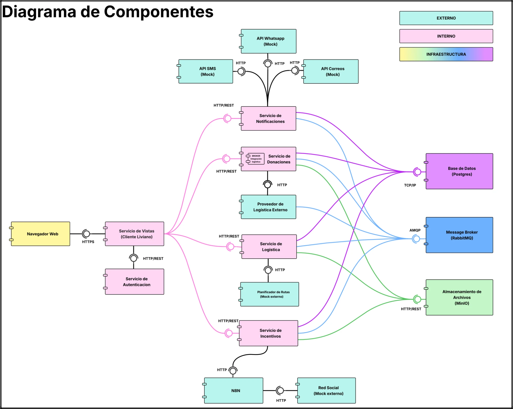
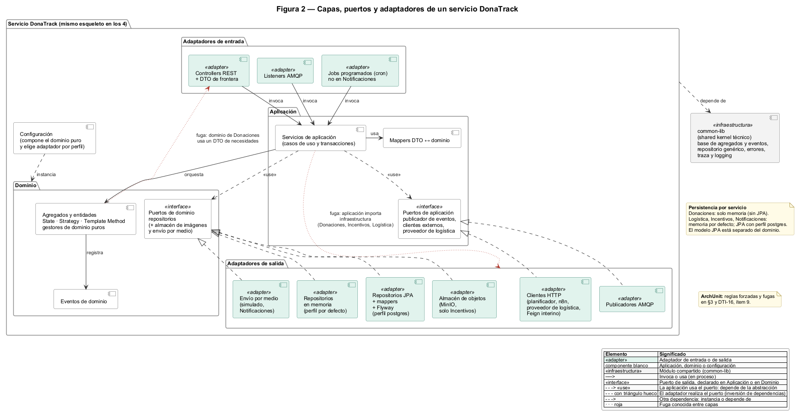
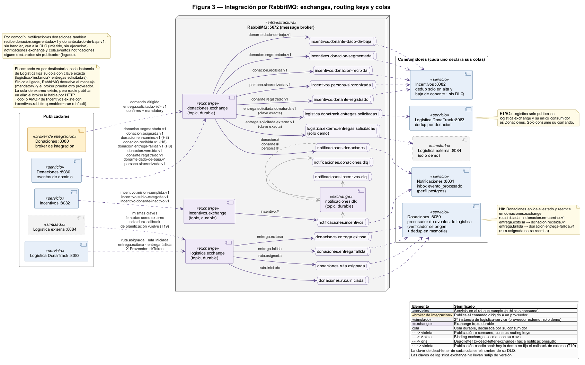
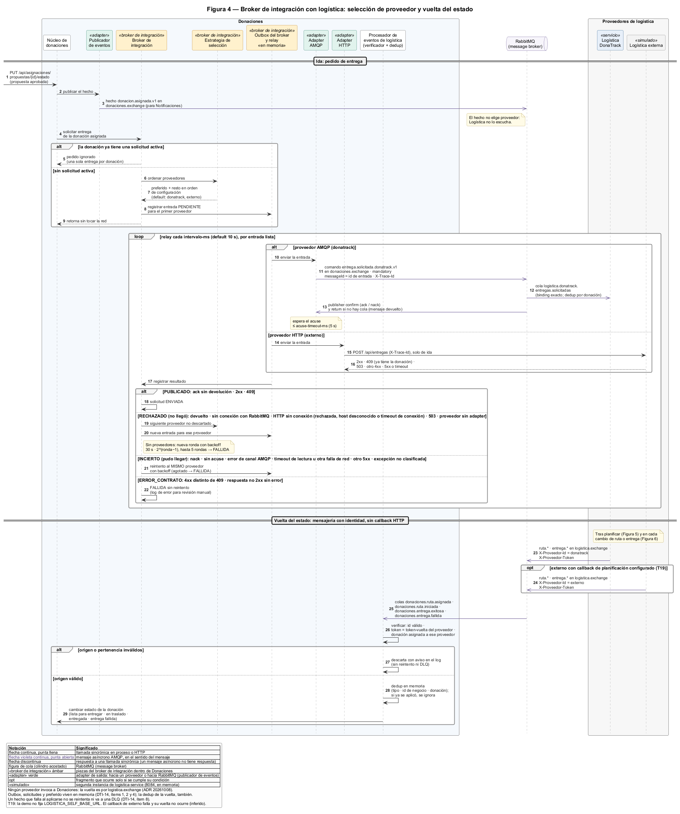
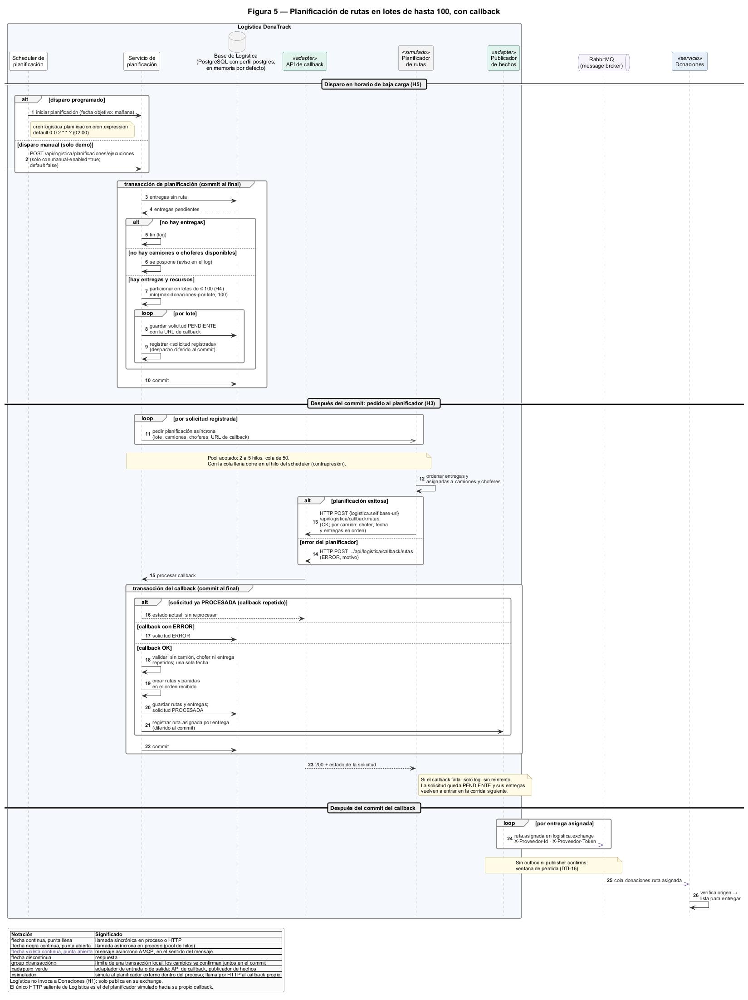
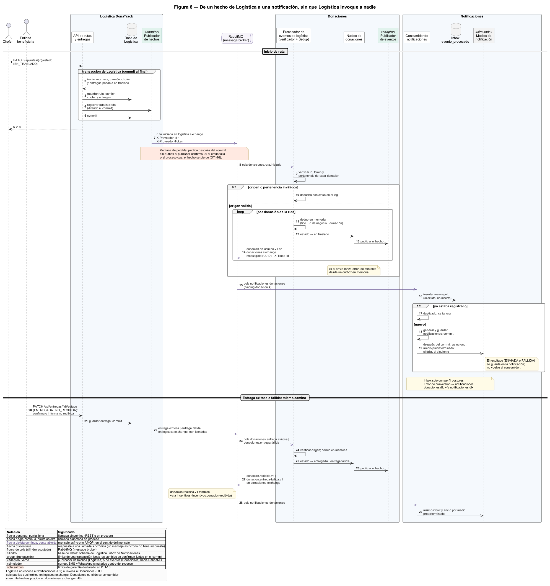
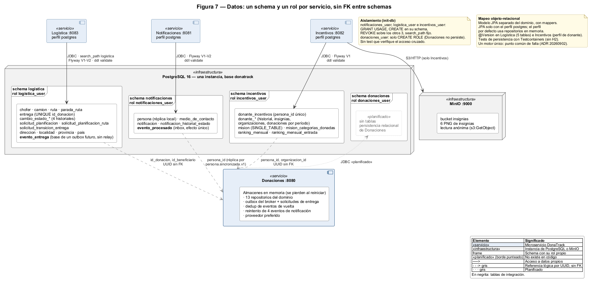
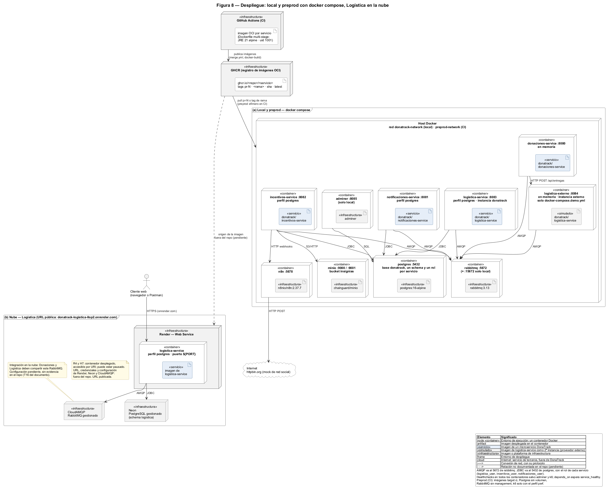

# Arquitectura del sistema DonaTrack — Entrega 4

| Campo | Valor |
|---|---|
| Versión | 1.1 · respaldo técnico verificado del entregable 5 |
| Fecha | 2026-10-09 |
| Baseline | `ENTREGA_4` @ `5cf8563b` (incluye #886, #887 y #889) más el PR #892, que se asume integrado. Ref de verificación local: `baseline/e4-prs` @ `dcd66fe5`. |
| Alcance | Respaldo técnico del entregable 5, que se entrega como informe en [`entregable-5/`](entregable-5/README.md) · entregable 4 (Figura 1, arquitectura objetivo) · entregable 3 (Figuras 2 a 8, ADRs del Anexo E y [`anexo-servicios.md`](anexo-servicios.md)). |
| Cómo leer | §1–§10: vista de sistema. Anexo E: índice de decisiones. Detalle por servicio: [`anexo-servicios.md`](anexo-servicios.md) (entregable 3). |
| Convenciones | El número de figura coincide con el del archivo del diagrama. "Diseño" = decidido pero no está en el código. "Deuda" = desvío declarado en §9. |

---

## 1. Contexto y drivers

### 1.1 Requisitos que gobiernan la arquitectura

| ID | Requisito | Fuente | Sección | Figura | Evidencia en el repo | Estado |
|---|---|---|---|---|---|---|
| R1 | Servicios de dominio → Notificaciones por cola asincrónica | E4 p.24 | §5.2 | 1, 3 | `notificaciones-service/src/main/java/grupo5/notificaciones/infrastructure/amqp/` · `docs/entrega-4/integracion/matriz-productor-consumidor.md` | Cumple. Camino HTTP interino de Incentivos, apagado por defecto (DTI-13) |
| R2 | Broker de integración Donaciones → Logística que elige entre ≥ 2 proveedores | E4 p.24 | §5.3 | 1, 4 | `donaciones-service/src/main/java/grupo5/donaciones/infrastructure/logistica/` · `donatrack.logistica.proveedores` en `donaciones-service/src/main/resources/application.properties` | Cumple |
| R3 | Persistencia relacional con mapeo objeto-relacional | E4 p.24 | §6 | 7 | `*/src/main/resources/db/migration/` · `*/infrastructure/persistencia/` | Parcial: 3 de 4 servicios. Donaciones en memoria (§9, T1) |
| R4 | Logística desplegada y accesible por sus URIs | E4 p.24 | §7 | 8 | `logistica-service/Dockerfile` · ADR D6 · https://donatrack-logistica-0op2.onrender.com | Cumple (verificado: 200 en `/v3/api-docs`, 2026-10-09) |
| R5 | Diagrama de componentes con la integración de E4 | E4 p.24, entregable 4 | §2 | 1 | `docs/arquitectura/diseno/diagrama-de-componentes.png` | Cumple. Muestra la arquitectura objetivo; diferencias con el código en §2 |
| R6 | Documento de arquitectura sin detalle de componentes | E4 p.24, entregable 5 | todo | — | este documento | Cumple |
| R7 | Justificaciones con diagramas complementarios | E4 p.24, entregable 3 | §2–§7 · Anexo E · anexo por servicio | 2–8 | `docs/entrega-4/arquitectura/diagramas/` · `docs/adr/` · `docs/entrega-4/arquitectura/anexo-servicios.md` | Cumple |
| H1 | Logística no invoca a Donaciones ni a Incentivos | E3 p.22, impl. 3 | §5.5 | 3, 6 | `logistica-service/src/main/resources/application.properties` (sin URLs de otros servicios) · `logistica-service/pom.xml` (sin Feign) | Restricción respetada |
| H2 | Logística no se comunica con Notificaciones | E3 p.22, impl. 4 | §5.5 | 3, 6 | ídem H1 · `docs/entrega-4/integracion/matriz-productor-consumidor.md` | Restricción respetada |
| H3 | URL de callback para el planificador externo | E3 p.22, impl. 1 | §5.4 | 1, 5 | `logistica.self.base-url` en `logistica-service/src/main/resources/application.properties` | Cumple, con un planificador simulado dentro de Logística (T19) |
| H4 | Lotes de ≤ 100 donaciones por solicitud | E3 p.22, impl. 2 | §5.4 | 5 | `logistica.planificacion.max-donaciones-por-lote=100` (ídem) | Cumple |
| H5 | Rutas y algoritmos de asignación en horario de baja carga | E2 p.16 · E3 p.22 | §5.4 · Anexo A | 5 | Rutas: `logistica.planificacion.cron.expression` = `0 0 2 * * ?` (ídem) · Asignación: `planificador.algoritmos.cron.expression` = `0 0 0 * * ?` en `donaciones-service/src/main/resources/application.properties` | Cumple |
| H6 | Flujo low-code (n8n) para difundir insignias | E2 p.17 | §5.1 · anexo por servicio (Incentivos) | 1 | `n8n/workflow-insignias.json` · `n8n.webhook.*` en `incentivos-service/src/main/resources/application.properties` | Cumple, red social simulada |
| H7 | Cada servicio en contenedor y desplegado | E3 p.22 | §7 | 8 | 4 `Dockerfile` · `docker-compose.yml`, `.demo.yml`, `.preprod.yml` | Cumple |
| H8 | Notificar inicio de ruta, entrega exitosa y fallida, sin violar H2 | E3 p.22 | §5.5 | 6 | `donaciones-service/src/main/java/grupo5/donaciones/infrastructure/logistica/` · `matriz-productor-consumidor.md` | Cumple, vía Donaciones |

**H1, H2 y H8 como restricciones respetadas.**
- *Invocar* = llamada sincrónica dirigida (HTTP, Feign) o comando AMQP publicado en un exchange o cola de otro servicio.
- Publicar hechos propios en el exchange propio = "dejar disponible la información".

| Restricción | Cómo se respeta | Cómo se verifica |
|---|---|---|
| H1 | Logística publica solo en su `logistica.exchange`. No tiene clientes HTTP hacia otros servicios: su único cliente HTTP es el planificador simulado, que llama al callback de la propia Logística. Consume el comando que le publica Donaciones: eso no es invocar. | Búsqueda de clientes HTTP y de publicaciones en `logistica-service/src/main`. Properties sin URLs ajenas. |
| H2 | Notificaciones no tiene ningún binding sobre `logistica.exchange`. Logística no conoce exchanges, colas ni URLs de Notificaciones. | Bindings declarados por Notificaciones: ninguno sobre `logistica.exchange`; sus colas ligan `donaciones.exchange` e `incentivos.exchange`, más su propio `notificaciones.dlx` y el exchange legado `notificaciones.exchange`, sin publicadores (Figura 3). |
| H8 | Donaciones consume los 4 hechos de Logística, aplica el estado de la donación y reemite `donacion.*` en `donaciones.exchange`. Notificaciones los consume de ahí. | Cadena de la Figura 6 y tabla de §5.5. |

### 1.2 Atributos de calidad priorizados

| # | Atributo | Escenario (estímulo → respuesta medible) | Mecanismo | Sección |
|---|---|---|---|---|
| QA1 | Disponibilidad ante picos y fallas | Notificaciones cae 10 min con tráfico → Donaciones responde sin errores atribuibles; los mensajes esperan en `notificaciones.donaciones` | Publicación asincrónica · cola durable declarada por el consumidor | §5.2 · S1 |
| QA2 | Integridad de la entrega | El proveedor elegido rechaza o no responde → a lo sumo una solicitud activa por donación; el fallo final queda visible | Broker de integración: reenvío solo ante rechazo seguro; reintento al mismo ante resultado incierto | §5.3 · S2 |
| QA3 | Extensibilidad | Sumar un proveedor → AMQP: solo configuración; HTTP: un adapter nuevo. Broker de integración y estrategia sin cambios | Broker + Strategy + Adapter | §5.3 |
| QA4 | Modificabilidad y testeabilidad del dominio | Cambiar la persistencia → solo adaptadores. Reglas probadas sin Spring ni base | Capas con puertos y adaptadores · perfiles memoria / `postgres` | §3 |
| QA5 | Aislamiento de datos | Un servicio intenta leer otro schema → el motor lo rechaza (sin test automatizado: §6) | Rol por servicio · `REVOKE` sobre schemas ajenos · `search_path` | §6 |
| QA6 | Autenticidad de la vuelta | Evento sin identidad válida o sobre una donación ajena → se descarta sin cambiar estado | Id y token por proveedor · pertenencia en el registro de solicitudes | §5.3 |
| QA7 | Observabilidad | Seguir un flujo por `traceId` → posible en HTTP; en AMQP solo de ida | MDC · header `X-Trace-Id` · logs NDJSON | §5.6 · §9 |
| QA8 | Costo de despliegue | Logística accesible por URI y pausable entre defensas | PaaS con contenedor y servicios gestionados | §7 |

---

## 2. Estilo arquitectónico (D1)

**Definición de microservicios usada en este documento**
- Cada servicio de dominio es un proceso desplegable por separado.
- Es dueño de su modelo y de su schema.
- Se comunica con los demás solo por contratos de red: REST o mensajes AMQP.
- No se usa el término "SOA".

| Pieza | Responsabilidad | Puerto | Estado |
|---|---|---|---|
| Donaciones | Personas, donantes, entidades, donaciones, necesidades, asignación. Contiene el broker de integración con logística y, fuera de él, el procesador de eventos de logística (la vuelta) | 8080 | Implementado. Persistencia en memoria |
| Notificaciones | Avisos a personas por correo, SMS o WhatsApp | 8081 | Implementado. Medios de notificación simulados, dentro del proceso |
| Incentivos | Misiones, categorías, insignias, ranking, inactividad | 8082 | Implementado |
| Logística DonaTrack | Camiones, choferes, entregas, rutas, planificación. Proveedor `donatrack` | 8083 | Implementado. Planificador de rutas simulado, dentro del proceso |
| Logística externa | Segunda instancia de la misma imagen. Proveedor `externo` | 8084 | Simulado (solo demo) |
| Cliente Liviano | Interfaz web | — | Planificado E5 (módulo vacío) |
| Autenticación | Usuarios, roles, tokens | — | Planificado E6 (módulo vacío) |
| common-lib | Shared kernel técnico: errores, trazabilidad, repositorio genérico | — | Implementado. Biblioteca, no se despliega |
| Infraestructura | RabbitMQ (message broker) · PostgreSQL 16 · MinIO (solo Incentivos) · n8n | — | Implementado |

Responde: ¿Qué componentes tendrá el sistema, qué interfaces proveen y requieren, y por qué canal se conectan?

**La Figura 1 es el diagrama deseado (objetivo), no el estado actual.** Diferencias con el código de `ENTREGA_4`:

| En la Figura 1 (objetivo) | Estado actual | Deuda |
|---|---|---|
| Donaciones persiste en PostgreSQL | Donaciones trabaja en memoria: sin JPA ni datasource | T1 |
| Donaciones y Logística usan MinIO | Solo Incentivos usa MinIO (imágenes de insignias) | — |
| Notificaciones llama por HTTP a las APIs de WhatsApp, SMS y correo | Adaptadores simulados dentro del proceso, sin cliente HTTP | — |

### D1 — Estilo interno y capas de cada servicio

**Problema.** ¿Cómo se parte el sistema y cómo se organiza cada parte, para que el dominio se pruebe sin infraestructura y cada servicio cambie y falle por separado?

**Drivers.** QA4 (testeabilidad del dominio) · despliegue y fallas independientes (R1, R4) · costo y curva de aprendizaje de un equipo de cursada.

Escala de todas las matrices: 1 (malo) a 5 (muy bueno). Total = Σ(peso × puntaje) / 5, sobre 100.
Los puntajes son juicio del grupo, no una medición.

| Criterio (peso) | **A. Microservicios + capas con puertos y adaptadores** | B. Microservicios + capas clásicas (entidades JPA en el dominio) | C. Microservicios + hexagonal estricta (módulo por capa, puertos de entrada, sin framework en dominio ni aplicación) | D. Monolito modular (un desplegable, módulos por contexto) |
|---|---|---|---|---|
| Pureza y testeabilidad del dominio (30) | 4 | 2 | 5 | 4 |
| Costo de desarrollo y curva (25) | 4 | 5 | 1 | 4 |
| Despliegue y fallas independientes (25) | 5 | 5 | 5 | 1 |
| Reglas verificables automáticamente (10) | 3 | 3 | 5 | 3 |
| Costo operativo (10) | 2 | 2 | 2 | 5 |
| **Total** | **79** | 72 | 74 | 65 |

- B pierde en pureza del dominio: el mapeo relacional condiciona las clases de negocio.
- C pierde en costo y curva: un módulo por capa en 4 servicios y puertos de entrada para cada caso de uso.
- D pierde en despliegue independiente: E4 pide desplegar Logística sola y una cola entre servicios.

**Decisión.** A.
- Microservicios por contexto.
- Dentro de cada uno: el dominio declara puertos; la infraestructura los implementa; la aplicación orquesta.

**Consecuencias negativas asumidas**
- Más piezas para operar (4 servicios, RabbitMQ, PostgreSQL) y consistencia eventual entre servicios.
- Mapeos en cada borde (DTO ↔ dominio ↔ persistencia): más código.
- Variante pragmática: la aplicación usa Spring, declara sus propios puertos de salida (publicación, broker de integración, clientes externos) y no hay puertos de entrada formales.
- Las reglas de capas están automatizadas solo en parte y hay fugas conocidas (§3, DTI-16).

**ADR:** [`20261009-estilo-de-microservicios-con-capas-y-puertos-y-adaptadores`](../../adr/20261009-estilo-de-microservicios-con-capas-y-puertos-y-adaptadores.md) (`proposed`).

---

## 3. Capas e inversión de dependencias (D1)

Responde: ¿Cómo se organiza cada servicio por dentro y qué reglas lo protegen?

| Capa | Responsabilidad | Puede depender de | Paquetes típicos |
|---|---|---|---|
| Adaptadores de entrada | HTTP, listeners AMQP, procesos programados. Validan formato y delegan | Aplicación, DTO de frontera | `controllers/`, `infrastructure/` (listeners), `schedulers/` |
| Aplicación | Casos de uso, transacciones, publicación de eventos. Declara los puertos de publicación, del broker de integración y de clientes externos | Dominio y sus puertos | `services/` |
| Dominio | Agregados, reglas, algoritmos. Declara los puertos de repositorio y otros propios (`models/ports`, `models/storage`) | common-lib (eventos y repositorio genérico) | `models/` |
| Adaptadores de salida | Persistencia en memoria o JPA, AMQP, HTTP, MinIO, n8n | Dominio y aplicación (implementan sus puertos) | `infrastructure/`, `models/repositories/impl/` |

- Composición: las clases de dominio puras no llevan anotaciones de framework; se arman en las clases de configuración de cada servicio (`config/`).
- Excepción: Notificaciones no compone así; su gestor está en la capa de aplicación (`services/`) y anotado como componente.
- Selección de adaptador de persistencia: perfil `postgres` → JPA; perfil por defecto → memoria. Donaciones solo tiene memoria.

**Reglas y cómo se fuerzan (fitness functions con ArchUnit).**
Las reglas de capas están parcialmente automatizadas.

| Regla | Mecanismo | Donaciones | Incentivos | Logística | Notificaciones |
|---|---|---|---|---|---|
| Dominio no depende de controllers ni de infraestructura | ArchUnit (solo `models.entities`) | Sí | Sí | Sí | Sí |
| Dominio no depende de DTOs | ArchUnit (solo `models.entities`) | No: su dominio de necesidades usa un DTO (fuga conocida) | Sí | Sí | Sí |
| Dominio sin JPA | ArchUnit (solo `models.entities`) | No aplica (sin JPA) | Sin regla; 0 usos observados | Sí | Sin regla; 0 usos observados |
| Controllers en su paquete y sin repositorios | ArchUnit | Sí | Sí | Sí | Sí |
| Tests unitarios sin contexto de Spring | ArchUnit | Sí | Sí | Sí | Sí |
| Aplicación no depende de infraestructura | Sin regla | Fugas conocidas (DTI-02 · DTI-16, ítem 9) | Fuga: puertos de salida ubicados en `infrastructure/` | Fuga conocida en un mapper | Sin fugas observadas |
| common-lib no depende de los servicios | ArchUnit en common-lib | — | — | — | — |

- Las reglas faltantes respecto del ADR 20260906 se declaran en DTI-16.
- Las reglas de dominio solo inspeccionan `models.entities`. Algoritmos, normalización, segmentación y puertos del dominio quedan fuera: hoy sin fugas observadas (DTI-16, ítem 9).
- Evidencia: `*/src/test/java/grupo5/*/architecture/` · `common-lib/src/test/java/grupo5/common/architecture/`.

---

## 4. Patrones de diseño

Cada patrón responde a un driver. Ubicación a nivel servicio o módulo.

| Patrón | Problema | Driver | Dónde | Costo asumido |
|---|---|---|---|---|
| State | Transiciones ilegales en ciclos de vida | Integridad del dominio | Donaciones (estado como objeto, 7 estados) · Logística y Notificaciones (enum con transiciones) | Una clase o caso por estado |
| Strategy | Algoritmos que varían: asignación, normalización, inactividad, orden de paradas, lotes, selección de proveedor | Extensibilidad (QA3) | Donaciones, Incentivos, Logística | Una abstracción más por variante |
| Template Method | Esqueleto común con pasos variables: matching, segmentación, misiones | Evitar duplicación | Donaciones, Incentivos, simuladores de Notificaciones | Herencia: un cambio en la base alcanza a todas |
| Factory | Construcción de misiones estándar y de personas | Encapsular creación | Incentivos, Donaciones | Indirección |
| Eventos de dominio (Observer) | Efectos secundarios acoplados al agregado | Modificabilidad | Todos (base en common-lib) | Orden y errores de los oyentes menos visibles |
| Repository + Data Mapper | Dominio atado a la persistencia | QA4 · R3 | Todos; JPA en Logística, Incentivos y Notificaciones | Doble modelo y mappers |
| Gestores de dominio puros | Reglas entre varios agregados sin framework | Testeabilidad | Logística, Incentivos, Donaciones | Más clases en el dominio |
| Adapter + Router (double dispatch) | Medios de notificación intercambiables | Extensibilidad | Notificaciones | — |
| Shared kernel técnico | Errores, traza y repositorio genérico repetidos | Consistencia entre servicios | common-lib | Un cambio de contrato exige compilar todo el reactor |
| Publish/Subscribe, exchange por emisor | Productor acoplado a consumidores | R1 · QA1 | Todos | Consistencia eventual |
| Broker de integración + Adapter + Message Translator | Elegir entre proveedores con transportes distintos | R2 · QA3 | Donaciones | Una capa más de indirección |
| Command Message dirigido por routing key | Un hecho público no elige destinatario | QA2 | Donaciones → proveedor elegido | Un mensaje más en el catálogo |
| Transactional Outbox (interino, en memoria) | Pedido al proveedor perdido si falla la red | QA2 | Broker de integración | Sin durabilidad (DTI-14) |
| Transactional Inbox / Idempotent Consumer | Mensajes duplicados | Integridad | Notificaciones (persistente) · Logística (por donación) · Donaciones (en memoria) | Tabla o registro extra |
| Dead Letter Channel | Mensajes que no se pueden procesar | QA1 | Notificaciones | Revisión manual de la DLQ |
| Lotes asíncronos con callback | Cálculo de rutas costoso y limitado a 100 | H3 · H4 | Logística | Estado intermedio "pendiente" |

**No adoptados, por falta de driver:** CQRS, event sourcing, API gateway, service mesh.

---

## 5. Integración

### 5.1 Mapa sincrónico y asincrónico

| Interacción | Canal | Por qué |
|---|---|---|
| Clientes → cada servicio | REST, documentado con OpenAPI | Respuesta inmediata con validación |
| Donaciones → Notificaciones e Incentivos | AMQP pub `donaciones.exchange` | R1. Sumar un consumidor no toca al productor |
| Incentivos → Notificaciones | AMQP pub `incentivos.exchange` | R1 |
| Donaciones → Logística DonaTrack | AMQP pub `donaciones.exchange` (`entrega.solicitada.<proveedorId>.v1`) | El broker de integración elige el destinatario |
| Donaciones → Logística externa | HTTP `POST /api/entregas`, solo de ida | Proveedor que habla HTTP |
| Todo proveedor → Donaciones | AMQP pub `logistica.exchange`, con identidad | H1: la vuelta no invoca a Donaciones |
| Planificador simulado de Logística → callback de Logística | Invocación asíncrona en proceso; después, HTTP POST síncrono al callback propio. El planificador es un subcomponente simulado de Logística | H3 |
| Incentivos → n8n | HTTP webhook, sin esperar respuesta | H6. Efecto secundario |
| Incentivos → MinIO | S3/HTTP | Imágenes de insignias |
| Incentivos → Notificaciones (interino) | REST (Feign), solo con `incentivos.rabbitmq.enabled=false` | DTI-13. Por defecto `true`: apagado |
| Administración → Donaciones | REST con `X-API-Key` (`/api/logistica/proveedores`, `/api/logistica/proveedor-preferido`) | Cambiar el proveedor preferido en caliente |

- Todo mensaje AMQP es asíncrono: el publicador no espera respuesta del consumidor.

### 5.2 Cola hacia Notificaciones (D2)

Detalle legible por flujo, verificado contra el código: [`diagramas/rabbit/`](diagramas/rabbit/README.md) (4 diagramas).

Responde: ¿Quién publica qué, en qué exchange, y quién lo consume?

| Exchange (dueño) | Routing keys | Cola (la declara el consumidor) | Consumidor | DLQ |
|---|---|---|---|---|
| `donaciones.exchange` (Donaciones) | `donacion.#` · `donante.#` · `persona.#` | `notificaciones.donaciones` | Notificaciones | `notificaciones.donaciones.dlq` vía `notificaciones.dlx` |
| `donaciones.exchange` | `donante.registrado.v1` · `donante.dado-de-baja.v1` · `donacion.segmentada.v1` · `donacion.recibida.v1` · `persona.sincronizada.v1` | una por clave: `incentivos.donante-registrado`, `incentivos.donante-dado-de-baja`, `incentivos.donacion-segmentada`, `incentivos.donacion-recibida`, `incentivos.persona-sincronizada` | Incentivos | No |
| `donaciones.exchange` | `entrega.solicitada.<proveedorId>.v1` (comando, binding exacto) | `logistica.<instancia>.entregas.solicitadas` | Logística (cada instancia) | No |
| `incentivos.exchange` (Incentivos) | `incentivo.#` | `notificaciones.incentivos` | Notificaciones | `notificaciones.incentivos.dlq` vía `notificaciones.dlx` |
| `logistica.exchange` (todo proveedor) | `ruta.asignada` · `ruta.iniciada` · `entrega.exitosa` · `entrega.fallida` | `donaciones.ruta.asignada`, `donaciones.ruta.iniciada`, `donaciones.entrega.exitosa`, `donaciones.entrega.fallida` | Donaciones | No |
| `notificaciones.exchange` | legado, sin publicadores | `cola.eventos.notificaciones` | Notificaciones | No |

- Exchanges topic y colas durables. Sin TTL.
- El tipo de cada mensaje viaja como alias corto, no como nombre de clase: la routing key en los hechos; `entrega.solicitada.v1` en el comando.
- Los comodines de Notificaciones también reciben `donacion.segmentada.v1` y `donante.dado-de-baja.v1`, que no procesa: terminan en su DLQ (inferido, T18).
- Contratos: `docs/arquitectura/eventos-amqp.md` · `docs/entrega-4/integracion/catalogo-mensajes.md`.

**Problema.** R1: Notificaciones no debe afectar la disponibilidad de los servicios de dominio ante picos o fallas transitorias.

**Drivers.** QA1 · desacople productor–consumidor · costo operativo · stack existente (RabbitMQ ya adoptado por Logística, ADR `logistica-service/20260703-uso-de-rabbitmq-para-la-comunicacin-entre-logstica-y-los-dems-servicios`, `accepted`).

| Criterio (peso) | **A. RabbitMQ: exchange por emisor, cola por consumidor, DLX** | B. Kafka (log particionado) | C. REST síncrono (Feign) con reintentos | D. Exchange único de Notificaciones con mensaje polimórfico | E. Outbox + polling HTTP, sin message broker |
|---|---|---|---|---|---|
| Disponibilidad ante picos y fallas (35) | 4 | 5 | 1 | 4 | 4 |
| Desacople productor–consumidor (20) | 5 | 5 | 1 | 2 | 2 |
| Costo operativo y curva (25) | 4 | 1 | 5 | 4 | 3 |
| Ruteo por clave y DLQ nativos (10) | 5 | 2 | 1 | 3 | 1 |
| Ya está en el stack (10) | 5 | 1 | 4 | 5 | 2 |
| **Total** | **88** | 66 | 46 | 72 | 57 |

- B pierde en costo operativo: clúster, particiones y retención, sin necesidad de replay.
- C pierde en disponibilidad: un consumidor caído hace fallar o demora al productor.
- D pierde en desacople: todos los productores dependen de un formato de Notificaciones (ADR 20260911, opción 2).
- E pierde en desacople y costo: cada consumidor conoce a cada productor, y Donaciones no tiene base.

**Decisión.** A.

**Consecuencias negativas asumidas**
- Consistencia eventual: el aviso llega después de la operación.
- Más infraestructura: exchanges, colas, DLX y DLQ.
- Garantías desparejas entre publicadores (§5.6).
- Las pruebas de punta a punta son asíncronas.

**ADR:** [`20260911-topologia-pubsub-amqp-y-desacoplamiento-notificaciones`](../../adr/20260911-topologia-pubsub-amqp-y-desacoplamiento-notificaciones.md) (`proposed`). Reemplaza al ADR de comunicación asimétrica (`superseded`).

### 5.3 Broker de integración con logística (D3) y vuelta con identidad (D4)

Responde: ¿Cómo elige proveedor el broker de integración y cómo vuelve el estado?

La vuelta de la instancia `externo` va en un fragmento `opt` de la Figura 4: depende de su callback de planificación, hoy no configurado en la demo (§9, T19).

**Patrones del broker de integración (dentro de Donaciones).** Detalle: Figura 4 y [ADR 20261007](../../adr/20261007-broker-de-integracion-con-logistica.md).
- **Broker de integración:** un único punto recibe el pedido de entrega de cada donación asignada.
- **Strategy:** ordena los proveedores. Preferido configurable y cambiable en caliente; el resto, en orden.
- **Transactional Outbox, en memoria:** con el proveedor ya elegido, el pedido se registra antes de tocar la red. Un relay periódico lo envía, con backoff.
- **Adapter + Message Translator:** un adapter por transporte. AMQP publica con `mandatory` y espera el acuse; HTTP traduce al contrato del proveedor.
- Una solicitud activa por donación (chequeo no atómico: DTI-14, ítem 2). La vuelta se acepta solo con id, token y pertenencia válidos (D4).

| Proveedor | Ida | Vuelta | Estado |
|---|---|---|---|
| `donatrack` | AMQP comando `entrega.solicitada.donatrack.v1` | `logistica.exchange`, firmado | Implementado (Logística DonaTrack, 8083) |
| `externo` | HTTP `POST /api/entregas` | `logistica.exchange`, firmado | Simulado: segunda instancia de la misma imagen (8084), en memoria. Su callback de planificación apunta al 8083 (T19) |
| `otra` | AMQP sin instancia levantada | — | Solo demo: muestra el reenvío ante mensaje devuelto |

**Política de resultados (ida)**

| Resultado | Señal AMQP | Señal HTTP | Acción del broker de integración |
|---|---|---|---|
| Publicado | Acuse sin devolución | 2xx o 409 | Solicitud enviada |
| Rechazado (seguro que no llegó) | Mensaje devuelto · sin conexión | Conexión rechazada · host desconocido · timeout de conexión · 503 · proveedor sin adapter | Siguiente proveedor. Si no quedan, nueva ronda con backoff hasta 5 rondas → fallida |
| Incierto (pudo haber llegado) | Nack · sin acuse a tiempo · otro error AMQP | Timeout de lectura · otros 5xx | Reintento al mismo proveedor con backoff. Agotado → fallida |
| Error de contrato | — | 4xx distinto de 409 | Sin reintento ni reenvío → fallida |

- Una solicitud fallida deja un log de error para revisión manual. No genera evento ni notificación.
- Configuración: `donatrack.logistica.*` en `donaciones-service/src/main/resources/application.properties` · `docker-compose.demo.yml`.

#### D3 — Broker de integración y criterio de selección

**Problema.** R2: elegir entre ≥ 2 proveedores de logística. Un exchange topic copia el hecho `donacion.asignada.v1` a todos los interesados: no elige.

**Drivers.** QA3 (sumar un proveedor) · QA2 (una sola entrega por donación) · sin punto único de falla nuevo · testeabilidad.

| Criterio (peso) | **A. Broker de integración en proceso, dentro de Donaciones (Strategy + Adapter + outbox)** | B. Microservicio separado para el broker de integración | C. ESB o gateway de integración (Apache Camel, Spring Integration) | D. Campo de ruteo en el hecho + filtro en cada proveedor | E. Condicional por proveedor en el servicio de aplicación |
|---|---|---|---|---|---|
| Extensibilidad: sumar un proveedor (30) | 5 | 5 | 4 | 2 | 1 |
| Una sola entrega por donación (25) | 4 | 4 | 4 | 2 | 4 |
| Sin punto único de falla ni salto de red nuevos (20) | 5 | 2 | 4 | 5 | 5 |
| Testeable sin infraestructura (15) | 5 | 3 | 3 | 4 | 4 |
| Costo y curva (10) | 4 | 3 | 1 | 5 | 5 |
| **Total** | **93** | 73 | 71 | 64 | 68 |

- B pierde en punto único de falla: suma un contenedor y un salto de red sin beneficio funcional.
- C pierde en costo y curva: un framework de rutas nuevo para dos proveedores.
- D pierde en extensibilidad e integridad: ensucia un hecho que escucha Notificaciones y cada proveedor debe filtrar.
- E pierde en extensibilidad: cada proveedor nuevo modifica la orquestación de negocio.

**Decisión.** A, con "los eventos se rutean por hecho; los comandos, por destinatario".

**Consecuencias negativas asumidas**
- Un resultado incierto no se reenvía: puede terminar en fallida y requerir revisión manual.
- Outbox, solicitudes y preferido viven en memoria: un reinicio los pierde (DTI-14, ítems 1, 2 y 4).
- El contrato HTTP del proveedor `externo` es el de nuestra Logística, no el de un tercero real.
- Una traducción por cada proveedor HTTP.

**ADR:** [`20261007-broker-de-integracion-con-logistica`](../../adr/20261007-broker-de-integracion-con-logistica.md) (`proposed`).

#### D4 — Vuelta de los proveedores hacia Donaciones

**Problema.** El estado de la entrega tiene que volver a Donaciones sin que el proveedor la invoque (H1), y Donaciones debe saber quién lo envía.

**Drivers.** H1 · aviso oportuno para H8 · autenticidad del origen (QA6) · costo.

| Criterio (peso) | **A. Mensajería en `logistica.exchange` con id y token del proveedor** | B. Callback HTTP a Donaciones (se implementó y se quitó) | C. Polling de Donaciones al proveedor |
|---|---|---|---|
| Cumple H1: el proveedor no invoca a Donaciones (35) | 5 | 1 | 5 |
| Aviso oportuno y un solo camino de vuelta (20) | 5 | 3 | 2 |
| Autenticidad del origen (15) | 3 | 4 | 4 |
| Integrable por un tercero que solo habla HTTP (10) | 1 | 5 | 5 |
| Costo de implementación (20) | 4 | 4 | 2 |
| **Total** | **82** | 57 | 73 |

- B pierde en H1: un proveedor de logística invocaría a Donaciones.
- C pierde en oportunidad y costo: consulta por adapter, traductor de estados y planificador. Queda como evolución para un tercero solo-HTTP.

**Decisión.** A.
- Headers `X-Proveedor-Id` y `X-Proveedor-Token`.
- Donaciones verifica token y pertenencia; ante cualquier falla descarta con un aviso en el log.
- HTTP queda solo de ida.

**Consecuencias negativas asumidas**
- Un proveedor que solo hable HTTP no puede devolver estado sin la evolución por polling.
- El token viaja en el mensaje, sin rotación ni firma (DTI-14, ítems 5 y 7).
- Un evento descartado o que falla al aplicarse no se reintenta ni va a una DLQ (DTI-14, ítem 8).

**ADR:** [`20261008-vuelta-de-proveedores-de-logistica-por-mensajeria-con-identidad`](../../adr/20261008-vuelta-de-proveedores-de-logistica-por-mensajeria-con-identidad.md) (`proposed`).

### 5.4 Planificación de rutas (H3, H4, H5)

Responde: ¿Cómo se planifican las rutas en lotes y con callback?

| Aspecto | Diseño | Requisito |
|---|---|---|
| Disparo | Cron diario a las 02:00 (configurable). Disparo manual solo con un flag de demo, apagado por defecto | H5 |
| Lotes | Hasta 100 entregas por solicitud: configurable, con tope de dominio en 100 | H4 |
| Pedido | Sale después del commit de la solicitud, en un pool acotado. Con la cola llena, ejecuta el hilo del scheduler (contrapresión) | ADR del pedido después del commit |
| Callback | `POST /api/logistica/callback/rutas`, URL propia configurada | H3 |
| Callback repetido | Una solicitud ya procesada devuelve su estado sin reprocesar | Integridad |
| Resultado | Persiste rutas y entregas, y publica `ruta.asignada` por entrega | H1 |
| Planificador | Subcomponente simulado dentro de Logística. Llama por HTTP al callback propio, en `logistica.self.base-url` (T19) | `<<simulado>>` |

- Límite: si el callback falla, solo queda un log, sin reintento.
- La solicitud queda pendiente y sus entregas vuelven a entrar en la corrida siguiente.
- ADRs: `logistica-service/20260901-planificacion-de-rutas-asincrona-por-lotes-y-callback-rest` · `logistica-service/20261007-pedido-al-planificador-despues-del-commit`.

### 5.5 Hechos de logística hacia notificaciones (H1, H2, H8)

Responde: ¿Cómo llega un hecho de Logística a una notificación sin que Logística invoque a nadie?

| Hecho en `logistica.exchange` | Estado que aplica Donaciones | Reemisión en `donaciones.exchange` | Consumidores |
|---|---|---|---|
| `ruta.asignada` | Lista para entregar | — | — |
| `ruta.iniciada` | En traslado | `donacion.en-camino.v1` | Notificaciones |
| `entrega.exitosa` | Entregada | `donacion.recibida.v1` | Notificaciones · Incentivos |
| `entrega.fallida` | Entrega fallida | `donacion.entrega-fallida.v1` | Notificaciones |

- La entidad beneficiaria confirma la recepción o informa que no la recibió (E3 p.21). Logística registra el resultado y publica `entrega.exitosa` o `entrega.fallida`.
- Logística publica después del commit de su transacción (sin outbox: DTI-16).
- Donaciones recibe la vuelta en su procesador de eventos de logística: primero verifica el origen y después deduplica por tipo, id de negocio y donación (en memoria).
- Logística solo publica en su exchange; consume su comando desde su cola, ligada a `donaciones.exchange`.
- Donaciones es el único consumidor de `logistica.exchange`.

### 5.6 Garantías de mensajería por servicio

| Flujo | Outbox | Dedup / inbox | Confirms + `mandatory` | DLQ | `messageId` | Traza AMQP |
|---|---|---|---|---|---|---|
| Donaciones — comando del broker de integración | Sí, en memoria (DTI-14) | Lo hace el proveedor, por donación | Sí | No aplica | Estable por entrada del outbox | Envía |
| Donaciones — hechos de dominio | Parcial: 4 hechos reintentan en memoria si falla el envío | — | No: confirms activos en la conexión, sin espera | — | UUID por publicación | Envía |
| Donaciones — consumo de la vuelta | — | Sí, en memoria | — | No (DTI-14, ítem 8) | — | No la restaura |
| Logística — publicación | No: después del commit (DTI-16) | — | No | — | No | No envía |
| Logística — consumo del comando | — | Sí, por donación: clave única y 409 | — | No | — | No la restaura |
| Incentivos — publicación | No: asíncrona; un error solo deja un aviso | — | No | — | No (DTI-16) | No envía |
| Incentivos — consumo | — | Solo alta y baja de donante, idempotentes por id; donaciones no (DTI-16) | — | No: rechazo sin requeue = descarte (DTI-16) | — | No la restaura |
| Notificaciones — consumo | — | Inbox `evento_procesado`, perfil `postgres` | — | Sí, `notificaciones.dlx` | Lo usa; si falta, id de negocio (DTI-16) | No la restaura |

- Ningún flujo ofrece entrega exactamente una vez de punta a punta.
- Lo más fuerte: el comando del broker de integración (confirms, `mandatory` y outbox) y el inbox persistente de Notificaciones.

---

## 6. Datos y persistencia (D5)

Responde: ¿Cómo se aíslan los datos de cada servicio?

| Aspecto | Donaciones | Logística | Incentivos | Notificaciones |
|---|---|---|---|---|
| Motor | Memoria, sin JPA | PostgreSQL 16, perfil `postgres` | PostgreSQL 16, perfil `postgres` | PostgreSQL 16, perfil `postgres` |
| Perfil por defecto | Memoria | Memoria | Memoria | Memoria |
| Schema / rol | `donaciones` / `donaciones_user` (rol sin permisos: no persiste) | `logistica` / `logistica_user` | `incentivos` / `incentivos_user` | `notificaciones` / `notificaciones_user` |
| Modelo de persistencia | — | Separado, con mappers | Separado, con mappers | Separado, con mappers |
| Migraciones | — | Flyway V1–V2 | Flyway V1 | Flyway V1–V2 |
| Validación del esquema | — | `ddl-auto=validate` | `ddl-auto=validate` | `ddl-auto=validate` |
| Herencia | — | Sin herencia; enums nativos de PostgreSQL | SINGLE_TABLE (misiones) | SINGLE_TABLE (medios de contacto) |
| Concurrencia | — | Bloqueo optimista (columna `version`) | Bloqueo optimista en el perfil de donante, con reintento ante conflicto | — |
| Tablas de integración | Outbox, solicitudes y dedup en memoria | `evento_entrega` (base de un outbox futuro, sin relay) · `UNIQUE (id_donacion)` | — | Inbox `evento_procesado` |
| Referencias a otros servicios | — | UUID sin clave foránea | UUID sin clave foránea | UUID sin clave foránea |
| Objetos binarios | — | Solo la URL de la foto | MinIO, bucket `insignias` | — |

- Una sola instancia PostgreSQL 16 con una base `donatrack`.
- Cada servicio se conecta con su rol y su `currentSchema`. Flyway corre por servicio sobre su schema.
- Tests de persistencia contra PostgreSQL 16 real con Testcontainers. No se usa H2.
- Evidencia: `persistencia/init-db/01-init-schemas-roles.sql` · `docker-compose.yml` · `*/src/main/resources/application-postgres.properties`.

**Problema.** R3 pide persistencia relacional con ORM. Hay que decidir la topología física y dónde vive el mapeo, sin romper el ownership de datos ni la pureza del dominio.

**Drivers.** QA5 (aislamiento) · QA4 (pureza del dominio) · costo operativo · compatibilidad con Testcontainers y CI.

**D5a — Topología**

| Criterio (peso) | **A. Una instancia, schema y rol por servicio** | B. Una instancia (base) por servicio | C. Schema único compartido, aislamiento por convención |
|---|---|---|---|
| Aislamiento forzado por el motor (35) | 4 | 5 | 1 |
| Costo operativo y huella (25) | 5 | 2 | 5 |
| Compatible con Testcontainers y CI (15) | 5 | 4 | 5 |
| Falla y escala independientes (15) | 2 | 5 | 2 |
| Migraciones por servicio (10) | 5 | 5 | 2 |
| **Total** | **84** | 82 | 57 |

- B pierde en costo: cuatro motores que operar, más memoria y un CI más lento.
- C pierde en aislamiento: un JOIN mal escrito toca tablas ajenas sin que el motor lo impida.

**D5b — Mapeo objeto-relacional**

| Criterio (peso) | **A. Modelo de persistencia separado + mappers** | B. Anotaciones JPA en las clases del dominio | C. Mapeo externo en XML (`orm.xml`) sobre las clases del dominio |
|---|---|---|---|
| Pureza del dominio (35) | 5 | 1 | 4 |
| Costo: código de mapeo (25) | 2 | 5 | 3 |
| Control del esquema con Flyway y `validate` (15) | 5 | 5 | 5 |
| Verificable con ArchUnit (15) | 5 | 1 | 3 |
| Libertad del modelo: constructores, inmutabilidad (10) | 5 | 2 | 2 |
| **Total** | **85** | 54 | 71 |

- B pierde en pureza: el dominio importa JPA y queda condicionado por el ORM.
- C pierde en verificabilidad y libertad del modelo: el ORM sigue imponiendo la forma de las clases.

**Decisión.** D5a = A. D5b = A.

**Consecuencias negativas asumidas**
- Donaciones no persiste en E4: R3 se cumple en 3 de 4 servicios (§9, T1).
- Una instancia PostgreSQL es un punto común de falla.
- Doble modelo y mappers en cada servicio persistido.
- El modelo separado exige constructores o métodos de reconstitución en el dominio (Logística, Incentivos).
- SINGLE_TABLE deja columnas nulas por subtipo.
- No hay un test que pruebe el rechazo de acceso cruzado entre schemas.

**ADRs** (todos `proposed`):
- [`20260902-arquitectura-de-persistencia-multi-schema-y-aislamiento-de-roles-en-postgresql`](../../adr/20260902-arquitectura-de-persistencia-multi-schema-y-aislamiento-de-roles-en-postgresql.md)
- ADRs de mapeo ORM por servicio (Anexo E)
- [`20260901-estrategia-de-testing-de-persistencia-con-testcontainers-frente-a-h2`](../../adr/20260901-estrategia-de-testing-de-persistencia-con-testcontainers-frente-a-h2.md)

---

## 7. Despliegue (D6)

Responde: ¿Dónde corre cada pieza, local y en la nube?

| Entorno | Qué corre | Cómo | Estado |
|---|---|---|---|
| Local | 4 servicios, RabbitMQ, PostgreSQL, MinIO, n8n, adminer | `docker-compose.yml` | Implementado |
| Demo del broker de integración | Lo anterior más Logística externa (8084, en memoria) | `docker-compose.demo.yml`. Tokens y clave de administración por variable obligatoria | Implementado |
| Preprod efímero | Lo mismo, con imágenes publicadas por CI y PostgreSQL sin volumen | `docker-compose.preprod.yml`, dentro del runner de GitHub Actions | Implementado |
| Nube, solo Logística | Logística en Render · PostgreSQL en Neon · RabbitMQ en CloudAMQP | Plataforma elegida. Configuración y credenciales fuera del repo | **URL: https://donatrack-logistica-0op2.onrender.com** |

- **URL pública de Logística: https://donatrack-logistica-0op2.onrender.com** (Swagger UI en `/swagger-ui/index.html`). El cliente llega a Logística en Render por HTTPS. En el plan gratuito la instancia se suspende sin tráfico: la primera respuesta tardó más de 60 s y las siguientes, menos de 1 s (medido el 2026-10-09).
- Integración en la nube: Donaciones y Logística deben compartir el RabbitMQ de CloudAMQP. Configuración pendiente, sin evidencia en el repo (T16).
- El callback de planificación usa `http://localhost:8083` por defecto. Si la plataforma asigna otro `PORT`, hay que fijar `LOGISTICA_SELF_BASE_URL` (T19).
- Imagen: multi-stage (Maven → JRE 21 alpine), usuario no root 1001, memoria relativa al contenedor.
- Puerto por la variable `PORT`. Healthcheck por `/actuator/health`.
- CI publica las imágenes en GHCR. No hay despliegue automático a la nube.
- Huella de la nube en el repo: un comentario en una migración de Logística dice que la V1 corrió en Render.
- Neon y CloudAMQP no tienen evidencia en el repo: no hay manifiesto de nube ni URL.

**Problema.** R4: Logística debe quedar accesible por web en sus URIs, con la opción de pausarla para reducir consumo.

**Drivers.** QA8 (costo y pausa) · acceso por URI · reutilizar la imagen que valida CI · Logística necesita un proceso residente (consumidor AMQP y cron).

| Criterio (peso) | **A. PaaS con contenedor (Render) + PostgreSQL gestionado (Neon) + RabbitMQ gestionado (CloudAMQP)** | B. VM (IaaS) con Docker Compose | C. Serverless de funciones (FaaS) |
|---|---|---|---|
| Costo y posibilidad de pausar (35) | 5 | 2 | 5 |
| Acceso web por URI con HTTPS (20) | 5 | 3 | 5 |
| Reutiliza la imagen Docker sin cambios (20) | 5 | 5 | 1 |
| Proceso residente para consumidor AMQP y cron (15) | 3 | 5 | 1 |
| Esfuerzo operativo: SO, TLS, parches (10) | 4 | 1 | 3 |
| **Total** | **92** | 63 | 68 |

- B pierde en costo y esfuerzo: sistema operativo, TLS y parches a cargo del grupo.
- C pierde en reutilización y proceso residente: no hay consumidor AMQP permanente ni cron, y habría que reempaquetar.

**Decisión.** A.

**Consecuencias negativas asumidas**
- Pausada, Logística no consume comandos ni corre la planificación de las 02:00.
- Donaciones también pasa a depender del RabbitMQ gestionado para integrarse con la Logística de la nube.
- Tres plataformas con credenciales fuera del repo: el despliegue no se reproduce desde el repo.
- El arranque después de una pausa demora la primera respuesta.

**ADR:** [`logistica-service/20261009-despliegue-de-logistica-en-paas-con-contenedores`](../../adr/logistica-service/20261009-despliegue-de-logistica-en-paas-con-contenedores.md) (`proposed`).

---

## 8. Calidad

### 8.1 Escenarios de falla

El documento no promete entrega exactamente una vez ni efecto único global. S3–S5 describen el estado real.

| # | Estímulo | Respuesta | Mecanismo | Estado |
|---|---|---|---|---|
| S1 | Notificaciones caído 10 min durante un pico de donaciones | Donaciones sigue operando. Los mensajes se procesan al volver | Colas durables declaradas por Notificaciones · publicación asincrónica | Cubierto. Condición: Notificaciones arrancó antes al menos una vez (declara su cola); sin cola, el hecho se pierde (inferido: los hechos se publican sin `mandatory`) |
| S2 | El proveedor elegido no responde o rechaza | Rechazo seguro → siguiente proveedor. Incierto → mismo proveedor con backoff. Agotado → fallida con log de error | Política de resultados del broker de integración (§5.3) · `mandatory` y confirms en el comando | Cubierto, con límites: la fallida solo se ve en el log; una solicitud activa por donación no es atómica (DTI-14, ítem 2); si Logística descarta el comando por validación después del acuse de RabbitMQ, Donaciones no se entera (T20); sin failover por disponibilidad: si el proveedor AMQP elegido está caído pero su cola existe, el comando espera en la cola y no se reenvía a otro proveedor (ADR 20261007) |
| S3 | El mismo mensaje llega dos veces | Efecto único donde hay dedup | Inbox persistente en Notificaciones · clave única por donación en Logística · dedup en memoria en Donaciones | Parcial: Incentivos no deduplica donaciones y no envía `messageId` (DTI-16); la dedup de Donaciones se pierde al reiniciar (DTI-14) |
| S4 | Falla la publicación después del commit, o el proceso cae antes de publicar | Sin evento perdido | Solo el comando del broker de integración pasa por outbox (en memoria) | No cubierto: Logística publica después del commit sin outbox (DTI-16); outbox de Donaciones sin durabilidad (DTI-14, ítem 1) |
| S5 | RabbitMQ reinicia | Colas y mensajes durables; publicador informado | Exchanges y colas durables · confirms y `mandatory` solo en el comando | Parcial: el resto de los publicadores no confirma; en compose RabbitMQ no tiene volumen, así que recrear el contenedor pierde colas y mensajes |

### 8.2 Estrategia de validación

| Nivel | Qué valida | Herramienta | En CI |
|---|---|---|---|
| Unitarias | Reglas, transiciones, algoritmos, broker de integración con proveedores simulados | JUnit | Sí |
| Arquitectura | Reglas de capas de §3 (parciales) | ArchUnit | Sí |
| Persistencia | Adaptadores, mappers y migraciones contra PostgreSQL 16 | Testcontainers | Parcial: los de Notificaciones quedan excluidos (DTI-16) |
| Mensajería | Adapter AMQP del broker de integración (mensaje devuelto) · mensajería de Logística | Testcontainers con RabbitMQ | Sí. Sin Docker se saltean |
| Contratos | Respuestas contra OpenAPI · mensajes contra JSON Schema | Validador OpenAPI · script de contratos | Sí |
| Integración y E2E | Flujos entre servicios sobre el preprod efímero | Failsafe + compose | Sí |
| Carga | p95 en creación de donaciones · saturación de eventos | k6 | No, manual |
| Mutación | Algoritmo de compatibilidad | Pitest | No, manual |
| Análisis estático | Calidad y cobertura | Sonar · JaCoCo | Sonar no bloquea el merge |

- Tests: Donaciones 643 · Logística 383 · Incentivos 314 · Notificaciones 192 · integración 29 · common-lib 60.

---

## 9. Deuda y trade-offs asumidos

| ID | Qué | Impacto | Mitigación o plan | Referencia |
|---|---|---|---|---|
| T1 | Donaciones sin persistencia relacional | R3 parcial. Un reinicio pierde todo el estado | Puertos listos para JPA. Fuera de alcance de E4 | SPEC-04 · ADR de mapeo ORM de Donaciones (`proposed`) · DTI-01 |
| T2 | Outbox, solicitudes y preferido del broker de integración en memoria | Pedidos pendientes perdidos al reiniciar · "una solicitud activa" no atómica | Puerto de outbox basado en datos, reemplazable por tabla | DTI-14, ítems 1, 2, 4 |
| T3 | Logística publica después del commit, sin outbox ni confirms | Ventana de pérdida de hechos de logística | Tabla `evento_entrega` como base de un outbox | DTI-16, ítem 1 |
| T4 | Incentivos publica sin `messageId` | Notificaciones puede descartar como duplicado un aviso legítimo de la misma persona (inferido, sin ejecutar) | Asignar `messageId` al publicar | DTI-16, ítem 2 |
| T5 | Incentivos: sin dedup de donaciones y sin DLQ | Métricas duplicadas ante un reenvío · mensajes que fallan se pierden | Inbox y DLX como en Notificaciones | DTI-16, ítems 3 y 4 |
| T6 | Incentivos: sin lock distribuido de schedulers | Jobs duplicados con más de una réplica | ShedLock sobre PostgreSQL | DTI-16, ítem 5 · ADR ShedLock (`proposed`) |
| T7 | Incentivos: pool que ejecuta en el hilo llamador al saturarse | La publicación bloquea al llamador · errores solo en el log | Pool con rechazo explícito o publicación con outbox | DTI-16, ítem 6 |
| T8 | Traza AMQP solo de ida | No se sigue un flujo asíncrono de punta a punta | Restaurar `X-Trace-Id` al consumir y enviarlo en todos los publicadores | DTI-16, ítem 7 · ADR de trazabilidad (`proposed`) |
| T9 | Tests JPA de Notificaciones fuera de CI | Una regresión de mapeo no frena el merge | Renombrar o reincluir en Surefire | DTI-16, ítem 8 |
| T10 | Reglas ArchUnit faltantes, alcance limitado a `models.entities` y fugas de capas | Las fugas de §3 pueden crecer sin aviso | Reglas del ADR 20260906 | DTI-16, ítem 9 · DTI-02 |
| T11 | Un evento de vuelta que falla no se reintenta | La donación queda en el estado anterior | DLQ y reintentos acotados en las colas de vuelta | DTI-14, ítem 8 |
| T12 | Seguridad de transición: API key y token en header | Protección mínima, sin rotación ni identidad de usuario | Autenticación (E6) · usuarios de RabbitMQ por proveedor | DTI-14, ítems 3, 5, 7 · DTI-07 |
| T13 | Feign interino de Incentivos a Notificaciones | Con el flag en `false` se apaga también el consumo AMQP de Incentivos | Eliminar el cliente | DTI-13 |
| T14 | Un proveedor que solo habla HTTP no puede devolver estado | Sin integración con un tercero real solo-HTTP | Polling como evolución | ADR 20261008 |
| T15 | Script de roles en conflicto al integrar #889 | Cerrado: el merge en `ENTREGA_4` (`76003bf4`) conserva los GRANT de Logística e Incentivos | — | — |
| T16 | Despliegue en la nube fuera del repo | No reproducible desde el repo · RabbitMQ compartido (CloudAMQP) sin configuración en el repo, ni para Donaciones ni para Logística | Configurar CloudAMQP en ambos servicios antes de la defensa | ADR D6 |
| T17 | Restos legados: `notificaciones.exchange` sin publicadores · `PUT /api/notificaciones/personas` sin llamador en producción | Superficie sin uso | Retirar al cerrar la migración | DTI-13 · ADR 20260911 |
| T18 | Notificaciones recibe por comodín `donacion.segmentada.v1` y `donante.dado-de-baja.v1`, sin tipo que los procese | Esos mensajes terminan en su DLQ (inferido, sin ejecutar): ruido para la revisión manual | Bindings explícitos o descarte controlado | DTI-16, ítem 10 |
| T19 | Callback de planificación con URL por defecto `http://localhost:8083` | La instancia `externo` (8084) no la redefine: su callback falla y no emite `ruta.asignada` (inferido, sin ejecutar) | Fijar `LOGISTICA_SELF_BASE_URL` en la demo y en la nube | DTI-16, ítem 11 |
| T20 | Logística descarta un comando inválido después del acuse | Hace ack y solo deja un log de error: la solicitud queda `ENVIADA` en Donaciones y la donación en "Asignación realizada", sin reenvío ni aviso | Publicar `entrega.fallida` (u otro hecho de rechazo) al descartar | DTI-16, ítem 12 |

- DTI-15 queda reservada: #892 trae una segunda DTI-14 (direcciones) que se renumerará al integrarlo.

---

## 10. Glosario

| Término | Significado en este documento |
|---|---|
| Broker de integración | Componente dentro de Donaciones que elige un proveedor de logística y le envía el pedido por su transporte. No es RabbitMQ |
| Procesador de eventos de logística | Componente de Donaciones que consume `logistica.exchange`, verifica origen y pertenencia, y deduplica en memoria. No es parte del broker de integración |
| RabbitMQ (message broker) | Infraestructura de mensajería AMQP: exchanges, colas y bindings |
| Microservicio | Ver la definición de §2 |
| Hecho (evento) | Mensaje que informa algo que ya pasó. Su routing key nombra el hecho. Puede tener N interesados |
| Comando | Orden a un destinatario elegido. Su routing key nombra al destinatario |
| Exchange · routing key · binding | Punto de publicación · clave del mensaje · regla que une una cola con un exchange |
| DLX · DLQ | Exchange y cola donde terminan los mensajes que no se pudieron procesar |
| Outbox | Registro del mensaje a enviar antes de enviarlo, despachado después por un relay |
| Inbox · consumidor idempotente | Registro de mensajes ya procesados para aplicar cada uno una sola vez |
| Publisher confirms · `mandatory` | Acuse de RabbitMQ al publicador · devolución del mensaje si ninguna cola lo recibe |
| Schema por servicio | Una instancia PostgreSQL, con un schema y un rol propios por servicio |
| Perfil `postgres` | Configuración que activa los adaptadores JPA. Sin él, cada servicio guarda en memoria |
| Proveedor de logística | Servicio que crea entregas a pedido del broker de integración: hoy `donatrack` y `externo` |
| Vuelta | Eventos que un proveedor publica para informar el estado de una entrega |
| Puerto · adaptador | Contrato que define el dominio o la aplicación · implementación técnica de ese contrato |
| Fitness function | Test que verifica una regla de arquitectura |
| Shared kernel | Código técnico compartido por todos los servicios (common-lib) |
| PaaS · IaaS · FaaS | Plataforma que ejecuta contenedores · máquina virtual · funciones sin servidor propio |
| Simulado · planificado · interino | Reemplaza a un externo real · decidido para una entrega futura · solución temporal con fecha de retiro |

---

## Anexo — Detalle por servicio

Responsabilidad, agregados, entradas, salidas, datos y deuda propia de cada servicio: [`anexo-servicios.md`](anexo-servicios.md) (entregable 3).

## Anexo E — Índice de decisiones

| Decisión | Tema | ADR principal | Otros ADR | Estado del ADR | Implementación |
|---|---|---|---|---|---|
| D1 | Estilo y capas | [`20261009-estilo-de-microservicios-con-capas-y-puertos-y-adaptadores`](../../adr/20261009-estilo-de-microservicios-con-capas-y-puertos-y-adaptadores.md) | `20260906-fitness-functions-arquitectonicas-con-archunit-y-pitest` · `20260901-limites-y-responsabilidades-del-shared-kernel-common-lib` · `20260901-patron-gestores-de-dominio-puros-para-transiciones-complejas` | `proposed` | Implementada, con reglas parciales (T10) |
| D2 | Cola hacia Notificaciones | [`20260911-topologia-pubsub-amqp-y-desacoplamiento-notificaciones`](../../adr/20260911-topologia-pubsub-amqp-y-desacoplamiento-notificaciones.md) | `notificaciones-service/20260902-implementacion-del-inbox-pattern-para-idempotencia-en-notificaciones` · `20260910-dti-13-migracion-clientes-api-rest-deprecada-notificaciones-a-amqp` | `proposed` | Implementada (T4, T5, T13) |
| D3 | Broker de integración con logística | [`20261007-broker-de-integracion-con-logistica`](../../adr/20261007-broker-de-integracion-con-logistica.md) | `20260901-patron-transactional-outbox-para-consistencia-eventual` | `proposed` | Implementada, estado en memoria (T2) |
| D4 | Vuelta de los proveedores | [`20261008-vuelta-de-proveedores-de-logistica-por-mensajeria-con-identidad`](../../adr/20261008-vuelta-de-proveedores-de-logistica-por-mensajeria-con-identidad.md) | — | `proposed` | Implementada (T11, T14) |
| D5 | Persistencia y mapeo | [`20260902-arquitectura-de-persistencia-multi-schema-y-aislamiento-de-roles-en-postgresql`](../../adr/20260902-arquitectura-de-persistencia-multi-schema-y-aislamiento-de-roles-en-postgresql.md) | Mapeo ORM: `logistica-service/20261007-comentarios-sobre-el-mapeo-orm-de-logistica` · `incentivos-service/20260901-estrategia-de-mapeo-orm-y-herencia-relacional-en-incentivos` · `notificaciones-service/20260901-estrategia-de-mapeo-orm-en-notificaciones` · `donaciones-service/20260901-estrategia-de-mapeo-orm-y-herencia-relacional-en-donaciones` (sin implementar) · `logistica-service/20261007-referencias-a-donaciones-sin-clave-foranea` | `proposed` | 3 de 4 servicios (T1) |
| D6 | Despliegue de Logística | [`logistica-service/20261009-despliegue-de-logistica-en-paas-con-contenedores`](../../adr/logistica-service/20261009-despliegue-de-logistica-en-paas-con-contenedores.md) | `20260903-aislamiento-contenedores-y-recoleccion-logs-sin-volumenes-host` | `proposed` | Imagen y configuración en el repo; URL pendiente (T16) |
