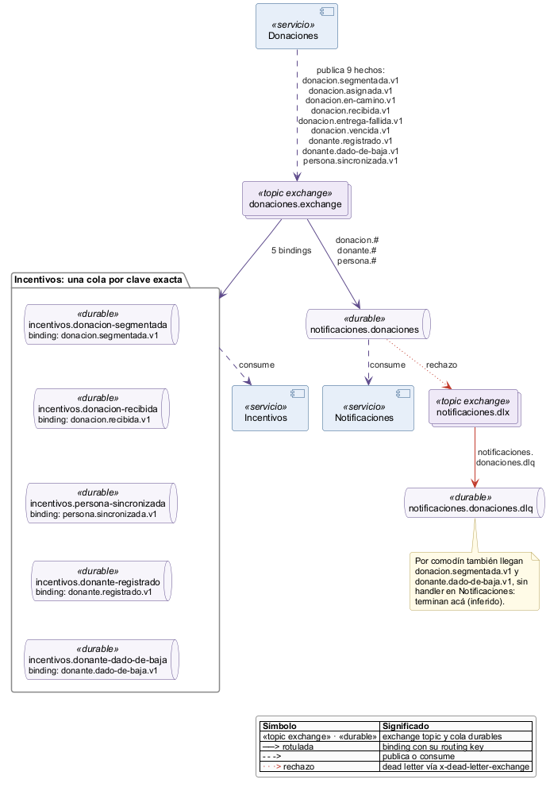
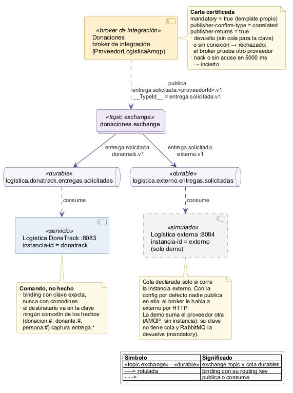
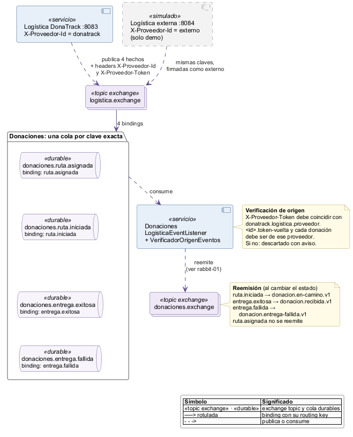
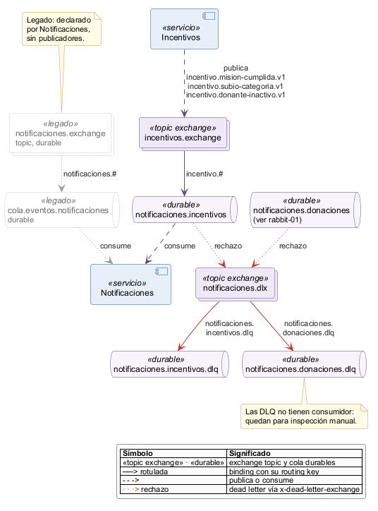

# Topología RabbitMQ — diagramas de detalle

Fuente: `RabbitMQConfig` de los 4 servicios y sus publicadores y listeners, rama `baseline/e4-prs`.
Cada `.puml` lista en su encabezado los archivos y líneas de código que dibuja.
Render: `java -jar plantuml.jar -tpng <archivo>.puml` (layout smetana, sin Graphviz).

| Diagrama | Pregunta que responde |
|---|---|
| `rabbit-01-hechos-donaciones` | ¿Cómo llegan los hechos de Donaciones a Notificaciones y a Incentivos? |
| `rabbit-02-comando-entrega` | ¿Cómo llega el pedido de entrega a una sola instancia de Logística? |
| `rabbit-03-vuelta-logistica` | ¿Cómo vuelven a Donaciones los hechos de cualquier proveedor, firmados? |
| `rabbit-04-incentivos-dlx-legado` | ¿Qué recibe Notificaciones de Incentivos, adónde va lo rechazado y qué quedó de legado? |

Notación común:
- Arriba el publicador; abajo el exchange, el binding rotulado con su routing key, la cola y el consumidor.
- Exchanges topic y colas, todos durables.
- Línea punteada roja "rechazo": dead letter hacia `notificaciones.dlx`.

## rabbit-01 — Hechos de Donaciones

- Notificaciones liga una sola cola con tres comodines; Incentivos liga una cola por cada clave que usa.
- Notificaciones no procesa `donacion.segmentada.v1` ni `donante.dado-de-baja.v1`, pero los recibe por comodín: terminan en la DLQ (inferido, sin ejecución).

## rabbit-02 — Comando de entrega

- El destinatario va en la clave (`entrega.solicitada.<proveedorId>.v1`) y cada instancia liga su cola con clave exacta.
- `mandatory` + publisher confirms: si ninguna cola recibe el comando, RabbitMQ lo devuelve y el broker prueba otro proveedor.

## rabbit-03 — Vuelta de logística

- Todo proveedor publica las mismas 4 claves; Donaciones identifica a cada uno por los encabezados `X-Proveedor-Id` y `X-Proveedor-Token`.
- Donaciones aplica el cambio de estado y reemite el hecho propio en `donaciones.exchange` (dibujado en rabbit-01).

## rabbit-04 — Incentivos, DLX y legado

- Las dos colas de Notificaciones mandan lo rechazado a `notificaciones.dlx`; la clave de dead letter es el nombre de su DLQ.
- Solo va a la DLQ el rechazo definitivo (error de conversión o validación); el contenedor de Notificaciones reencola los demás errores (default de Spring AMQP, inferido).
