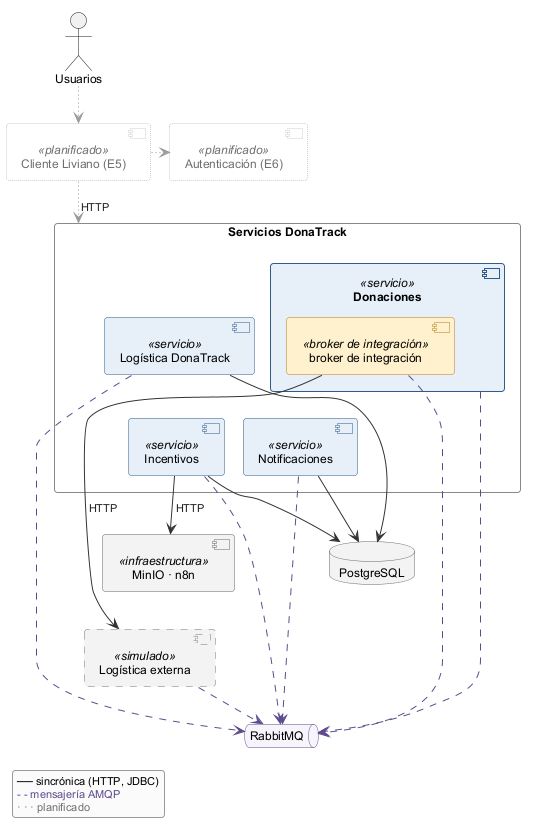
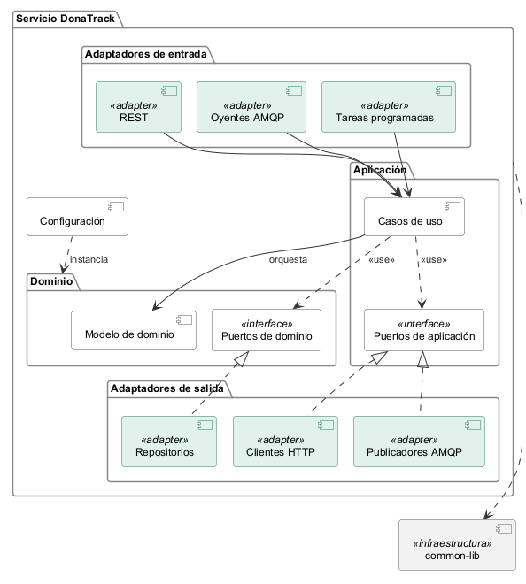
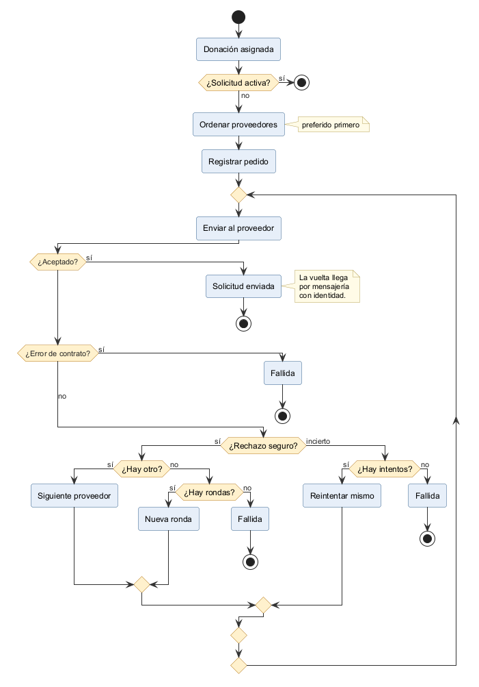
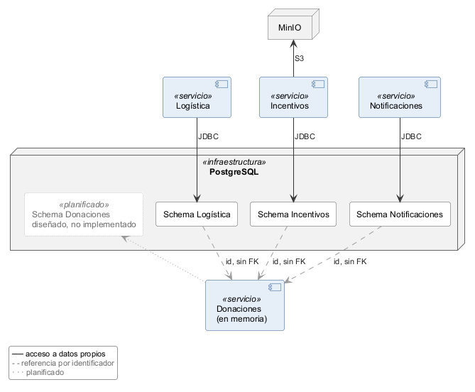
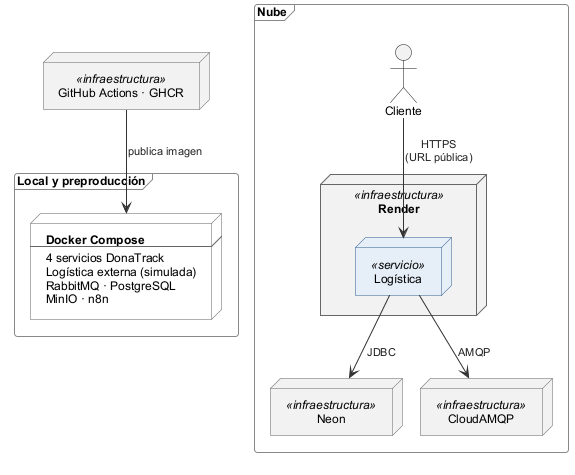

# 1 Introducción

## 1.1 Propósito y alcance

Este documento describe la arquitectura de DonaTrack al cierre de la Entrega 4 (E4): persistencia, integración y despliegue.
Quedan fuera el cliente liviano, previsto para E5, y la autenticación, prevista para E6.
Cada requisito de E4 tiene una respuesta y una sección que la desarrolla (ver Tabla 1).

Tabla 1. Requisitos de E4 y cómo se resolvieron
{anchos: 4.5, 8.0, 2.5}

| Requisito de E4 | Cómo se resolvió | Sección |
|---|---|---|
| Cola asincrónica hacia Notificaciones | Publicación y suscripción sobre RabbitMQ, con cola durable por consumidor | 6.2 |
| Broker de integración que elige entre al menos dos proveedores de logística | Componente dentro de Donaciones con orden de preferencia y un adaptador por transporte; el segundo proveedor es simulado | 6.3 |
| Persistencia relacional con mapeo objeto-relacional | PostgreSQL con un schema y un rol por servicio; por ahora, en tres de los cuatro servicios | 7 |
| Logística desplegada y accesible por web | Contenedor en una plataforma como servicio, publicado en https://donatrack-logistica-0op2.onrender.com (URL, *Uniform Resource Locator*) | 9 |

## 1.2 Mapa de servicios

El sistema tiene cuatro servicios de dominio y piezas de apoyo (ver Tabla 2).

Tabla 2. Servicios del sistema
{anchos: 4.0, 7.0, 4.0}

| Servicio | Para qué existe | Situación actual |
|---|---|---|
| Donaciones | Personas, donantes, entidades, donaciones, necesidades y asignación. Contiene el broker de integración | En memoria; persistencia relacional diseñada |
| Logística | Camiones, choferes, entregas, rutas y planificación. Es el proveedor propio | Persistencia relacional; el planificador de rutas es simulado |
| Notificaciones | Avisos por correo, SMS (*Short Message Service*) o WhatsApp | Persistencia relacional; los medios de envío son simulados |
| Incentivos | Misiones, categorías, insignias, ranking e inactividad | Persistencia relacional |
| Logística externa | Segundo proveedor: otra instancia de Logística | Simulada, solo para la demo |
| Cliente liviano y Autenticación | Interfaz web y usuarios | Previstos para E5 y E6 |

## 1.3 Cómo leer este documento

- **Capítulos 2 a 10**: vista de sistema.
- **Capítulo 11**: una ficha por servicio.
- **Recuadros**: problema, alternativas, motivo y costo de cada decisión.
- **Anexos**: índice de decisiones (A), trazabilidad (B), deuda técnica (C) y glosario (D).

## 1.4 Relación con otros entregables

Este documento es el entregable 5.
El diagrama de componentes es el entregable 4.
Los diagramas, los registros de decisión de arquitectura (ADR, *Architecture Decision Record*) y el detalle por servicio forman el entregable 3.

# 2 Atributos de calidad

El grupo priorizó seis atributos de calidad.
Cada uno tiene un escenario, un mecanismo y una sección que lo desarrolla (ver Tabla 3).
La autenticidad del origen de los mensajes se trata en la decisión sobre la vuelta de los proveedores (sección 6.4) y la observabilidad, en el capítulo 10.

Tabla 3. Atributos de calidad priorizados
{anchos: 3.0, 5.0, 4.5, 2.5}

| Atributo | Qué pasa si… | Mecanismo | Sección |
|---|---|---|---|
| Disponibilidad ante picos y fallas | Notificaciones cae 10 minutos con tráfico: Donaciones sigue respondiendo y los avisos esperan en la cola | Publicación asincrónica y cola durable declarada por el consumidor | 6.2 |
| Integridad de la entrega | El proveedor elegido rechaza o no responde: queda a lo sumo una solicitud activa por donación | Broker de integración con política de resultados | 6.3 |
| Extensibilidad | Se suma un proveedor: alcanza con configuración o un adaptador nuevo | Broker de integración, Strategy y Adapter | 6.3 |
| Modificabilidad y testeabilidad del dominio | Cambia la persistencia: solo cambian adaptadores; las reglas se prueban sin base | Capas con puertos y adaptadores | 4 |
| Aislamiento de datos | Un servicio intenta leer datos de otro: el motor lo rechaza por permisos | Schema y rol por servicio | 7 |
| Costo de despliegue | Logística debe estar accesible entre defensas a bajo costo | Plataforma como servicio, con pausa | 9 |

# 3 Arquitectura orientada a servicios (microservicios)

## 3.1 Definición operativa

En este documento, un microservicio cumple tres condiciones.
- **Desplegable**: es un proceso que se despliega por separado.
- **Dueño de sus datos**: tiene su propio modelo y su propio schema.
- **Contrato de red**: se comunica con los demás solo por REST (*Representational State Transfer*) o por mensajes AMQP (*Advanced Message Queuing Protocol*).

## 3.2 Regla de comunicación

Los hechos se publican por mensajería.
Las altas, los cambios y las consultas van por REST.
La Figura 1 muestra los servicios y sus canales.

## 3.3 Infraestructura y núcleo compartidos

Se comparten RabbitMQ (broker de mensajería), una instancia de PostgreSQL, MinIO y n8n.
Un núcleo técnico compartido (*shared kernel*) agrupa errores, trazabilidad y un repositorio genérico; su costo es que un cambio de contrato obliga a compilar todos los servicios.
No se adoptaron CQRS (*Command Query Responsibility Segregation*), event sourcing, API (*Application Programming Interface*) gateway ni service mesh, por falta de un atributo que los pida.

## 3.4 Decisión de estilo

El problema es partir el sistema para que cada parte cambie, se despliegue y falle por separado, con un costo razonable para un equipo de cursada.

:::decision | Microservicios frente a monolito modular
Decisión: un microservicio por contexto de negocio, cada uno con su schema, comunicados por REST y mensajería.
Alternativas:
- **Monolito modular**: pierde en despliegue independiente, porque E4 pide desplegar Logística sola y una cola entre servicios.
- **Servicios con schema compartido**: pierde en aislamiento, porque una consulta mal escrita toca datos ajenos sin que el motor lo impida.
Por qué: prioriza despliegue y fallas independientes y la testeabilidad del dominio.
Costo:
- Más piezas para operar: cuatro servicios, RabbitMQ y PostgreSQL.
- Consistencia eventual entre servicios.
Referencia: ADR del 9/10/2026 «Estilo de microservicios con capas y puertos y adaptadores»; ver Figura 1 y Anexo A.
:::

# 4 Capas e inversión de dependencias

## 4.1 Capas

Cada servicio se organiza en cuatro capas (ver Figura 2).
- **Adaptadores de entrada**: HTTP (*Hypertext Transfer Protocol*), consumidores de mensajes y procesos programados; validan formato y delegan.
- **Aplicación**: casos de uso, transacciones y publicación de eventos; declara sus puertos de salida.
- **Dominio**: agregados, reglas y algoritmos; declara los puertos de repositorio.
- **Adaptadores de salida**: persistencia, mensajería, HTTP, MinIO y n8n; implementan los puertos.

## 4.2 Regla de dependencia y composición

El dominio no depende de controladores, infraestructura ni objetos de transporte.
Las entidades y las reglas del dominio no llevan anotaciones de framework; se arman en un único punto de configuración por servicio.
Hay un desvío conocido de esta regla: en los cuatro servicios, los repositorios en memoria están ubicados dentro del dominio y registrados como componentes de Spring, en lugar de vivir en infraestructura.
Cada servicio persistido elige el adaptador en memoria o el relacional según la configuración; en memoria es el valor por defecto.
Pruebas de arquitectura (*fitness functions*) con ArchUnit verifican parte de estas reglas.
Esa automatización cubre solo las entidades del dominio, y hay fugas conocidas entre aplicación e infraestructura; el detalle está en la deuda sobre reglas de capas del Anexo C.

## 4.3 Decisión de organización interna

El problema es que el dominio se pruebe sin infraestructura sin que el costo de la estructura frene al equipo.

:::decision | Capas con puertos y adaptadores, variante pragmática
Decisión: capas con puertos y adaptadores; la aplicación usa Spring y no hay puertos de entrada formales.
Alternativas:
- **Capas clásicas con entidades JPA (*Jakarta Persistence API*) en el dominio**: pierde en pureza, porque el mapeo condiciona las clases de negocio.
- **Hexagonal estricta**: pierde en costo, porque exige un módulo por capa y un puerto por caso de uso.
Por qué: testeabilidad del dominio con un costo de desarrollo aceptable.
Costo:
- Mapeos en cada borde: más código.
- Las reglas de capas están automatizadas solo en parte.
Referencia: ADR del 9/10/2026 «Estilo de microservicios con capas y puertos y adaptadores»; ver Figura 2 y Anexo A.
:::

# 5 Principios SOLID y patrones de diseño

## 5.1 Principios

SOLID agrupa cinco principios de diseño orientado a objetos; el sistema aplica sobre todo tres.
- **SRP** (*Single Responsibility Principle*): los controladores solo validan y delegan; las reglas viven en el dominio.
- **OCP** (*Open/Closed Principle*): un proveedor de logística nuevo se agrega con configuración o un adaptador, sin tocar el broker de integración.
- **DIP** (*Dependency Inversion Principle*): el dominio declara el puerto de repositorio y lo implementa un adaptador relacional con JPA o uno en memoria; este último, por ahora, queda junto al dominio (ver sección 4.2).

## 5.2 Patrones

Cada patrón responde a un problema concreto (ver Tabla 4).

Tabla 4. Patrones de diseño por problema
{anchos: 4.0, 6.5, 4.5}

| Patrón | Problema que resuelve | Servicios |
|---|---|---|
| State | Transiciones ilegales en ciclos de vida | Donaciones, Logística, Notificaciones |
| Strategy | Algoritmos que varían: asignación, inactividad, orden de paradas, lotes, proveedor | Donaciones, Incentivos, Logística |
| Template Method | Esqueleto común con pasos variables | Donaciones, Incentivos, Notificaciones |
| Factory | Construcción de misiones y de personas | Incentivos, Donaciones |
| Eventos de dominio (Observer) | Efectos secundarios acoplados al agregado | Todos |
| Repository y Data Mapper | Dominio atado a la persistencia | Todos; relacional en tres |
| Publicación y suscripción | Productor acoplado a sus consumidores | Todos |
| Broker de integración, Adapter y Message Translator | Elegir entre proveedores con transportes distintos | Donaciones |
| Inbox y consumidor idempotente | Mensajes duplicados | Notificaciones, Logística, Donaciones |
| Dead Letter Channel | Mensajes que no se pueden procesar | Notificaciones |

# 6 Estrategia de integración

## 6.1 Mapa de comunicación

Cada interacción entre servicios usa un canal elegido por su propósito (ver Tabla 5).

Tabla 5. Quién se comunica con quién
{anchos: 4.5, 3.5, 7.0}

| Origen y destino | Canal | Para qué |
|---|---|---|
| De los clientes a cada servicio | REST documentado con OpenAPI | Altas, cambios y consultas con respuesta inmediata |
| De Donaciones a Notificaciones e Incentivos | Mensajería, publicación | Informar hechos sin conocer a los consumidores |
| De Incentivos a Notificaciones | Mensajería, publicación | Informar logros |
| De Donaciones al proveedor de logística | Mensajería dirigida o HTTP de ida | Pedir una entrega al proveedor elegido |
| Del proveedor de logística a Donaciones | Mensajería con identidad | Devolver el estado sin invocar a Donaciones |
| De Incentivos a n8n | HTTP, sin esperar respuesta | Difundir insignias |
| De Administración a Donaciones | REST con clave de administración | Cambiar el proveedor preferido en caliente |

Además, Incentivos conserva de forma transitoria un cliente HTTP hacia Notificaciones, apagado por defecto.
Si se enciende, también se corta su consumo por mensajería; por eso está previsto eliminarlo.

## 6.2 Cola hacia Notificaciones

E4 pide que Notificaciones no afecte la disponibilidad de los servicios de dominio ante picos o fallas.
- **Publicación por emisor**: cada servicio emisor publica sus hechos en su propio canal de RabbitMQ.
- **Cola del consumidor**: Notificaciones declara sus colas durables y las liga a los hechos que le interesan.
- **Cola de fallidos**: un mensaje que no se puede procesar va allí para revisión manual.

:::decision | Cola hacia Notificaciones
Decisión: RabbitMQ con un canal por emisor, una cola durable por consumidor y cola de fallidos.
Alternativas:
- **Kafka**: pierde en costo operativo, porque suma clúster, particiones y retención sin necesidad de reprocesar.
- **REST síncrono con reintentos**: pierde en disponibilidad, porque un consumidor caído frena al productor.
- **Canal único con mensaje polimórfico**: pierde en desacople, porque los productores dependen del formato de Notificaciones.
Por qué: disponibilidad y desacople; RabbitMQ ya estaba en el stack.
Costo:
- Consistencia eventual: el aviso llega después.
- Garantías desparejas entre publicadores (sección 10.1).
Referencia: ADR del 11/9/2026 «Topología de publicación y suscripción y desacople de Notificaciones»; ver Anexo A.
:::

## 6.3 Broker de integración con logística

E4 pide elegir entre al menos dos proveedores; un canal de publicación copia el hecho a todos los interesados y no elige.
La Figura 3 muestra cómo decide el broker de integración.
- **Orden de proveedores**: primero el preferido, configurable en caliente; después, el resto en orden.
- **Registro previo**: con el proveedor elegido, el pedido se registra antes de tocar la red y un proceso periódico lo envía.
- **Un adaptador por transporte**: mensajería con acuse del broker de mensajería, o HTTP traducido al contrato del proveedor.
- **Una solicitud activa por donación**: el control existe, pero no es atómico.

El resultado de cada envío define la acción.
- **Rechazo seguro**: el pedido no llegó; pasa al siguiente proveedor y, si no quedan, reintenta hasta cinco rondas.
- **Resultado incierto**: el pedido pudo llegar; reintenta con el mismo proveedor y, agotado, la solicitud queda fallida.
- **Error de contrato**: sin reintento ni reenvío; la solicitud queda fallida.

El segundo proveedor está simulado: es una segunda instancia de nuestra Logística, que habla HTTP.
En la demo, su callback de planificación todavía no está configurado.

:::decision | Broker de integración con logística
Decisión: dentro de Donaciones, Strategy ordena los proveedores y un Adapter por transporte envía el pedido. Los hechos se rutean por tema; los pedidos, por destinatario.
Alternativas:
- **Microservicio aparte**: pierde en disponibilidad, porque suma un punto único de falla y un salto de red.
- **Plataforma de integración (Apache Camel)**: pierde en costo, porque es un framework nuevo para dos proveedores.
- **Filtro en cada proveedor**: pierde en integridad, porque cada proveedor debe descartar lo ajeno.
Por qué: extensibilidad y una sola entrega por donación, sin infraestructura nueva.
Costo:
- El estado del broker de integración vive en memoria: lo pendiente se pierde al reiniciar.
- Un resultado incierto no se reenvía; puede requerir revisión manual.
Referencia: ADR del 7/10/2026 «Broker de integración con logística»; ver Figura 3 y Anexo A.
:::

## 6.4 Vuelta del estado

El estado de la entrega tiene que volver a Donaciones sin que el proveedor la invoque, como exige una restricción heredada de E3, y Donaciones debe saber quién lo envía.
Donaciones verifica la credencial y que la donación sea de ese proveedor; si algo falla, descarta el mensaje y lo registra.

:::decision | Vuelta de los proveedores por mensajería con identidad
Decisión: cada proveedor devuelve el estado por mensajería, con identidad y credencial en el mensaje; HTTP queda solo de ida.
Alternativas:
- **Callback HTTP a Donaciones**: pierde frente a la restricción de que Logística no invoque a Donaciones; se implementó y se quitó.
- **Consulta periódica al proveedor**: pierde en oportunidad y costo, porque exige traductor y planificador.
Por qué: respeta esa restricción y permite avisar a tiempo el inicio de la ruta y el resultado de la entrega, por un solo camino.
Costo:
- Un proveedor que solo habla HTTP no puede devolver estado.
- Credencial sin rotación ni firma.
- Un evento que falla no se reintenta.
Referencia: ADR del 8/10/2026 «Vuelta de proveedores de logística por mensajería con identidad»; ver Anexo A.
:::

## 6.5 Restricciones heredadas de la Entrega 3

Las restricciones de la Entrega 3 (E3) sobre Logística se respetan sin canales extra (ver Tabla 6).
Invocar significa llamar a otro servicio o publicar en un canal ajeno; publicar los hechos propios en el canal propio no es invocar.

Tabla 6. Cómo se respetan las restricciones heredadas
{anchos: 4.0, 11.0}

| Restricción | Cómo se respeta |
|---|---|
| Logística no invoca a Donaciones ni a Incentivos | Publica solo en su canal y no tiene clientes HTTP hacia otros servicios; consume el pedido que le publica Donaciones |
| Logística no se comunica con Notificaciones | Notificaciones no escucha el canal de Logística, y Logística no conoce canales ni direcciones de Notificaciones |
| Avisar inicio de ruta, entrega exitosa y entrega fallida | Donaciones consume los hechos de Logística, actualiza la donación y reemite sus propios hechos, que escucha Notificaciones |

La cadena de avisos tiene tres pasos.
- Cuando la ruta se inicia, la donación pasa a estar en camino.
- Cuando la entrega es exitosa, la donación pasa a recibida.
- Cuando la entrega falla, la donación pasa a entrega fallida.

# 7 Persistencia

Cada servicio guarda sus datos sin invadir los de otro (ver Figura 4).
- **Topología**: una instancia de PostgreSQL, con un schema y un rol de base de datos por servicio.
- **Referencias**: entre servicios se usan identificadores, sin claves foráneas.
- **Mapeo**: un modelo de persistencia separado del dominio, con traductores en cada borde.
- **Esquema**: migraciones versionadas por servicio y validación del esquema al arrancar.
- **Selección**: en memoria por defecto, relacional por configuración.

La persistencia relacional de Donaciones está diseñada, con sus puertos listos, pero todavía no está implementada: el servicio guarda todo en memoria.

E4 pide persistencia relacional con ORM (*Object-Relational Mapping*); hay que decidir la topología física sin romper la propiedad de los datos.

:::decision | Topología: una instancia con schema y rol por servicio
Decisión: una instancia de PostgreSQL; cada servicio usa su schema y un rol sin permisos sobre schemas ajenos.
Alternativas:
- **Una instancia por servicio**: pierde en costo, porque son cuatro motores y un CI (*Continuous Integration*) más lento.
- **Schema único compartido**: pierde en aislamiento, porque el motor no impide tocar tablas ajenas.
Por qué: el motor fuerza el aislamiento con bajo costo operativo.
Costo:
- La instancia es un punto común de falla.
- Sin prueba automática del rechazo de acceso cruzado.
- Por ahora se aplica en tres de los cuatro servicios; Donaciones guarda en memoria.
Referencia: ADR del 2/9/2026 «Persistencia multi-schema y aislamiento de roles en PostgreSQL»; ver Figura 4 y Anexo A.
:::

Además, hay que decidir dónde vive el mapeo objeto-relacional sin ensuciar el dominio.

:::decision | Mapeo: modelo de persistencia separado
Decisión: un modelo de persistencia propio, traducido al dominio con mappers.
Alternativas:
- **Anotaciones JPA en el dominio**: pierde en pureza, porque el dominio queda condicionado por el ORM.
- **Mapeo externo en XML (*Extensible Markup Language*)**: pierde en verificabilidad y libertad, porque el ORM sigue imponiendo la forma de las clases.
Por qué: prioriza pureza del dominio y reglas verificables con ArchUnit.
Costo:
- Doble modelo y mappers en cada servicio persistido.
- El dominio necesita métodos de reconstitución.
- Por ahora se aplica en tres de los cuatro servicios.
Referencia: el ADR de mapeo de cada servicio; ver Anexo A.
:::

# 8 Estrategia y tipos de pruebas

Cada nivel de prueba valida algo distinto (ver Tabla 7).

Tabla 7. Niveles de prueba
{anchos: 3.5, 7.5, 4.0}

| Nivel | Qué valida | Automático en CI |
|---|---|---|
| Unitarias | Reglas, transiciones, algoritmos y el broker de integración con proveedores simulados | Sí |
| Arquitectura | Reglas de capas, con ArchUnit | Sí, aunque cubren solo parte de las reglas |
| Persistencia | Adaptadores, mappers y migraciones contra PostgreSQL real con Testcontainers | En parte: las de Notificaciones quedan fuera de CI |
| Mensajería | Adaptador de mensajería del broker de integración y mensajería de Logística, contra RabbitMQ real | Sí |
| Contratos | Respuestas contra OpenAPI y mensajes contra su esquema publicado | Sí |
| Integración de punta a punta | Flujos entre servicios en un entorno de preproducción efímero | Sí |
| Carga | Tiempo de respuesta al crear donaciones, con k6 | No, manual |
| Mutación | Algoritmo de compatibilidad, con Pitest | No, manual |

El problema es probar la persistencia contra el mismo motor que corre en producción.

:::decision | Base real efímera para pruebas de persistencia
Decisión: PostgreSQL real en contenedores efímeros con Testcontainers.
Alternativas:
- **Base embebida en memoria**: pierde en fidelidad, porque su dialecto difiere del motor real.
Por qué: valida migraciones y mapeos contra el motor de producción.
Costo:
- Requiere Docker.
Referencia: ADR del 1/9/2026 «Testing de persistencia con Testcontainers».
:::

# 9 Despliegue

## 9.1 Contenedores

Cada servicio corre en su propio contenedor (ver Figura 5).
- **Imagen**: construcción en varias etapas, sin privilegios de administrador y con chequeo de salud.
- **Configuración**: por variables de entorno.
- **Publicación**: CI publica las imágenes; no hay despliegue automático a la nube.

## 9.2 Entornos

Hay tres entornos (ver Tabla 8).

Tabla 8. Entornos de ejecución
{anchos: 3.5, 7.5, 4.0}

| Entorno | Qué corre | Situación |
|---|---|---|
| Local y demo | Cuatro servicios, RabbitMQ, PostgreSQL, MinIO y n8n; la demo agrega la Logística externa | En uso |
| Preproducción efímera | Lo mismo, con imágenes publicadas por CI, dentro de la corrida de CI | En uso |
| Nube | Solo Logística, en Render, con PostgreSQL en Neon y RabbitMQ en CloudAMQP | Publicado y accesible por HTTPS |

Logística está publicada en https://donatrack-logistica-0op2.onrender.com; la documentación interactiva de su API está en Swagger UI, en la misma dirección.
Para la demo integrada en la nube falta que Donaciones comparta RabbitMQ con Logística y fijar la URL de callback de planificación.

## 9.3 Decisión de plataforma

E4 pide Logística accesible por web, con la opción de pausarla para reducir consumo.

:::decision | Plataforma como servicio con contenedor
Decisión: PaaS (*Platform as a Service*) con contenedor (Render), PostgreSQL gestionado (Neon) y RabbitMQ gestionado (CloudAMQP).
Alternativas:
- **Máquina virtual con Docker Compose (IaaS, *Infrastructure as a Service*)**: pierde en costo y esfuerzo, porque el sistema operativo y los parches quedan a cargo del grupo.
- **Funciones sin servidor (FaaS, *Function as a Service*)**: pierde en reutilización, porque no sostiene un consumidor permanente.
Por qué: costo con pausa, acceso por URL y reutilizar la imagen que valida CI.
Costo:
- Pausada, Logística no consume pedidos ni planifica.
- Credenciales fuera del repositorio.
- En el plan gratuito, la instancia se suspende sin tráfico: la primera respuesta puede tardar cerca de un minuto.
Referencia: ADR del 9/10/2026 «Despliegue de Logística en PaaS con contenedores»; ver Figura 5 y Anexo A.
:::

# 10 Decisiones diferidas y trade-offs asumidos

## 10.1 Garantías que hoy no ofrecemos

El sistema no ofrece entrega exactamente una vez de punta a punta (ver Tabla 9).

Tabla 9. Situaciones de falla no cubiertas por completo
{anchos: 3.5, 6.0, 5.5}

| Situación | Qué pasa hoy | Qué haría falta |
|---|---|---|
| El mismo mensaje llega dos veces | Notificaciones y Logística deduplican; Donaciones deduplica en memoria; Incentivos no deduplica donaciones | Inbox en Incentivos e identificador de mensaje en sus publicaciones |
| El proceso cae entre guardar y publicar | Solo el pedido del broker de integración pasa por un registro previo, en memoria; Logística publica después de confirmar sin registro previo | Registro previo persistente en ambos servicios |
| RabbitMQ reinicia | Colas y mensajes son durables, pero en el entorno local el contenedor no tiene volumen; solo el pedido del broker de integración espera acuse | Volumen persistente y acuse en todos los publicadores |

Observabilidad: la traza se sigue en HTTP, pero en mensajería solo viaja de ida.

## 10.2 Deuda agrupada

La deuda técnica se agrupa en seis temas (ver Tabla 10); el detalle está en el Anexo C.

Tabla 10. Deuda técnica por tema
{anchos: 4.5, 5.5, 5.0}

| Tema | Impacto | Plan |
|---|---|---|
| Persistencia y estado del broker de integración en memoria | Un reinicio pierde donaciones y pedidos pendientes | Persistencia relacional y registro previo en tabla |
| Durabilidad y acuse de la mensajería | Ventana de pérdida de hechos de Logística | Registro previo sobre la tabla de eventos existente |
| Duplicados y traza | Métricas duplicadas; flujos asíncronos sin traza completa | Inbox, identificador de mensaje y traza al consumir |
| Seguridad de transición | Clave y credencial sin rotación ni identidad de usuario | Autenticación en E6 |
| Despliegue y demo | Callback de la segunda instancia sin configurar; RabbitMQ en la nube todavía no compartido con Donaciones | Configurar la mensajería en la nube |
| Reglas y pruebas pendientes | Fugas de capas sin aviso; regresiones de mapeo sin freno | Reglas faltantes y pruebas de vuelta a CI |

# 11 Cómo aplica la arquitectura cada servicio

Cada ficha recorre los capítulos 2 a 10 para un servicio y cierra con una decisión propia.
Cada fila sigue el capítulo del mismo nombre.
El orden sigue el flujo de una donación.

## 11.1 Donaciones

Responsabilidad: fuente de verdad de personas, donaciones y necesidades, y punto de salida hacia los proveedores de logística. La Tabla 11 resume cómo aplica la arquitectura en este servicio.

Tabla 11. Ficha de Donaciones
{anchos: 4.0, 11.0}

| Tema | Cómo se aplica |
|---|---|
| Atributos de calidad | Integridad del ciclo de vida de la donación y extensibilidad de criterios y proveedores |
| Microservicios | Contiene el broker de integración y, fuera de él, el procesador de la vuelta de logística |
| Capas | Excepción conocida: el dominio de necesidades usa un objeto de transporte |
| Patrones | State con siete estados, Template Method y Strategy en la asignación, Factory de personas |
| Integración | Publica hechos, dirige pedidos a proveedores y recibe la vuelta con identidad |
| Persistencia | Todo en memoria: repositorios, registro previo, solicitudes, deduplicación y preferido |
| Pruebas | Políticas del broker de integración con proveedores simulados; adaptador de mensajería contra RabbitMQ real |
| Despliegue | Local, demo y preproducción; todavía falta compartir RabbitMQ en la nube |
| Decisiones diferidas | Persistencia relacional, estado del broker de integración en memoria y reintento de los eventos de vuelta |

El mapeo relacional de Donaciones tiene ADR y puertos listos, pero todavía no tiene código JPA.

:::decision | Persistencia relacional diferida
Decisión: Donaciones guarda en memoria en E4; la persistencia relacional queda diseñada, sin implementar.
Alternativas:
- **JPA en E4**: compite por esfuerzo con el broker de integración, prioridad de E4.
Por qué: la persistencia relacional de Donaciones no era requisito de la entrega; el esfuerzo fue al broker de integración y los puertos admiten JPA sin tocar el dominio.
Costo:
- La persistencia relacional queda aplicada en tres de los cuatro servicios.
- Un reinicio pierde el estado.
Referencia: ADR de mapeo ORM de Donaciones; ver la deuda sobre persistencia en el Anexo C.
:::

## 11.2 Logística

Responsabilidad: camiones, choferes, entregas y rutas; es el proveedor de logística propio y no invoca a ningún servicio. La Tabla 12 resume cómo aplica la arquitectura en este servicio.

Tabla 12. Ficha de Logística
{anchos: 4.0, 11.0}

| Tema | Cómo se aplica |
|---|---|
| Atributos de calidad | Integridad y trazabilidad de estados, disponibilidad aunque otros servicios caigan, reglas físicas de carga |
| Microservicios | Proveedor propio del broker de integración; una segunda instancia simula al proveedor externo |
| Capas | Único servicio con la regla automatizada de dominio sin JPA; una fuga conocida en un mapper |
| Patrones | State con transiciones; Strategy en paradas, dimensiones y lotes; gestores de dominio puros |
| Integración | Consume pedidos, publica estado y planifica rutas en lotes de hasta 100 con callback |
| Persistencia | Bloqueo optimista, historial de estados y referencias a donaciones por identificador |
| Pruebas | Persistencia y migraciones contra una base real efímera |
| Despliegue | Único servicio en la nube, publicado en Render |
| Decisiones diferidas | Publicación sin registro previo, URL de callback de planificación y descarte sin aviso de pedidos inválidos |

:::decision | Planificación por lotes con callback
Decisión: un proceso nocturno arma lotes de hasta 100 entregas; el planificador responde por callback.
Alternativas:
- **Cálculo síncrono por donación**: pierde ante el tope de 100 y el horario de baja carga.
Por qué: respeta las restricciones heredadas de responder por una URL de callback, armar lotes de hasta 100 donaciones y planificar en horario de baja carga.
Costo:
- Estado intermedio pendiente.
- Si el callback falla, queda un registro y las entregas reingresan en la corrida siguiente.
- El planificador es simulado.
Referencia: ADR del 1/9/2026 «Planificación de rutas asíncrona por lotes y callback REST».
:::

## 11.3 Notificaciones

Responsabilidad: avisar a cada persona por su medio preferido, con alternativa entre medios. La Tabla 13 resume cómo aplica la arquitectura en este servicio.

Tabla 13. Ficha de Notificaciones
{anchos: 4.0, 11.0}

| Tema | Cómo se aplica |
|---|---|
| Atributos de calidad | No duplicar avisos, no afectar al negocio y pasar a otro medio si uno falla |
| Microservicios | Mantiene una réplica de contacto de cada persona; no publica hechos |
| Capas | Excepción: su gestor vive en la capa de aplicación y está anotado como componente |
| Patrones | Adapter y Router por medio, inbox, Dead Letter Channel |
| Integración | Consume dos colas, de Donaciones e Incentivos, y expone REST de consulta |
| Persistencia | Herencia en tabla única para medios de contacto; inbox persistente |
| Pruebas | Las pruebas de persistencia quedan fuera de CI |
| Despliegue | Local y preproducción; medios de notificación simulados dentro del proceso |
| Decisiones diferidas | Pruebas de persistencia fuera de CI, restos legados y hechos recibidos que no procesa |

:::decision | Inbox persistente
Decisión: registrar cada mensaje procesado en la base para aplicarlo una sola vez.
Alternativas:
- **Deduplicación en memoria**: pierde el registro al reiniciar.
- **No deduplicar**: un reenvío duplica avisos.
Por qué: prioriza no duplicar avisos a personas.
Costo:
- Una tabla más.
- Si falta el identificador de mensaje, usa el id de negocio y puede descartar un aviso legítimo.
Referencia: ADR del 2/9/2026 «Inbox para idempotencia en Notificaciones».
:::

## 11.4 Incentivos

Responsabilidad: misiones, categorías, insignias, ranking mensual e inactividad de los donantes. La Tabla 14 resume cómo aplica la arquitectura en este servicio.

Tabla 14. Ficha de Incentivos
{anchos: 4.0, 11.0}

| Tema | Cómo se aplica |
|---|---|
| Atributos de calidad | Autonomía sin consultar a Donaciones, integridad de reglas y salidas no bloqueantes |
| Microservicios | Difunde insignias con un flujo low-code en n8n, contra una red social simulada |
| Capas | Fuga conocida: sus puertos de salida están ubicados en infraestructura |
| Patrones | Template Method en misiones, Factory, Strategy de inactividad, insignia como plantilla y como logro |
| Integración | Consume cinco hechos de Donaciones y publica tres logros; webhooks a n8n y almacenamiento de imágenes |
| Persistencia | Tabla única para misiones; bloqueo optimista con reintento en el perfil del donante; imágenes en MinIO |
| Pruebas | Object Mother en pruebas; carga con k6 |
| Despliegue | Local y preproducción |
| Decisiones diferidas | Identificador de mensaje, deduplicación y cola de fallidos, bloqueo de procesos programados, saturación al publicar y cliente HTTP transitorio |

:::decision | Representación propia del donante
Decisión: Incentivos mantiene un perfil del donante alimentado por los hechos de Donaciones.
Alternativas:
- **Consultar por red a Donaciones**: pierde en autonomía, porque una caída de Donaciones frenaría el cálculo de misiones.
Por qué: prioriza autonomía y salidas no bloqueantes.
Costo:
- Datos duplicados y sincronización por eventos.
- Sin deduplicar donaciones, un reenvío duplica métricas.
Referencia: ver la deuda sobre duplicados en Incentivos en el Anexo C.
:::

# Anexo A. Índice de decisiones

Las alternativas descartadas y por qué pierden están en el recuadro de cada decisión, en el cuerpo.
El índice de decisiones vincula cada recuadro con su ADR (ver Tabla 15).
Todos estos ADR están en estado propuesto; el antecedente del 3/7/2026 está aceptado.

Tabla 15. Índice de decisiones
{anchos: 4.5, 7.0, 3.5}

| Decisión | Registro de la decisión (ADR: fecha y título) | Dónde se justifica |
|---|---|---|
| Microservicios frente a monolito modular; capas con puertos y adaptadores | 9/10/2026 «Estilo de microservicios con capas y puertos y adaptadores» | Secciones 3.4 y 4.3; Figuras 1 y 2 |
| Cola hacia Notificaciones | 11/9/2026 «Topología de publicación y suscripción y desacople de Notificaciones»; antecedente: 3/7/2026 «Uso de RabbitMQ entre Logística y los demás servicios» | Sección 6.2 |
| Broker de integración con logística | 7/10/2026 «Broker de integración con logística» | Sección 6.3; Figura 3 |
| Vuelta de los proveedores por mensajería con identidad | 8/10/2026 «Vuelta de proveedores de logística por mensajería con identidad» | Sección 6.4 |
| Topología de persistencia y mapeo con modelo separado | 2/9/2026 «Persistencia multi-schema y aislamiento de roles en PostgreSQL», más un ADR de mapeo por servicio | Capítulo 7; Figura 4 |
| Plataforma como servicio con contenedor | 9/10/2026 «Despliegue de Logística en PaaS con contenedores» | Sección 9.3; Figura 5 |

# Anexo B. Trazabilidad de requisitos

Cada requisito de E4 y cada restricción heredada de E3 tiene una sección que lo responde (ver Tabla 16).

Tabla 16. Requisitos y restricciones
{anchos: 7.5, 7.5}

| Requisito | Dónde se trata |
|---|---|
| Los servicios de dominio avisan a Notificaciones por una cola asincrónica | Sección 6.2 y Figura 1. Incentivos conserva un cliente HTTP transitorio, apagado por defecto |
| Un broker de integración elige entre al menos dos proveedores de logística | Sección 6.3 y Figura 3 |
| Persistencia relacional con mapeo objeto-relacional | Capítulo 7 y Figura 4. Por ahora, en tres de los cuatro servicios: falta Donaciones |
| Logística desplegada y accesible por sus URL | Capítulo 9 y Figura 5. Publicada en https://donatrack-logistica-0op2.onrender.com |
| Diagrama de componentes con la integración de E4 | Entregable 4 y Figura 1 |
| Documento de arquitectura sin detalle de componentes | Este documento |
| Justificaciones con diagramas complementarios | Capítulos 3 a 9, Anexo A y entregable 3 |
| Restricción heredada: Logística no invoca a Donaciones ni a Incentivos | Sección 6.5 |
| Restricción heredada: Logística no se comunica con Notificaciones | Sección 6.5 |
| Restricción heredada: el planificador externo responde por una URL de callback | Sección 11.2. El planificador es simulado |
| Restricción heredada: lotes de hasta 100 donaciones por solicitud | Sección 11.2 |
| Restricción heredada: rutas y asignación en horario de baja carga | Sección 11.2 |
| Restricción heredada: flujo low-code para difundir insignias | Sección 11.4. La red social es simulada |
| Restricción heredada: cada servicio en contenedor y desplegado | Capítulo 9. En la nube, solo Logística |
| Restricción heredada: avisar inicio de ruta, entrega exitosa y fallida sin que Logística se comunique con Notificaciones | Sección 6.5. Los avisos pasan por Donaciones |

# Anexo C. Deuda técnica

La deuda técnica declarada se lista por tema (ver Tabla 17). Los temas ya resueltos no se incluyen.

Tabla 17. Deuda técnica
{anchos: 5.0, 5.0, 5.0}

| Tema | Impacto | Plan |
|---|---|---|
| Donaciones sin persistencia relacional | El requisito de persistencia queda cubierto en parte; un reinicio pierde todo el estado | Puertos listos para JPA; fuera del alcance de E4 |
| Registro previo, solicitudes y preferido del broker de integración en memoria | Pedidos pendientes perdidos al reiniciar; el control de una solicitud activa por donación no es atómico | Reemplazar el registro en memoria por una tabla |
| Logística publica después de confirmar, sin registro previo ni acuse | Ventana de pérdida de hechos de logística | Usar la tabla de eventos existente como registro previo |
| Incentivos publica sin identificador de mensaje | Riesgo identificado: Notificaciones puede descartar como duplicado un aviso legítimo | Asignar identificador al publicar |
| Incentivos sin deduplicación de donaciones ni cola de fallidos | Métricas duplicadas ante un reenvío; mensajes fallidos perdidos | Inbox y cola de fallidos, como en Notificaciones |
| Incentivos sin bloqueo distribuido de procesos programados | Tareas duplicadas con más de una réplica | Bloqueo distribuido sobre PostgreSQL |
| Incentivos ejecuta en el hilo llamador al saturarse | La publicación bloquea al llamador; errores solo en el registro | Rechazo explícito o registro previo |
| Traza de mensajería solo de ida | No se sigue un flujo asíncrono de punta a punta | Restaurar la traza al consumir y enviarla en todos los publicadores |
| Pruebas de persistencia de Notificaciones fuera de CI | Una regresión de mapeo no frena la integración | Reincluirlas en la suite de CI |
| Reglas de capas faltantes, de alcance limitado, y fugas conocidas; entre ellas, los repositorios en memoria de los cuatro servicios están dentro del dominio y registrados como componentes de Spring | Las fugas pueden crecer sin aviso | Agregar las reglas del ADR de fitness functions y llevar los repositorios en memoria a infraestructura |
| Un evento de vuelta que falla no se reintenta | La donación queda en el estado anterior | Cola de fallidos y reintentos acotados |
| Seguridad de transición: clave de administración y credencial en el mensaje | Protección mínima, sin rotación ni identidad de usuario | Autenticación en E6; usuarios de RabbitMQ por proveedor |
| Cliente HTTP transitorio de Incentivos a Notificaciones | Al encenderlo se apaga también el consumo por mensajería de Incentivos | Eliminar el cliente |
| Un proveedor que solo habla HTTP no puede devolver estado | Sin integración con un tercero real que solo use HTTP | Consulta periódica como evolución |
| Despliegue en la nube fuera del repositorio | No reproducible desde el repositorio; mensajería compartida sin configurar | Configurar CloudAMQP en ambos servicios antes de la defensa |
| Restos legados en Notificaciones: canal sin publicadores y operación de personas sin llamador | Superficie sin uso | Retirarlos al cerrar la migración |
| Notificaciones recibe dos tipos de hecho que no procesa | Riesgo identificado: terminan en su cola de fallidos y agregan ruido | Ligar solo los hechos que procesa |
| URL de callback de planificación con valor local por defecto | Riesgo identificado: la segunda instancia no recibe su callback ni asigna rutas | Fijar la URL en la demo y en la nube |
| Logística descarta un pedido inválido después del acuse | La solicitud queda enviada y la donación asignada, sin reenvío ni aviso | Publicar un hecho de rechazo al descartar |

# Anexo D. Glosario y siglas

La Tabla 18 reúne los términos y las siglas que usa el documento, en orden alfabético.

Tabla 18. Glosario y siglas
{anchos: 4.0, 11.0}

| Término | Significado |
|---|---|
| ADR | *Architecture Decision Record*: registro de una decisión de arquitectura, con contexto, alternativas y consecuencias |
| Adaptador · puerto | Puerto: contrato que define el dominio o la aplicación. Adaptador: implementación técnica de ese contrato |
| AMQP | *Advanced Message Queuing Protocol*: protocolo de mensajería que usa RabbitMQ |
| API | *Application Programming Interface*: interfaz que un sistema expone a otros |
| Broker de integración | Componente dentro de Donaciones que elige un proveedor de logística y le envía el pedido. No es RabbitMQ |
| Broker de mensajería | RabbitMQ: infraestructura que recibe, guarda y reparte mensajes |
| CI | *Continuous Integration*: integración continua; corre compilación y pruebas en cada cambio |
| Cola de fallidos | Cola donde terminan los mensajes que no se pudieron procesar, para revisión manual |
| CQRS | *Command Query Responsibility Segregation*: separar modelos de escritura y de lectura. No adoptado |
| DIP | *Dependency Inversion Principle*: los módulos de alto nivel dependen de abstracciones |
| E3, E4, E5, E6 | Entregas 3 a 6 del trabajo práctico |
| ESB | *Enterprise Service Bus*: bus de integración centralizado. Alternativa descartada para el broker de integración |
| FaaS | *Function as a Service*: funciones que se ejecutan sin servidor propio |
| Hecho · comando | Hecho: mensaje que informa algo que ya pasó, con varios interesados. Comando: orden a un destinatario elegido |
| HTTP · HTTPS | *Hypertext Transfer Protocol*, y su versión cifrada |
| IaaS | *Infrastructure as a Service*: máquina virtual que administra el grupo |
| Inbox | Registro de mensajes ya procesados para aplicar cada uno una sola vez |
| JPA | *Jakarta Persistence API*: estándar de Java para mapeo objeto-relacional |
| OCP | *Open/Closed Principle*: abierto a extensión, cerrado a modificación |
| ORM | *Object-Relational Mapping*: mapeo entre objetos y tablas relacionales |
| Outbox (registro previo) | Registro del mensaje antes de enviarlo, despachado después por un proceso periódico |
| PaaS | *Platform as a Service*: plataforma que ejecuta contenedores y gestiona el servidor |
| REST | *Representational State Transfer*: estilo de API sobre HTTP |
| Schema por servicio | Una instancia de PostgreSQL con un schema y un rol propios por servicio |
| SMS | *Short Message Service*: mensaje de texto al teléfono |
| SOLID | Cinco principios de diseño orientado a objetos, entre ellos SRP, OCP y DIP |
| SRP | *Single Responsibility Principle*: una clase tiene un solo motivo para cambiar |
| TLS | *Transport Layer Security*: cifrado de las conexiones |
| URL | *Uniform Resource Locator*: dirección web |
| XML | *Extensible Markup Language*: formato de texto con etiquetas |
