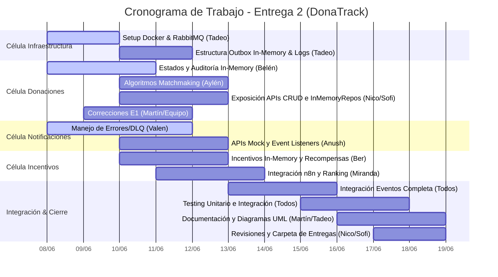

# Planificación Detallada y Asignación de Tareas — Entrega 2 (DonaTrack)

Este documento establece la planificación y distribución de tareas para el equipo de **DonaTrack** de cara a la segunda entrega (fecha límite: **19 de junio de 2026**). A fecha de hoy (**8 de junio de 2026**), restan exactamente **11 días** de desarrollo, integración y testing.

> [!IMPORTANT]
> **Ajuste por Memoria Volátil (Sin Persistencia en Base de Datos):**
> De acuerdo con las pautas de la Entrega 2, **esta entrega no incluye persistencia en bases de datos**. Toda la persistencia de datos (Donantes, Donaciones, Misiones, Rankings, Notificaciones, etc.) se implementará mediante **repositorios en memoria volátil** (usando colecciones estándar de Java como `ConcurrentHashMap`, `List`, `Set`, etc.). 
>
> Para mantener un diseño de software limpio y extensible, se definirá una **arquitectura basada en interfaces para los repositorios** (ej. `DonanteRepository`), de modo que en las entregas de persistencia real (Entrega 4+) se puedan reemplazar los componentes en memoria por implementaciones con base de datos (JPA/Hibernate/Spring Data) sin alterar la lógica de negocio ni los controladores de la API REST.

---

## 1. Resumen de Estructura de Trabajo y Grupos

El equipo se divide en tres células de desarrollo con responsabilidades funcionales específicas, complementándose con roles transversales de DevOps, Aseguramiento de la Calidad (QA), Documentación Técnica y Entregables.

```
                  ┌──────────────────────────────────────────┐
                  │                 Tadeo                    │
                  │   Sinergia de Equipo & DevOps (Broker)   │
                  └──────────────────────────────────────────┘
                                       │
      ┌────────────────────────┬───────┴────────────────┬────────────────────────┐
      ▼                        ▼                        ▼                        ▼
┌───────────────┐        ┌───────────────┐        ┌───────────────┐        ┌───────────────┐
│  Donaciones   │        │Notificaciones │        │  Incentivos   │        │ Transversal  │
│ - Sofi        │        │ - Anush       │        │ - Ber         │        │ - Martín      │
│ - Aylén       │        │ - Valen       │        │ - Miranda     │        │ (ADRs y UML)  │
│ - Belén       │        └───────────────┘        └───────────────┘        │ - Nico        │
│ - Martín      │                                                          │ (Entregables) │
│ - Nico        │                                                          └───────────────┘
└───────────────┘
```

### 1.1. Distribución de Roles del Proyecto (Mapping de Responsabilidades)

| Integrante | Rol Principal | Colaboración | Grupo de Servicio | Foco en Entrega 2 (Ajustado a In-Memory) |
| :--- | :--- | :--- | :--- | :--- |
| **Tadeo** | Sinergia de Equipo | DevOps / Calidad | Transversal | Setup de RabbitMQ, `common-lib`, Outbox In-Memory y logs. |
| **Anush** | Requerimientos | UX/UI / Tiempos | Notificaciones | Contrato de API, Mocks de Notificadores y Event Listeners. |
| **Valen** | Revisión de Diseño | Calidad / UX/UI | Notificaciones | Manejo de errores (DLQ), validación e idempotencia en memoria. |
| **Ber** | Rendimiento | Calidad / Requerimientos | Incentivos | Repositorios volátiles de Incentivos y lógica de recompensas. |
| **Miranda**| Aseguramiento Calidad | Doc. Técnica / Requerimientos | Incentivos | Integración con n8n, Scheduler de Ranking y QA Lead. |
| **Sofi** | Diseño UX/UI | Calidad / Entregables | Donaciones | Contratos REST de Donaciones y esquemas de validación de datos. |
| **Aylén** | Gestión de Reuniones | Rendimiento / Doc. Técnica | Donaciones | Algoritmos de Matchmaking sobre colecciones y scheduler. |
| **Belén** | Adm. de Tiempos/Objetivos | Calidad / Entregables | Donaciones | Máquina de estados de donación y registros de auditoría en memoria. |
| **Martín** | Doc. Técnica | Calidad / Tiempos | Donaciones | Redacción de ADRs y Diagramas de Clase UML. |
| **Nico** | Entregables | UX/UI / Rev. Diseño | Donaciones | CRUD REST y Repositorios en memoria de Donaciones/Entidades. |

---

## 2. Planificación Temporal y Hitos Críticos (8/6 - 19/6)

Al no tener que configurar bases de datos (tablas SQL, mapeos de entidades, indexación, migraciones, bases NoSQL), el esfuerzo se concentra netamente en el **modelado orientado a objetos**, la **comunicación distribuida con RabbitMQ** y el **testing**.



### Hitos de Control (Checkpoints):
*   **Hito 1 (10/6)**: Infraestructura compartida funcionando. Estados de la donación terminados en memoria.
*   **Hito 2 (13/6)**: Lógicas core individuales de los 3 servicios completadas (APIs sobre repositorios volátiles, Matchmaking, n8n, Recompensas, Mocks de Notificaciones).
*   **Hito 3 (15/6)**: Integración y flujo de eventos de punta a punta probado con RabbitMQ local (comunicando los contenedores de los microservicios).
*   **Hito 4 (18/6)**: Cobertura de tests unitarios y de integración robustos en verde. Documentación técnica completa (ADRs, Diagramas).
*   **Hito 5 (19/6)**: Entrega final del proyecto.

---

## 3. Asignación Detallada de Tareas por Integrante

### 3.1. Célula de Infraestructura y Soporte Transversal

#### **Tadeo (Sinergia de Equipo / DevOps / Calidad)**
*   **Rol en la Entrega**: Coordinador de arquitectura y DevOps. Diseña la infraestructura distribuida de mensajería y empaquetamiento.
*   **Tareas**:
    1.  **Configuración de RabbitMQ en Docker**: Crear/actualizar el `docker-compose.yml` local para incluir la imagen de RabbitMQ (`rabbitmq:3-management`) y exponer los puertos `5672` (mensajería) y `15672` (consola de administración).
    2.  **Proyecto `common-lib`**: Definir el esquema JSON unificado y clases Java para los eventos comunes (`DonanteCreado`, `DonacionAsignada`, `DonacionEntregada`, `MisionCompletada`, `CategoriaAscendida`).
    3.  **Patrón Outbox In-Memory**: Dado que no hay bases de datos, desarrollar un mecanismo outbox en memoria: los eventos se encolan en una estructura interna concurrente (ej. `BlockingQueue<Event>`) dentro de la misma transacción en memoria del comando. Un hilo worker en segundo plano consume de esa cola local y publica de manera asincrónica en RabbitMQ.
    4.  **Sistema de Logs Transversal**: Configurar una política estándar de logs (Logback con Slf4j) que incluya TraceID en la comunicación distribuida.
    5.  **Monitoreo y Apoyo**: Asistir a todos los servicios en la integración del cliente de RabbitMQ.
*   **Entregables**: Archivo `docker-compose.yml` actualizado, código del módulo `common-lib` de eventos y clases del outbox en memoria.
*   **Fecha Límite**: **11 de junio de 2026**.

---

### 3.2. Célula del Servicio de Donaciones

#### **Belén (Adm. de Tiempos/Objetivos / Aseguramiento de Calidad)**
*   **Rol en la Entrega**: Diseñadora del ciclo de vida del negocio de donaciones.
*   **Tareas**:
    1.  **Trazabilidad de Estados**: Implementar la máquina de estados de la donación (`En depósito` $\rightarrow$ `Asignación realizada` $\rightarrow$ `Lista para entregar` $\rightarrow$ `En traslado` $\rightarrow$ `Entregada` / `Entrega fallida` $\rightarrow$ `Vencida`).
    2.  **Registro de Auditoría Volátil**: Crear una clase de almacenamiento en memoria (`InMemoryDonacionEstadoAuditRepository`) que mantenga una lista de objetos `DonacionEstadoAudit` con campos como `donacion_id`, `estado_anterior`, `estado_nuevo`, `fecha_cambio`, `usuario_id` y `justificacion` (requerida si cambia a `Entrega fallida`).
    3.  **Publicación de Eventos de Estados**: Integrar en los métodos de transición del estado la publicación del evento correspondiente (`DonacionAsignada`, `DonacionEnTraslado`, `DonacionEntregada`, `DonacionEntregaFallida`) en la outbox in-memory.
*   **Entregables**: Clases del dominio `DonacionEstado`, entidad `DonacionEstadoAudit`, repositorio `InMemoryDonacionEstadoAuditRepository` y tests unitarios de transiciones de estados.
*   **Fecha Límite**: **11 de junio de 2026**.

#### **Aylén (Gestión de Reuniones / Rendimiento)**
*   **Rol en la Entrega**: Responsable del núcleo algorítmico y optimización de base de datos en memoria.
*   **Tareas**:
    1.  **Algoritmo de Compatibilidad Semántica**: Lógica que evalúa la coincidencia entre ítems donados y necesidades registradas de las entidades beneficiarias consultando colecciones en memoria.
    2.  **Algoritmo de Prioridad a Sub-atendidos**: Lógica que obtiene y prioriza aquellas entidades con menor cantidad de donaciones entregadas en el último trimestre, realizando los cálculos sobre listas en memoria de donaciones auditadas.
    3.  **Filtro de Intersección y Retorno**: Lógica que intersecta ambos rankings para proponer las candidatas ideales. Si la intersección es vacía, sugiere los resultados individuales.
    4.  **Ejecución Asincrónica y Calendarizada**: Implementar un planificador (`@Scheduled` en Spring Boot) que corra el matchmaking asincrónico nocturno extrayendo los datos de los repositorios en memoria sin interferir con las operaciones HTTP.
*   **Entregables**: Clases algoritmos de asignación, lógica de intersección, componente scheduler y tests de lógica de asignaciones.
*   **Fecha Límite**: **12 de junio de 2026**.

#### **Nico (Entregables / UX/UI)**
*   **Rol en la Entrega**: Programador backend del negocio de donaciones y compilador de entregables.
*   **Tareas**:
    1.  **Definición de Interfaces de Repositorio**: Definir las interfaces `DonanteRepository`, `DonacionRepository` y `EntidadRepository`.
    2.  **Implementación de Repositorios en Memoria (In-Memory)**: Implementar dichas interfaces usando estructuras como `ConcurrentHashMap<UUID, Entity>` para almacenar en memoria volátil de la aplicación los datos simulados de donantes, donaciones y entidades.
    3.  **Exposición API REST (CRUD)**:
        *   Endpoints CRUD de Donantes (`GET /donantes`, `POST /donantes`, etc.) operando sobre el repositorio en memoria.
        *   Endpoints CRUD de Donaciones (`GET /donaciones`, `POST /donaciones` con segmentación).
        *   Endpoints CRUD de Entidades Beneficiarias y Necesidades (`GET /entidades`, `POST /entidades/{id}/necesidades`).
        *   Endpoints de control de matchmaking (`POST /matchmaking/ejecutar`, `GET /matchmaking/resultados`).
    4.  **Trazabilidad de Justificaciones**: Integrar el endpoint `PUT /donaciones/{id}/estado` para recibir justificaciones en fallas de entrega y auditorías de vencimientos por administradores en memoria.
*   **Entregables**: Interfaces de repositorios, clases implementadoras `InMemory*Repository`, controladores Spring MVC de Donaciones, Donantes, Entidades y tests JUnit correspondientes.
*   **Fecha Límite**: **12 de junio de 2026**.

#### **Sofi (Diseño UX/UI / Calidad)**
*   **Rol en la Entrega**: Validadora de contratos de API y consistencia de datos de negocio.
*   **Tareas**:
    1.  **Validación de Entradas API**: Implementar las anotaciones de validación (ej. `@Valid`, `@NotNull`, `@Email`) en los DTOs de entrada de las APIs creadas por Nico.
    2.  **Normalización de Categorías**: Diseñar la lista estática y catálogo maestro de Categorías y Subcategorías en la memoria del Servicio de Donaciones (ej. cargado al inicio desde un JSON o inicializado estáticamente) y asegurar que el servicio de Incentivos se parametrice de forma consistente.
    3.  **UI Mocking / Contratos**: Elaborar y verificar que los JSON de respuesta de la API coincidan con los bocetos de interfaz diseñados en la Entrega 1.
*   **Entregables**: DTOs validados con test de integración de API de Donaciones y catálogo maestro en memoria inicializado.
*   **Fecha Límite**: **12 de junio de 2026**.

#### **Martín (Documentación Técnica / Calidad)**
*   **Rol en la Entrega**: Dueño de la consistencia del modelo y justificaciones del diseño.
*   **Tareas**:
    1.  **Refactorizaciones de la Entrega 1**: Liderar la corrección de las observaciones hechas por los profesores en la Entrega 1 a nivel de dominio y lógica.
    2.  **UML de Clases de Donaciones**: Actualizar y documentar el diagrama de clases para el módulo de Donaciones, reflejando el nuevo diseño de interfaces de Repositorios y sus implementaciones InMemory.
    3.  **ADRs (Architecture Decision Records)**: Documentar y verificar que la justificación de diseño de persistencia volátil e in-memory (patrón Repository) y por qué se decidió esta estructura modular esté escrita formalmente en Markdown.
*   **Entregables**: Archivo `docs/arquitectura/arquitectura.md` y diagramas UML actualizados en la carpeta del repositorio, y PRs de correcciones de la Entrega 1 integrados.
*   **Fecha Límite**: **12 de junio de 2026**.

---

### 3.3. Célula del Servicio de Notificaciones

#### **Anush (Requerimientos / UX/UI)**
*   **Rol en la Entrega**: Diseñadora de las comunicaciones e integradora de mensajería.
*   **Tareas**:
    1.  **API REST de Notificaciones**: Exponer el endpoint interno `POST /notificaciones/enviar` que acepte destinatario, mensaje, canal (Correo, SMS, WhatsApp) y envíe la notificación.
    2.  **Mocks de Proveedores**: Crear las clases adaptadoras simuladas (Mocks) que finjan llamar a APIs de terceros (SendGrid, Twilio) y registren en consola/log el éxito del envío.
    3.  **Event Listeners**: Configurar el listener de RabbitMQ (`notificaciones.events.queue`) suscriptor al exchange `donatrack.events`. Debe escuchar:
        *   `donante.registrado` $\rightarrow$ Envía correo de bienvenida.
        *   `donacion.asignada` $\rightarrow$ Notifica a entidad y donante por su medio preferido.
        *   `donacion.entregada` $\rightarrow$ Envía confirmación final.
        *   `incentivos.mision.cumplida` $\rightarrow$ Envía felicitación.
        *   `incentivos.categoria.ascendida` $\rightarrow$ Notifica ascenso de categoría.
*   **Entregables**: Clases `NotificationController`, adaptadores mock, listener de eventos `NotificationEventListener` y pruebas de recepción de eventos de integración.
*   **Fecha Límite**: **13 de junio de 2026**.

#### **Valen (Revisión de Diseño / Calidad)**
*   **Rol en la Entrega**: Responsable de la resiliencia en notificaciones.
*   **Tareas**:
    1.  **Estrategia de Fallback de Canales**: Implementar la lógica que, si el canal preferido del usuario falla (ej. mock de WhatsApp lanza un error simulado), automáticamente intente con el canal secundario (ej. SMS o Email).
    2.  **Manejo de Errores en RabbitMQ (DLQ)**: Configurar la Dead Letter Queue (DLQ) en RabbitMQ para desviar mensajes corruptos o fallidos después de $N$ reintentos, evitando el bloqueo de la cola principal.
    3.  **Idempotencia del Consumidor In-Memory**: Crear un conjunto concurrente en memoria (`Set<UUID> processedEvents`) en el servicio para verificar si un evento ya fue procesado y evitar enviar notificaciones duplicadas.
*   **Entregables**: Clases de reintento/fallback, configuración de colas DLQ en Spring AMQP, set de control de duplicados en memoria y tests unitarios de simulación de fallos y recuperación.
*   **Fecha Límite**: **13 de junio de 2026**.

---

### 3.4. Célula del Servicio de Incentivos

#### **Ber (Rendimiento / Calidad / Requerimientos)**
*   **Rol en la Entrega**: Arquitecto de gamificación y analítica de datos.
*   **Tareas**:
    1.  **Definición de Repositorio de Incentivos**: Definir la interfaz `ProgresoDonanteRepository` y su implementación en memoria `InMemoryProgresoDonanteRepository`.
    2.  **Consolidación de Métricas**: Implementar los endpoints `GET /donantes/{id}/metricas` para obtener los totales de donaciones, histórico mensual y organizaciones ayudadas calculando los valores sobre las colecciones en memoria.
    3.  **Sistema de Categorías**: Lógica que define las categorías (Colaborador $\rightarrow$ Sostenedor $\rightarrow$ Transformador) y evalúa los cambios de nivel en memoria asincrónicamente cuando consume los eventos.
    4.  **Misiones Secuenciales**: Diseñar e implementar el motor de misiones secuenciales (Racha de meses consecutivos, Completitud de categorías de bienes donados, Hábil donador por volumen de ítems, Donaciones exitosas) sobre colecciones en memoria.
    5.  **Pérdida de Racha**: Crear una tarea programada o lógica de validación para detectar si un donante tiene $>30$ días de inactividad (sin registrar donaciones) y resetear el progreso de su misión de Racha en memoria.
*   **Entregables**: Interfaces de repositorios, clases implementadoras `InMemory*Repository`, dominio de gamificación (`Mision`, `Insignia`, `ProgresoDonante`), endpoints de métricas y misiones, y tests de misiones y pérdida de racha.
*   **Fecha Límite**: **13 de junio de 2026**.

#### **Miranda (Aseguramiento de Calidad / Doc. Técnica)**
*   **Rol en la Entrega**: Responsable de la integración externa de redes sociales y planificación analítica.
*   **Tareas**:
    1.  **Scheduler de Ranking Mensual**: Implementar el proceso cron programado para el último día del mes que calcule el ranking de los 3 donantes más activos (basados en misiones completadas durante el mes) leyendo el repositorio de progresos en memoria, y persista dicho ranking en una lista en memoria (`List<Ranking>`).
    2.  **Integración con n8n (Webhook)**: Crear el cliente HTTP que invoque el Webhook de n8n pasándole los datos de la insignia obtenida y el donante, disparando el flujo de publicación externa.
    3.  **Estrategia de QA en Incentivos**: Diseñar el set de pruebas de integración para verificar que la simulación de obtención de insignias gatilla correctamente la llamada HTTP a n8n.
*   **Entregables**: Clase `RankingScheduler`, cliente HTTP `N8NClient`, configuración de tests de integración de Incentivos, y especificación del flujo JSON de n8n.
*   **Fecha Límite**: **13 de junio de 2026**.

---

## 4. Plan de Pruebas de Integración Cruzada (Event Flow Checkpoint)

A partir del **14 de junio**, una vez completadas las tareas individuales, el equipo completo priorizará la realización de pruebas de integración en tres flujos transversales críticos:

```
[Servicio Donaciones]                       [RabbitMQ Event Bus]                        [Servicios Consumidores]

 Registrar Donación ───────────────> Evento: DonacionRegistrada ────────────────────────> (Segmentación asíncrona)
                                                 │
 Asignar Donación   ───────────────> Evento: DonacionAsignada   ───────────────────────┐
                                                                                       ▼
                                                                             [Notificaciones Service]
                                                                             - Envía Notificación al Donante
                                                                             - Envía Notificación a Entidad
                                                                                       ▲
 Completar Misión   ───────────────> Evento: MisionCompletada   ───────────────────────┤
                                                                                       ▼
                                                                             [Incentivos Service]
                                                                             - Gatilla Webhook a n8n
                                                                             - Publica en Redes Sociales
```

### 4.1. Flujo 1: Alta de Donante y Sincronización
1.  Se invoca `POST /donantes` en el *Servicio de Donaciones*.
2.  El servicio guarda el donante en el repositorio en memoria y encola el evento `DonanteCreado` en la outbox in-memory.
3.  El hilo publicador lee la cola de outbox local y envía el mensaje al Exchange `donatrack.events` con la key `donante.registrado`.
4.  El *Servicio de Incentivos* y el *Servicio de Notificaciones* consumen el mensaje de RabbitMQ.
5.  *Verificación*: Incentivos crea la entidad `ProgresoDonante` en su repositorio en memoria con saldo 0 puntos. Notificaciones registra en memoria los medios de contacto de ese UUID.

### 4.2. Flujo 2: Matchmaking y Notificación
1.  Se ejecuta el matchmaking asincrónico nocturno (o vía endpoint `POST /matchmaking/ejecutar`).
2.  El administrador confirma la asignación a una necesidad de una entidad. La donación pasa a `Asignación realizada` en el repositorio en memoria.
3.  El servicio publica el evento `DonacionAsignada` en RabbitMQ.
4.  El *Servicio de Notificaciones* consume el evento y simula el envío al donante ("Tu donación ha sido asignada a...") y a la entidad beneficiaria ("Se te ha asignado una donación...").
5.  *Verificación*: Validar en los logs del *Servicio de Notificaciones* que se simularon y marcaron como completados ambos envíos en base al canal preferido del usuario.

### 4.3. Flujo 3: Entrega, Insignia, Notificación y Publicación en Redes
1.  La entidad beneficiaria confirma recepción (sube fotos) y la donación pasa a `Entregada` en el repositorio de Donaciones.
2.  El servicio publica el evento `DonacionEntregada` en RabbitMQ.
3.  El *Servicio de Incentivos* consume el evento, busca el progreso en su repositorio en memoria, calcula y le suma los puntos al donante.
4.  Si los puntos/donación completan una misión activa:
    *   Incentivos registra la insignia obtenida por el donante en su repositorio de insignias en memoria.
    *   Incentivos publica el evento `MisionCompletada` en RabbitMQ.
    *   Incentivos realiza un `POST` al webhook de n8n para publicar en redes sociales.
5.  El *Servicio de Notificaciones* consume `MisionCompletada` y envía un mensaje de felicitación al donante.
6.  *Verificación*: Comprobar que al marcar como entregada la donación, se disparen consecutivamente la suma de puntos, la obtención de la insignia, el envío de la felicitación y el trigger del webhook low-code.

---

## 5. Lista de Chequeo de Entregables (QA y Calidad)

Para garantizar la aprobación, los responsables de entregables (**Nico, Sofía y Belén**) auditarán el cumplimiento de los siguientes requisitos antes del **18 de junio**:

*   `[ ]` **Código Fuente Multimódulo**: Repositorio limpio con módulos independientes (donaciones, notificaciones, incentivos, common-lib) y compilación limpia sin errores.
*   `[ ]` **Interfaces de Repositorio**: Asegurar que toda llamada a almacenamiento use interfaces genéricas y que las implementaciones `InMemory*Repository` sean las únicas inyectadas.
*   `[ ]` **Especificación REST**: Archivo de especificación OpenAPIs (Swagger) que describa todos los endpoints expuestos por los servicios.
*   `[ ]` **Diagrama de Clases UML**: Diagramas actualizados por servicio reflejando el diseño de in-memory repos y cargados en `docs/arquitectura/diagramas/`.
*   `[ ]` **Diagrama de Componentes y Despliegue**: Reflejando el desacoplamiento lógico y el broker de mensajería RabbitMQ.
*   `[ ]` **ADRs (Decisiones de Diseño)**: Al menos 3 documentos ADR redactados justificando:
    *   Elección de RabbitMQ y arquitectura orientada a eventos.
    *   Diseño de persistencia volátil basado en patrón Repository.
    *   Catálogo de categorías en memoria.
*   `[ ]` **Mecanismo de Publicación n8n**: Definición exportada en formato JSON del flujo diseñado en n8n para la difusión de insignias.
*   `[ ]` **Carpeta de Documentación e Impresión**: Archivos Markdown y PDFs listos en la carpeta `docs/` listos para presentación a cátedra.
