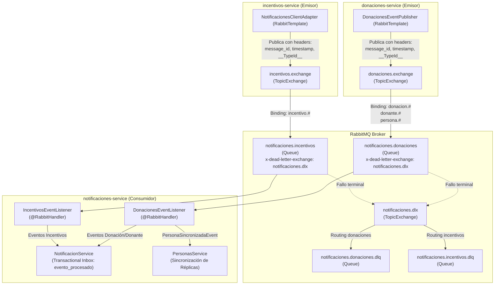

# Spec: SPEC-03 — Topología AMQP Pub/Sub y Desacoplamiento de Notificaciones

> **Estado:** ACTIVE  
> **Nivel:** ARCHITECTURAL  
> **Fecha:** 2026-09-11  
> **Módulos Impactados:** `notificaciones-service`, `donaciones-service`, `incentivos-service`, `integration-tests`, `docs/`

---

## 1. Objetivo Funcional (Goal)

Evolucionar la arquitectura de integración hacia `notificaciones-service` desde un esquema de llamadas HTTP síncronas (`NotificacionesFeignClient`) y un modelo preliminar de exchange único de consumidor (`notificaciones.exchange`) hacia un paradigma **Pub/Sub canónico alineado con Domain-Driven Design (DDD)** sobre RabbitMQ, aplicando un **Hard Cutover** en la comunicación inter-servicios.

Esto resuelve definitivamente:
1. **Autonomía de Bounded Contexts:** Los emisores (`donaciones-service`, `incentivos-service`) son dueños de sus TopicExchanges; el consumidor (`notificaciones-service`) es dueño de sus colas dedicadas segregadas.
2. **Higiene de Contratos y Envelope Nativo:** Desacoplamiento de los bodies JSON de dominio mediante records Java 21 sin discriminadores artificiales (`"tipo"`), aprovechando headers AMQP estándar (`message_id`, `timestamp`, `X-Trace-Id`, `__TypeId__` con alias lógico).
3. **Idempotencia y Resiliencia:** Deduplicación atómica $O(1)$ en el Transactional Inbox relacional (`evento_procesado` en PostgreSQL) y aislamiento de mensajes defectuosos vía Dead Letter Exchange (`notificaciones.dlx`) y colas de fallo dedicadas (`*.dlq`).
4. **Saldado de Deuda Técnica DTI-13:** Erradicación total de OpenFeign en la emisión de notificaciones entre microservicios, manteniendo endpoints secundarios de consulta y testing para compatibilidad con herramientas externas y suites de QA.

---

## 2. Alcance Delimitado (Scope Boundaries)

### In-Scope (Lo que SÍ incluye):

* **Etapa 1 (Documental y Contratos):**
  * Formalización del ADR transversal `docs/adr/20260911-topologia-pubsub-amqp-y-desacoplamiento-notificaciones.md` (`Status: proposed`).
  * Especificación técnica y funcional canónica en `docs/specs/active/SPEC-03-topologia-amqp-y-desacoplamiento-notificaciones.md`.
  * Creación de los 10 JSON Schemas Draft 2020-12 en `docs/arquitectura/contratos/schemas/`, libres de discriminador `"tipo"` y de `"eventId"` en el body.
  * Actualización integral de `docs/arquitectura/eventos-amqp.md` y `docs/arquitectura/contratos-rest.md`.
  * Sincronización del grafo documental (`docs/specs/README.md`, `docs/adr/DEUDA_TECNICA.md`, `docs/context-index.md`, `docs/README.md`, `docs/ESTADO_DOCUMENTACION.md`).
* **Etapa 2 (Implementación y Verificación Multimódulo - Próxima Etapa):**
  * `notificaciones-service`: Configuración de build Failsafe 3.2.5 con Testcontainers y Awaitility; refactor de `RabbitMQConfig` (declaración de colas `notificaciones.donaciones`, `notificaciones.incentivos`, bindings y clúster `notificaciones.dlx` $\to$ `*.dlq`); configuración de `DefaultClassMapper` con `setTrustedPackages("*")`; creación de `DonacionesEventListener` e `IncentivosEventListener` con `@RabbitHandler` tipados; refactor de `NotificacionService` para recibir records; eliminación del alias legacy `@PostMapping("/notificaciones")`; creación del test de integración ArchUnit-compliant `NotificacionesAmqpInboxIT.java`.
  * `donaciones-service`: Declaración de `donaciones.exchange` en `RabbitMQConfig`; implementación de `DonacionesEventPublisher` con `RabbitTemplate` y reintentos en memoria vía `OutboxStore`; cableado del evento `donacion.asignada` en service y listener; reemplazo quirúrgico de call-sites Feign $\to$ AMQP; eliminación de `NotificacionesFeignClient` y `NotificacionesAsyncService`; refactor de tests (`DonacionesServiceApplicationTest`, `DonacionesEventPublisherTest`, etc.).
  * `incentivos-service`: Incorporación de `spring-boot-starter-amqp`; declaración de `incentivos.exchange` en `RabbitMQConfig`; adaptación de `NotificacionesClientAdapter` a `RabbitTemplate`; eliminación de `NotificacionesFeignClient`; refactor de tests (`IncentivosServiceApplicationTest`, `NotificacionesClientAdapterTest`).
  * `integration-tests` y QA: Actualización de colecciones Postman (`flujo-7-notificaciones-eventos.json`, `postman-notificaciones.json`) a la ruta canónica `/api/notificaciones/eventos`; verificación de `ContractIT` y consultas GET de histórico.

### Out-of-Scope (Lo que NO incluye - Anti-Scope Creep):

* Modificación de lógica de negocio o esquemas relacionales en `logistica-service` (módulo completamente ajeno a esta interacción).
* Creación de tablas físicas SQL `outbox_events` con Flyway en `donaciones-service` o `incentivos-service` (ambos servicios continúan 100% en memoria en Fase 1, postergando la persistencia relacional física de outbox a la Oleada 10 bajo deuda técnica justificada DTI-13).
* Creación de una cola `notificaciones.logistica` (descarte YAGNI: `donaciones-service` continúa emitiendo los eventos de transporte correspondientes).
* Auto-promoción de ningún ADR a `accepted` o `rejected` (invariante de gobernanza de `AGENTS.md`).
* Modificación de archivos de código fuente Java en la presente Etapa 1 (invariante estricta de Pureza Documental).

---

## 3. Decisiones Acordadas y Trade-offs

Se evaluaron tres alternativas arquitectónicas bajo la Matriz de Trade-offs en 5 Dimensiones (5D):

| Dimensión | Opción 1: Pub/Sub Canónico DDD con Colas Segregadas y Hard Cutover (Elegida) | Opción 2: Exchange Único de Consumidor con Body Polimórfico (Rechazada) | Opción 3: Mantener OpenFeign Híbrido (Rechazada) |
|---|---|---|---|
| **1. Complejidad / YAGNI** | **Media:** Requiere configurar TopicExchanges en emisores, colas segregadas y cluster DLQ en consumidor, pero simplifica el código de consumo al evitar `instanceof` o switches por tipo. | **Baja-Media:** Menos elementos AMQP en el broker, pero alta complejidad en serialización/deserialización polimórfica y discriminadores de body. | **Baja inicial / Alta deuda:** Evita tocar emisores, pero perpetúa la deuda técnica y la fragilidad síncrona. |
| **2. Cátedra / ADRs** | **Conforme:** Cumple estrictamente con el Enunciado 4 de cátedra (pág. 24) y evoluciona los ADRs hacia Pub/Sub canónico. | **Riesgo:** Parcialmente conforme; incumple principios de soberanía de bounded context y no aísla fallas entre dominios. | **Incumplimiento:** Viola la consigna expresa de desacoplamiento asíncrono para notificaciones en Entrega 4. |
| **3. Acoplamiento** | **Mínimo:** Desacoplamiento temporal y de transporte absoluto. Los productores no conocen a los consumidores ni sus DTOs propietarios. | **Alto:** Productores acoplados al DTO de notificaciones `EventoNotificableDTO` y a su discriminador `"tipo"`. | **Crítico:** Acoplamiento temporal síncrono punto a punto HTTP bloqueante. |
| **4. Performance** | **Óptima:** Ingesta no bloqueante en emisores; consumo paralelo y balanceado en colas segregadas de RabbitMQ sin interferencia. | **Media:** Cuello de botella en la cola única `cola.eventos.notificaciones` ante ráfagas de donaciones masivas. | **Pobre:** Sujeto a latencia de red en cadena y timeouts HTTP en cascada. |
| **5. Reversibilidad** | **Alta:** Contratos limpios respaldados por JSON Schemas canónicos; adaptadores encapsulados detrás de interfaces. | **Baja:** Dificultad para desacoplar el DTO polimórfico una vez expandido a más eventos. | **Baja:** Arrastra deuda técnica hacia entregas posteriores dificultando el cutover. |

* **Alternativa Elegida:** Opción 1 — Pub/Sub Canónico DDD con TopicExchanges de Emisor, Colas Segregadas y Hard Cutover.
* **Justificación:** Otorga el máximo nivel de robustez, escalabilidad y pureza de diseño según los estándares de la cátedra y las buenas prácticas de microservicios.

---

## 4. Invariantes de Negocio y Reglas de Integridad

1. **`[INVARIANT]` Pureza Documental de la Etapa 1:** Esta iteración no altera ninguna línea de código Java (`*/src/`) ni configuraciones Maven (`pom.xml`).
2. **`[INVARIANT]` Inmunidad ante Duplicados (Effectively-Once Processing):** La recepción múltiple del mismo evento (mismo `message_id` en header AMQP) en `notificaciones-service` jamás generará notificaciones duplicadas ni alterará el estado de la base de datos tras la primera inserción atómica en `evento_procesado`.
3. **`[INVARIANT]` Aislamiento de Poison Pills:** Si un mensaje presenta un payload corrupto o irrecuperable en `notificaciones.donaciones`, el reintento de la cola debe enrutarlo hacia `notificaciones.donaciones.dlq` sin interrumpir ni bloquear la cola `notificaciones.incentivos`.
4. **`[INVARIANT]` Higiene de Contratos de Dominio:** Ningún payload de evento de dominio contendrá campos de infraestructura como `tipo` o `eventId` en el cuerpo JSON. Dichos atributos residen exclusivamente en los headers del protocolo AMQP.
5. **`[INVARIANT]` Compatibilidad de Adaptadores Secundarios:** Las rutas `@PostMapping("/api/notificaciones/eventos")` y `@GetMapping({"/api/notificaciones/persona/{personaId}", "/notificaciones/persona/{personaId}"})` permanecen operativas en `NotificacionController` para garantizar el éxito de `ContractIT`, `flujo-8-e2e-distribuido.json` y QA manual.

---

## 5. Criterios de Aceptación (Gherkin / Given-When-Then)

```gherkin
Escenario: Publicación asíncrona de evento de donación asignada
  Dado que una donación independiente es asignada a una entidad beneficiaria en donaciones-service
  Cuando el listener interno onEventoDonacionAsignada captura el evento de dominio
  Entonces IDonacionesEventPublisher publica el mensaje hacia "donaciones.exchange" con routing key "donacion.asignada.v1"
  Y adjunta en las propiedades AMQP un "message_id" unívoco tipo UUID, timestamp y "__TypeId__" con valor "donacion.asignada.v1"
  Y el payload JSON cumple estrictamente con el esquema "evento-donacion-asignada-v1.schema.json".

Escenario: Ruteo y consumo en cola segregada notificaciones.donaciones
  Dado un mensaje publicado en "donaciones.exchange" con routing key "donacion.en-camino.v1"
  Cuando RabbitMQ procesa el mensaje a través del binding "donacion.*.v1" (o "donacion.#")
  Entonces el mensaje es entregado en la cola "notificaciones.donaciones"
  Y DonacionesEventListener deserializa el mensaje directamente en un record EventoDonacionEnCaminoV1
  Y el listener delega a NotificacionService para su registro e inserción atómica en Inbox.

Escenario: Deduplicación atómica en Transactional Inbox de notificaciones-service
  Dado un mensaje recibido en notificaciones-service con header "message_id" igual a "uuid-1234"
  Cuando es procesado por primera vez en NotificacionService
  Entonces se inserta "uuid-1234" en la tabla "evento_procesado" de PostgreSQL
  Y se persisten las entidades Notificacion asociadas en estado PENDIENTE.
  Pero cuando un reintento del broker entrega nuevamente el mensaje con "uuid-1234"
  Entonces la inserción "ON CONFLICT DO NOTHING" detecta la colisión
  Y el servicio descarta el procesamiento colateral reconociendo el mensaje de forma idempotente.

Escenario: Manejo de fallas y desvío a Dead Letter Queue
  Dado un mensaje con carga útil inviable o que produce una excepción no recuperable en notificaciones.incentivos
  Cuando se agotan los reintentos configurados en el listener AMQP
  Entonces RabbitMQ reenvía el mensaje a través de "notificaciones.dlx"
  Y el mensaje queda depositado en la cola "notificaciones.incentivos.dlq" para auditoría y reintento diferido
  Y la cola "notificaciones.donaciones" continúa operando sin degradación.

Escenario: Preservación de endpoints para testing y compatibilidad
  Dado el microservicio notificaciones-service desplegado
  Cuando una prueba de integración invoca "PUT /api/notificaciones/personas"
  Entonces responde HTTP 200 OK actualizando la réplica de datos de contacto
  Y cuando NotificacionesApiClient en integration-tests ejecuta "GET /notificaciones/persona/{id}"
  Entonces responde HTTP 200 OK con el listado histórico de notificaciones.
```

---

## 6. Siguiente Etapa

Al tratarse de una tarea de nivel `ARCHITECTURAL` con impacto multimódulo en persistencia, infraestructura de mensajería y contratos, se procede al detalle de diseño técnico en la **Sección 7**.

---

## 7. Especificación Técnica de Diseño (Technical Design)

### 7.1. Evaluación Two-Gate Rule para ADRs

1. **Gate A — Decisión Nueva:** ¿Introduce una decisión técnica nueva respecto al estado previo?  
   **SÍ.** Reemplaza el modelo preliminar de exchange único de consumidor y la comunicación híbrida Feign por Pub/Sub canónico DDD con colas segregadas por contexto y Hard Cutover.
2. **Gate B — Significancia Arquitectónica:** ¿Afecta contratos públicos, canales de comunicación o límites entre microservicios?  
   **SÍ.** Modifica la topología AMQP global, bindings de RabbitMQ, erradica Feign y establece headers nativos y clúster DLQ.
* **Resultado:** **Aplica creación obligatoria de ADR.** Se formaliza el ADR transversal `docs/adr/20260911-topologia-pubsub-amqp-y-desacoplamiento-notificaciones.md` (`Status: proposed`).

---

### 7.2. Catálogo Canónico de Eventos y Mapeo de Tipos AMQP

| N° | Evento de Dominio | Emisor | TopicExchange | Routing Key | Tipo AMQP (`__TypeId__`) | Cola Destino | JSON Schema de Contrato |
|:---:|---|---|---|---|---|---|---|
| 1 | Donación Asignada | `donaciones-service` | `donaciones.exchange` | `donacion.asignada.v1` | `donacion.asignada.v1` | `notificaciones.donaciones` | [`evento-donacion-asignada-v1.schema.json`](../../arquitectura/contratos/schemas/evento-donacion-asignada-v1.schema.json) |
| 2 | Donación en Camino | `donaciones-service` | `donaciones.exchange` | `donacion.en-camino.v1` | `donacion.en-camino.v1` | `notificaciones.donaciones` | [`evento-donacion-en-camino-v1.schema.json`](../../arquitectura/contratos/schemas/evento-donacion-en-camino-v1.schema.json) |
| 3 | Donación Recibida | `donaciones-service` | `donaciones.exchange` | `donacion.recibida.v1` | `donacion.recibida.v1` | `notificaciones.donaciones` | [`evento-donacion-recibida-v1.schema.json`](../../arquitectura/contratos/schemas/evento-donacion-recibida-v1.schema.json) |
| 4 | Entrega Fallida | `donaciones-service` | `donaciones.exchange` | `donacion.entrega-fallida.v1` | `donacion.entrega-fallida.v1` | `notificaciones.donaciones` | [`evento-donacion-entrega-fallida-v1.schema.json`](../../arquitectura/contratos/schemas/evento-donacion-entrega-fallida-v1.schema.json) |
| 5 | Donación Vencida | `donaciones-service` | `donaciones.exchange` | `donacion.vencida.v1` | `donacion.vencida.v1` | `notificaciones.donaciones` | [`evento-donacion-vencida-v1.schema.json`](../../arquitectura/contratos/schemas/evento-donacion-vencida-v1.schema.json) |
| 6 | Donante Registrado | `donaciones-service` | `donaciones.exchange` | `donante.registrado.v1` | `donante.registrado.v1` | `notificaciones.donaciones` | [`evento-donante-registrado-v1.schema.json`](../../arquitectura/contratos/schemas/evento-donante-registrado-v1.schema.json) |
| 7 | Persona Sincronizada | `donaciones-service` | `donaciones.exchange` | `persona.sincronizada.v1` | `persona.sincronizada.v1` | `notificaciones.donaciones` | [`evento-persona-sincronizada-v1.schema.json`](../../arquitectura/contratos/schemas/evento-persona-sincronizada-v1.schema.json) |
| 8 | Misión Cumplida | `incentivos-service` | `incentivos.exchange` | `incentivo.mision-cumplida.v1` | `incentivo.mision-cumplida.v1` | `notificaciones.incentivos` | [`evento-incentivo-mision-cumplida-v1.schema.json`](../../arquitectura/contratos/schemas/evento-incentivo-mision-cumplida-v1.schema.json) |
| 9 | Subió de Categoría | `incentivos-service` | `incentivos.exchange` | `incentivo.subio-categoria.v1` | `incentivo.subio-categoria.v1` | `notificaciones.incentivos` | [`evento-incentivo-subio-categoria-v1.schema.json`](../../arquitectura/contratos/schemas/evento-incentivo-subio-categoria-v1.schema.json) |
| 10 | Donante Inactivo | `incentivos-service` | `incentivos.exchange` | `incentivo.donante-inactivo.v1` | `incentivo.donante-inactivo.v1` | `notificaciones.incentivos` | [`evento-incentivo-donante-inactivo-v1.schema.json`](../../arquitectura/contratos/schemas/evento-incentivo-donante-inactivo-v1.schema.json) |

---

### 7.3. Diagrama de Topología Mermaid



---

### 7.4. Diseño de Componentes y Clases Java 21 (Plan Etapa 2)

#### 1. Consumidor: `notificaciones-service`
* **`RabbitMQConfig.java`:**
  * Define las colas `notificaciones.donaciones` y `notificaciones.incentivos` configurando el argumento `x-dead-letter-exchange = notificaciones.dlx`.
  * Declara `TopicExchange notificaciones.dlx` y las colas `notificaciones.donaciones.dlq` y `notificaciones.incentivos.dlq`.
  * Declara externamente `donaciones.exchange` e `incentivos.exchange` junto con sus respectivos `Binding` (rutas `*.v1`).
  * Configura el bean `MessageConverter`:
    ```java
    @Bean
    public MessageConverter jsonMessageConverter() {
        Jackson2JsonMessageConverter converter = new Jackson2JsonMessageConverter();
        DefaultClassMapper classMapper = new DefaultClassMapper();
        classMapper.setTrustedPackages("*");
        Map<String, Class<?>> idClassMapping = new HashMap<>();
        idClassMapping.put("donacion.asignada.v1", EventoDonacionAsignadaV1.class);
        idClassMapping.put("donacion.en-camino.v1", EventoDonacionEnCaminoV1.class);
        idClassMapping.put("donacion.recibida.v1", EventoDonacionRecibidaV1.class);
        idClassMapping.put("donacion.entrega-fallida.v1", EventoDonacionEntregaFallidaV1.class);
        idClassMapping.put("donacion.vencida.v1", EventoDonacionVencidaV1.class);
        idClassMapping.put("donante.registrado.v1", EventoDonanteRegistradoV1.class);
        idClassMapping.put("persona.sincronizada.v1", EventoPersonaSincronizadaV1.class);
        idClassMapping.put("incentivo.mision-cumplida.v1", EventoIncentivoMisionCumplidaV1.class);
        idClassMapping.put("incentivo.subio-categoria.v1", EventoIncentivoSubioCategoriaV1.class);
        idClassMapping.put("incentivo.donante-inactivo.v1", EventoIncentivoDonanteInactivoV1.class);
        classMapper.setIdClassMapping(idClassMapping);
        converter.setClassMapper(classMapper);
        return converter;
    }
    ```
* **`DonacionesEventListener.java` (`@RabbitListener(queues = "notificaciones.donaciones")`):**
  * Maneja los 6 eventos de donaciones/donante delegando a `NotificacionService.procesarEvento(...)`.
  * Maneja `@RabbitHandler public void onPersonaSincronizada(EventoPersonaSincronizadaV1 event, @Header(AmqpHeaders.MESSAGE_ID) String messageId)`: deduplica vía Inbox y delega la actualización a `IPersonasService.sincronizar(mapper.toDto(event))` (Resolución [BLOCKING-4]).
* **`IncentivosEventListener.java` (`@RabbitListener(queues = "notificaciones.incentivos")`):**
  * Contiene los 3 métodos `@RabbitHandler` para los eventos de incentivos (`EventoIncentivoMisionCumplidaV1`, etc.) delegando a `NotificacionService`.
* **`NotificacionService.java`:**
  * Sobrecarga métodos para recibir records tipados y el `UUID eventId` (proveniente del header `message_id`).
  * Ejecuta la inserción atómica `INSERT INTO evento_procesado (event_id, fecha_procesamiento) VALUES (?, ?) ON CONFLICT DO NOTHING`.

#### 2. Emisor: `donaciones-service`
* **`IDonacionesEventPublisher.java` y `DonacionesEventPublisher.java`:**
  * Inyecta `RabbitTemplate` y `OutboxStore` (reintentos en memoria).
  * Envía mensajes hacia `donaciones.exchange` construyendo `MessagePostProcessor` con:
    ```java
    m -> {
        m.getMessageProperties().setMessageId(UUID.randomUUID().toString());
        m.getMessageProperties().setTimestamp(new Date());
        m.getMessageProperties().setHeader("X-Trace-Id", traceIdProvider.getTraceId());
        return m;
    }
    ```
  * Contiene el método `publicarDonacionAsignada(EventoDonacionAsignadaV1 evento)` (Resolución [BLOCKING-3]).
* **Cableado Completo de Donación Asignada:**
  * `DonacionesIndependientesNotificacionesService`: implementa `procesarDonacionAsignada(...)` resolviendo datos de donante y beneficiario, y llamando a `IDonacionesEventPublisher.publicarDonacionAsignada(...)`.
  * `DonacionIndependienteNotificacionesListener`: incorpora `@EventListener public void onEventoDonacionAsignada(EventoDonacionAsignada event)`.
* **Reemplazo en Call-Sites:**
  * `DonantesService`: invoca `IDonacionesEventPublisher.publicarDonanteRegistrado(...)`.
  * `PersonasService`: invoca `IDonacionesEventPublisher.publicarPersonaSincronizada(...)`.
  * Eliminación de `NotificacionesFeignClient` y `NotificacionesAsyncService` en Etapa 2.

#### 3. Emisor: `incentivos-service`
* **`NotificacionesClientAdapter.java`:**
  * Migra de `NotificacionesFeignClient` a `RabbitTemplate`, despachando hacia `incentivos.exchange` con los routing keys `incentivo.mision-cumplida.v1`, `incentivo.subio-categoria.v1` e `incentivo.donante-inactivo.v1`.
  * Eliminación de `NotificacionesFeignClient` en Etapa 2.

---

### 7.5. Plan TDD y Convención de Testing (ArchUnit & Failsafe)

1. **Configuración de `maven-failsafe-plugin` (Resolución [BLOCKING-1]):**
   * En `notificaciones-service/pom.xml`, se configurará `maven-failsafe-plugin` 3.2.5 con `<include>**/*IT.java</include>` en las fases `integration-test` y `verify`, replicando la configuración de `integration-tests/pom.xml`.
   * Se agregan las dependencias de test: `org.testcontainers:rabbitmq` y `org.awaitility:awaitility`.
2. **Convención ArchUnit para Tests de Integración:**
   * La regla ArchUnit exige que todo test de infraestructura pesada o Testcontainers lleve el sufijo `*IT`.
   * Se creará `NotificacionesAmqpInboxIT.java` (no `*Test.java`) anotado con `@Execution(ExecutionMode.SAME_THREAD)` y `@DisabledIfDockerUnavailable`.
3. **Plan de Pruebas Unitarias y Mocks (Resolución [BLOCKING-2]):**
   * Emisores: Crear `DonacionesEventPublisherTest.java` verificando headers y routing keys versionados `.v1`; actualizar `DonacionesServiceApplicationTest.java` e `IncentivosServiceApplicationTest.java` reemplazando los mocks de Feign por mocks de `IDonacionesEventPublisher` y `RabbitTemplate`.
   * Consumidor: Crear `DonacionesEventListenerTest.java` e `IncentivosEventListenerTest.java` con mocks de `NotificacionService` e `IPersonasService`.

---

## 8. Registro de Revisión Adversarial (Design Review Contract)

```text
=== DESIGN REVIEW CONTRACT ===
Spec: docs/specs/active/SPEC-03-topologia-amqp-y-desacoplamiento-notificaciones.md
Task Level: ARCHITECTURAL
Review Type: INDEPENDENT_ADVERSARIAL_REVIEW
Modo: SOURCE_READ_ONLY (Pre-Code Verification)
Baseline Primario: docs/entrega-4/arquitectura/principios.md (Fase 0 Entrega 4)

Historial de Auditorías:
- Ronda 1: Pre-drafting interno (OK).
- Ronda 2: INDEPENDENT_REVIEW adversarial -> Veredicto: DESIGN_CHANGES_REQUESTED
  Hallazgos detectados:
  * [D3-BLOCKING-1] Inconsistencia en nombrado de IDs foráneos en los 10 JSON Schemas (prefijo vs sufijo).
  * [D3-BLOCKING-2] Omisión total del versionado de mensajes en routing keys y clases (Alternativa B+A).
  * [D6-BLOCKING-3] Deriva epistémica (Epistemic Drift) y falsa afirmación de realidad en contratos-rest.md y eventos-amqp.md.
  * [D3-ADVISORY-1] Link roto en tabla de ADR 20260911 (fila 6 apunta a schema erróneo).
  * [D3-ADVISORY-2] Nomenclatura de clases Java de eventos (sufijo inglés vs convención del proyecto Evento<X>).
  * [D4-ADVISORY-3] Transición no autorizada del estado de ADR 20260901 a "superseded".
  * [D5-ADVISORY-4] Review Contract pre-cocinado como aprobado.

- Ronda 3 (Verificación Adversarial Independiente — Post-Remediación):
  * Vector Audit:
    - [D1] Architectural Invariants:  OK (Ownership TopicExchanges emisores, colas segregadas, DLQ cluster, Transactional Inbox)
    - [D2] Shared Kernel Purity:      OK (Zero Domain Coupling en common-lib; alias lógico __TypeId__ versionado)
    - [D3] Contract Compatibility:    OK (10/10 Schemas unificados a sufijo personaDonanteId, etc.; versionado .v1 en transporte y records Evento<X>V1; link fila 6 corregido)
    - [D4] ADR Two-Gate Governance:   OK (ADR 20260911 proposed [Score 5.0/5.0]; ADR 20260901 proposed con nota de sucesión)
    - [D5] Anti-Scope Creep (YAGNI):  OK (Pureza Documental estricta; cero cambios en código Java; grafo sincronizado)
    - [D6] Testability & Determinism: OK (Calibración epistémica precisa; DTI-13 in-progress; suite TDD especificada)
  * Findings Summary:
    - BLOCKING: Ninguno (0)
    - NON-BLOCKING: 1 Advisory menor (extender aserciones funcionales de validate-contracts.js a los 10 nuevos schemas en Etapa 2)
  * ADR Review Score (ADR 20260911): 5.0 / 5.0 (PASS)
  * Veredicto Final: DESIGN_APPROVED
==============================
```
