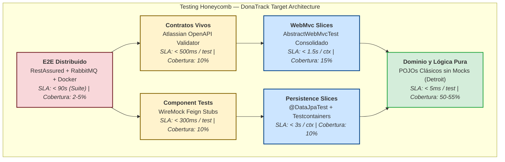
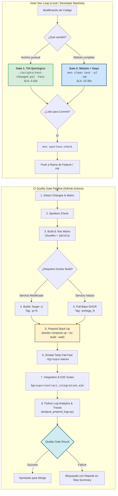
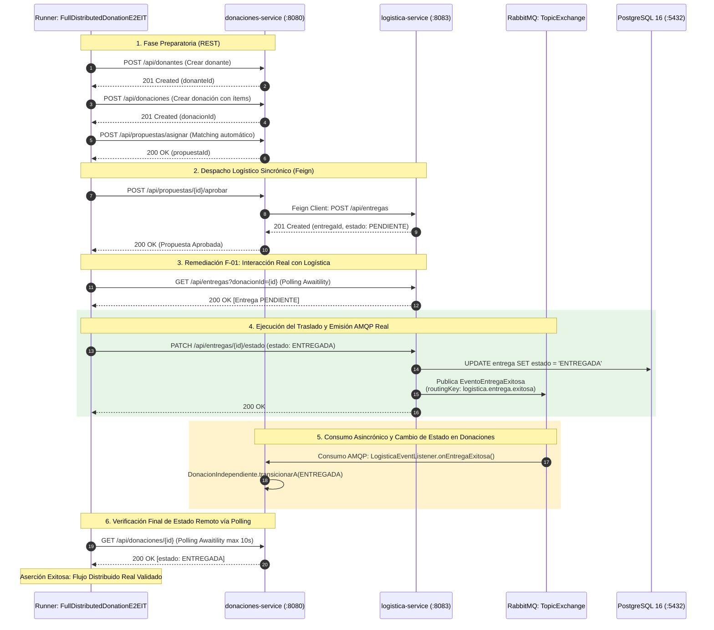

# Auditoría y Blueprint de Arquitectura de Testing y QA en DonaTrack

> **Plataforma de Logística, Trazabilidad y Fidelización de Donaciones**  
> **Ámbito Académico:** UTN-FRBA — Diseño de Sistemas (2026) — Grupo 5  
> **Documento:** Informe Maestro de Auditoría Factual, Diagnóstico Crítico, Estudio Comparativo, Evaluación Adversarial y Blueprint Target de Testing y QA  
> **Versión:** 1.0.0  
> **Fecha:** 2026-09-08  
> **Estado:** Aprobado para Revisión Arquitectónica  
> **Normativa de Gobierno:** Cumplimiento estricto de `AGENTS.md` (Taxonomía Epistémica §3, Invariantes §4, Pirámide de Validación §11).

---

## 1. Encabezado, Metadatos y Marco Epistemológico

### 1.1 Identificación y Alcance Operativo

* **`[DOCUMENTED]` Propósito del Documento:** Consolidar en una única fuente canónica la radiografía empírica integral del parque de pruebas automatizadas de DonaTrack, formalizar la matriz de patologías y fortalezas arquitectónicas detectadas en el código fuente, dirimir comparativamente las alternativas tecnológicas de ingeniería de pruebas mediante matrices multicriterio, someter los trade-offs a un escrutinio adversarial escéptico y establecer el Blueprint de Arquitectura Target de Testing y QA junto con su roadmap de transición en tres fases y sus candidatos preliminares a ADR.
* **`[DOCUMENTED]` Bounded Contexts y Topología Monorepo:** DonaTrack opera como un monorepo modular Maven bajo Java 21 y Spring Boot 4.0.7 / Spring Cloud 2025.1.1, integrado por:
  1. `common-lib`: Shared Kernel, contratos de repositorios genéricos en memoria y JPA, eventos de dominio transversales, trazabilidad distribuida MDC (`X-Trace-Id`) y extensiones JUnit 5.
  2. `donaciones-service` (Puerto 8080): Gestión de donaciones, entidades beneficiarias, donantes, items, necesidades y algoritmos de matching semántico.
  3. `notificaciones-service` (Puerto 8081): Comunicaciones multicanal (Email, WhatsApp, SMS vía adaptadores), plantillas, Inbox Pattern y persistencia relacional PostgreSQL 16 activa.
  4. `incentivos-service` (Puerto 8082): Gamificación, misiones basadas en Template Method, insignias, rachas mensuales y ranking de colaboradores.
  5. `logistica-service` (Puerto 8083): Gestión de camiones, choferes, entregas, rutas y planificación logística de traslados.
  6. `integration-tests`: Suite de integración distribuida y pruebas de caja negra HTTP basadas en RestAssured, Awaitility y validación de contratos OpenAPI Atlassian contra el entorno Docker Compose preproducción.
  7. `auth-service` y `cliente-liviano`: Bounded contexts reservados formalmente para entregas curriculares posteriores (stubs no incluidos en el reactor).

### 1.2 Taxonomía Epistémica de Integridad (`AGENTS.md` §3)

Para garantizar la honestidad intelectual, la verificabilidad científica y evitar alucinaciones o asunciones infundadas, toda afirmación técnica en esta auditoría se clasifica explícitamente mediante la siguiente taxonomía:

* **`[OBSERVED]`**: Hecho comprobado directamente en el código fuente Java, archivos `pom.xml`, scripts de shell/PowerShell, workflows de GitHub Actions o configuraciones locales del repositorio.
* **`[DOCUMENTED]`**: Regla, requerimiento o decisión formalizada en un ADR aprobado, especificación de diseño o enunciado curricular de cátedra.
* **`[INFERRED]`**: Deducción lógica o hipótesis técnica derivada rigurosamente a partir de hechos observables o documentados.
* **`[PROPOSED]`**: Solución, patrón, refactor o arquitectura objetivo recomendada que aún no existe en el código de producción.
* **`[REJECTED]`**: Alternativa evaluada y descartada explícitamente por costo, complejidad excesiva, fragilidad o desvío de los objetivos académicos.
* **`[VERIFIED]`**: Comportamiento, métrica o resultado confirmado mediante la ejecución efectiva de comandos de prueba, linters o herramientas de automatización.

### 1.3 Marco Teórico y Bibliografía Canónica

Esta auditoría y su blueprint target se fundamentan en el estado del arte de la ingeniería de software y la literatura canónica de testing de software:

1. **Vladimir Khorikov (*Unit Testing: Principles, Practices, and Patterns*, 2020):**
   * *Los Cuatro Pilares del Buen Unit Test:* Protección contra regresiones, resistencia al refactor (*resistance to refactoring*), retroalimentación rápida (*fast feedback*) y facilidad de mantenimiento.
   * *Anti-patrones de Mockeo:* Identificación del sobre-mockeo en dependencias estables y deterministas (mappers, utilidades) como causa primaria de fragilidad (*brittle tests*) y acoplamiento a detalles de implementación.
   * *Escuelas de Testing:* Síntesis entre la Escuela Clásica (Detroit) para el dominio y lógica de negocio pura, y la Escuela Londres (Mockista) acotada estrictamente a puertos de frontera out-of-process.
2. **Gerard Meszaros (*xUnit Test Patterns: Refactoring Test Code*, 2007):**
   * *Taxonomía de Test Doubles:* Distinción formal entre Dummy, Stub, Spy, Mock y Fake (repositorio en memoria).
   * *Olores de Código de Pruebas (Test Smells):* Detección de *Fragile Test*, *Obscure Test*, *Shared Mutable State Contamination*, *Context Churn* y *Assertion Roulette*.
   * *Patrones de Creación de Datos:* Object Mother y Test Data Builder fluido.
3. **Martin Fowler (*The Practical Test Pyramid*, *Testing Strategies in a Microservice Architecture*, 2014-2018):**
   * Estratificación de pruebas en microservicios: Unitarias, Componente (en proceso con Stubs), Integración (boundary crossing), Contrato (CDC/OpenAPI) y End-to-End (E2E).
   * El concepto de *Testing Honeycomb* (Spotify / Fowler) como modelo superador de la pirámide clásica en arquitecturas distribuidas orientadas a eventos.
4. **Google Software Engineering (*Software Engineering at Google*, Titus Winters, Tom Manshreck, Hyrum Wright, 2020):**
   * Dimensionamiento operativo de pruebas: *Small Tests* (un único proceso, sin I/O, sin red, <100ms), *Medium Tests* (múltiples procesos en localhost, base de datos local efímera, <5s) y *Large Tests* (distribuidos, red real, out-of-process, <15min).
   * Filosofía de hermeticidad y determinismo: erradicación de estados compartidos no reseteables y eliminación de dependencias de temporizadores arbitrarios (`Thread.sleep`).
5. **Estándares Internacionales ISO/IEC/IEEE 29119 e IEEE 829:**
   * *ISO/IEC/IEEE 29119 (Software Testing):* Procesos de prueba por niveles (Unitario, Integración, Sistema), técnicas de diseño basadas en caja negra y caja blanca, y aseguramiento de trazabilidad bidireccional de requisitos.
   * *IEEE 829 (Standard for Software and System Test Documentation):* Rigor estructural en reportes de incidentes, matrices de diagnóstico y planes de verificación.

---

## 2. Relevamiento Empírico de Campo (R1)

### 2.1 Censo Factual y Cuantitativo del Parque de Pruebas

* **`[OBSERVED]` Dimensión del Corpus de Pruebas:** Mediante inspección exhaustiva de los árboles de código (`src/test/java/`) en los 6 módulos del monorepo, se comprueba la existencia de **232 archivos Java de prueba**, de los cuales **191 son clases ejecutables de test** y **41 son artefactos auxiliares** (Object Mothers, Test Data Builders, Clases Base, DTOs de prueba y Fixtures).
* **`[OBSERVED]` Métodos de Prueba Totales:** El sistema alberga exactamente **1.191 métodos ejecutables** anotados con `@Test` o `@ParameterizedTest`.

#### Tabla I: Distribución Exhaustiva de Archivos y Tests por Módulo
| Módulo | Archivos Java (`src/test`) | Clases Ejecutables | Helpers / Fixtures / Mothers | Métodos `@Test` | % del Parque Total |
| :--- | :---: | :---: | :---: | :---: | :---: |
| **`common-lib`** | 13 | 13 | 0 | 60 | 5.0% |
| **`donaciones-service`** | 86 | 76 | 10 | 419 | 35.2% |
| **`logistica-service`** | 40 | 35 | 5 | 320 | 26.9% |
| **`notificaciones-service`** | 29 | 25 | 4 | 148 | 12.4% |
| **`incentivos-service`** | 39 | 34 | 5 | 219 | 18.4% |
| **`integration-tests`** | 25 | 8 | 17 | 25 | 2.1% |
| **TOTAL CONSOLIDADO** | **232** | **191** | **41** | **1.191** | **100.0%** |

#### Tabla II: Distribución por Estrategia de Testing (Pirámide Empírica)
| Estrategia Operacional | Definición Técnica | Clases | Métodos `@Test` | % Tests | SLA Ejecución |
| :--- | :--- | :---: | :---: | :---: | :---: |
| **`PureUnitPojo`** | Unitarios puros sin Spring, sin Mockito, sin I/O (School Detroit) | 90 | 641 | 53.8% | < 5 ms / clase |
| **`UnitWithMocks`** | Aislamiento con Mockito (`@Mock`, `@InjectMocks`, `@ExtendWith`) | 67 | 347 | 29.1% | < 50 ms / clase |
| **`WebMvcSlice`** | Slice de controlador HTTP Spring Boot (`@WebMvcTest` + MockMvc) | 20 | 163 | 13.7% | 300 - 900 ms / ctx |
| **`DataJpaSlice`** | Slice de persistencia ORM (`@DataJpaTest` + Testcontainers Postgres) | 1 | 3 | 0.3% | ~2.5 s / container |
| **`ArchUnit`** | Reglas arquitectónicas de compilación (Fitness Functions) | 5 | 17 | 1.4% | ~200 ms / suite |
| **`FullSpringBootTest`**| Contexto completo integrado Spring Boot (`@SpringBootTest`) | 4 | 5 | 0.4% | ~3.0 s / ctx |
| **`Integration/E2E`** | Caja negra HTTP distribuida RestAssured + Awaitility (`integration-tests`) | 8 | 25 | 2.1% | 15 - 45 s suite |
| **TOTAL** | *(Excluye los 41 archivos auxiliares de infraestructura de pruebas)* | **191** | **1.191** | **100.0%** | — |

* **`[INFERRED]` Morfología de la Pirámide:** A nivel puramente cuantitativo, la base no está invertida: el **82.9% de los tests (988 tests)** son unitarios (53.8% POJO puros y 29.1% con mocks), el **14.0% (166 tests)** son slices de Spring Boot, y únicamente el **2.5% (30 tests)** involucra contextos completos o infraestructura distribuida E2E.

#### Tabla III: Distribución por Capa Arquitectónica de Negocio
| Capa Arquitectónica | Clases de Test | Tests Totales | Tests Puros (sin mock) | Tests con Mockito |
| :--- | :---: | :---: | :---: | :---: |
| **Dominio (`models.entities`, `algoritmos`, `domain`)** | 52 | 462 | 424 (48 clases) | 38 (4 clases) |
| **Servicios de Aplicación (`services`)** | 33 | 195 | 11 (2 clases) | 184 (31 clases) |
| **Controladores REST (`controllers`)** | 26 | 189 | 36 (6 clases) | 153 (20 clases) |
| **DTOs, Validaciones y Mappers (`dto`, `mappers`)** | 20 | 138 | 138 (20 clases) | 0 (0 clases) |
| **Infraestructura, Listeners y Schedulers (`infra`)** | 19 | 54 | 18 (7 clases) | 36 (12 clases) |
| **Repositorios y Adaptadores (`repositories`)** | 8 | 40 | 31 (7 clases) | 9 (1 clase) |
| **Arquitectura (`architecture` / ArchUnit)** | 5 | 17 | 17 (5 clases) | 0 (0 clases) |
| **E2E / Integración Distribuida (`integration-tests`)** | 8 | 25 | 25 (8 clases) | 0 (0 clases) |
| **Otras Utilidades / Handlers (`handlers`, `logging`)** | 20 | 71 | 42 (13 clases) | 29 (7 clases) |

---

### 2.2 Diagnóstico de Sobrecarga de Framework y Slicing (Spring Context Overhead)

#### A. Ocurrencias de `@SpringBootTest` (Contexto Completo)
* **`[OBSERVED]` Censo de Contextos Completos:** Existen exactamente **4 clases con `@SpringBootTest` en todo el repositorio**, que ejecutan **5 métodos de prueba**:
  1. `notificaciones-service/src/test/java/grupo5/notificaciones/NotificacionesServiceApplicationTests.java` (L6-L10): 1 test (`contextLoads()`).
  2. `incentivos-service/src/test/java/grupo5/incentivos/IncentivosServiceApplicationTest.java` (L8-L15): 1 test (`contextLoads()`), con `webEnvironment = NONE` y `@MockitoBean private NotificacionesFeignClient client`.
  3. `donaciones-service/src/test/java/grupo5/donaciones/DonacionesServiceApplicationTest.java` (L20-L41): 2 tests (`contextLoads()` y verificación asíncrona), con 3 `@MockitoBean` para clientes Feign (`NotificacionesFeignClient`, `IncentivosFeignClient`, `LogisticaFeignClient`).
  4. `logistica-service/src/test/java/grupo5/logistica/integration/PlanificacionManualFlowIntegrationTest.java` (L34-L40): 1 test de integración del flujo de cron manual de planificación.
* **`[OBSERVED]` Custodia de ArchUnit:** Las reglas de arquitectura en `ArchitectureFitnessTest.java` de los microservicios restringen explícitamente el uso de `@SpringBootTest` para prevenir la degradación de tiempos unitarios, forzando exclusiones nominales específicas para estas 4 clases.

#### B. Slices WebMvc (`@WebMvcTest`) y el Fenómeno de Context Churn
* **`[OBSERVED]` Asimetría de Diseño en Slices Web:** Se comprueba una disparidad de madurez arquitectónica radical entre microservicios:
  * **Consolidación Óptima en `donaciones-service`:** La clase base `AbstractDonacionesWebMvcTest.java` (L35-L50) consolida los 10 controladores REST del servicio en una única anotación:
    ```java
    @WebMvcTest({
      CategoriasController.class, DonacionesController.class, DonacionesIndependientesController.class,
      DonantesController.class, EntidadBeneficiariaController.class, ItemDonacionNormalizadoController.class,
      NecesidadesController.class, PersonasController.class, PropuestaDeAsignacionController.class,
      SubcategoriasController.class
    })
    @Import({CommonLibAutoConfiguration.class, LoggingAutoConfiguration.class})
    @Execution(ExecutionMode.SAME_THREAD)
    @ResourceLock("donaciones-webmvc-context")
    public abstract class AbstractDonacionesWebMvcTest { ... }
    ```
    Spring Boot calcula una única clave de caché para el `ApplicationContext`, logrando que las 10 suites derivadas (56 tests) compartan el contexto en memoria, reduciendo el tiempo total de la capa web a ~3.2 segundos y eliminando race conditions mediante `@ResourceLock`.
  * **Fragmentación y Context Churn en `logistica-service`:** Existen **7 declaraciones disjuntas de `@WebMvcTest`**:
    1. `CamionesControllerTest.java` (L30): `@WebMvcTest(CamionesController.class)`
    2. `ChoferesControllerTest.java` (L35): `@WebMvcTest(ChoferesController.class)`
    3. `EntregasControllerTest.java` (L35): `@WebMvcTest(EntregasController.class)`
    4. `RutasControllerTest.java` (L35): `@WebMvcTest(RutasController.class)`
    5. `PlanificacionControllerTest.java` (L31): `@WebMvcTest(PlanificacionController.class)`
    6. `PlanificacionManualControllerTest.java` (L18): `@WebMvcTest(PlanificacionManualController.class)`
    7. `ValidacionHttpTest.java` (L51-L57): `@WebMvcTest({ CamionesController.class, ... })`
  * **`[INFERRED]` Impacto del Context Churn:** Cada configuración produce una clave de caché distinta en el `TestContextManager` de Spring. Esto fuerza **7 inicializaciones completas de context slices**, multiplicando por 7 el overhead de inyección de dependencias, escaneo de componentes y descarte/recreación de beans en memoria.
  * **Patrón Alternativo en `incentivos-service`:** Consolida validaciones HTTP en `ControllersWebMvcValidationTest.java` (16 tests bajo un único contexto), mientras que las 6 suites funcionales de controladores se prueban como clases POJO puras con `@ExtendWith(MockitoExtension.class)` sin arrancar Spring.

---

### 2.3 El "Data Persistence Void" (El Vacío de Persistencia en Slices)

* **`[OBSERVED]` Cero Tests JPA en el 75% de los Microservicios:** En `donaciones-service`, `logistica-service` e `incentivos-service` **no existe ninguna prueba anotada con `@DataJpaTest`**. Sus `pom.xml` no incluyen `spring-boot-starter-data-jpa` en scope test ni dependencias de Testcontainers PostgreSQL.
* **`[OBSERVED]` Implementación en Memoria:** Los 3 servicios mencionados resuelven el almacenamiento mediante repositorios en memoria basados en `CrudRepositoryEnMemoria` (`ConcurrentHashMap`).
* **`[OBSERVED]` Excepción Única en `notificaciones-service`:** Únicamente `notificaciones-service` implementa persistencia relacional real con PostgreSQL 16 y cuenta con una prueba dedicada de slice de persistencia:
  `RepositoriosJpaTest.java` (L37-L58):
  ```java
  @DataJpaTest
  @ActiveProfiles("postgres")
  @AutoConfigureTestDatabase(replace = AutoConfigureTestDatabase.Replace.NONE)
  @Import({
    PersonaPersistenciaMapper.class, NotificacionPersistenciaMapper.class,
    PersonaRepositoryJpaAdapter.class, NotificacionRepositoryJpaAdapter.class
  })
  @Testcontainers
  @DisabledIfDockerUnavailable
  class RepositoriosJpaTest {
    @Container @ServiceConnection
    static PostgreSQLContainer<?> postgres = new PostgreSQLContainer<>("postgres:16-alpine")
        .withDatabaseName("donatrack")
        .withUsername("admin")
        .withPassword("admin_secure_password")
        .withInitScript("persistencia/init-db/01-init-schemas-roles.sql");
  ```
* **`[INFERRED]` Vulnerabilidad de Integración Temprana:** Salvo en notificaciones, el sistema carece de *Medium Tests* para validar sintaxis de queries JPQL, mapeos `@Entity`, restricciones de integridad referencial de clave foránea, triggers o scripts de migración Flyway. Cualquier discrepancia entre las entidades Java y el motor relacional no se manifiesta en Gate 1 ni Gate 2, quedando latente hasta la ejecución tardía del stack Docker Compose en Gate 4.

---

### 2.4 Arquitectura y Patrones del Módulo `integration-tests`

* **`[OBSERVED]` Runner de Caja Negra Desacoplado de Spring (`pom.xml:14-97`):** El módulo `integration-tests` no importa `spring-boot-starter-test` ni `@SpringBootTest`. Opera como un ejecutor de pruebas de caja negra en Java puro que interactúa contra el cluster mediante HTTP RestAssured (`io.rest-assured:rest-assured:6.0.0`).
* **`[OBSERVED]` Desactivación por Defecto:** Posee `<skipTests>true</skipTests>` en sus propiedades para no frenar la compilación regular del reactor (`mvn test`), requiriendo activación explícita vía `-DskipTests=false` en Gate 3/4.
* **`[OBSERVED]` Driver Pattern (`client/`):**
  * `DonacionesApiClient.java` (170 líneas), `NotificacionesApiClient.java` (27 líneas), `IncentivosApiClient.java` (84 líneas) y `LogisticaApiClient.java` (76 líneas). Encapsulan endpoints REST exponiendo métodos tipados `*Ok` que asertan HTTP 201/200 y retornan identificadores UUID.
* **`[OBSERVED]` Test Data Builders Fluidos y DTOs Desacoplados:**
  * `PersonaTestDataBuilder.java`, `DonacionTestDataBuilder.java` y `NecesidadTestDataBuilder.java`.
  * La suite define sus propios DTOs como **Java Records inmutables locales** (`PersonaTestDTO`, `DonacionTestDTO`, etc.), desacoplándose por completo de los DTOs de producción de los microservicios para evitar falsos positivos por compatibilidad de classpath binario.
* **`[OBSERVED]` Artefactos Huérfanos (Fixtures Muertos):**
  * En `integration-tests/src/test/resources/fixtures/` existen **7 archivos JSON** (`crear-donacion.json`, `crear-persona-humana.json`, etc.). El análisis estático confirma que **ningún archivo en todo el repositorio los referencia**. Fueron sustituidos por los Test Data Builders y representan código muerto residual.
* **`[OBSERVED]` Sondeos Asincrónicos con Awaitility (`PollingUtils.java`):**
  * Erradicación total de `Thread.sleep`. Siete funciones de sondeo declarativo (`esperarReplicacionPersona`, `esperarDonacionEstado`, etc.) con intervalos de 100-300ms y timeouts de 5-10s.
  * Captura de fallos diagnósticos: Ante un `ConditionTimeoutException`, arroja un `AssertionError` estructurado que imprime el último código HTTP recibido y el cuerpo textual de la respuesta (`Status: 500, Body: {...}`).
* **`[OBSERVED]` Aislamiento Puramente Sintético y Cero Teardown:**
  * **Cero rutinas de limpieza:** Ausencia absoluta de anotaciones `@AfterEach`, `@AfterAll` o invocaciones a endpoints de truncado/reset.
  * **Generación sintética (`TestIdGenerator.java`):** El aislamiento depende enteramente de generar DNIs atómicos (`randomDni()`), CUITs únicos (`randomCuit()`), correos con prefijo y UUID (`randomEmail()`) y nombres de bienes con sufijos aleatorios (`uniqueItemName()`).

---

### 2.5 Infraestructura de Ejecución, Ambientes y CI/CD

* **`[OBSERVED]` Desacoplamiento de Build en Docker (`docker-compose.preprod.yml` vs `Dockerfile`):**
  * Los 4 servicios utilizan en preproducción el stage `target: ci` de su `Dockerfile`, el cual toma como base `eclipse-temurin:21-jre-alpine` y monta directamente el fat JAR compilado previamente en el host o runner:
    ```dockerfile
    FROM eclipse-temurin:21-jre-alpine AS ci
    ARG JAR_FILE
    COPY --chown=appuser:appgroup ${JAR_FILE} app.jar
    ENTRYPOINT ["java", "-XX:+UseContainerSupport", "-XX:MaxRAMPercentage=75.0", "-XX:+ExitOnOutOfMemoryError", "-jar", "app.jar"]
    ```
  * Esto elimina la necesidad de ejecutar Maven dentro de los contenedores Docker en tiempo de prueba, reduciendo el arranque del stack a ~30 segundos si los JARs ya existen.
* **`[OBSERVED]` Aislamiento de Red Hermético:**
  * En `docker-compose.preprod.yml`, los contenedores de `donatrack-postgres`, `rabbitmq` y `donatrack-minio` no mapean ningún puerto hacia el host (red `preprod-network`). Solo exponen los puertos HTTP de los 4 microservicios (`8080`, `8081`, `8082`, `8083`) y n8n (`5678`). Se previene cualquier colisión con servicios que el desarrollador tenga corriendo localmente.
* **`[OBSERVED]` Orquestación y Diagnóstico Automatizado (`run-preprod-tests.sh`):**
  * El script orquestador implementa un bloque de trampa `trap cleanup EXIT` que captura logs completos en `logs/registro/${EXECUTION_ID}/docker-compose-full.log`, ejecuta el analizador de correlación distribuida en Python `scripts/analyze_preprod_logs.py` (586 líneas, correlación por `traceId` MDC) y parsea reportes Surefire/Failsafe con `scripts/report_test_failures.py`.
* **`[OBSERVED]` Resolución Híbrida de Imágenes en CI/CD (`main.yml: preprod-validation`):**
  * El pipeline de PR descarga desde GHCR las imágenes con tag `:pr-<PR_NUM>` únicamente para los servicios que sufrieron modificaciones en el PR.
  * Para los servicios no modificados, descarga la imagen base estable publicada previamente por el pipeline de merge (`merge.yml`) bajo el tag `:<base_branch>` (ej. `:entrega_2`).
  * Esta optimización evita recompilar o reconstruir imágenes de microservicios estables durante la validación de un cambio puntual.

---

## 3. Matriz de Diagnóstico Crítico y Patologías de Testing (R2)

### 3.1 Criterios de Evaluación y Clasificación de Severidad

La evaluación clasifica los hallazgos según la taxonomía de criticidad arquitectónica:
* 🔴 **Crítico (Defecto Estructural / Falsa Seguridad):** Patología que compromete la integridad del sistema, introduce una ilusión de cobertura o genera un punto ciego que puede permitir el paso de bugs graves a producción.
* 🟡 **Deuda / Oportunidad (Fragilidad / Eficiencia / Deuda Técnica):** Violación de buenas prácticas de testing, context churn, acoplamiento a detalles de implementación o cuellos de botella que incrementan el costo de mantenimiento.
* 🟢 **Fortaleza (Excelencia de Ingeniería / Best Practice):** Patrón de diseño robusto, optimización de velocidad o salvaguarda arquitectónica que debe preservarse y extenderse.

---

### 3.2 Matriz Exhaustiva de Hallazgos (F-01 a F-12)

| ID | Cat. | Sev. | Título del Hallazgo | Descripción Técnica Observada | Impacto Arquitectónico y Riesgo | Remediación Recomendada |
| :--- | :---: | :---: | :--- | :--- | :--- | :--- |
| **F-01** | E2E | 🔴 | **Simulated E2E Illusion / Event Bus Bypass** | En `FullDistributedDonationE2EIT.java:118-134`, la prueba rotulada `testFlujoCompletoDistribuidoConLogisticaYRabbitMQ` **bypassea RabbitMQ**, forzando los estados de la donación mediante llamadas directas PATCH REST (`cambiarEstadoDonacionIndependiente`). `LogisticaApiClient` jamás invoca el avance de entregas ni rutas. En `ContractIT:210-220`, el test de AMQP solo ejecuta `assertTrue(Files.exists(schemaPath))`. | **Falsa sensación de seguridad crítica.** La integración asincrónica distribuida y los listeners de RabbitMQ (`LogisticaEventListener`) no se prueban jamás en ninguna suite automatizada. Errores de serialización o bindings AMQP rotos pasarían inadvertidos a producción. | **[ADR-CAND-01]** Remediación del flujo E2E: invocar la transición de entrega en `logistica-service`, permitir la publicación real del evento AMQP `EventoEntregaExitosa` hacia RabbitMQ, y asertar la recepción asíncrona en `donaciones-service` vía Awaitility. |
| **F-02** | Slice | 🔴 | **Data Persistence Void (El Vacío de Persistencia)** | En 3 de 4 microservicios (`donaciones`, `logistica`, `incentivos`), **no existe ninguna prueba `@DataJpaTest`** ni validación de esquemas relacionales. Operan en pruebas y preprod mediante `CrudRepositoryEnMemoria`. Solo `notificaciones-service` cuenta con Testcontainers Postgres 16. | **Punto ciego masivo de base de datos.** El 75% del sistema es ciego a errores de mapeo ORM (`@Entity`, `@ManyToOne`), consultas JPQL/SQL malformadas, colisiones de tipos enum, transacciones o violaciones de constraints hasta Gate 4. | **[ADR-CAND-02]** Introducir slices de persistencia con `@DataJpaTest` y Testcontainers PostgreSQL (vía `@ServiceConnection`) en `donaciones-service`, `logistica-service` e `incentivos-service` para validar repositorios JPA y scripts Flyway. |
| **F-03** | Slice | 🟡 | **Context Churn en WebMvc de `logistica-service`** | `logistica-service` declara **7 clases independientes con `@WebMvcTest`** (`CamionesControllerTest`, `ChoferesControllerTest`, `EntregasControllerTest`, etc.), mientras que `donaciones-service` consolida sus 10 controladores en `AbstractDonacionesWebMvcTest`. | **Degradación del Inner Dev Loop.** Provoca 7 inicializaciones completas de ApplicationContexts en Spring, multiplicando el consumo de memoria y alargando innecesariamente el tiempo de build en Gate 1/2 y CI. | **[ADR-CAND-03]** Crear `AbstractLogisticaWebMvcTest` con `@ResourceLock` y `@Execution(SAME_THREAD)` que consolide los controladores de logística bajo un único contexto reutilizable. |
| **F-04** | Unit | 🟡 | **Sobre-mockeo de Mappers Stateless en Servicios** | En `donaciones-service` y `logistica-service`, **31 de 33 clases de Service mockean mappers puros y deterministas** (`CategoriaMapper`, `CamionMapper`, `PersonaMapper`) mediante `@Mock` y múltiples cláusulas `when(...).thenReturn(...)`. | **Fragilidad extrema de pruebas (Smell de Khorikov).** Destruye el pilar de *resistencia al refactor*. Las pruebas verifican interacción con componentes utilitarios en lugar del comportamiento observable, rompiéndose ante cambios internos que preservan la funcionalidad. | **[ADR-CAND-04]** Prohibir el mockeo de mappers puros. Instanciar los mappers reales en los tests de servicios de aplicación (siguiendo el patrón observado en `GestionDonanteServiceTest`), o adoptarlos mediante inyección real. |
| **F-05** | E2E | 🟡 | **Estado Mutable Compartido y Aserciones Debilitadas** | Ausencia absoluta de teardown (`@AfterEach` / `@AfterAll`) en `integration-tests`. La acumulación de datos en PostgreSQL y memoria forzó a relajar aserciones a `greaterThanOrEqualTo(1)` (en `CrossServiceCommunicationIT:111, 286`). | **Riesgo de enmascaramiento de anomalías.** El test pierde la capacidad de detectar duplicaciones espurias, inserciones dobles de notificaciones o desbordes de concurrencia al no poder asertar cardinalidad exacta. | **[ADR-CAND-05]** Exponer endpoints protegidos de reseteo (`POST /api/test/reset`) activos únicamente bajo perfiles de prueba/preprod, o particionar esquemas por suite de integración. |
| **F-06** | Int. | 🟡 | **Heavyweight Distributed E2E Bottleneck** | Cero dependencias de **WireMock** o mock servers en proceso en todo el monorepo. Para probar cualquier interacción entre servicios (clientes Feign), es obligatorio arrancar los 7 contenedores de Docker Compose. | **Cuello de botella en el ciclo de desarrollo.** La validación de integración básica de contratos inter-servicio requiere ~2 minutos de inicialización del stack completo, impidiendo testing ágil de componentes aislados en Gate 2. | Adoptar WireMock en pruebas de integración a nivel de microservicio (`*ComponentTest`) para simular clientes Feign de servicios aguas abajo sin depender del cluster Docker preprod. |
| **F-07** | Build | 🟡 | **Violación de Segregación Surefire/Failsafe** | `PlanificacionManualFlowIntegrationTest.java` en `logistica-service` contiene `@SpringBootTest`, pero su sufijo es `*Test.java` en lugar de `*IT.java`. Se ejecuta en Surefire durante la fase unitaria rápida. | **Ruptura de la higiene de ciclo de vida Maven (ADR 20260903).** Alarga la fase unitaria de Surefire y obligó a introducir exclusiones nominales ad-hoc en ArchUnit y en Surefire del POM raíz. | Renombrar la clase a `PlanificacionManualFlowIntegrationIT.java` para que sea gestionada exclusivamente por Maven Failsafe en la fase `verify`. |
| **F-08** | Infra | 🟡 | **Ausencia de test-jar en `common-lib` y Fixtures Duplicados** | `common-lib/pom.xml` no empaqueta `test-jar`. `PersonaMother` y generadores de datos se encuentran duplicados y triplicados en `donaciones`, `notificaciones` e `integration-tests`. Además, existen 7 fixtures JSON huérfanos. | **Inconsistencia de modelado y código muerto.** Cada microservicio reinventa la creación de entidades comunes con sutiles diferencias estructurales, aumentando el esfuerzo de mantenimiento. | Configurar `maven-jar-plugin` con el goal `test-jar` en `common-lib` para compartir `PersonaMother` y Object Mothers base; eliminar los 7 JSONs huérfanos. |
| **F-09** | Unit | 🟢 | **Fortaleza Excepcional del Dominio Puro** | **424 de 462 tests de dominio (91.8%) son POJO puros** sin dependencias de Spring, Mockito ni bases de datos. Ejecutan en menos de 5 ms por clase. | **Custodia de negocio ultra-rápida y blindada.** Máquinas de estado (`DonacionIndependienteEstadosTest`), algoritmos de matching semántico y cálculos de gamificación están perfectamente cubiertos con máxima resistencia al refactor. | Preservar intacta esta arquitectura de dominio puro como estándar no negociable para nuevas entidades y algoritmos. |
| **F-10** | CI/CD | 🟢 | **Optimización de CI y JVM en Surefire** | Uso de `-XX:+TieredCompilation -XX:TieredStopAtLevel=1 -XX:+UseSerialGC`, paralelismo por clases en JUnit 5, TIA quirúrgico (`test-changed.ps1`) y resolución híbrida GHCR en CI. | **Developer Experience sobresaliente.** Calidad de inner dev loop y tiempos de PR en CI altamente competitivos para un monorepo de 6 módulos con suite E2E distribuida. | Mantener las directivas JVM y expandir los scripts TIA para validar esquemas modificados. |
| **F-11** | Cont. | 🟢 | **Validación Viva Bidireccional de OpenAPI** | `ContractIT.java` implementa Atlassian Swagger Request Validator contra endpoints `/v3/api-docs` vivos y contiene validación adversaria de breaking changes (`testAdversarialBreakingChangeContractValidation`). | **Prevención activa de drift de endpoints.** Garantiza que las firmas HTTP, códigos de error y payloads DTO cumplan estrictamente la especificación OpenAPI 3.0 en tiempo de ejecución. | Extender este patrón a la validación de eventos asíncronos AMQP utilizando JSON Schemas. |
| **F-12** | E2E | 🟢 | **Sondeos Inteligentes de Awaitility con Diagnósticos** | `PollingUtils.java` centraliza los sondeos de sincronización eventual con capturas de código HTTP y cuerpo de respuesta en excepciones de timeout. | **Determinismo y facilidad de depuración.** Erradicación del flakiness causado por sleeps ciegos y retroalimentación inmediata sobre la causa raíz del fallo en asincronía. | Mantener el patrón e incorporar correlación de `traceId` en los mensajes de timeout de Awaitility. |

---

### 3.3 Análisis Forense Detallado de Patologías Críticas

#### Deep-Dive F-01: El Gran Evasor en `FullDistributedDonationE2EIT`
* **`[OBSERVED]` Evidencia en el Código Fuente:**
  1. En `FullDistributedDonationE2EIT.java:28`, el test declara:
     ```java
     @Test
     @DisplayName("Flujo completo distribuido con logística y RabbitMQ")
     void testFlujoCompletoDistribuidoConLogisticaYRabbitMQ() { ... }
     ```
  2. En los pasos 1 al 7 (L30-L116), se crean personas, donaciones y necesidades, y se aprueba la propuesta de asignación, lo que genera una llamada REST sincrónica Feign hacia `logistica-service` (`POST /api/entregas`), creando una entrega en estado `PENDIENTE`.
  3. En el paso 8 (L118-L134), la prueba debe simular la concreción del traslado. Sin embargo, en lugar de avanzar el estado de la entrega en `logistica-service` (que desencadenaría la emisión del evento AMQP `EventoEntregaExitosa` hacia la cola `cola.entrega.exitosa` en RabbitMQ), el test ejecuta llamadas REST directas hacia `donaciones-service`:
     ```java
     // Paso 8: Avanzar estados de la donación
     donacionesClient.cambiarEstadoDonacionIndependiente(diId, "LISTA_PARA_ENTREGAR", "TRANSPORTISTA");
     donacionesClient.cambiarEstadoDonacionIndependiente(diId, "EN_TRASLADO", "TRANSPORTISTA");
     donacionesClient.cambiarEstadoDonacionIndependiente(diId, "ENTREGADA", "TRANSPORTISTA");
     ```
  4. La inspección de `LogisticaApiClient.java` demuestra que los métodos `cambiarEstadoEntrega`, `cambiarEstadoRuta` y `agregarEntregaARuta` existen pero tienen **0 llamadas** en todo el módulo de integración.
  5. En `ContractIT.java:210-220`, el test `testRabbitMqMessagingContractsDeferred()` se limita a comprobar:
     ```java
     assertTrue(Files.exists(schemaPath), "El esquema AMQP debe existir en el disco");
     ```
* **`[INFERRED]` Conclusión Forense:** Existe una desconexión total entre la arquitectura declarada y la verificación real. RabbitMQ opera como un contenedor ocioso en el stack Docker Compose. Si el listener de RabbitMQ en donaciones fallase por incompatibilidad de serialización JSON o nombre de routing key, el build de CI daría verde absoluto.

#### Deep-Dive F-02: El "Data Persistence Void"
* **`[OBSERVED]` Evidencia en el Código Fuente:**
  * Al inspeccionar los 86 archivos de prueba de `donaciones-service`, los 40 de `logistica-service` y los 39 de `incentivos-service`, se constata la presencia exclusiva de `CrudRepositoryEnMemoria`.
  * La única prueba de persistencia relacional con Testcontainers PostgreSQL 16 reside en `notificaciones-service` (`RepositoriosJpaTest.java`).
* **`[INFERRED]` Conclusión Forense:** El 75% del sistema carece de verificación automatizada sobre el modelo de persistencia relacional hasta el Gate 4. Errores críticos como anotaciones JPA inválidas (`@Column(length=...)` no respetado, colecciones `@ElementCollection` sin clave foránea adecuada, queries de repositorio `findBy...` con palabras clave mal nombradas) permanecen invisibles para los desarrolladores durante el ciclo de trabajo local con Maven nativo.

---

## 4. Estudio Comparativo Multicriterio de Alternativas de Ingeniería (R3)

Para fundamentar técnicamente las decisiones de evolución arquitectónica, se evalúan las principales alternativas de la industria según cinco dimensiones:
1. **Fidelidad Productiva:** Similitud con el comportamiento del entorno real de producción.
2. **Velocidad de Ejecución (Inner Dev Loop):** Latencia de feedback para el desarrollador.
3. **Costo de Mantenimiento / Fragilidad:** Resistencia a roturas por refactors o drift de configuración.
4. **Complejidad Operativa:** Requerimientos de setup, memoria RAM y curvas de aprendizaje.
5. **Idoneidad en DonaTrack:** Viabilidad dentro de un monorepo universitario con hardware heterogéneo.

---

### 4.1 Persistencia e Infraestructura de Datos

| Criterio | Testcontainers PostgreSQL 16 | H2 Database In-Memory | Docker Compose Preprod (Actual) | Repositorio En Memoria (Actual) |
| :--- | :--- | :--- | :--- | :--- |
| **Fidelidad Productiva** | 🟢 **Máxima:** Misma versión, dialecto SQL, triggers, constraints y Flyway. | 🔴 **Baja:** Dialecto H2 no emula tipos complejos, JSONB ni enums de Postgres. | 🟢 **Máxima:** Instancia real de Postgres 16 en contenedor. | 🔴 **Nula:** `HashMap` Java; ciego a transacciones, SQL y concurrencia de BD. |
| **Velocidad (Dev Loop)** | 🟡 **Media:** 2-4 s de arranque con `@ServiceConnection` y Ryuk. | 🟢 **Ultra-rápida:** 50-150 ms por suite. | 🔴 **Lenta:** 60-120 s para levantar todo el stack de 7 contenedores. | 🟢 **Instantánea:** < 5 ms por suite unitaria. |
| **Costo de Mantenimiento** | 🟢 **Bajo:** Configuración declarativa en código Java; aislada. | 🔴 **Alto:** Mantenimiento de dialectos dobles y scripts SQL condicionales. | 🟡 **Medio:** Mantenimiento de scripts de compose y volumes. | 🟢 **Bajo:** Clases simples en `common-lib`. |
| **Consumo de Memoria** | 🟡 150-300 MB por contenedor PostgreSQL Alpine. | 🟢 < 50 MB en heap JVM. | 🔴 3.5 - 4.5 GB (stack completo con n8n y 4 JVMs). | 🟢 Despreciable (< 10 MB). |
| **Veredicto DonaTrack** | **`[PROPOSED]` RECOMENDADO para Medium Tests:** Adoptar Testcontainers en los 3 servicios restantes. | **`[REJECTED]` DESCARTADO:** H2 induce falsos positivos y drift de dialectos SQL. | **`[DOCUMENTED]` CONSERVAR para Gate 4:** Mantener como paso final E2E. | **`[DOCUMENTED]` CONSERVAR para Small Tests:** Mantener para tests unitarios puros. |

---

### 4.2 Aislamiento de Integración HTTP y Clientes Feign

| Criterio | WireMock (Standalone / Extension) | MockMvc / @WebMvcTest | E2E RestAssured (Actual) |
| :--- | :--- | :--- | :--- |
| **Nivel de Aislamiento** | 🟢 **Component Testing:** Levanta un servidor HTTP local en proceso; prueba Feign real. | 🟡 **Slice Web:** Prueba controladores internos; no prueba clientes HTTP salientes. | 🔴 **Sin aislamiento:** Requiere que todos los servicios downstream estén levantados en Docker. |
| **Fidelidad de Red** | 🟢 **Alta:** Serialización JSON real, headers HTTP, timeouts, reintentos y TLS. | 🔴 **Baja:** Despacho en memoria mediante `MockFilterChain`; no toca sockets TCP. | 🟢 **Máxima:** Tráfico real sobre la red de Docker. |
| **Velocidad de Ejecución**| 🟢 **Rápida:** 50-150 ms por test; arranque de servidor en ~200 ms. | 🟡 **Media:** 500-1500 ms (afectado por context churn si no se consolida). | 🔴 **Lenta:** Dependiente de la disponibilidad de 7 contenedores (Gate 4). |
| **Costo de Mantenimiento** | 🟢 **Bajo:** Stubs declarativos JSON o fluent Java API con verificación de llamadas. | 🟢 **Bajo:** Mocks `@MockitoBean` locales. | 🟡 **Medio:** Fragilidad ante cambios en datos sembrados o estados compartidos. |
| **Veredicto DonaTrack** | **`[PROPOSED]` RECOMENDADO para Gate 2:** Incorporar WireMock para probar Feign Clients aislados. | **`[DOCUMENTED]` CONSERVAR consolidado:** Usar en slices web con `AbstractWebMvcTest`. | **`[DOCUMENTED]` CONSERVAR para Gate 3/4:** Restringido a flujos E2E críticos. |

---

### 4.3 Validación de Contratos Inter-Servicio

| Criterio | Atlassian Swagger Validator (Actual) | Pact (Consumer-Driven Contracts) | Spring Cloud Contract |
| :--- | :--- | :--- | :--- |
| **Paradigma** | Validación viva bidireccional contra OpenAPI 3.0 dinámico (`/v3/api-docs`). | Consumer-Driven Contracts con publicación de pactos hacia Pact Broker. | Provider-Driven / Contract-First basado en Groovy/YAML DSL y generación de stubs. |
| **Infraestructura Requerida** | 🟢 **Cero infraestructura adicional:** Se ejecuta como filtro RestAssured en memoria. | 🔴 **Pesada:** Requiere desplegar y mantener una instancia de Pact Broker + PostgreSQL. | 🟡 **Media:** Requiere plugins de Maven para generación de stubs y publicación en Artifactory. |
| **Idoneidad en Monorepo** | 🟢 **Ideal:** Esquemas OpenAPI versionados en el mismo repositorio (`docs/arquitectura/contratos/`). | 🔴 **Inadecuada:** Pact está diseñado para repositorios desacoplados con pipelines asíncronos. | 🟡 **Compleja:** Curva de aprendizaje empinada para los integrantes del equipo. |
| **Soporte AMQP** | 🟡 **Parcial:** Vía JSON Schema validator local (actualmente diferido a chequeo de archivo). | 🟢 **Excelente:** Soporte nativo de pactos de mensajes asíncronos. | 🟢 **Bueno:** Soporte de contratos de mensajes para RabbitMQ. |
| **Veredicto DonaTrack** | **`[DOCUMENTED]` CONSERVAR Y EXTENDER:** Mantener Atlassian para REST y extender a AMQP con JSON Schema. | **`[REJECTED]` DESCARTADO:** Overkill de infraestructura y complejidad innecesaria en monorepo. | **`[REJECTED]` DESCARTADO:** Fricción excesiva en Maven y desalineación con OpenAPI. |

---

### 4.4 Fitness Functions de Arquitectura e Invariantes

| Criterio | ArchUnit (Actual en DonaTrack) | Linters Estáticos (SonarQube / Checkstyle) |
| :--- | :--- | :--- |
| **Inspección** | Bytecode compilado Java (`.class`); analiza llamadas, tipos, herencia y paquetes. | Árbol de Sintaxis Abstracta (AST) de código fuente (`.java`); patrones textuales. |
| **Capacidad Semántica** | 🟢 **Alta:** Valida dependencias de capas DDD, empaquetado hexagonal y uso de anotaciones. | 🟡 **Media:** Detecta bugs estáticos, complejidad ciclomática y estilo; ciego a reglas de dominio. |
| **Velocidad y Feedback** | 🟢 **Inmediata:** Se ejecuta como un test unitario regular en `mvn test` (< 300 ms). | 🔴 **Tardía:** Análisis en CI/CD o fase `sonar:sonar` posterior a la compilación. |
| **Veredicto DonaTrack** | **`[DOCUMENTED]` CONSERVAR Y PROFUNDIZAR:** Mantener como guardián estricto en Gate 1/2. | **`[DOCUMENTED]` CONSERVAR:** Mantener como Quality Gate complementario en CI. |

---

### 4.5 Eficacia y Sensibilidad de la Suite de Pruebas

| Criterio | PITest (Mutation Testing) | JaCoCo (Line / Branch Coverage) |
| :--- | :--- | :--- |
| **Métrica Principal** | *Mutation Score Indicator (MSI):* % de mutantes sintéticos eliminados por las pruebas. | *Line / Branch Coverage:* % de líneas de bytecode ejecutadas por la suite. |
| **Calidad de Aserciones** | 🟢 **Verdadera:** Detecta pruebas vacías o aserciones triviales (`assertNotNull(obj)`). | 🔴 **Falsa seguridad:** Otorga 100% de cobertura a tests sin aserciones efectivas. |
| **Costo Computacional** | 🔴 **Extremo:** Recompila y ejecuta la suite cientos de veces (minutos/horas). | 🟢 **Bajísimo:** Instrumentación de bytecode al vuelo durante la ejecución regular. |
| **Veredicto DonaTrack** | **`[DOCUMENTED]` CONSERVAR ACOTADO:** Mantener el perfil `mutation-test` restringido al núcleo de algoritmos de matching semántico. | **`[DOCUMENTED]` CONSERVAR:** Utilizar como métrica de higiene base en CI/CD. |

---

### 4.6 Pruebas de Carga y Rendimiento

| Criterio | Grafana k6 (Adoptado en commit `ebfa113a`) | PerformanceIT en Java (Deprecado AP-02) | Apache JMeter |
| :--- | :--- | :--- | :--- |
| **Motor de Ejecución** | Runtime Go hiper-optimizado; scripts en JavaScript ES6. | Hilos Java en JUnit con RestAssured sobre Surefire/Failsafe. | JVM independiente con interfaz gráfica Java Swing pesada. |
| **Consumo de Recursos** | 🟢 Mínimo: Consume < 150 MB RAM para miles de peticiones concurrentes. | 🔴 Ineficiente: Cada VU es un thread del runner de Maven; satura la JVM local. | 🔴 Pesado: Alto consumo de memoria y CPU en generación de carga. |
| **Veredicto DonaTrack** | **`[DOCUMENTED]` ESTÁNDAR CANÓNICO:** Ejecutar k6 en contenedor Docker dedicado (`--profile perf`). | **`[DOCUMENTED]` ERRADICADO:** Eliminado por completo del ciclo de Maven. | **`[REJECTED]` DESCARTADO:** Obsoleto para pipelines de CI modernos. |

---

## 5. Evaluación Crítica Adversarial (R4)

### 5.1 El Desafío del Contexto Académico y Restricciones de Hardware

* **`[OBSERVED]` Realidad del Parque Informático:** El equipo de desarrollo opera sobre estaciones de trabajo con recursos heterogéneos (laptops con 8 GB a 16 GB de RAM bajo Windows/Linux).
* **`[INFERRED]` Tensión entre Pureza Teórica y Factibilidad Práctica:**
  * Introducir Testcontainers PostgreSQL en los 4 microservicios simultáneamente dentro de cada ejecución de `mvn test -am` puede desencadenar el arranque concurrente de 4 contenedores Docker si Maven ejecuta en paralelo. Esto saturaría la memoria de una laptop de 8 GB, forzando swapping en disco y provocando timeouts espurios.
  * **Postura Adversarial:** *No se debe reemplazar ciegamente `CrudRepositoryEnMemoria` por Testcontainers en todos los tests unitarios.* La solución académicamente prudente y técnicamente superior consiste en **preservar los repositorios en memoria para la capa unitaria (Small Tests)**, e introducir Testcontainers **estrictamente en una suite dedicada de integración de persistencia por microservicio (Medium Tests)**, ejecutada bajo perfiles específicos o mediante reuso inteligente de contenedores (`.withReuse(true)`).

### 5.2 El Dilema de YAGNI frente a la Adopción de Pact

* **`[OBSERVED]` Naturaleza del Monorepo:** Los 4 microservicios residen en el mismo repositorio Git y se versionan y compilan bajo el mismo ciclo de lanzamiento.
* **`[INFERRED]` Rechazo Fundamentado de Pact (YAGNI):**
  * Pact es un estándar de excelencia en organizaciones con cientos de microservicios distribuidos en múltiples repositorios y mantenidos por equipos independientes con ciclos de despliegue desacoplados.
  * En DonaTrack, montar una infraestructura de Pact Broker, publicar pactos en CI y sincronizar estados de verificación añade una sobrecarga operativa gigantesca para un equipo de 5 estudiantes de UTN-FRBA.
  * La estrategia actual basada en **Atlassian Swagger Request Validator** contra los esquemas OpenAPI 3.0 vivos (`/v3/api-docs`) proporciona exactamente las mismas garantías de no-regresión de contratos sin requerir servidores intermediarios ni dependencias externas. Se rechaza la adopción de Pact por estricta aplicación del principio **YAGNI** (*You Aren't Gonna Need It*).

### 5.3 Sobrecarga de Tiempos en CI/CD y Fatiga del Desarrollador

* **`[OBSERVED]` Tiempos Actuales del Pipeline:** La ejecución de `main.yml: preprod-validation` toma actualmente entre **4 y 6 minutos** en GitHub Actions.
* **`[INFERRED]` Evaluación de Impacto de Nuevas Pruebas:**
  * Si cada una de las remediaciones propuestas agregara 1-2 minutos de ejecución, el pipeline de PR superaría los 10 minutos, violando el principio de *Fast Feedback* de Google SWE y desincentivando la integración continua frecuente.
  * **Mitigación Diseñada:**
    1. Aprovechar la arquitectura existente de "Build Once, Tag Many" y resolución híbrida de imágenes en GHCR.
    2. Garantizar que las nuevas pruebas de persistencia con Testcontainers se ejecuten en paralelo dentro del job matricial `build-and-test` (que corre en ~1.5 minutos), sin inflar el tiempo de `preprod-validation`.

### 5.4 Riesgos de Fragilidad y Flakiness en la Verificación Asincrónica de RabbitMQ

* **`[OBSERVED]` Causa Raíz de F-01:** La elusión de RabbitMQ en `FullDistributedDonationE2EIT` no fue un acto fortuito; fue el resultado previsible de la dificultad intrínseca de sincronizar eventos asíncronos distribuidos en pruebas automatizadas.
* **`[INFERRED]` Prevención de Flakiness en la Remediación:**
  * Conectar RabbitMQ al flujo E2E introduce latencias de encolado, serialización Jackson y despacho en hilos secundarios. Si la prueba intenta asertar el estado de la donación de forma síncrona inmediata, fallará de forma intermitente (*flaky test*).
  * La remediación **solo es viable si se utiliza Awaitility con sondeos exponenciales y timeouts holgados (mínimo 10s)**, y si el consumidor en `donaciones-service` es estrictamente idempotente.

---

## 6. Blueprint de Arquitectura Target de Testing y QA (R5)

### 6.1 El Testing Honeycomb de DonaTrack: Estratificación y Responsabilidades

Inspirado en el modelo *Testing Honeycomb* de Martin Fowler y Spotify, se supera la concepción rígida de la pirámide tradicional adaptándola a la realidad distribuida de DonaTrack:

```
                            ┌────────────────────────┐
                            │    E2E DISTRIBUIDO     │
                            │  RestAssured + Docker  │
                            │  (2-5% del parque)     │
                            └───────────┬────────────┘
                                        │
                    ┌───────────────────┴───────────────────┐
                    │                                       │
        ┌───────────┴────────────┐             ┌────────────┴───────────┐
        │  INTEGRACIÓN CONTRATOS │             │  COMPONENTES AISLADOS  │
        │  OpenAPI + JSON Schema │             │  WireMock Feign Stubs  │
        │   (10-15% del parque)  │             │   (10-15% del parque)  │
        └───────────┬────────────┘             └────────────┬───────────┘
                    │                                       │
                    └───────────────────┬───────────────────┘
                                        │
                            ┌───────────┴────────────┐
                            │   SLICES ESPECÍFICOS   │
                            │  @WebMvc consolidado   │
                            │  @DataJpaTest Postgres │
                            │   (15-20% del parque)  │
                            └───────────┬────────────┘
                                        │
                            ┌───────────┴────────────┐
                            │    DOMINIO Y UNITARIO  │
                            │    POJO Puro Detroit   │
                            │   (50-60% del parque)  │
                            └────────────────────────┘
```

#### Responsabilidades Claras por Estrato:
1. **Dominio Puro (Small Tests, SLA < 5 ms):**
   * *Alcance:* Entidades, Value Objects, Algoritmos de Matching, Máquinas de Estado, Cálculos de Rachas.
   * *Tecnología:* JUnit 5, AssertJ. Prohibición terminante de Spring y Mockito.
2. **Servicios de Aplicación (Small Tests, SLA < 50 ms):**
   * *Alcance:* Orquestación de casos de uso, transaccionalidad de negocio.
   * *Tecnología:* Repositorios en memoria reales (`Fake` de Meszaros) y mappers reales instanciados. Mocks restringidos exclusivamente a puertos de salida externos (Gateways/Clients).
3. **Slices WebMvc Consolidados (Medium Tests, SLA < 1.5 s por servicio):**
   * *Alcance:* Serialización DTO, validaciones JSR-380 (`@NotNull`, `@Size`), mapeo de errores HTTP (`GlobalExceptionHandler`).
   * *Tecnología:* `Abstract*WebMvcTest` con `@ResourceLock`, `@Execution(SAME_THREAD)` y MockMvc.
4. **Slices de Persistencia Relacional (Medium Tests, SLA < 3 s por servicio):**
   * *Alcance:* Mapeos ORM JPA, queries JPQL nativas, scripts Flyway y constraints de PostgreSQL.
   * *Tecnología:* `@DataJpaTest`, Testcontainers PostgreSQL 16 con `@ServiceConnection`.
5. **Component Testing con Aislamiento (Medium Tests, SLA < 2 s por servicio):**
   * *Alcance:* Clientes Feign HTTP salientes y manejo de fallas de red/timeout.
   * *Tecnología:* WireMock en proceso sin levantar microservicios downstream.
6. **Integración Distribuida E2E y Contratos (Large Tests, SLA 30-90 s suite completa):**
   * *Alcance:* Flujos de negocio que cruzan múltiples microservicios y validación viva de OpenAPI.
   * *Tecnología:* Docker Compose preprod, RestAssured, Awaitility, RabbitMQ real.

---

### 6.2 Diagrama Mermaid 1: Testing Honeycomb Estratificado con SLAs y Alcances



---

### 6.3 Diagrama Mermaid 2: Ciclo de Vida Inner Dev Loop vs CI Quality Gate



---

### 6.4 Diagrama Mermaid 3: Flujo E2E Distribuido Remediado (Verificación Real de RabbitMQ)



---

### 6.5 Recomendaciones Preliminares de Decisión de Arquitectura (Candidatos a ADR)

*Las siguientes propuestas se formulan como recomendaciones de ingeniería preliminares dentro de este informe de auditoría. Ningún archivo bajo `docs/adr/` ha sido creado ni modificado, respetando estrictamente la invariante de gobernanza §9.1 de `AGENTS.md`.*

* **`[PROPOSED]` ADR-CAND-01: Reemplazo del Event Bus Bypass por Verificación Real de Mensajería AMQP en Pruebas E2E**
  * *Contexto:* `FullDistributedDonationE2EIT` saltea RabbitMQ invocando llamadas PATCH directas contra `donaciones-service`.
  * *Decisión:* Remodificar el paso 8 de la prueba para invocar `logisticaClient.cambiarEstadoEntrega(...)`, permitiendo que `LogisticaEventPublisher` emita `EventoEntregaExitosa` hacia RabbitMQ y verificando con Awaitility que `LogisticaEventListener` actualice la donación en `donaciones-service`.
  * *Consecuencias:* Garantiza que los bindings AMQP, los nombres de cola y los serializadores JSON estén cubiertos por pruebas. Exige tolerancia a latencias de mensajería con sondeos Awaitility de hasta 10 segundos.

* **`[PROPOSED]` ADR-CAND-02: Introducción de Slices de Persistencia con `@DataJpaTest` y Testcontainers en los Microservicios**
  * *Contexto:* Solo `notificaciones-service` valida persistencia relacional; los otros 3 microservicios operan con `CrudRepositoryEnMemoria`.
  * *Decisión:* Incorporar suites `@DataJpaTest` respaldadas por Testcontainers PostgreSQL 16 con `@ServiceConnection` en `donaciones-service`, `logistica-service` e `incentivos-service` para validar repositorios relacionales y scripts Flyway.
  * *Consecuencias:* Erradica el "Data Persistence Void". Incrementa en ~3 segundos la ejecución de la fase de integración de cada módulo; se mitiga reutilizando el contenedor de Postgres o habilitando `.withReuse(true)`.

* **`[PROPOSED]` ADR-CAND-03: Consolidación de Contextos WebMvc en `logistica-service` (`AbstractLogisticaWebMvcTest`)**
  * *Contexto:* `logistica-service` mantiene 7 declaraciones independientes de `@WebMvcTest`, generando context churn.
  * *Decisión:* Crear una clase base abstracta `AbstractLogisticaWebMvcTest` idéntica a la de `donaciones-service`, agrupando los controladores de logística bajo un único contexto con `@ResourceLock` y `@Execution(SAME_THREAD)`.
  * *Consecuencias:* Reduce el tiempo de ejecución de las pruebas web de logística de ~12 segundos a ~2.5 segundos, eliminando reinicios del contenedor Spring.

* **`[PROPOSED]` ADR-CAND-04: Erradicación del Sobre-Mockeo de Mappers Stateless en Servicios de Aplicación**
  * *Contexto:* 31 de 33 clases de Service mockean mappers puros (`CategoriaMapper`, `CamionMapper`), destruyendo la resistencia al refactor.
  * *Decisión:* Adoptar la convención de instanciar mappers reales en los tests unitarios de servicios de aplicación (escuela clásica / state-based testing), prohibiendo el mockeo de clases de mapeo deterministas.
  * *Consecuencias:* Aumenta drásticamente la resistencia al refactoring. Requiere actualizar los tests unitarios existentes para eliminar bloques redundantes de `when(mapper...)`.

* **`[PROPOSED]` ADR-CAND-05: Adopción de WireMock para Component Testing Aislado de Clientes Feign**
  * *Contexto:* La verificación de comunicación entre servicios depende exclusivamente del stack completo de Docker Compose preproducción.
  * *Decisión:* Incorporar `wiremock-standalone` en el scope de test de los microservicios para validar el comportamiento de clientes Feign, manejo de timeouts y respuestas de error HTTP 4xx/5xx sin levantar otros contenedores.
  * *Consecuencias:* Habilita pruebas de integración rápidas en Gate 2 sin necesidad de Docker Compose, acelerando el ciclo de retroalimentación de los desarrolladores.

---

### 6.6 Roadmap de Implementación y Transición en 3 Fases

```
┌──────────────────────────────────────────────────────────────────────────────────┐
│ FASE 1: Quick Wins & Higiene de Testing (✅ VERIFIED — IMPLEMENTADA)             │
├──────────────────────────────────────────────────────────────────────────────────┤
│ 1. [✅] Renombrar PlanificacionManualFlowIntegrationTest -> *IT.java (Failsafe). │
│ 2. [✅] Crear AbstractLogisticaWebMvcTest y consolidar los 6 slices de logística.│
│ 3. [✅] Erradicar mockeo de mappers en servicios de aplicación (ADR-CAND-04).   │
│ 4. [✅] Configurar goal test-jar en common-lib para compartir Mothers base.      │
│ 5. [✅] Eliminar los 7 fixtures JSON huérfanos en integration-tests.            │
│ 6. [✅] Depurar nombres fantasma (viandas-service) en docs y scripts de TIA.    │
└────────────────────────────────────────┬─────────────────────────────────────────┘
                                         │
┌────────────────────────────────────────┴─────────────────────────────────────────┐
│ FASE 2: Medium Testing & Component Isolation (Plazo Medio / Backlog P1-P2)       │
├──────────────────────────────────────────────────────────────────────────────────┤
│ 1. Introducir WireMock para pruebas aisladas de Feign Clients en cada servicio. │
│ 2. Implementar @DataJpaTest con Testcontainers Postgres en donaciones y logistica│
│ 3. Habilitar validación de contratos JSON Schema para payloads de eventos AMQP.  │
│ (Ver detalle en docs/testing/auditoria/06-cobertura-critica-qa-backlog.md)      │
└────────────────────────────────────────┬─────────────────────────────────────────┘
                                         │
┌────────────────────────────────────────┴─────────────────────────────────────────┐
│ FASE 3: E2E Realism & Resilient Infrastructure (Plazo Mayor / Backlog P3)        │
├──────────────────────────────────────────────────────────────────────────────────┤
│ 1. Remediación completa de F-01 en FullDistributedDonationE2EIT (RabbitMQ real). │
│ 2. Implementar endpoints de reseteo (/api/test/reset) para teardown determinístico│
│ 3. Restaurar aserciones exactas (equalTo(1)) erradicando greaterThanOrEqualTo.   │
│ 4. Incorporar correlación de traceId en los diagnósticos de timeout Awaitility.  │
└──────────────────────────────────────────────────────────────────────────────────┘
```

---

## 7. Conclusiones y Próximos Pasos

1. **Diagnóstico Consolidado:** DonaTrack exhibe una ingeniería de pruebas unitarias sobresaliente a nivel de dominio puro (424 tests POJO, 91.8% de cobertura en la capa de negocio), complementada por scripts avanzados de Developer Experience (TIA acelerado, diagnósticos automáticos post-mortem en Python con correlación de `traceId`).
2. **Brechas Identificadas:** La auditoría sacó a la luz dos patologías de severidad crítica: la ilusión de flujo distribuido en pruebas E2E (bypass sistemático de RabbitMQ en F-01) y el vacío de pruebas de persistencia relacional en tres de los cuatro microservicios (F-02).
3. **Viabilidad del Blueprint:** La arquitectura target propuesta equilibra la pureza conceptual de la ingeniería de software moderna con las restricciones materiales y académicas de un proyecto universitario de UTN-FRBA, proveyendo un camino de evolución ordenado y de bajo riesgo a través de su roadmap de 3 fases.

---
*Fin del Documento Canónico de Auditoría y Blueprint de Arquitectura de Testing y QA en DonaTrack.*
