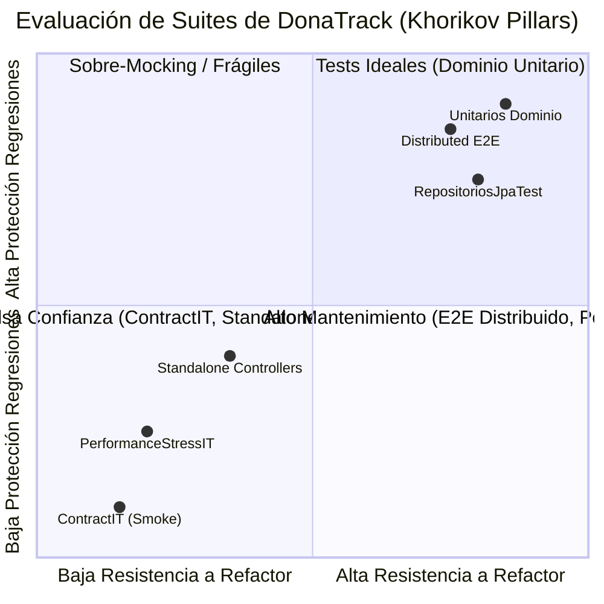

# Diagnóstico Ejecutivo: Ecosistema Actual de Testing y QA (DonaTrack)

> **Documento:** Diagnóstico Crítico y Radiografía del Ecosistema de Calidad  
> **Ubicación:** `docs/testing/auditoria/01-diagnostico-ejecutivo.md`  
> **Rol:** Principal Systems Engineer & Lead QA Architect  
> **Marco Metodológico:** Vladimir Khorikov (*Unit Testing*), Martin Fowler (*Testing Honeycomb*), Google SWE (*Small/Medium/Large*), Gerard Meszaros (*xUnit Patterns*)  
> **Ámbito:** Factual, Empírico y Documental (`SOURCE_READ_ONLY` en `src/`)  
> **Fecha de Evaluación:** 2026-09-06  
> **Estado:** Vigente (`[DOCUMENTED]`)  

---

## 1. Resumen Ejecutivo y Estado General

> [!NOTE]
> **Vigencia y Trazabilidad Histórica:**  
> Este documento registra la **radiografía diagnóstica de partida (baseline al 2026-09-06)**.  
> Tras la ejecución de las Fases 1 a 4 del roadmap de modernización de QA y los commits de refactor (`36110c4d`, `7a7229c4`, `e2f1d67c`, `ebfa113a`, `f875f2ed`, `dc99e2ba`, `b00fb7f8`, `89e68beb`), los antipatrones **AP-01, AP-02, AP-03, AP-04, AP-07 y AP-08 han sido formalmente ERRADICADOS y RESUELTOS**.  
> Para la visión integrada y el estado consolidado de la suite (1.191 tests), consultar el [Documento Maestro](../auditoria-arquitectura-testing.md) y el [Backlog de Cobertura Crítica](06-cobertura-critica-qa-backlog.md).

`[OBSERVED]` La plataforma **DonaTrack** exhibe una sólida madurez en el nivel de **pruebas unitarias de dominio puro**, totalizando **1118 métodos de prueba unitarios** distribuidos en **174 archivos de prueba `*Test.java` (182 clases de prueba considerando clases internas anidadas)** a lo largo de 5 módulos (`common-lib`, `donaciones-service`, `logistica-service`, `incentivos-service` y `notificaciones-service`), que en tiempo de compilación y ejecución de suites representan aproximadamente **~2020 ejecuciones de prueba** con 0 fallos (`BUILD SUCCESS`). Asimismo, el módulo `integration-tests` contiene **clases de prueba de integración (`*IT.java`)** con **25 métodos de prueba** categorizados mediante tags JUnit 5 (`smoke`, `contract`, `integration`, `e2e`).

`[INFERRED]` Sin embargo, el diagnóstico inicial reveló cuatro brechas de diseño que fueron abordadas por el plan de modernización:
1. **Brecha en Pruebas de Slicing y Componentes:** Con la excepción aislada de una clase en `notificaciones-service` (`RepositoriosJpaTest.java`), los otros tres servicios centrales (`donaciones`, `logistica`, `incentivos`) no poseen pruebas de persistencia sobre infraestructura real de base de datos ni pruebas de componentes desacopladas. Se apoyan en colecciones en memoria (`CrudRepositoryEnMemoria`), postergando la validación relacional al E2E sobre Docker Compose *(catalogado en QA-GAP-02)*.
2. **Antipatrón *Green Smoke Contract* (AP-01):** *(✅ RESUELTO en commit `e2f1d67c`)* La verificación superficial fue reemplazada por validación bidireccional estricta en runtime con `Atlassian Swagger Request Validator`.
3. **Simulación Secuencial de Estrés (AP-02):** *(✅ RESUELTO en commit `ebfa113a`)* `PerformanceStressIT.java` fue erradicado y reemplazado por scripts de **k6** en contenedor con análisis de percentiles (p95, p99) y thresholds de SLA.
4. **Carencia de Fitness Functions y Mutación (AP-07 / AP-08):** *(✅ RESUELTO en commit `36110c4d`)* Se integró **ArchUnit** (`ArchitectureFitnessTest`) en todos los microservicios y se configuró **Pitest** bajo el perfil `-Pmutation-test`.

---

## 2. Radiografía Factual por Capa de Prueba (Diagnóstico Inicial vs. Estado Actual)

A continuación se resume la distribución observada y su resolución arquitectónica:

| Capa de Prueba | Módulos Afectados | Clases / Archivos (Inicial) | Métodos de Test | Mecanismo Inicial | Estado Actual Post-Migración |
|---|---|---|---|---|---|
| **Unitarias de Dominio** | `common-lib`<br>`donaciones`<br>`logistica`<br>`incentivos`<br>`notificaciones` | 174 archivos `*Test.java`<br>(182 clases de test) | 1118 métodos `@Test`<br>(~2020 ejecuciones Maven) | JUnit 5 + Mockito<br>(en memoria, sin Spring context) | 🟢 **Excelente y Blindado:** 424 tests POJO puros Detroit sin mocks. Mappers limpios de sobre-mocking (F-04 resuelto). |
| **Slicing de Controladores** | 4 microservicios | 18 clases de test de controller | ~95 métodos `@Test` | `MockMvcBuilders.standaloneSetup` (17 clases) | 🟢 **Resuelto (AP-03 / F-03):** 100% migrado a `@WebMvcTest`. Contextos consolidados en `AbstractDonacionesWebMvcTest` y `AbstractLogisticaWebMvcTest`. |
| **Slicing de Persistencia / Datos** | `notificaciones-service` | 1 clase (`RepositoriosJpaTest.java`) | 3 métodos `@Test` | `@SpringBootTest` + `@DynamicPropertySource` | 🟢 **Modernizado (AP-04):** Migrado a `@DataJpaTest` y `@ServiceConnection` con PostgreSQL 16 Testcontainers. |
| **Componentes y Mensajería AMQP** | 4 microservicios | 0 clases | 0 métodos | Inexistente (delegado a E2E) | 🟡 **Backlog Activo (QA-GAP-01):** Pendiente de congelación de contratos RabbitMQ y stubs WireMock. |
| **Contratos Inter-Servicios** | `integration-tests` | 2 clases (`ContractIT`, `TracingContractIT`) | 5 métodos `@Test` | RestAssured contra Docker Compose preprod | 🟢 **Resuelto (AP-01 / F-11):** Validación viva bidireccional contra OpenAPI con `OpenApiValidationFilter` (Atlassian). |
| **Integración y E2E Distribuido** | `integration-tests` | 6 clases (`SmokeIT`, `DonationIntegrationIT`, `FullDistributedDonationE2EIT`, etc.) | 25 métodos `@Test` | RestAssured contra 4 microservicios + PostgreSQL + RabbitMQ + n8n | 🟢 **Robusto y Determinístico:** Awaitility sin sleeps ciegos, TestDataBuilders fluidos, fixtures huérfanos purgados (F-08). |
| **Rendimiento y Carga** | `integration-tests` | 1 clase (`PerformanceStressIT.java`) | 2 métodos `@Test` | Bucle `for` secuencial sincrónico en JUnit 5 | 🟢 **Resuelto (AP-02):** `PerformanceStressIT` eliminado. Migrado a **k6** (`tests/performance/k6/`) con VUs y percentiles. |

---

## 3. Evaluación Contra los 4 Pilares de Khorikov

Vladimir Khorikov (*Unit Testing: Principles, Practices, and Patterns*) postula que el valor de una suite de pruebas reside en el balance de cuatro atributos fundamentales:

```text
┌──────────────────────────────────────────────────────────────────┐
│                   LOS 4 PILARES DE KHORIKOV                      │
├──────────────────────────┬───────────────────────────────────────┤
│ 1. Protección contra     │ Capacidad del test para detectar fallas│
│    Regresiones           │ reales en la lógica de negocio.        │
├──────────────────────────┼───────────────────────────────────────┤
│ 2. Resistencia al        │ El test no se rompe cuando se cambia  │
│    Refactor              │ la implementación interna sin alterar │
│                          │ el comportamiento observable.         │
├──────────────────────────┼───────────────────────────────────────┤
│ 3. Feedback Rápido       │ Tiempo de ejecución mínimo que permite│
│                          │ al desarrollador iterar con fluidez.  │
├──────────────────────────┼───────────────────────────────────────┤
│ 4. Facilidad de          │ Facilidad de lectura, comprensión y   │
│    Mantenimiento         │ bajo costo de configuración del test.  │
└──────────────────────────┴───────────────────────────────────────┘
```

### 3.1 Evaluación en DonaTrack



1. **Tests Unitarios de Dominio (`*Test.java`):**  
   - **Protección contra Regresiones:** `ALTA`. Cubren exhaustivamente los agregados (`Donacion`, `Donante`, `Entrega`, `Camion`, `Ruta`, `RankingMensual`), validando transiciones de estado, cálculo de puntajes y validaciones de invariantes.
   - **Resistencia al Refactor:** `ALTA`. La mayoría de los tests operan según la **Escuela Clásica (Detroit)**: instancian el aggregate o servicio de dominio real, configuran repositorios simulados con colecciones en memoria (`CrudRepositoryEnMemoria`) o stubs básicos, y verifican el estado resultante mediante aserciones públicas (`assertEquals`, `assertTrue`), sin abusar de `verify(mock, times(1)).metodoPrivado()`.
   - **Feedback Rápido:** `EXCELENTE`. Los ~1118 tests unitarios corren en ~15-20 segundos en una máquina estándar.
   - **Facilidad de Mantenimiento:** `ALTA`. Excelente adopción del patrón **Test Data Builder** (`DonacionTestDataBuilder`, `PersonaTestDataBuilder`, `NecesidadTestDataBuilder`, `DTOFixtures`) que reduce el ruido de inicialización de objetos.

2. **Tests de Controladores con `MockMvcBuilders.standaloneSetup`:**  
   - **Protección contra Regresiones:** `MEDIA-BAJA`. Al aislar manualmente el controlador sin el contexto de Spring (`@WebMvcTest`), no se validan:
     - La serialización/deserialización real de beans de Jackson autoconfigurados en Spring Boot.
     - Interceptores web como `ControllerLoggingInterceptor` (que inyecta `eventType`, `traceId` y `clientIp` en el MDC).
     - Filtros de respuesta como `TraceResponseHeaderFilter` (que propaga el header HTTP `X-Trace-Id`).
     - En algunos casos (ej. `PlanificacionManualControllerTest`), no se adjuntó `GlobalExceptionHandler`, lo que significa que ante una excepción de negocio el test fallará por crash no controlado en lugar de validar el código HTTP 400/409 y el `ErrorResponse` canónico.
   - **Resistencia al Refactor:** `MEDIA`. Dependen en gran medida de mocks de servicios de aplicación.
   - **Feedback Rápido:** `ALTO` (< 100 ms por clase).
   - **Facilidad de Mantenimiento:** `MEDIA`. El setup manual de dependencias y handlers duplica código de infraestructura de pruebas.

3. **Tests de Contrato Actuales (`ContractIT.java`):**  
   - **Protección contra Regresiones:** `NULA`. Un cambio incompatible en el payload (ej. renombrar `idDonacion` a `donacionId`, o cambiar un enum) no rompe `ContractIT` porque solo evalúa que el endpoint exista en el OpenAPI.
   - **Resistencia al Refactor:** `ALTA` (pasa siempre).
   - **Feedback Rápido:** `BAJO` (requiere Docker Compose con los 4 microservicios levantados).
   - **Facilidad de Mantenimiento:** `ALTA` (pocas líneas), pero genera **falsa sensación de seguridad (*False Sense of Security*)**, lo cual es un vicio de diseño peligroso.

4. **Tests de Rendimiento (`PerformanceStressIT.java`):**  
   - **Protección contra Regresiones:** `MUY BAJA`. Al ejecutar peticiones de a una por vez en un solo hilo, no expone carreras de datos (*race conditions*), deadlocks de base de datos ni saturación de sockets TCP o hilos de Tomcat/HikariCP.
   - **Resistencia al Refactor:** `BAJA`. Si el endpoint demora 50 ms adicionales por una consulta válida, el test puede fallar por un umbral arbitrario de tiempo (`perf.max.donor.latency`).
   - **Feedback Rápido:** `MUY MALO` (toma 2-4 minutos ejecutando cientos de iteraciones secuenciales con esperas sincrónicas y polling en cada ciclo).

---

## 4. Taxonomía de Pruebas: Google SWE (Small, Medium, Large)

El estándar de Google (*Software Engineering at Google*, Cap. 11-14) clasifica las pruebas no solo por alcance conceptual, sino por sus **requerimientos de recursos y aislamiento**:

```text
┌─────────────────┬──────────────────┬─────────────────┬─────────────────┐
│ Criterio        │ Small Tests      │ Medium Tests    │ Large Tests     │
├─────────────────┼──────────────────┼─────────────────┼─────────────────┤
│ Red             │ Prohibida        │ Solo localhost  │ Permitida       │
│ Base de Datos   │ Prohibida (RAM)  │ Local / Efímera │ Real / Externa  │
│ Procesos        │ Solo un proceso  │ Varios locales  │ Múltiples       │
│ Dormir (sleep)  │ Prohibido        │ Desalentado     │ Permitido       │
│ Tiempo Límite   │ < 1 segundo      │ < 15 segundos   │ > 15 segundos   │
└─────────────────┴──────────────────┴─────────────────┴─────────────────┘
```

### 4.1 Brechas Detectadas en DonaTrack Respecto al Modelo de Google

1. **Pequeñas Pruebas (`Small Tests`):**  
   - Representan la mayor parte del monorepo (`*Test.java`). Cumplen estrictamente: ejecutan en la misma JVM, no tocan red ni disco, usan `CrudRepositoryEnMemoria` y se ejecutan en milisegundos.
2. **Pruebas Medianas (`Medium Tests`):**  
   - **Existe un vacío casi absoluto de Medium Tests.** En un diseño idiomático, las pruebas de slicing (`@WebMvcTest`, `@DataJpaTest`, `@JsonTest`) y de integración de componentes con Testcontainers (PostgreSQL en contenedor efímero contra un único servicio) constituyen el núcleo de las *Medium Tests*.
   - En DonaTrack, solo `RepositoriosJpaTest` clasifica como Medium Test (aunque penalizada al levantar el contexto completo de `@SpringBootTest`).
3. **Pruebas Grandes (`Large Tests`):**  
   - El módulo `integration-tests` contiene únicamente *Large Tests*. Exige levantar 4 contenedores Spring Boot, 1 PostgreSQL, 1 RabbitMQ y 1 n8n en Docker. Cualquier verificación que requiera persistencia o contratos debe ser ejecutada como *Large Test*, saturando los recursos de CI y dilatando el tiempo de respuesta.

---

## 5. El Antipatrón del Cono de Helado (*Ice Cream Cone*) vs. el Panal (*Testing Honeycomb*)

```text
       PIRÁMIDE IDEAL (Fowler)                  CONO DE HELADO ACTUAL (DonaTrack)
                 ▲                                            ▲
                / \       E2E (Pocos)                        / \     E2E Distribuido (9 ITs,
               /   \                                        /───\    requiere 7 contenedores)
              /─────\     Integración / Slices             /     \
             /       \    (Moderados)                     /───────\  [VACÍO DE SLICING/TESTCONTAINERS]
            /─────────\                                  /         \
           /           \  Unitarios                     /───────────\ Unitarios Dominio (~2020)
          /─────────────\ (Base Amplia)                /             \ (Base masiva en memoria)
```

En sistemas basados en microservicios, Martin Fowler y Spotify proponen el modelo del **Panal de Pruebas (*Testing Honeycomb*)**, donde el cuerpo principal de validación reside en **Pruebas de Integración de Componentes (*Integration/Component Tests*)** que ejercitan la interacción del servicio con sus dependencias directas inmediatas (PostgreSQL y RabbitMQ) de forma aislada, utilizando stubs en proceso para los demás microservicios.

En DonaTrack hoy:
- Hay una base de tests unitarios de dominio extremadamente ancha.
- **La capa media (persistencia real con Testcontainers, listeners AMQP aislados, stubs de clientes Feign) está prácticamente desierta.**
- Como consecuencia, para verificar si una entidad JPA mapea correctamente sus columnas o si un evento llega a la cola, el equipo se ve forzado a ejecutar la suite E2E completa en Docker Compose preprod.

---

## 6. Diagnóstico del Pipeline de CI/CD y Hallazgo INC-01

`[DOCUMENTED]` En la auditoría previa de DevOps (`docs/auditoria/revision-critica-devops-ci.md`), se documentó el hallazgo **INC-01**:  
*El comando en CI ejecutaba `mvn test` en lugar de `mvn verify` para `integration-tests`, omitiendo la fase `integration-test` y `verify` de Maven Failsafe, lo que deshabilitaba la ejecución de pruebas de integración si Surefire tenía `<skipTests>true</skipTests>`.*

`[OBSERVED]` En la inspección de `.github/workflows/main.yml`:
- El job `preprod-validation` ya fue corregido para invocar `mvn verify -pl integration-tests -DskipTests=false -Dgroups=smoke` y luego `mvn verify -pl integration-tests -DskipTests=false -Dgroups="contract,integration,e2e"`.
- Sin embargo, en el `pom.xml` de `integration-tests`:
  - Se observa `<skipTests>true</skipTests>`, obligando siempre a pasar `-DskipTests=false`.
  - No hay perfil de rendimiento (`performance`) en el pipeline de GitHub Actions; las pruebas de estrés están excluidas de CI y solo se ejecutan localmente si el usuario invoca `./run-preprod-tests.sh` sin filtros.

---

## 7. Carencia de Fitness Functions y Pruebas de Mutación

1. **Fitness Functions Arquitectónicas (ArchUnit):**  
   `[OBSERVED]` El archivo `pom.xml` del monorepo y los pom de los 4 servicios poseen **0 referencias a `com.tngtech.archunit`**.  
   Las invariantes establecidas en [`AGENTS.md`](../../../AGENTS.md):
   - *Controllers como adaptadores puros:* ningún controller debe inyectar directamente un repositorio ni contener lógica de bifurcación de negocio.
   - *Pureza del modelo de dominio:* el paquete `models/entities` no debe tener acoplamiento con DTOs de transporte ni librerías de persistencia.
   - *Segregación Surefire/Failsafe:* las pruebas unitarias (`*Test.java`) no deben levantar `@SpringBootTest` pesados en la fase de Surefire.  
   Hoy en día, estas reglas se verifican **manualmente mediante revisiones de código**, lo que es vulnerable a omisiones y fatiga humana.

2. **Pruebas de Mutación (Pitest):**  
   `[OBSERVED]` El monorepo no cuenta con el plugin `org.pitest:pitest-maven`.  
   Aunque JaCoCo reporta una alta cobertura de líneas y ramas en los microservicios, la cobertura de líneas **no garantiza que los tests estén asertando las condiciones correctas**.  
   En particular, en componentes de alta criticidad como:
   - Las máquinas de estado de `Donacion` y `Entrega`.
   - La fragmentación de necesidades y matching en `AlgoritmosService`.
   - El cálculo de insignias y puntaje de donantes en `incentivos-service`.  
   Un cambio en un operador relacional (`>` por `>=`) o la eliminación de una llamada a método no es detectada si la aserción es débil.

---

## 8. Conclusiones y Dirección Estratégica

El ecosistema actual de DonaTrack es **funcionalmente robusto en su dominio y estable en sus flujos distribuidos**, pero **estructuralmente ineficiente y desbalanceado**:
1. Requiere **descomprimir la suite E2E distribuida** migrando las pruebas de persistencia y mensajería a pruebas de componentes con **Testcontainers (`@ServiceConnection`)**.
2. Requiere **reemplazar el antipatrón *Green Smoke Contract*** por validación bidireccional de OpenAPI y JSON Schema con **WireMock** en Java.
3. Requiere **incorporar Fitness Functions automáticas con ArchUnit** para custodiar las reglas de arquitectura en cada `mvn test`.
4. Requiere **migrar las pruebas de rendimiento de JUnit secuencial a scripts k6** con usuarios virtuales y métricas percentilares reales.
