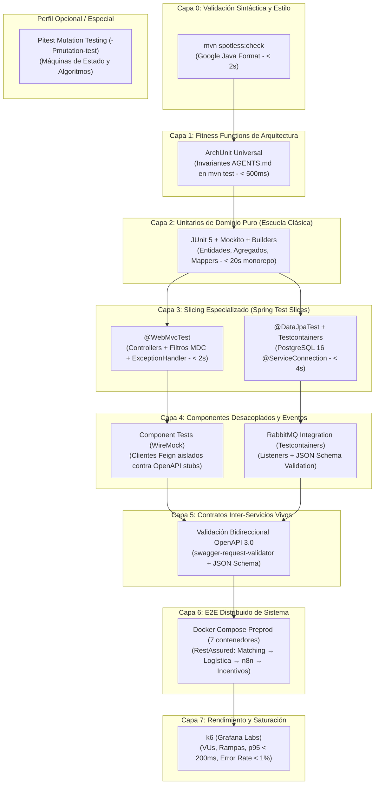
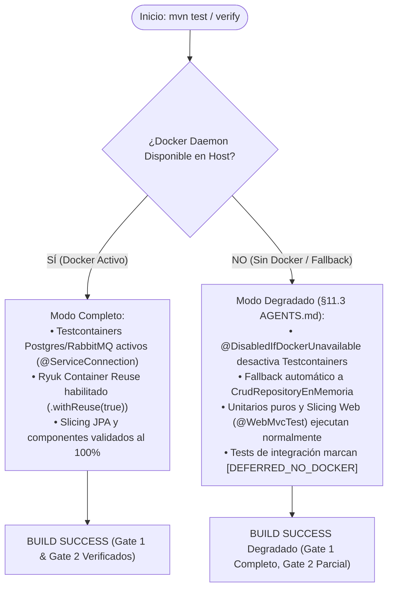
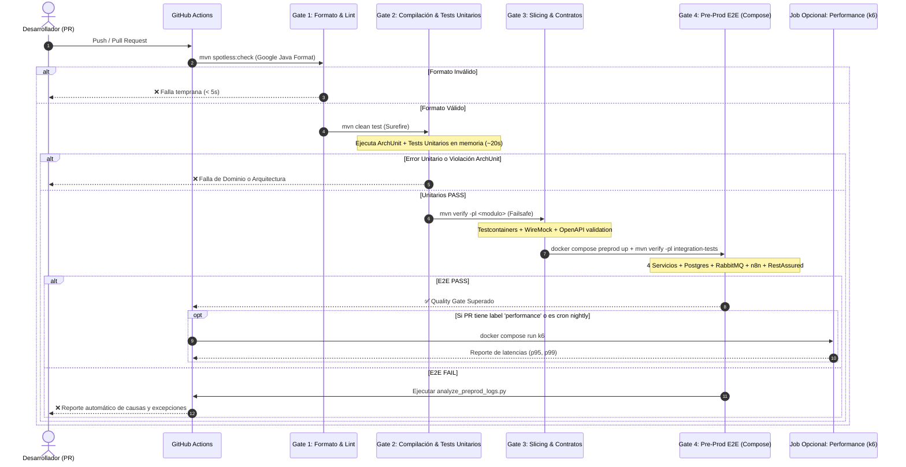

# Blueprint: Arquitectura Target de Testing y QA (DonaTrack)

> **Documento:** Especificación Arquitectónica y Blueprint de Testing  
> **Ubicación:** `docs/testing/auditoria/04-blueprint-target.md`  
> **Rol:** Principal Systems Engineer & Lead QA Architect  
> **Marco Conceptual:** Testing Honeycomb (Martin Fowler / Spotify), Google SWE Test Size, Shift-Left Architecture  
> **Ámbito:** Factual, Empírico y Documental (`SOURCE_READ_ONLY` en `src/`)  
> **Fecha de Diseño:** 2026-09-06  
> **Estado:** Vigente (`[DOCUMENTED]`)  

---

## 1. Visión y Principios Rectores de la Arquitectura Target

La arquitectura target de testing para **DonaTrack** transforma el modelo desbalanceado actual (Pirámide Invertida con vacío en capas medias) hacia un **Panal de Pruebas (*Testing Honeycomb*)** moderno, eficiente y determinístico.

Los principios arquitectónicos rectores son:

1. **Shift-Left Estricto:** Toda regla que pueda validarse en tiempo de compilación o en memoria (formato, estilo, reglas arquitectónicas de capas, modelos de dominio) debe validarse en la fase más temprana posible (`mvn test`), con tiempos de respuesta en milisegundos.
2. **Aislamiento de Dependencias Out-of-Process:** Ningún microservicio debe depender de otros microservicios activos para verificar su propia persistencia o lógica de integración; las dependencias externas se sustituyen por **stubs canónicos de WireMock** y brokers efímeros de **Testcontainers**.
3. **Paridad de Entornos (*Environment Parity*):** Las pruebas de persistencia deben utilizar el motor de base de datos real (**PostgreSQL 16**) y el script canónico de inicialización multi-schema (`01-init-schemas-roles.sql`), eliminando las discrepancias de dialectos de H2.
4. **Verificación Contractual Viva:** Los contratos no son archivos pasivos en una wiki; son aserciones ejecutables en tiempo de prueba que validan bidireccionalmente esquemas JSON y especificaciones OpenAPI 3.0.
5. **Rendimiento Basado en Concurrencia Real:** Las pruebas de estrés y saturación se delegan a herramientas especializadas (**k6**) capaces de simular usuarios virtuales y calcular percentiles con rigor estadístico.
6. **Respeto a las Restricciones Académicas:** Se preserva intacta la infraestructura de **Docker Compose preprod** y los scripts canónicos de entrega (`./run-preprod-tests.sh`), garantizando plena compatibilidad con los requerimientos de la cátedra UTN-FRBA DDS 2026.

---

## 2. Topología del Panal de Pruebas (*Testing Honeycomb*)



---

## 3. Matriz de Responsabilidades, Herramientas y SLA por Capa

| Capa | Nombre de la Capa | Herramientas Seleccionadas | Alcance & Responsabilidades | Tiempo Máximo (SLA) | Fase Maven / Trigger |
|:---:|---|---|---|:---:|:---:|
| **0** | **Estilo y Linting** | Spotless (Google Java Format) | Verifica formato, indentación y reglas sintácticas sin compilar tests. | < 2 seg | `compile`<br>`mvn spotless:check` |
| **1** | **Fitness Functions** | ArchUnit Universal | Custodia las invariantes de `AGENTS.md`: pureza de `models/entities`, controllers como adaptadores puros sin repositorios, surefire/failsafe. | < 500 ms / módulo | `test`<br>`mvn test` |
| **2** | **Unitarias de Dominio** | JUnit 5 + Mockito + Builders | Verifica transiciones de estado, cálculo de puntajes, validaciones de invariantes y lógica algorítmica en memoria pura. | < 20 seg (total) | `test`<br>`mvn test` |
| **3A** | **Slicing Web** | `@WebMvcTest` + MockMvc | Valida serialización Jackson, bean validation (`@Valid`), filtros de header `X-Trace-Id`, interceptores MDC y `@ControllerAdvice`. | < 2 seg / suite | `test`<br>`mvn test` |
| **3B** | **Slicing Persistencia** | `@DataJpaTest` + Testcontainers (`@ServiceConnection`) | Valida queries JPQL/nativas, mapeos de entidades, constraints de base de datos multi-schema y migraciones Flyway sobre PostgreSQL 16. | < 4 seg / suite | `test`<br>`mvn test` |
| **4** | **Componentes Aislados** | WireMock + Testcontainers RabbitMQ | Valida clientes Feign y consumidores AMQP desacoplados de los demás microservicios mediante stubs canónicos. | < 5 seg / suite | `integration-test`<br>`mvn verify` |
| **5** | **Contratos Vivos** | `swagger-request-validator` + `json-schema-validator` | Valida bidireccionalmente requests y responses HTTP contra las specs OpenAPI 3.0 y los eventos contra JSON Schemas en `docs/`. | < 3 seg / suite | `integration-test`<br>`mvn verify` |
| **6** | **E2E Distribuido** | Docker Compose Preprod + RestAssured | Valida los flujos de negocio transversales completos (donación $\rightarrow$ logística $\rightarrow$ eventos $\rightarrow$ n8n $\rightarrow$ incentivos). | < 60 seg | `verify`<br>`./run-preprod-tests.sh` |
| **7** | **Carga y Estrés** | k6 (Dockerizado) | Simula carga concurrente (VUs), evalúa contención de base de datos y verifica thresholds de SLA (p95, p99, throughput). | 1 - 3 min | Manual / CI Nightly<br>`--groups performance` |
| **Esp** | **Mutation Testing** | Pitest (`-Pmutation-test`) | Inyecta fallas en bytecode para auditar la calidad de las aserciones en máquinas de estado (`Donacion`, `Entrega`) y matching. | 2 - 5 min | Perfil dedicado bajo demanda o CI Cron |

---

## 4. Topología de Ejecución Local y Modo Degradado

Para garantizar que los desarrolladores puedan trabajar ágilmente sin importar la capacidad de su estación de trabajo (ej. laptops sin Docker daemon activo), la arquitectura soporta **ejecución en modo degradado** conforme a §11.3 de [`AGENTS.md`](../../AGENTS.md):



---

## 5. Arquitectura de Datos de Prueba: Fixtures, Builders y Aislamiento

### 5.1 Paridad DDL y Multi-Schema Canónico

Todas las pruebas que utilicen PostgreSQL real (tanto en Testcontainers como en Docker Compose) **deben utilizar estrictamente la misma fuente de verdad DDL**:
- Archivo canónico: `persistencia/init-db/01-init-schemas-roles.sql`.
- Schemas aislados por microservicio:
  - `donaciones`: schema `donaciones`, usuario `donaciones_user`
  - `logistica`: schema `logistica`, usuario `logistica_user`
  - `incentivos`: schema `incentivos`, usuario `incentivos_user`
  - `notificaciones`: schema `notificaciones`, usuario `notificaciones_user`
- Conexión dinámica idiomática y resolución de DDL:
  > [!NOTE]
  > Dado que `01-init-schemas-roles.sql` reside en la raíz del repositorio (`persistencia/init-db/`), la resolución robusta entre submódulos Maven se gestiona mediante helper de host path (patrón probado en `RepositoriosJpaTest.java`) o empaquetando el DDL en el classpath de `common-lib` durante el build:

  ```java
  private static String resolveInitScriptPath() {
    Path pathInSubmodule = Path.of("../persistencia/init-db/01-init-schemas-roles.sql");
    return Files.exists(pathInSubmodule)
        ? pathInSubmodule.toAbsolutePath().toString()
        : Path.of("persistencia/init-db/01-init-schemas-roles.sql").toAbsolutePath().toString();
  }

  @Container
  @ServiceConnection
  static PostgreSQLContainer<?> postgres = 
      new PostgreSQLContainer<>("postgres:16-alpine")
          .withDatabaseName("donatrack")
          .withUsername("admin")
          .withPassword("admin_secure_password")
          .withCopyFileToContainer(
              MountableFile.forHostPath(resolveInitScriptPath()),
              "/docker-entrypoint-initdb.d/01-init-schemas-roles.sql")
          .withReuse(true);
  ```

### 5.2 Test Data Builders y Generación de Datos Sintéticos

Se prohíbe el uso de datos personales reales (PII). Todos los tests deben inicializar sus entidades utilizando los **Test Data Builders** existentes y extendidos:
- `PersonaTestDataBuilder.humana().conDocumento(randomDni()).build()`
- `DonacionTestDataBuilder.deAlimento("Arroz", 10).conDonante(donanteId).build()`
- `NecesidadTestDataBuilder.extraordinaria().conCantidad(50).build()`
- `CamionTestDataBuilder.disponible().conCapacidad(5000f).build()`

---

## 6. Flujo de Validación en CI/CD (GitHub Actions)

El siguiente diagrama detalla la orquestación en el pipeline optimizado de GitHub Actions, resolviendo definitivamente el hallazgo **INC-01** y garantizando la segregación estricta entre Surefire (`*Test.java`) y Failsafe (`*IT.java`):



---

## 7. Reglas de Transición y Criterio de Parada

1. **No Rotura de Builds:** La incorporación de ArchUnit y Testcontainers se realizará de forma aditiva y progresiva; ningún test existente en memoria será eliminado hasta que su contraparte de slicing esté completamente verificada.
2. **Preservación de Contratos:** Los stubs de WireMock se generarán a partir de las especificaciones OpenAPI existentes en `docs/arquitectura/contratos/`, garantizando que la evolución de contratos sea retrocompatible según §8 de `AGENTS.md`.
3. **Erradicación de Smells:** El éxito de la implementación target se medirá por la erradicación total de los hallazgos críticos `AP-01` (*Green Smoke Contract*), `AP-02` (*Sequential Load Loop*) y `AP-03` (*Standalone Setup Blindspot*).
