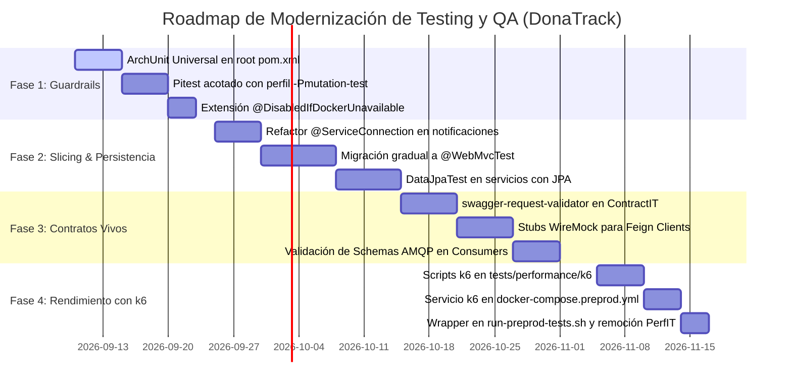

# Roadmap de Migración No Disruptivo hacia la Arquitectura Target de QA (DonaTrack)

> **Documento:** Plan de Implementación Progresivo y Gestión de Transición  
> **Ubicación:** `docs/testing/auditoria/05-roadmap-migracion.md`  
> **Rol:** Lead QA Architect & Release Coordinator  
> **Principio Clave:** Cero Regresiones, Compatibilidad Docente y Adopción Incremental  
> **Ámbito:** Factual, Empírico y Documental (`SOURCE_READ_ONLY` en `src/`)  
> **Fecha de Diseño:** 2026-09-06  
> **Estado:** Vigente (`[DOCUMENTED]`)  

---

## 1. Estrategia y Filosofía de Transición

La modernización del ecosistema de testing de **DonaTrack** no debe ejecutarse mediante una reescritura masiva (*Big Bang*), ya que pondría en riesgo la estabilidad del pipeline de CI/CD, aumentaría la probabilidad de conflictos de merge en Git y podría alterar la compatibilidad con los scripts docentes evaluados por la cátedra (**UTN-FRBA DDS 2026**).

Por lo tanto, la transición se estructura en **4 Fases Incrementales No Disruptivas**, diseñadas bajo tres invariantes:

1. **Invariante de Preservación de Baseline:** En ninguna fase se debilitará o eliminará un test existente hasta que su reemplazo moderno esté completamente verificado y reporte verde.
2. **Invariante de Compatibilidad de Scripts:** Los comandos docentes canónicos `./run-preprod-tests.sh` y `./run-preprod-tests-stay.sh` deben continuar funcionando exactamente igual desde la perspectiva del usuario.
3. **Invariante de Independencia de Fases:** Cada fase entrega valor arquitectónico independiente y puede desplegarse a producción sin requerir la finalización de las fases subsiguientes.

---

## 2. Cronograma de Fases y Criterios de Aceptación (DoD)



---

### 2.1 Fase 1: Guardrails Arquitectónicos y Fitness Functions (Sprints 1-2)

* **Objetivo:** Blindar el repositorio contra desviaciones arquitectónicas y habilitar el modo degradado sin alterar ninguna prueba de negocio existente.
* **Acciones Concretas:**
  1. Incorporar la dependencia `com.tngtech.archunit:archunit-junit5` en `dependencyManagement` del root `pom.xml` y en el scope de test de cada módulo.
  2. Implementar `ArchitectureFitnessTest.java` en cada microservicio para validar automáticamente:
     - Pureza de paquetes de dominio (`models/entities` aislado de HTTP y persistencia).
     - Controllers como adaptadores puros (ningún Controller puede inyectar un Repositorio).
     - Segregación Surefire/Failsafe (ningún `*Test.java` puede tener `@SpringBootTest`).
  3. Configurar el plugin `org.pitest:pitest-maven` bajo el perfil dedicado `-Pmutation-test`, acotado a `grupo5.donaciones.services.matching` y transiciones de estado de `DonacionIndependiente`.
  4. Crear la extensión JUnit 5 `@DisabledIfDockerUnavailable` en `common-lib` para soportar el modo degradado local (§11.3 de `AGENTS.md`).
* **Definition of Done (DoD):**
  - [ ] `mvn test` ejecuta las reglas de ArchUnit en < 500 ms por módulo sin violaciones.
  - [ ] `mvn test -Pmutation-test` genera reporte de mutación en < 3 minutos reportando un mutation score $\ge 75\%$ en matching.
  - [ ] El build compila y pasa en máquinas sin Docker gracias a `@DisabledIfDockerUnavailable`.

---

### 2.2 Fase 2: Modernización de Slicing y Persistencia Efímera (Sprints 3-4)

* **Objetivo:** Erradicar el smell `AP-04` (*Fragile Dynamic Property Setup*) y `AP-03` (*Standalone Setup Blindspot*), introduciendo la capa media de *Medium Tests*.
* **Acciones Concretas:**
  1. Refactorizar `RepositoriosJpaTest.java` en `notificaciones-service`:
     - Reemplazar `@SpringBootTest` por `@DataJpaTest`.
     - Reemplazar `@DynamicPropertySource` manual por `@ServiceConnection` (Spring Boot 3.1+).
     - Reutilizar el script SQL canónico `01-init-schemas-roles.sql` montado desde classpath.
  2. Migrar de forma incremental las 17 clases de controladores que usan `MockMvcBuilders.standaloneSetup` a `@WebMvcTest(MiController.class)`:
     - Validar que participen `ControllerLoggingInterceptor`, `TraceResponseHeaderFilter` y `GlobalExceptionHandler`.
     - Simular las dependencias de servicio con `@MockitoBean`.
  3. A medida que los microservicios `donaciones`, `logistica` e `incentivos` migren de repositorios en memoria a Spring Data JPA, incorporar sus respectivos `@DataJpaTest` con Testcontainers Postgres.
* **Definition of Done (DoD):**
  - [ ] `notificaciones-service` no contiene ningún `@DynamicPropertySource` manual.
  - [ ] Los tests de controladores validan la presencia del header `X-Trace-Id` y respuestas estructuradas ante excepciones de validación (400) y de negocio (409).
  - [ ] El 100% de los tests de slicing ejecutan en < 3 segundos por clase.

---

### 2.3 Fase 3: Contratos Inter-Servicios Vivos y Stubs WireMock (Sprints 5-6)

* **Objetivo:** Erradicar el smell crítico `AP-01` (*Green Smoke Contract*) y desacoplar los tests de consumidores Feign de los servicios remotos.
* **Acciones Concretas:**
  1. Incorporar la librería `com.atlassian.oai:swagger-request-validator-mockmvc` y `swagger-request-validator-restassured`.
  2. Reemplazar las aserciones superficiales de `ContractIT.java` por validación bidireccional estricta:
     - Cada request y response de prueba se valida contra `docs/arquitectura/contratos/openapi-*.yaml`.
     - Si un campo obligatorio falta o un tipo no coincide, la prueba falla explícitamente.
  3. Incorporar `com.github.tomakehurst:wiremock-jre8-standalone` para pruebas de integración de clientes Feign (`NotificacionesFeignClient`, `LogisticaFeignClient`, `IncentivosFeignClient`):
     - Configurar stubs canónicos de WireMock inicializados a partir de las specs OpenAPI de los productores.
  4. Validar los eventos serializados de RabbitMQ contra los 11 JSON Schemas en `docs/arquitectura/contratos/schemas/` usando `networknt/json-schema-validator`.
* **Definition of Done (DoD):**
  - [ ] `ContractIT.java` valida esquemas completos de request y response contra los 4 OpenAPI YAML.
  - [ ] Un cambio incompatible intencional en un DTO provoca la falla inmediata de la prueba de contrato.
  - [ ] Los clientes Feign cuentan con suites de prueba unitarias/componente con WireMock sin requerir el backend real levantado.

---

### 2.4 Fase 4: Migración de Pruebas de Rendimiento a k6 (Sprint 7)

* **Objetivo:** Erradicar el smell crítico `AP-02` (*Sequential Load Loop*) y dotar a DonaTrack de pruebas de carga con rigor estadístico y usuarios concurrentes.
* **Acciones Concretas:**
  1. Crear el directorio `tests/performance/k6/` con scripts modulares en JavaScript:
     - `donaciones-creacion-carga.js`: Simulación de 20-50 usuarios virtuales creando personas, donantes y donaciones con ramp-up de 30 segundos.
     - `incentivos-eventos-saturacion.js`: Inyección masiva de eventos de donación para evaluar throughput y tiempo de respuesta de cálculo de métricas.
  2. Configurar el servicio `k6` en `docker-compose.preprod.yml` bajo el perfil `--profile perf`:
     ```yaml
     k6:
       image: grafana/k6:latest
       profiles: ["perf"]
       volumes:
         - ./tests/performance/k6:/scripts:ro
       networks:
         - preprod-network
     ```
  3. Actualizar el script canónico `run-preprod-tests.sh`:
     - Al invocar `./run-preprod-tests.sh --groups performance`, el script levanta el stack preprod y ejecuta `docker compose -f docker-compose.preprod.yml run --rm k6 run /scripts/donaciones-creacion-carga.js`.
     - Si los thresholds de k6 fallan (ej. `p(95) > 500ms` o `http_req_failed > 0.01`), el script retorna código de salida `1`.
  4. Deprecar, archivar y eliminar definitivamente `PerformanceStressIT.java` de la suite JUnit de `integration-tests`.
* **Definition of Done (DoD):**
  - [ ] `PerformanceStressIT.java` eliminado de `integration-tests/src/test/java/`.
  - [ ] `./run-preprod-tests.sh --groups performance` ejecuta k6 exitosamente en contenedor y reporta percentiles p90, p95 y p99.
  - [ ] La suite regular de integración (`mvn verify -pl integration-tests`) ya no ejecuta bucles secuenciales de estrés, reduciendo su tiempo de ejecución en más de 2 minutos.

---

## 3. Preservación Estricta de Compatibilidad Docente

Para asegurar que los docentes y evaluadores no perciban cambios en la forma de ejecutar o calificar el proyecto:

| Comando Docente Habitual | Comportamiento Anterior | Comportamiento en la Arquitectura Target |
|---|---|---|
| `./run-preprod-tests.sh` | Compila JARs, levanta Docker Compose, corre Failsafe en `integration-tests` (incluyendo bucle secuencial). | Compila JARs, levanta Docker Compose, corre Failsafe con contratos rigurosos (OpenAPI) y E2E sin demoras de bucles secuenciales. |
| `./run-preprod-tests.sh --skip-build` | Reusa JARs en `target/` y corre tests. | Idéntico: reusa JARs en `target/` y corre tests. |
| `./run-preprod-tests.sh --groups smoke` | Corre solo pruebas marcadas con `@Tag("smoke")`. | Idéntico: corre solo pruebas de humo. |
| `./run-preprod-tests.sh --groups performance` | Ejecutaba `PerformanceStressIT` en JUnit (bucle secuencial). | Ejecuta los scripts de **k6** en contenedor Docker con reporte en consola de percentiles y SLA, retornando 0 o 1 según los thresholds. |
| `./run-preprod-tests-stay.sh` | Levanta infraestructura y la deja activa para debugging. | Idéntico: levanta infraestructura completa y permanece en espera. |

---

## 4. Matriz de Riesgos de Transición y Plan de Contingencia

| Riesgo Identificado | Probabilidad | Impacto | Estrategia de Mitigación y Contingencia |
|---|:---:|:---:|---|
| **R1: Aumento del tiempo de build por ArchUnit** | Baja | Media | ArchUnit analiza el bytecode en memoria; en suites de microservicios insume < 500 ms. Si llegara a superar 1s, se agrupan reglas en una sola clase de test. |
| **R2: Estaciones de trabajo de estudiantes sin Docker** | Media | Alta | Mitigado por diseño con `@DisabledIfDockerUnavailable`: los unitarios y controllers corren siempre; solo los slices de persistencia se saltean reportando `[DEFERRED_NO_DOCKER]`. |
| **R3: Divergencia entre OpenAPI y endpoints vivos** | Media | Alta | El validador `swagger-request-validator` en `ContractIT` detecta la discrepancia inmediatamente en el PR, bloqueando el merge hasta que se actualice la spec en `docs/`. |
| **R4: Fallas espurias en k6 por recursos de CI** | Baja | Media | Los thresholds de k6 en CI se calibran de forma conservadora (`p(95) < 800ms`) considerando las 2 vCPUs de GitHub Actions, dejando umbrales más estrictos para entornos locales. |
