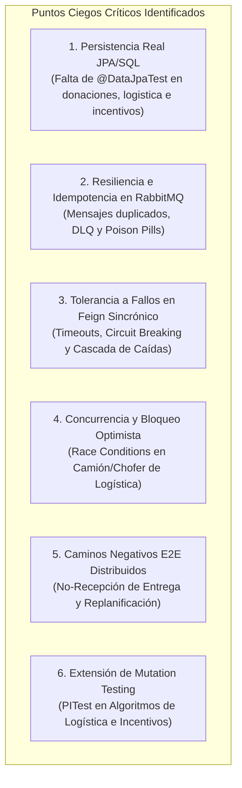

# Diagnóstico de Cobertura Crítica Faltante y Backlog de QA

> **Módulo:** Documentación de Calidad, Testing y Arquitectura de Pruebas  
> **Ubicación:** `docs/testing/auditoria/06-cobertura-critica-qa-backlog.md`  
> **Institución:** UTN-FRBA — Diseño de Sistemas (2026) — Grupo 5  
> **Responsable:** Principal Systems Engineer & Lead QA Architect  
> **Fecha de Publicación:** 2026-09-08  
> **Estado:** 🟡 Pendiente / Backlog para Futura Iteración de QA (`[DOCUMENTED]`)  

---

## 1. Resumen Ejecutivo y Motivación

`[OBSERVED]` La plataforma **DonaTrack** cuenta con una base madura de **más de 1.150 tests unitarios y de slicing** y una suite de **integración distribuida** sobre Docker Compose (`SmokeIT`, `DonationIntegrationIT`, `CrossServiceCommunicationIT`, `FullDistributedDonationE2EIT`), totalizando más de 2.000 ejecuciones limpias en el reactor de Maven.

`[INFERRED]` Sin embargo, tras la auditoría técnica exhaustiva del ecosistema, se han identificado **puntos ciegos críticos en las fronteras de integración, persistencia real, concurrencia y tolerancia a fallos distribuidos**. Actualmente, la alta tasa de éxito de los tests unitarios en memoria enmascara riesgos de producción que solo emergerían bajo alta concurrencia, degradación de red o fallas parciales de infraestructura.

Este documento formaliza y cataloga dichos faltantes de cobertura como **Backlog Mandatorio para una Futura Iteración de QA**, organizados por severidad, impacto operacional y esfuerzo de implementación.

---

## 2. Diagnóstico de Puntos Ciegos Críticos por Capa

---

### 2.1 Persistencia Real JPA/SQL y Mapeos Hibernate

* **`[OBSERVED]` Estado Actual:**  
  En `donaciones-service`, `logistica-service` e `incentivos-service`, las pruebas de repositorios y servicios corren exclusivamente contra implementaciones en memoria (`CrudRepositoryEnMemoria` con `Map<UUID, T>`). Únicamente `notificaciones-service` cuenta con una prueba aislada (`RepositoriosJpaTest.java`) respaldada por Testcontainers.
* **`[INFERRED]` Riesgos de Producción:**
  1. **`LazyInitializationException` Fuera de Transacción:** Entidades con relaciones `@OneToMany` o `@ManyToMany` (ej. `Donacion -> items`, `Ruta -> entregas`, `Donante -> insignias`) devuelven el grafo completo en memoria. En producción, un acceso a una colección perezosa fuera de un método `@Transactional` detonará una excepción no capturada.
  2. **Incompatibilidad de Esquema y Constraints SQL:** Restricciones de longitud (`@Column(length = 20)`), tipos enumerados (`@Enumerated(EnumType.STRING)`), claves foráneas `FOREIGN KEY` huérfanas o campos `NOT NULL` en PostgreSQL no se validan en el ciclo de pruebas unitarias.
  3. **Consultas JPQL/Nativas No Verificadas:** Métodos con `@Query` personalizados carecen de validación de sintaxis contra el motor PostgreSQL real.
* **`[PROPOSED]` Alcance de la Futura Iteración:**  
  Incorporar tests de persistencia con `@DataJpaTest` y Testcontainers (`postgres:16-alpine` con `@ServiceConnection`) para validar los repositorios troncales de cada servicio sin requerir levantar el contexto completo de Spring Boot.

---

### 2.2 Resiliencia, Idempotencia y Mensajes Tóxicos en RabbitMQ

* **`[OBSERVED]` Estado Actual:**  
  La comunicación asíncrona de eventos desde `logistica-service` hacia `donaciones-service` se realiza mediante el exchange `logistica.exchange` (routing keys: `ruta.asignada`, `ruta.iniciada`, `entrega.exitosa`, `entrega.fallida`). Los tests unitarios actuales simulan el evento invocando directamente los métodos de `LogisticaEventListener` o mockeando `RabbitTemplate`.
* **`[INFERRED]` Riesgos de Producción:**
  1. **Falta de Idempotencia (*At-Least-Once Delivery*):** Si RabbitMQ reenvía un evento duplicado tras una pérdida de ACK de red, el aggregate intentará ejecutar una transición de estado inválida. La auditoría previa ([`docs/arquitectura/diseno/auditoria-final-proyecto.md`](../../arquitectura/diseno/auditoria-final-proyecto.md)) confirmó que el consumidor carece de tabla de deduplicación o *Inbox Pattern*.
  2. **Ciclos Infinitos por *Poison Pills*:** No existen pruebas que inyecten payloads con JSON corrupto o campos incompatibles para verificar el desvío automático a la Dead Letter Queue (DLQ), arriesgando un bucle infinito de `NACK + requeue` que sature el broker.
* **`[PROPOSED]` Alcance de la Futura Iteración:**  
  Implementar tests de integración de mensajería con broker efímero (Testcontainers RabbitMQ) que verifiquen:
  - Re-entrega del mismo `messageId` (confirmando que la segunda entrega no altera el estado ni lanza excepciones no controladas).
  - Enrutamiento de mensajes malformados hacia la cola de descarte (`logistica.dlq`).

---

### 2.3 Tolerancia a Fallos y Timeouts en Comunicación Feign Sincrónico

* **`[OBSERVED]` Estado Actual:**  
  `donaciones-service` invoca síncronamente a `incentivos-service` y `notificaciones-service` mediante Spring Cloud OpenFeign en sus listeners de eventos locales.
* **`[INFERRED]` Riesgos de Producción:**
  1. **Cascada de Caídas (*Cascading Failures*):** Si el servicio de notificaciones experimenta latencia de red (ej. timeout de 10 segundos) o responde HTTP 503, el hilo de ejecución de donaciones queda bloqueado.
  2. **Pérdida Silenciosa de Eventos:** Los listeners capturan errores mediante `try/catch` y solo emiten `log.error`, perdiendo el registro de fidelización o la notificación sin reintento transaccional garantizado (*Transactional Outbox*).
* **`[PROPOSED]` Alcance de la Futura Iteración:**  
  Crear suites de pruebas de clientes Feign utilizando **WireMock** para simular:
  - Timeouts de socket (`SocketTimeoutException` / HTTP 408).
  - Respuestas HTTP 500 y 503, validando la activación de políticas de retry o fallback de Resilience4j.

---

### 2.4 Concurrencia y Condiciones de Carrera (*Race Conditions*)

* **`[OBSERVED]` Estado Actual:**  
  El 100% de las pruebas unitarias y de integración son estrictamente secuenciales y monohilo.
* **`[INFERRED]` Riesgos de Producción:**
  - **Doble Asignación de Recursos Logísticos:** En `logistica-service`, un `Camion` o `Chofer` tiene estado exclusivo (`EN_RUTA`). No existe ningún test que someta a contención la asignación de recursos ante dos peticiones HTTP concurrentes en el mismo milisegundo.
  - **Pérdida de Actualizaciones (*Lost Updates*):** Falta de verificación de bloqueo optimista (`@Version`) en entidades transaccionales de alta concurrencia.
* **`[PROPOSED]` Alcance de la Futura Iteración:**  
  Diseñar pruebas unitarias y de componentes multihilo (usando `CountDownLatch` y `ExecutorService`) que verifiquen que ante peticiones concurrentes en competencia, solo una transacción resulte exitosa y la otra sea rechazada con `OptimisticLockingFailureException` o `BusinessStateException`.

---

### 2.5 Caminos Negativos E2E y Flujos de Compensación Distribuida

* **`[OBSERVED]` Estado Actual:**  
  Las pruebas E2E en `integration-tests` (`FullDistributedDonationE2EIT.java`) cubren exclusivamente el camino feliz (*Happy Path*): donante creado $\rightarrow$ donación cargada $\rightarrow$ ruta planificada $\rightarrow$ entrega exitosa.
* **`[INFERRED]` Riesgos de Producción:**
  - **Falta de Validación de No-Recepción:** No existe prueba distribuida que simule al transportista reportando entrega fallida (`NO_RECEPCION` por domicilio cerrado) para verificar que la donación original regrese a `REVISION` en `donaciones-service` y se despache la alerta correspondiente al donante.
  - **Cancelación de Rutas en Tránsito:** Desconocimiento empírico del comportamiento del stack distribuido ante la avería de un vehículo con múltiples entregas asignadas.
* **`[PROPOSED]` Alcance de la Futura Iteración:**  
  Crear en `integration-tests` la clase `DistributedFailureRecoveryE2EIT` para validar la máquina de estados distribuida ante eventos de falla y compensación.

---

### 2.6 Extensión de Pruebas de Mutación (Mutation Testing / PITest)

* **`[OBSERVED]` Estado Actual:**  
  En el [pom.xml raíz](../../../pom.xml), `pitest-maven` está configurado en el perfil `mutation-test`, pero su alcance está restringido únicamente a `AlgoritmoCompatibilidadSemantica` en `donaciones-service`.
* **`[INFERRED]` Riesgos de Producción:**
  - Existen motores de cálculo con lógica condicional compleja en otros módulos que carecen de auditoría de mutantes:
    - `PlanificadorDeRutas` y validadores de capacidad de carga en `logistica-service` (donde mutar un `>=` por `>` en el peso o volumen podría permitir sobrecargas ilegales).
    - `RankingMensual` y evaluación de misiones/rachas en `incentivos-service`.
* **`[PROPOSED]` Alcance de la Futura Iteración:**  
  Extender la configuración del perfil `mutation-test` para incluir clases de lógica matemática y ordenamiento en `logistica-service` e `incentivos-service`.

---

## 3. Matriz de Priorización del Backlog de QA

| ID | Área de Cobertura | Riesgo en Producción | Esfuerzo Estimado | Nivel Honeycomb | Prioridad |
|:---:|---|:---:|:---:|:---:|:---:|
| **QA-GAP-01** | **Idempotencia y Dead Letter Queue en RabbitMQ** | 🔴 Crítico (inconsistencia de estado / colas bloqueadas) | Medio | Componente | **P1 (Urgente)** |
| **QA-GAP-02** | **Persistencia Real con Testcontainers (@DataJpaTest)** | 🔴 Alto (`LazyInitializationException` y DDL real) | Medio | Datos / Slicing | **P1 (Urgente)** |
| **QA-GAP-03** | **Resiliencia y Timeouts Feign con WireMock** | 🟡 Alto (cascada de caídas por servicios lentos) | Bajo | Integración | **P2 (Importante)** |
| **QA-GAP-04** | **Concurrencia y Race Conditions en Logística** | 🟡 Medio (doble asignación de camiones) | Bajo | Dominio / Concurrencia | **P2 (Importante)** |
| **QA-GAP-05** | **E2E Distribuido de Caminos Negativos (No-Recepción)** | 🟡 Medio (desincronización de agregados distribuidos) | Medio | E2E Distribuido | **P3 (Recomendado)** |
| **QA-GAP-06** | **Ampliación de Targets de PITest (Logística / Incentivos)**| 🟢 Bajo (detección de aserciones débiles en algoritmos) | Bajo | Unitario / Fitness | **P3 (Recomendado)** |

---

## 4. Criterios de Aceptación (Definition of Done) para la Futura Iteración

Cuando el equipo o un agente de IA aborde este backlog en una próxima iteración, deberá verificar los siguientes criterios objetivos:

1. **`[VERIFIED]` Paridad de Datos:** Al menos 1 `@DataJpaTest` con Testcontainers PostgreSQL activo en `donaciones-service`, `logistica-service` e `incentivos-service`.
2. **`[VERIFIED]` Deduplicación AMQP:** Test de consumidor en `donaciones-service` que envíe 2 eventos idénticos y verifique que solo se procese 1 vez sin excepciones.
3. **`[VERIFIED]` Manejo de Timeouts:** Test de WireMock simulando delay de 5s en `notificaciones-service` con aserción de fallback o degradación controlada.
4. **`[VERIFIED]` Integridad Concurrente:** Test con 10 hilos intentando reservar el mismo camión con éxito para solo 1 hilo.
5. **`[VERIFIED]` Pipeline Verde:** Todos los nuevos tests integrados bajo el estándar de perfiles y tags de `AGENTS.md` sin degradar el tiempo del reactor estándar.
